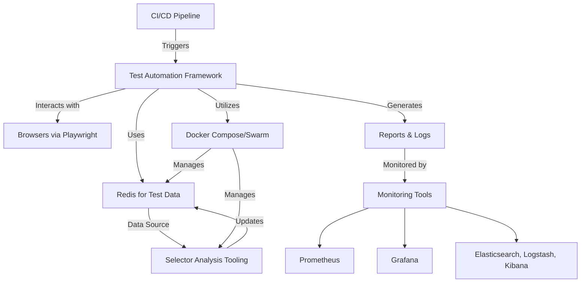
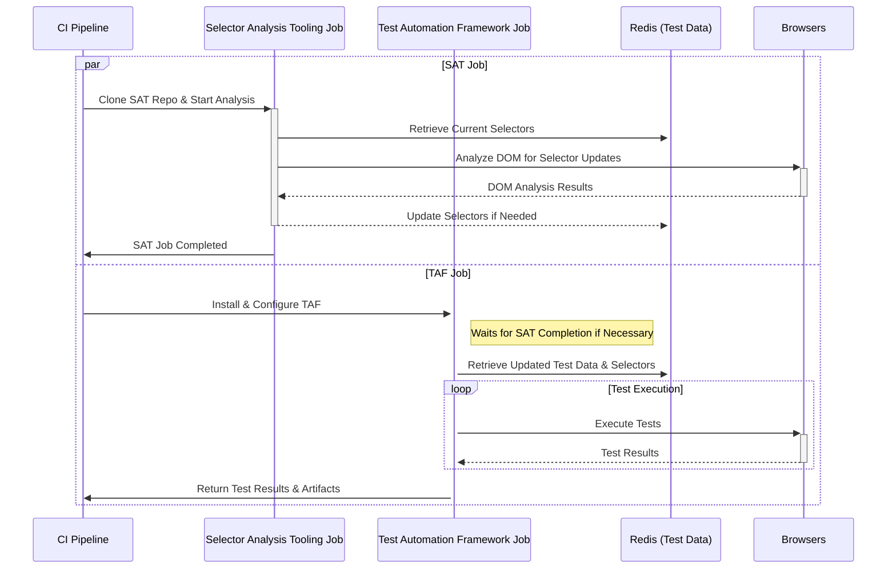
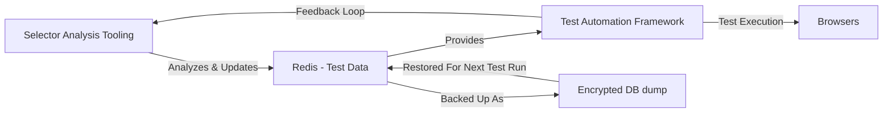
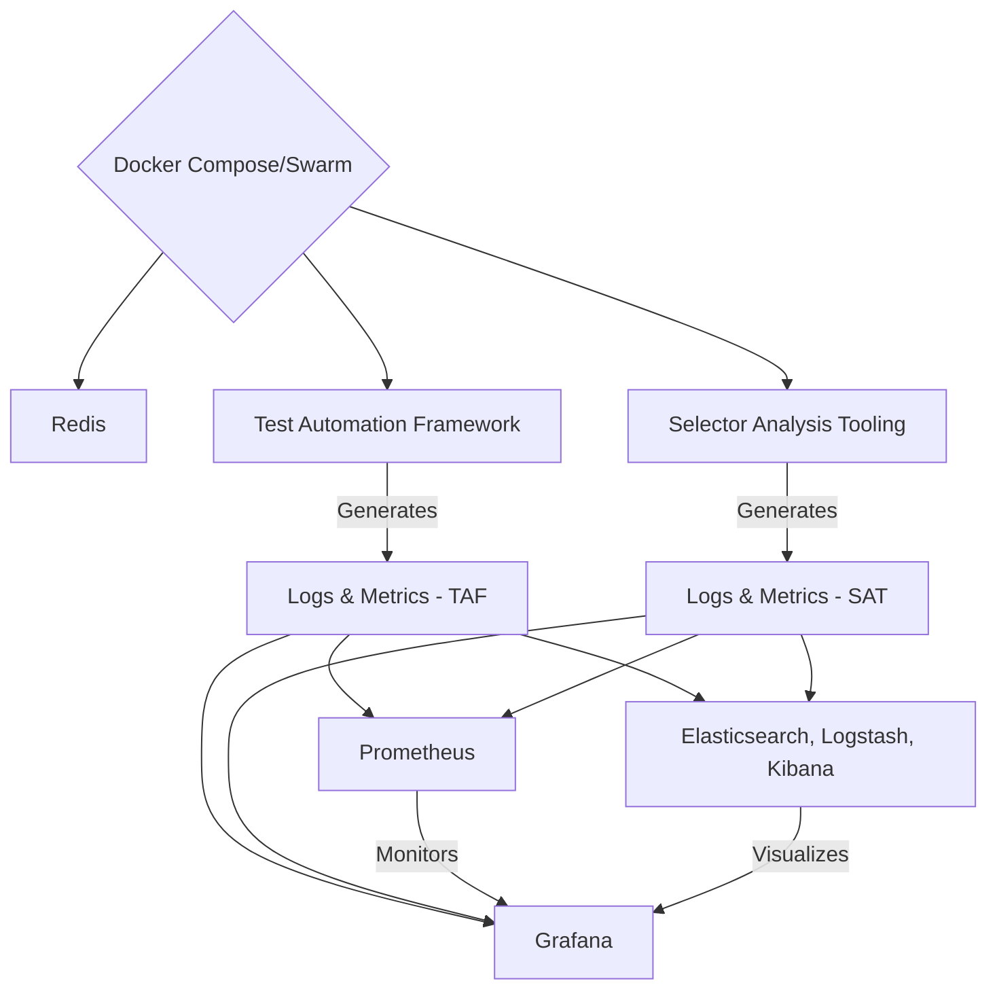

# AuroraFlow :: Import Joy and Chill into your Test Scripts

## ~ A Robust AI-Driven Test Automation Framework you can Rely on ~

## Objective

This document outlines an advanced blueprint for a Test Automation Framework (TAF) that incorporates AI-driven Selector Analysis Tooling (SAT), dynamic test data management, real-time monitoring, and more. It begins with a clean architecture and meticulous, professional software design. With an emphasis on scalability, reliability, adaptability, and observability, the framework leverages Docker, Redis, Prometheus, Grafana, the ELK stack, and machine learning technologies. Its purpose is to automate UI, end-to-end, and accessibility testing and offer self-healing capabilities efficiently across a variety of web applications, with a special focus on developer experience.

## Architectural Overview

This diagram illustrates the core components of the TAF ecosystem, showing the relationships between the CI pipeline, the Test Automation Framework, Redis, the Selector Analysis Tooling, browsers, and the monitoring tools.

### Core Components

- **Node.js and TypeScript:** Serve as the backbone for the TAF, offering asynchronous execution and strong typing for robust, maintainable code.
- **Playwright:** Enables automated, cross-browser UI interactions and assertions, facilitating comprehensive test coverage.
- **Page Object Model (POM) & Page Factory:** Encapsulates UI element interactions, improving test maintenance and reducing redundancy.
- **Redis:** Acts as a central repository for storing and managing UI selectors and other test data, allowing for real-time updates and retrieval.
- **Docker Compose (migrating to Swarm):** Orchestrates containerized deployments of the TAF, SAT, and Redis, ensuring consistency across testing environments.
- **AI-Driven SAT:** Utilizes TensorFlow.js and NLP for dynamic identification and updating of UI selectors based on DOM analysis, minimizing manual intervention.
- **Monitoring and Logging:** Integrates Prometheus, Grafana, and the ELK stack for real-time monitoring, logging, and analysis of the test infrastructure.
- **Computer Vision:** Employs open-source computer vision models to enhance UI testing capabilities, particularly for complex or dynamic UI elements.

### Enhanced Features

- **Docker Compose for CI/CD Pipelines:** Facilitates Redis and SAT service management, ensuring isolated, reproducible test environments.
- **Redis Persistence:** Utilizes encrypted Redis dump files as a persistent data source across CI runs, safeguarded with GitHub secrets.
- **Machine Learning for SAT:** Leverages custom-built or open-source ML models for efficient DOM analysis and selector optimization.
- **Advanced Monitoring and Visualization:** Employs Prometheus and Grafana for infrastructure monitoring, combined with ELK for in-depth log analysis.
- **Failover Mechanisms & Robust Error Handling:** Implements sophisticated error handling and failover strategies to enhance the resilience of the test infrastructure.
- **Tracing with Jaeger or Zipkin:** Offers detailed tracing of test executions and interactions within the infrastructure for pinpointing issues.

### TAF Design Best Practices

- **Modularity and Encapsulation:** Page objects encapsulate UI interactions, while helper functions and utilities support reusable logic, promoting clean and modular code.
- **Asynchronous Programming:** Playwright's asynchronous API is fully leveraged, ensuring non-blocking operations and efficient execution.
- **Error Handling:** Custom error handling in page actions, with logging and screenshots on failure, enhances debugging and accountability.
- **Retry Mechanisms:** Implement retry logic with exponential backoff for flaky operations, improving test reliability.
- **Security:** Strong encryption for Redis dump and GitHub secrets for sensitive data ensure security best practices.
- **Test Isolation:** Docker containers provide isolated environments for each test run, reducing data pollution and ensuring consistent test conditions.

### Project Structure and Setup

- Organized test codebase with clear directories for tests, page objects, helpers, and utilities, using TypeScript for type safety and readability.
- Configured Playwright for cross-browser testing (Chrome, Firefox, Safari, Edge) and managed test environments with environment variables and configuration files.

### Continuous Integration

- Integrated CI pipelines (GitHub Actions) for automated test execution, leveraging parallel test execution to optimize feedback time.
- Enhanced error handling and logging, including Playwright's screenshot and video capture on test failures, for improved debugging.

### Code Quality and Scalability

- Enforced coding standards with ESLint and Prettier, and optimized test execution through parallel test runs supported by Playwright.

### Documentation, Accessibility, and Knowledge Sharing

- Maintained comprehensive documentation for the test framework, including setup instructions and test writing guidelines.
- Incorporated accessibility checks into end-to-end tests, ensuring web applications are accessible to all users.

## Test Execution Flow

This sequence diagram details the test execution flow, highlighting the interactions between the CI pipeline, TAF, Redis, SAT, and browsers during a test run.

## Data Management and SAT Workflow

This diagram focuses on the data management aspect, showing how the Selector Analysis Tooling updates test data in Redis, which is then used by the TAF for test execution. It also depicts the backup and restoration process of Redis data as an encrypted Redis dump, ensuring secure and reliable Test Data management and persistence across test runs.

## Implementation Details

### Docker Compose and Redis Configuration

- Use Docker Compose to spin up Redis in GitHub Actions, ensuring a consistent, isolated environment. Plan for future migration to Docker Swarm for enhanced scalability and management.
- Manage Redis as the dynamic data store for test selectors and URLs, with automated updates via SAT. Encrypt Redis dumps for security, decrypting them in CI pipelines with GitHub secrets.

### SAT Development and Integration

- Develop SAT as an independent, AI-driven tool that runs in parallel to TAF executions. It should analyze the application's UI, automatically identify changes in selectors, and update Redis accordingly. For separation of concerns, it resides on a separate repository.
- Utilize TensorFlow.js for building or customizing ML models, trained on historical test data and web application changes. Incorporate NLP techniques for improved page context understanding.

### CI/CD Pipeline Enhancements

- Implement GitHub Actions workflows to manage TAF and SAT operations, including Docker Compose setups and Redis data management.
- Encrypt the Redis dump file for secure storage in the TAF repository. Automatically decrypt and load this dump in Redis at the start of test runs.

### Monitoring, Logging, and Tracing Setup

- Configure Prometheus and Grafana for real-time monitoring, setting up dashboards to display key metrics from test runs and infrastructure health.
- Utilize the ELK stack for comprehensive logging and analysis, ensuring that all test execution and system logs are indexed and searchable.
- Integrate Jaeger or Zipkin for tracing, enabling detailed analysis of test executions and system interactions to quickly identify bottlenecks or failures.

### Best Practices and Security Measures

- Encapsulate UI interactions within page objects, using the Page Factory for instance management, to ensure code modularity and reusability.
- Implement robust error handling and custom exceptions within page actions, including screenshots on failure for enhanced debugging.
- Secure test data management with encrypted Redis dumps and GitHub secrets, adhering to security best practices for CI pipelines.

## Infrastructure and Monitoring

This diagram showcases the infrastructure setup using Docker Compose/Swarm for container management and the integration of Prometheus, Grafana, and ELK for monitoring logs and metrics generated by the TAF and SAT.

## Rationale Behind Architectural Choices

The proposed TAF architecture is designed to address the challenges of dynamic web UI testing at scale. By leveraging Docker for environment consistency, Redis for flexible data management, and AI for automatic selector updates, the framework reduces manual maintenance and increases test reliability. The integration of advanced monitoring, logging, and tracing tools ensures comprehensive visibility into test executions and infrastructure performance, facilitating quick issue resolution and continuous improvement.

## Final Thoughts

The advanced TAF with SAT and dynamic test data management represents a state-of-the-art approach to automated web testing. By combining modern development practices, AI technologies, and containerization, this framework offers a scalable, efficient, and adaptable solution for ensuring the quality of web applications. Its design reflects a deep understanding of the complexities of modern web development and testing landscapes, setting a new standard for automated testing frameworks.

## Contributing

This exciting project is in early development phase.
Hit me up if you are interested in contributing!