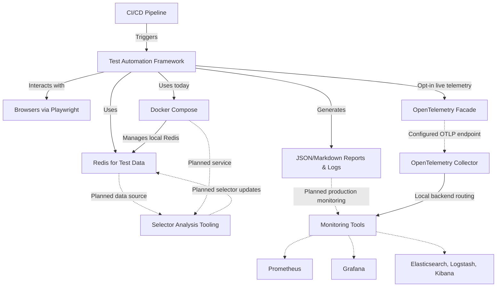
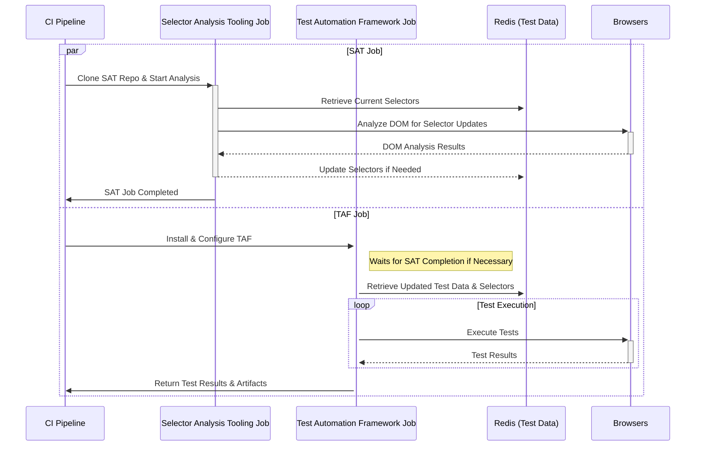
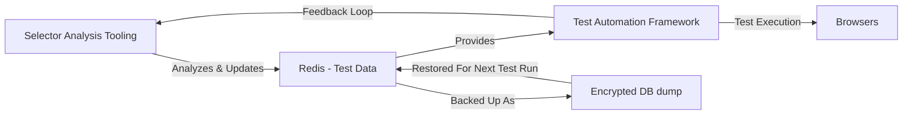
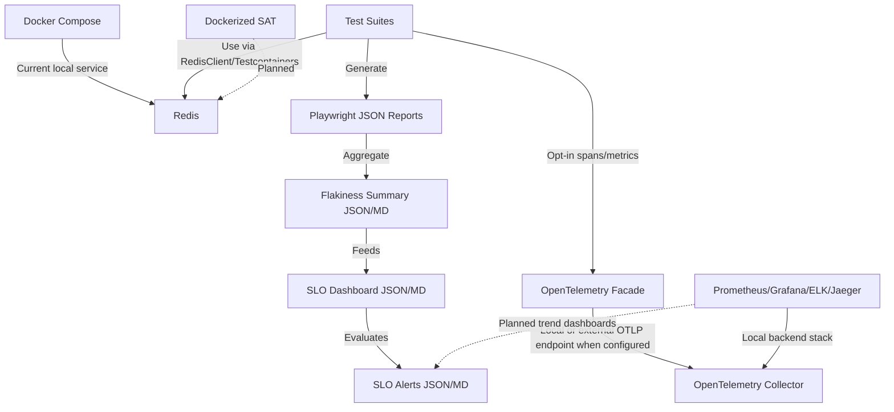

# AuroraFlow :: Import Joy and Chill into your Test Scripts

## ~ A Robust AI-Driven Test Automation Framework you can Rely on ~

## Objective

This document describes AuroraFlow's current Test Automation Framework (TAF) foundation and the target architecture it is growing toward. The implemented repository currently centers on Playwright, TypeScript, Redis data primitives, guarded self-healing artifacts, JSON/Markdown observability reports, configurable structured logging, an opt-in OpenTelemetry facade for framework telemetry, local Prometheus/Grafana/ELK/Jaeger stack configuration, CI observability smoke lanes, remote telemetry export hooks, and production observability reference manifests. AI-driven Selector Analysis Tooling (SAT), Dockerized SAT services, encrypted Redis dump lifecycle, and autonomous selector optimization remain roadmap capabilities until corresponding services and workflows exist in source.

## Current Repository Status (June 2026)

AuroraFlow currently provides a hardened foundation and examples-first blueprint. The full platform vision in this README remains the target architecture and is not fully implemented yet.

Implemented now:

- Playwright + TypeScript framework core with Page Object + Page Factory patterns.
- Quality/security CI workflows (`quality.yml`, `security.yml`, `examples.yml`, full matrix in `ci.yml`).
- E2E matrix flakiness analytics artifacts (`flakiness-summary.json` and `flakiness-summary.md`).
- SLO dashboard and alert policy artifacts from matrix telemetry (`slo-dashboard*.{json,md}`, `slo-alerts*.{json,md}`).
- Guarded self-healing foundation with artifact capture, candidate ranking, dry-run validation, and guarded auto-apply retry controls.
- SAT enrichment for failed page actions, including bounded DOM snapshots, allow-listed/redacted attributes, DOM-backed candidate extraction, deterministic candidate IDs, artifact schema parsing, and a deterministic Playwright fixture.
- Redis data-layer primitives (`RedisClient`, selector registry repository) and Testcontainers integration tests.
- Opt-in OpenTelemetry telemetry facade with no-op defaults, resource attribute normalization, PageObjectBase action spans/metrics, and trace/span log correlation.
- Local observability stack configuration with OpenTelemetry Collector, Prometheus, Grafana dashboards, Jaeger, Elasticsearch, Logstash, and Kibana.
- Collector-only, optional full-stack, and optional remote-export CI observability smoke lanes with uploaded diagnostics.
- Production observability references with TLS/auth-enabled manifests, runbooks, and dashboard review guidance.
- Configurable structured logging with default secret redaction and selectable console/file/silent destinations.
- Runnable deterministic examples for page objects, quickstart, reliability, data-provider abstractions, observability patterns, accessibility checks, and CI templates.

Planned/roadmap (not fully implemented yet):

- SAT history-backed scoring, promotion workflows, ML pipeline, and autonomous selector optimization lifecycle.
- Trend-dashboard governance and environment-owned production deployments.
- Extended platform governance automation and release/signing workflows.

## Target Architecture (Roadmap)

```mermaid
graph TD;
    CI[CI/CD Pipeline]-->|Triggers|TAF[Test Automation Framework];
    TAF-->|Uses|Redis[Redis for Test Data];
    TAF-->|Interacts with|Browser[Browsers via Playwright];
    Redis-.->|Planned data source|SAT[Selector Analysis Tooling];
    SAT-.->|Planned selector updates|Redis;
    TAF-->|Generates|Reports[JSON/Markdown Reports & Logs];
    TAF-->|Opt-in live telemetry|Telemetry[OpenTelemetry Facade];
    Telemetry-.->|Configured OTLP endpoint|Collector[OpenTelemetry Collector];
    Reports-.->|Planned production monitoring|Monitoring[Monitoring Tools];
    Collector-->|Local backend routing|Monitoring;
    Monitoring-.->Prometheus;
    Monitoring-.->Grafana;
    Monitoring-.->ELK[Elasticsearch, Logstash, Kibana];
    TAF-->|Uses today|Docker[Docker Compose];
    Docker-->|Manages local Redis|Redis;
    Docker-.->|Planned service|SAT;
```

This roadmap diagram separates the implemented foundation from planned services. Today, Docker Compose manages local Redis and an optional local observability stack, the OpenTelemetry facade is available as an opt-in framework boundary, CI can smoke-test collector/full-stack/remote telemetry paths, and production hardening is represented by reference manifests and operator docs. SAT services and autonomous selector optimization are target architecture, not current runtime infrastructure.

### Core Components

- **Node.js and TypeScript:** Serve as the backbone for the TAF, offering asynchronous execution and strong typing for robust, maintainable code.
- **Playwright:** Enables automated, cross-browser UI interactions and assertions, facilitating comprehensive test coverage.
- **Page Object Model (POM) & Page Factory:** Encapsulates UI element interactions, improving test maintenance and reducing redundancy.
- **Redis:** Provides implemented data-layer primitives for namespaced keys and selector registry records; autonomous selector updates are planned.
- **Docker Compose:** Currently orchestrates local Redis and an optional local observability stack. Dockerized SAT, TAF services, and Docker Swarm are not implemented yet.
- **AI-Driven SAT:** Planned capability for dynamic selector identification and updates based on DOM analysis.
- **Monitoring and Logging:** Currently implemented as redacted structured logs, JSON/Markdown flakiness, SLO, and alert artifacts, an opt-in OpenTelemetry facade, local collector-backed Prometheus/Grafana/ELK/Jaeger configuration, CI smoke lanes, remote export hooks, and production reference manifests.
- **Computer Vision:** Planned capability for complex or dynamic UI elements.

### Enhanced Features

- **Current Docker Compose support:** Provides a local Redis service with healthcheck and persistent volume for development and integration testing.
- **Current observability artifacts:** Generates flakiness summaries, SLO dashboards, and SLO alert evaluations as JSON/Markdown artifacts.
- **Current live telemetry foundation:** Provides opt-in OpenTelemetry spans/metrics for page actions, normalized resource attributes, privacy-preserving action target hashing, and trace/span identifiers in structured logs.
- **Planned Redis persistence:** Encrypted Redis dump backup/restore across CI runs.
- **Planned SAT ML:** Custom-built or open-source ML models for DOM analysis and selector optimization.
- **Local monitoring stack:** Prometheus/Grafana metrics, ELK log analysis, and Jaeger tracing are available through the optional local observability compose overlay.
- **Failover Mechanisms & Robust Error Handling:** Implemented in framework action wrappers and Redis retry primitives; broader infrastructure failover remains planned.

### TAF Design Best Practices

- **Modularity and Encapsulation:** Page objects encapsulate UI interactions, while helper functions and utilities support reusable logic, promoting clean and modular code.
- **Asynchronous Programming:** Playwright's asynchronous API is fully leveraged, ensuring non-blocking operations and efficient execution.
- **Error Handling:** Custom error handling in page actions, with logging and screenshots on failure, enhances debugging and accountability.
- **Retry Mechanisms:** Implement retry logic with exponential backoff for flaky operations, improving test reliability.
- **Security:** CI includes dependency review, npm audit, CodeQL, gitleaks, and workflow security checks; encrypted Redis dump handling is planned.
- **Test Isolation:** Docker Compose and Testcontainers provide Redis isolation for local/integration scenarios; full Dockerized TAF/SAT isolation is planned.

### Project Structure and Setup

- Organized test codebase with clear directories for tests, page objects, helpers, and utilities, using TypeScript for type safety and readability.
- Configured Playwright for cross-browser testing (Chrome, Firefox, Safari, Edge) and managed test environments with environment variables and configuration files.

### Continuous Integration

- Integrated CI pipelines (GitHub Actions) for automated test execution, leveraging parallel test execution to optimize feedback time.
- Enhanced error handling and logging, including Playwright's screenshot and video capture on test failures, for improved debugging.

### Code Quality and Scalability

- Enforced coding standards with ESLint and Prettier, and optimized test execution through parallel test runs supported by Playwright.

### Documentation, Accessibility, and Knowledge Sharing

- Maintained comprehensive documentation for the test framework, including setup instructions and test writing guidelines.
- Incorporated accessibility checks into end-to-end tests, ensuring web applications are accessible to all users.

## Test Execution Flow

```mermaid
sequenceDiagram
    participant CI as CI Pipeline
    participant SAT as Selector Analysis Tooling Job
    participant TAF as Test Automation Framework Job
    participant Redis as Redis (Test Data)
    participant Browser as Browsers

    par SAT Job
        CI->>+SAT: Clone SAT Repo & Start Analysis
        SAT->>+Redis: Retrieve Current Selectors
        SAT->>+Browser: Analyze DOM for Selector Updates
        Browser-->>-SAT: DOM Analysis Results
        SAT-->>-Redis: Update Selectors if Needed
        SAT->>CI: SAT Job Completed
    and TAF Job
        CI->>+TAF: Install & Configure TAF
        note right of TAF: Waits for SAT Completion if Necessary
        TAF->>+Redis: Retrieve Updated Test Data & Selectors
        loop Test Execution
            TAF->>+Browser: Execute Tests
            Browser-->>-TAF: Test Results
        end
        TAF->>CI: Return Test Results & Artifacts
    end
```

This sequence diagram represents the target SAT-integrated flow. Current CI runs TAF test suites and artifact generation; it does not yet clone, run, or wait for a SAT job.

## Data Management and SAT Workflow

```mermaid
graph LR;
    SAT[Selector Analysis Tooling] --> |Analyzes & Updates| Redis[Redis - Test Data];
    Redis --> |Provides| TAF[Test Automation Framework];
    TAF --> |Test Execution| Browser[Browsers];
    TAF --> |Feedback Loop| SAT;
    Redis --> |Backed Up As| DB_Dump[Encrypted DB dump];
    DB_Dump --> |Restored For Next Test Run| Redis;
```

This diagram represents the target data-management workflow. Current source includes Redis client and selector registry primitives, but not SAT-driven Redis updates or encrypted Redis dump backup/restore.

## Implementation Details

### Docker Compose and Redis Configuration

- Use Docker Compose to spin up local Redis for development and integration testing. Current GitHub Actions rely on Testcontainers for Redis integration tests, not a Dockerized SAT stack.
- Manage Redis as the dynamic data store foundation for test selectors and URLs. Automated SAT updates and encrypted Redis dump backup/restore are planned.

### SAT Development and Integration

- Current SAT support runs inside the self-healing failure path. When `SELF_HEAL_MODE=suggest` or `SELF_HEAL_MODE=guarded`, SAT can capture a bounded DOM snapshot through Playwright, redact sensitive attributes, extract resilient candidates, score them deterministically, and persist the compact analysis under the failure artifact's `sat` field.
- Runtime SAT controls include `SELF_HEAL_SAT_ENABLED`, `SELF_HEAL_SAT_CAPTURE_DOM`, `SELF_HEAL_MAX_DOM_NODES`, `SELF_HEAL_MAX_CANDIDATES`, `SELF_HEAL_MAX_TEXT_LENGTH`, `SELF_HEAL_ALLOWED_ATTRIBUTES`, `SELF_HEAL_REGISTRY_MODE`, and `SELF_HEAL_PROMOTION_MODE`.
- Future SAT phases can run as an independent, AI-driven tool in parallel to TAF executions. They should analyze the application's UI, identify selector changes, and promote reviewed selector updates into Redis-backed registry data.
- Utilize TensorFlow.js for building or customizing ML models, trained on historical test data and web application changes. Incorporate NLP techniques for improved page context understanding.

### CI/CD Pipeline Enhancements

- Implement GitHub Actions workflows to manage future TAF/SAT operations, Dockerized services, and Redis data lifecycle.
- Encrypt the Redis dump file for secure storage in the TAF repository and automatically decrypt/load it in Redis at the start of test runs.

### Monitoring, Logging, and Tracing Setup

- Current observability emits JSON/Markdown flakiness, SLO dashboard, and alert artifacts from Playwright report data.
- Live telemetry is opt-in. Set `AURORAFLOW_OBSERVABILITY_ENABLED=true` and configure `OTEL_EXPORTER_OTLP_ENDPOINT` to export framework spans and metrics to an OpenTelemetry Collector or compatible OTLP endpoint.
- Raw selectors, URLs, request bodies, passwords, tokens, and cookies are not emitted by default. Page action telemetry uses target hashes unless `AURORAFLOW_OBSERVABILITY_EXPORT_RAW_SELECTORS=true` is explicitly enabled.
- Structured logs include active trace and span identifiers when telemetry is enabled and a span is in scope.
- Start Prometheus, Grafana, ELK, and Jaeger locally with `npm run observability:up`, then emit telemetry with `AURORAFLOW_OBSERVABILITY_ENABLED=true` and `OTEL_EXPORTER_OTLP_ENDPOINT=http://localhost:4318`.
- See [`docs/operations/observability-contract.md`](docs/operations/observability-contract.md) for supported environment variables, resource attributes, span names, metric names, and privacy rules.
- See [`docs/architecture/observability-stack.md`](docs/architecture/observability-stack.md) and [`observability/README.md`](observability/README.md) for local stack architecture, ports, configuration files, and troubleshooting.

### Best Practices and Security Measures

- Encapsulate UI interactions within page objects, using the Page Factory for instance management, to ensure code modularity and reusability.
- Implement robust error handling and custom exceptions within page actions, including screenshots on failure for enhanced debugging.
- Secure test data management with validated Redis configuration and GitHub secret scanning today; encrypted Redis dump handling remains planned.

## Current Infrastructure and Monitoring Status

```mermaid
graph TD;
    Docker[Docker Compose]-->|Current local service|Redis[Redis];
    Tests[Test Suites]-->|Use via RedisClient/Testcontainers|Redis;
    Tests-->|Generate|PlaywrightReports[Playwright JSON Reports];
    Tests-->|Opt-in spans/metrics|Telemetry[OpenTelemetry Facade];
    PlaywrightReports-->|Aggregate|Flakiness[Flakiness Summary JSON/MD];
    Flakiness-->|Feeds|SLO[SLO Dashboard JSON/MD];
    SLO-->|Evaluates|Alerts[SLO Alerts JSON/MD];
    Telemetry-->|Local or external OTLP endpoint when configured|Collector[OpenTelemetry Collector];
    SAT[Dockerized SAT]-.->|Planned|Redis;
    Monitoring[Prometheus/Grafana/ELK/Jaeger]-->|Local backend stack|Collector;
    Monitoring-.->|Planned trend dashboards|Alerts;
```

Current infrastructure consists of local Redis orchestration, Testcontainers-backed Redis integration tests, artifact-based observability, opt-in OpenTelemetry emission from framework code, a repo-managed local Prometheus/Grafana/ELK/Jaeger stack, CI observability smoke workflows, remote export workflow hooks, and production observability reference manifests. Dockerized SAT services and environment-owned production deployments remain planned until the corresponding runtime services and operational ownership are in place.

## Rationale Behind Architectural Choices

The proposed TAF architecture is designed to address the challenges of dynamic web UI testing at scale. The current implementation establishes the Playwright framework, Redis data primitives, guarded self-healing artifacts, CI observability reports, a vendor-neutral telemetry boundary, local and CI backend smoke paths, and production observability references. Dockerized SAT, autonomous selector updates, and environment-owned production monitoring/tracing remain planned follow-on layers that should be claimed as deployed only after the corresponding services, security controls, and owners exist.

## Contributing

This exciting project is in the early development phase.
Hit me up if you are interested in contributing!
