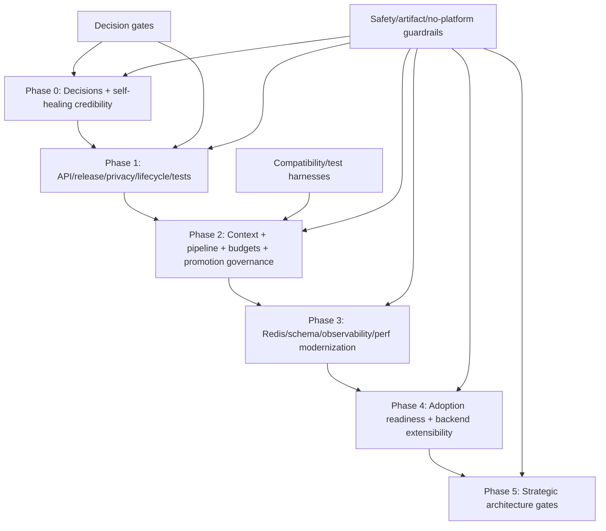
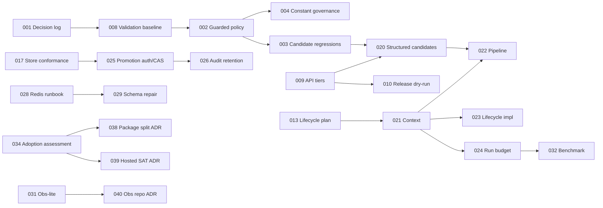

# Architecture Implementation Plan

## 1. Executive Summary

This document converts `docs/ARCHITECTURE_IMPROVEMENT_PLAN.md` into a coding-agent-ready execution plan. It is a planning document only; no production source, test, workflow, schema, lockfile, package metadata, or generated file changes are authorized or performed by this run.

Implementation strategy: execute **conservative evolution with internal seams**. Complete Phase 0 first to record the now-resolved stakeholder decisions, make the guarded self-healing contract credible, and add safety-regression baselines. Then add API, release, privacy, lifecycle, and testing foundations before invasive runtime refactors. Keep one npm package, preserve root import compatibility, keep Redis/telemetry optional, defer package split until adoption evidence exists, and treat hosted SAT as a non-goal.

Recommended execution order:

1. Phase 0: record stakeholder decisions and add safety-regression baselines.
2. Phase 1: establish API/release/privacy/lifecycle/test governance.
3. Phase 2: refactor runtime behind compatibility seams.
4. Phase 3: harden data, Redis, observability, trends, and performance evidence.
5. Phase 4: assess adoption and backend extensibility.
6. Phase 5: revisit package split and companion observability repo only with evidence; record hosted SAT as non-goal.

Top Phase 0 priorities:

- Create stakeholder decision log with the decisions supplied on 2026-06-10 for product, SLO, privacy, retention, Redis, promotion, observability support, release security, and future architecture scope.
- Decide and test guarded-healing bootstrap policy.
- Add structured-candidate quote-regression safety net before model migration.
- Govern scoring/SLO threshold constants.
- Define and implement candidate-history atomicity path; align TTL contract.
- Add self-healing config diagnostics.
- Record Phase 0 validation baseline.

Key risks: breaking root API compatibility, weakening safety-first self-healing, adding privacy controls that remove useful diagnostics without modes, broad runtime refactor before tests, CI cost growth, and implementation drift away from the resolved stakeholder decisions.

Expected outcome after completion: AuroraFlow remains a lightweight Playwright framework package, but guarded self-healing is predictable, artifacts and retention are governable, release/API posture is auditable, runtime dependencies are injectable, Redis/observability boundaries are explicit, and maintainers can evolve the system without premature platform expansion.

| Item | Result |
| --- | --- |
| Source plan | `docs/ARCHITECTURE_IMPROVEMENT_PLAN.md` |
| Output file | `docs/ARCHITECTURE_IMPLEMENTATION_PLAN.md` |
| Recommended architecture path | Conservative evolution with internal seams |
| Canonical issues mapped | 42 |
| Implementation tasks created | 40 |
| Decision gates | 13 resolved by operator decision on 2026-06-10 |
| Deferred items | 8 canonical items primarily monitor/deferred: `AUR-ARCH-023`, `024`, `025`, `031`, `032`, `033`, `034`, `039` |
| Production code modified | No |

## 2. Implementation Planning Methodology

The source plan was read end-to-end, including:

- Executive Summary.
- Canonical Issue Inventory.
- Source-to-Issue Coverage Matrix.
- Root-Cause Analysis.
- Improvement Principles and Guardrails.
- Recommended Target Architecture.
- Current-to-Target Gap Analysis.
- Detailed Improvement Designs.
- Target Architecture Options Revisited.
- Sequenced Roadmap.
- GitHub-style Work Breakdown.
- Validation Strategy.
- Security, Privacy, Reliability, and Operability Plan.
- Release, API, and Dependency Governance Plan.
- Risk Management and Trade-Offs.
- Decision Log and Stakeholder Questions.
- Non-Goals.
- Appendix.

Task derivation method:

1. Extracted all 42 `AUR-ARCH-*` canonical issues and their source priorities/phases.
2. Mapped each detailed improvement design (`DID-01` through `DID-20`) to one or more implementation tasks.
3. Split broad GitHub-style issue cards into smaller pull-request-sized implementation tasks where sequencing or validation differed.
4. Converted stakeholder unknowns into `AUR-DEC-*` decision gates with recommended defaults and fallbacks.
5. Converted preservation guardrails into mandatory validation/review requirements rather than feature tasks.
6. Merged duplicates where source issues share one implementation seam, while preserving traceability to all related issue IDs.
7. Assigned phases from the source roadmap, adjusted only to place tests, contracts, and decisions before refactors.
8. Sized tasks by likely pull-request scope: XS/S for docs or localized tests, M for single subsystem change, L for multi-module refactor, XL for epic-level work that must be decomposed.

Dependency rules used:

- Decisions before behavior changes.
- Regression tests before refactors.
- Compatibility contracts before API/release changes.
- Context/lifecycle seams before action-pipeline extraction.
- Store conformance before adding or expanding stores.
- Privacy classification before retention or artifact capture defaults.
- Phase 5 strategic work only after adoption/funding/support evidence.

Repository evidence inspected to refine likely files and commands:

- `package.json`, `vitest.config.mts`.
- `docs/**`, especially architecture, configuration, operations, and API docs.
- `.github/workflows/**`.
- `schemas/**`.
- `scripts/**`.
- `tests/suites/**`.
- `src/pageObjects/pageObjectBase.ts`.
- `src/helpers/pageFactory.ts`, `src/helpers/helpers.ts`.
- `src/framework/selfHealing/**`.
- `src/framework/observability/**`.
- `src/data/selectors/**`.
- `src/utils/logger.ts`, `src/utils/redisClient.ts`.

Limitations:

- This run did not execute tests, build, typecheck, package, workflow lint, or service startup.
- `docs/ARCHITECTURE_IMPROVEMENT_PLAN.md` is authoritative. Repository inspection refined file paths and commands only.
- If later repository state contradicts the source plan, the coding agent must stop and record a deviation/risk before changing code.
- Existing working tree already had untracked architecture-review files when this plan was created; this run only creates/updates `docs/ARCHITECTURE_IMPLEMENTATION_PLAN.md`.

Decision update:

- On 2026-06-10 the operator resolved all 13 `AUR-DEC-*` gates. This plan now treats those decisions as binding implementation policy, while still requiring `AUR-IMPL-001` to record them in the repository decision log/ADR location before behavior-changing PRs.

## 3. Coding Agent Operating Contract

Future coding agents executing this plan must follow this contract.

Read-before-coding checklist:

- Read this implementation plan fully.
- Read `docs/ARCHITECTURE_IMPROVEMENT_PLAN.md` fully.
- Read the task card for the active `AUR-IMPL-*` task.
- Read related `AUR-ARCH-*` issue sections and `DID-*` designs in the source plan.
- Inspect likely source/test/docs files listed in the task card.
- Check `git status --short`.
- Confirm allowed files for the task and out-of-scope files.
- Identify blocked `AUR-DEC-*` gates.
- Update Section 15 journal before editing.

Allowed commands:

- Read-only repository inspection: `pwd`, `ls`, `find`, `git status --short`, `git ls-files`, `rg`, `grep`, `sed`, `awk`, `wc`, `head`, `cat`.
- Safe package inspection: `npm pkg get`, `node -e` for local metadata reads.
- Existing validation scripts after implementation: `npm run format:check`, `npm run lint`, `npm run typecheck`, `npm run test:unit`, `npm run test:integration`, `npm run schemas:check`, `npm run workflows:lint`, `npm run pack:dry-run`, `npm run verify`.
- Existing targeted scripts listed in task cards.
- Docker/Playwright service commands only when the task explicitly requires them and the environment permits them.

Prohibited commands:

- Destructive git commands without maintainer permission: `git checkout --`, `git restore`, `git reset --hard`, branch deletion, force push.
- Dependency installation unless the active task explicitly authorizes dependency changes.
- Long-running service startup unless the active validation gate requires it.
- Editing generated files, lockfiles, package metadata, workflows, schemas, production code, or tests outside the active task scope.
- Publishing to npm, creating GitHub releases, changing secrets, or mutating external infrastructure.

Branch hygiene:

- Use one branch per pull-request-sized task or coherent PR group.
- Keep commits scoped to task IDs.
- Do not mix Phase 2 refactors with Phase 0/1 governance unless explicitly grouped in Section 10.
- Include task IDs in PR title/body.

Dependency installation policy:

- Do not add dependencies unless a task explicitly names the dependency class and acceptance criteria.
- Prefer built-in Vitest/table-driven generators before adding property-test libraries.
- If a new dependency is required, stop unless the task already includes dependency approval and validation.

Generated file and lockfile policy:

- Do not edit generated files directly.
- Do not edit `package-lock.json` unless a task explicitly adds/removes dependencies and validation covers install/build behavior.
- Schema changes must include versioning, legacy-read behavior, and contract tests.

Migration policy:

- Preserve root import compatibility.
- Public API changes need tier classification, release notes, compatibility tests, and deprecation horizon.
- Redis/artifact/schema changes need `schemaVersion` or documented legacy read paths.
- Behavior changes to self-healing defaults require release notes and regression fixtures.

Test-first expectations:

- Phase 0/1 tasks must add or update tests before behavior refactors when possible.
- Critical parser/stateful/concurrency changes require table-driven, property/fuzz-style, or concurrency tests.
- Preservation guardrails require tests or explicit manual review gates if automation is not practical.

Backward-compatibility expectations:

- Existing env names, root exports, CLI commands, artifact readers, no-op telemetry defaults, and optional Redis behavior remain compatible unless a task explicitly says otherwise.
- Default local development must not require Redis, OTel, Docker Compose, Prometheus, Grafana, Jaeger, ELK, or hosted services.

Documentation update expectations:

- Any task that changes public behavior, defaults, API tier, schema, artifact data, release workflow, privacy, or operational boundary must update relevant docs.
- Docs must distinguish supported behavior from reference-only examples.

Security/privacy expectations:

- Treat screenshots, DOM text, URLs, selectors, logs, telemetry attributes, Redis records, trend files, and audit records as potentially sensitive.
- Never add new sensitive artifact capture without classification, retention notes, and redaction/masking tests or review gate.
- Shared Redis and promotions require explicit authorization/tenancy decisions before enforcement changes.

Stop and ask for stakeholder decision when:

- A task depends on unresolved product, compliance, retention, SLO, support, ownership, or tenancy decision.
- A breaking API change is needed but not covered by this plan.
- Tests contradict source-plan assumptions.
- Repository evidence contradicts the architecture improvement plan.
- New dependencies are required but not explicitly planned.
- Required edits exceed allowed scope.
- Validation cannot be run and no fallback review gate exists.

Journal and handoff:

- Update Section 15 before starting a task, after meaningful changes, after validations, and before handoff.
- Record commands, results, skipped tests, files changed, decisions, blockers, deviations, and next recommended task.
- Final handoff notes must include task ID, changed files, validation evidence, unresolved risks, rollback notes, and next step.

### 3.1 Stop Conditions

A coding agent must stop instead of guessing when:

- A task depends on unresolved product, compliance, retention, SLO, or support decision.
- Implementing the task would require a breaking public API change not covered by the plan.
- Tests contradict the assumptions in the plan.
- Repository evidence contradicts the architecture improvement plan.
- A task requires installing new dependencies not explicitly planned.
- A task requires modifying files outside its allowed scope.
- Validation cannot be run and no fallback review gate is defined.

## 4. Source-to-Implementation Coverage Matrix

Total canonical issues from source plan: 42

Total implementation tasks: 40

Total decision gates: 13

Total deferred / monitor-only items: 8

| Source item ID | Source item title | Source item type | Source priority / phase | Implementation disposition | Implementation task IDs | Decision gate IDs, if any | Validation IDs | Notes |
| --- | --- | --- | --- | --- | --- | --- | --- | --- |
| `AUR-ARCH-001` | Guarded-healing defaults and promotion bootstrap are incoherent | canonical issue | P0 / Phase 0 | Implement | `AUR-IMPL-002`, `004`, `008` | `AUR-DEC-002`, `003` | `AUR-VAL-001`, `002`, `004` | Bootstrap policy before default changes. |
| `AUR-ARCH-002` | Locator candidates are stringly typed and parser/emitter mismatch is live | canonical issue | P0 / Phase 0-1 | Implement | `AUR-IMPL-003`, `020` | `AUR-DEC-002` | `AUR-VAL-003`, `026` | Quote-regression safety net first; full structured model later. |
| `AUR-ARCH-003` | Scoring, threshold, and SLO constants are duplicated or divergent | canonical issue | P0 / Phase 0 | Implement | `AUR-IMPL-004` | `AUR-DEC-003` | `AUR-VAL-004` | Single-source or asserted-difference policy. |
| `AUR-ARCH-004` | Candidate history writes are not atomic | canonical issue | P0 / Phase 0 | Implement | `AUR-IMPL-005` | `AUR-DEC-006` | `AUR-VAL-005`, `020` | Requires exact concurrency test. |
| `AUR-ARCH-005` | Candidate history TTL default differs from actual clamp | canonical issue | P0 / Phase 0 | Implement | `AUR-IMPL-006` | `AUR-DEC-005` | `AUR-VAL-006`, `026` | Align code, schema, docs. |
| `AUR-ARCH-006` | Self-healing config silently falls back and has dead/unclear promotion mode | canonical issue | P0 / Phase 0 | Implement | `AUR-IMPL-007`, `021` | `AUR-DEC-002` | `AUR-VAL-007`, `015` | Diagnostics now; context later. |
| `AUR-ARCH-007` | Screenshots, DOM text, artifacts, logs, Redis data, and telemetry need privacy controls | canonical issue | P1 / Phase 1 | Implement | `AUR-IMPL-011`, `012`, `026` | `AUR-DEC-004`, `005` | `AUR-VAL-010`, `019`, `028` | Data classification before default behavior changes. |
| `AUR-ARCH-008` | Public API lacks stability tiers and compatibility governance | canonical issue | P1 / Phase 1 | Implement | `AUR-IMPL-009`, `010`, `020` | `AUR-DEC-001`, `012` | `AUR-VAL-008`, `009`, `027` | Classify root exports before schema/API changes. |
| `AUR-ARCH-009` | Release, changelog, SBOM, signing, provenance, and rollback workflow are absent | canonical issue | P1 / Phase 1 | Implement | `AUR-IMPL-010`, `016` | `AUR-DEC-012` | `AUR-VAL-009`, `025`, `027`, `028` | Dry-run first; publish only after secrets/provenance ready. |
| `AUR-ARCH-010` | `PageObjectBase` over-centralizes action orchestration | canonical issue | P1 / Phase 2 | Implement | `AUR-IMPL-022` | none | `AUR-VAL-016` | Context and tests must precede extraction. |
| `AUR-ARCH-011` | Process-global env and singleton runtime model limit isolation | canonical issue | P1 / Phase 2 | Implement | `AUR-IMPL-021`, `023`, `033` | none | `AUR-VAL-011`, `015` | Env-backed default context preserves compatibility. |
| `AUR-ARCH-012` | Package-level lifecycle helper and Playwright fixture are missing | canonical issue | P1 / Phase 1-2 | Implement | `AUR-IMPL-013`, `023` | none | `AUR-VAL-011` | Phase 1 contract/design, Phase 2 runtime adoption. |
| `AUR-ARCH-013` | No per-run self-healing budget or failure-storm breaker | canonical issue | P1 / Phase 2 | Implement | `AUR-IMPL-024`, `032` | `AUR-DEC-013` | `AUR-VAL-017`, `024` | Budget may start warning-only until baseline. |
| `AUR-ARCH-014` | Promotion authorization is identity string based, not policy based | canonical issue | P1 / Phase 2 | Implement | `AUR-IMPL-025` | `AUR-DEC-007`, `006` | `AUR-VAL-018`, `028` | Shared mode must not be permissive without warning. |
| `AUR-ARCH-015` | Promotion record updates lack expected-status concurrency semantics | canonical issue | P2 / Phase 2 | Implement | `AUR-IMPL-025` | `AUR-DEC-007` | `AUR-VAL-018` | CAS/expected-status semantics. |
| `AUR-ARCH-016` | Redis production lifecycle is incomplete | canonical issue | P2 / Phase 3 | Implement | `AUR-IMPL-028` | `AUR-DEC-006` | `AUR-VAL-020`, `026` | Runbook, not AuroraFlow infra ownership. |
| `AUR-ARCH-017` | Registry schema migration, index repair, and scale ceilings need hardening | canonical issue | P2 / Phase 3 | Implement | `AUR-IMPL-029`, `036` | `AUR-DEC-006`, `013` | `AUR-VAL-021`, `020` | SchemaVersion and repair tooling after API governance. |
| `AUR-ARCH-018` | Trend history is cache-backed and strict-parsed | canonical issue | P2 / Phase 1-3 | Implement | `AUR-IMPL-018`, `030` | `AUR-DEC-005`, `013` | `AUR-VAL-022` | Tolerant reader early; durable export later. |
| `AUR-ARCH-019` | Observability stack is valuable but heavy and needs lite/support boundaries | canonical issue | P2 / Phase 3 | Implement | `AUR-IMPL-031`, `040` | `AUR-DEC-008` | `AUR-VAL-023`, `026` | Preserve optional stack; support tiers. |
| `AUR-ARCH-020` | Playwright peer range lacks explicit version matrix coverage | canonical issue | P2 / Phase 1 | Implement | `AUR-IMPL-014` | none | `AUR-VAL-012` | Scheduled/release lane if PR CI too costly. |
| `AUR-ARCH-021` | OTLP integration near the code path needs coverage | canonical issue | P2 / Phase 1 | Implement | `AUR-IMPL-019` | `AUR-DEC-008` | `AUR-VAL-014`, `023` | Lightweight collector/mock before full stack. |
| `AUR-ARCH-022` | Coverage thresholds, property tests, and concurrency tests are missing in critical areas | canonical issue | P2 / Phase 1-2 | Implement | `AUR-IMPL-015`, `003`, `005` | none | `AUR-VAL-003`, `005`, `013` | Critical modules before broad threshold ratchet. |
| `AUR-ARCH-023` | Logger has import-time side effects | canonical issue | P2 / Phase 3 | Monitor / implement if side-effect test fails | `AUR-IMPL-033` | none | `AUR-VAL-011`, `015` | Lower priority; context/lifecycle may address. |
| `AUR-ARCH-024` | `PageFactory` cache invalidation is manual | canonical issue | P3 / Phase 1 | Monitor / docs and fixture | `AUR-IMPL-013`, `023` | none | `AUR-VAL-011` | Avoid broad cache rewrite. |
| `AUR-ARCH-025` | Retry helper loses original error object and cause chain | canonical issue | P3 / Phase 2 | Monitor / small fix | `AUR-IMPL-022` | none | `AUR-VAL-016` | Preserve original failure evidence. |
| `AUR-ARCH-026` | Productized memory selector store and store conformance suite are missing | canonical issue | P2 / Phase 1 & 4 | Implement | `AUR-IMPL-017`, `036` | `AUR-DEC-006`, `011` | `AUR-VAL-020` | Memory store now; extra stores demand-gated. |
| `AUR-ARCH-027` | Locator-first Playwright API ergonomics are missing | canonical issue | P2 / Phase 2 | Defer behind pipeline | `AUR-IMPL-027`, `022`, `020` | none | `AUR-VAL-016`, `003` | Do not break string-selector API. |
| `AUR-ARCH-028` | Failure-path benchmark and DOM snapshot latency metric are missing | canonical issue | P2 / Phase 3 | Implement | `AUR-IMPL-032`, `024` | `AUR-DEC-013` | `AUR-VAL-024`, `017` | Baseline before hard gates. |
| `AUR-ARCH-029` | Redis prefixing is namespace hygiene, not authorization | canonical issue | P2 / Phase 2-3 | Implement | `AUR-IMPL-025`, `028` | `AUR-DEC-006`, `007` | `AUR-VAL-018`, `020`, `026` | Prefix policy must not imply ACL. |
| `AUR-ARCH-030` | Audit namespace is unbounded and cleanup skips audit records | canonical issue | P3 / Phase 2 | Implement | `AUR-IMPL-026` | `AUR-DEC-005` | `AUR-VAL-019`, `026` | Retention decision required. |
| `AUR-ARCH-031` | Redis and OTel unconditional dependency weight needs monitoring, not premature split | canonical issue | P3 / Phase 5 | Monitor | `AUR-IMPL-034`, `038` | `AUR-DEC-009` | `AUR-VAL-027` | No package split now. |
| `AUR-ARCH-032` | Redis-to-observability dependency inversion may block future lightweight split | canonical issue | P3 / Phase 5 | Defer | `AUR-IMPL-038` | `AUR-DEC-009` | `AUR-VAL-027` | Track only if split evidence appears. |
| `AUR-ARCH-033` | GitHub Actions is the only first-class CI orchestration | canonical issue | P3 / Phase 5 | Monitor | `AUR-IMPL-037` | `AUR-DEC-011` | `AUR-VAL-025`, `026` | Demand-gated docs/templates. |
| `AUR-ARCH-034` | Single-maintainer bus factor is a project risk | canonical issue | P3 / Phase 3 | Monitor / governance | `AUR-IMPL-016` | `AUR-DEC-001` | `AUR-VAL-026` | CODEOWNERS/ADR reduce risk. |
| `AUR-ARCH-035` | Contributor onboarding, CODEOWNERS, and ADRs are missing | canonical issue | P3 / Phase 1-3 | Implement | `AUR-IMPL-016` | `AUR-DEC-001` | `AUR-VAL-026` | Advisory CODEOWNERS acceptable initially. |
| `AUR-ARCH-036` | Product direction and target market are unresolved | canonical issue | P1 / Phase 0 | Decided / record in repo log | `AUR-IMPL-001`, `034` | `AUR-DEC-001` | `AUR-VAL-026` | Resolved as public npm library on 2026-06-10. |
| `AUR-ARCH-037` | Scale, compliance, retention, SLO, and shared-ops assumptions are unknown | canonical issue | P1 / Phase 0 | Decided / record in repo log | `AUR-IMPL-001`, `011`, `028`, `034` | `AUR-DEC-004`, `005`, `006`, `013` | `AUR-VAL-010`, `020`, `024`, `026` | Resolved defaults: synthetic/non-prod PII, shortest useful retention, consumer-owned Redis/CI, baseline-first budget. |
| `AUR-ARCH-038` | Observability SLO and alert thresholds need policy ownership | canonical issue | P2 / Phase 0-1 | Decide first / implement governance | `AUR-IMPL-004` | `AUR-DEC-003` | `AUR-VAL-004` | Warn-by-default unless SLO owner chooses blocking. |
| `AUR-ARCH-039` | Package split and hosted SAT are deferred strategic decision points | canonical issue | P3 / Phase 5 | Defer / non-goal | `AUR-IMPL-038`, `039` | `AUR-DEC-009`, `010` | `AUR-VAL-027` | Package split needs evidence/owner; hosted SAT is never. |
| `AUR-ARCH-040` | Safety-first self-healing invariants must be preserved | preservation guardrail | P1 / All phases | Preserve via guardrail | `AUR-IMPL-002`, `003`, `020`, `022`, `024`, `025` | `AUR-DEC-002`, `007` | `AUR-VAL-002`, `003`, `016`, `017`, `018` | No silent selector mutation or source rewrite. |
| `AUR-ARCH-041` | Artifact-first observability and no-op optional subsystem defaults must be preserved | preservation guardrail | P1 / All phases | Preserve via guardrail | `AUR-IMPL-011`, `019`, `031`, `040` | `AUR-DEC-008` | `AUR-VAL-010`, `014`, `023`, `026` | Artifacts remain authoritative. |
| `AUR-ARCH-042` | Production ownership boundaries and anti-goals must remain explicit | preservation guardrail | P1 / All phases | Preserve via guardrail | `AUR-IMPL-028`, `031`, `038`, `039`, `040` | `AUR-DEC-006`, `008`, `009`, `010` | `AUR-VAL-020`, `023`, `026` | No managed Redis/observability/platform claim. |
| `DID-01` | Guarded-healing calibration and bootstrap policy | detailed improvement design | Phase 0 | Implement | `AUR-IMPL-002`, `004` | `AUR-DEC-002`, `003` | `AUR-VAL-002`, `004` | Calibrate with tests, not comments. |
| `DID-02` | Structured locator candidates | detailed improvement design | Phase 0-2 | Implement | `AUR-IMPL-003`, `020` | none | `AUR-VAL-003`, `026` | Add legacy read path. |
| `DID-03` | Scoring, threshold, and SLO constant governance | detailed improvement design | Phase 0 | Implement | `AUR-IMPL-004` | `AUR-DEC-003` | `AUR-VAL-004` | CI drift test required. |
| `DID-04` | Atomic candidate history updates and TTL alignment | detailed improvement design | Phase 0 | Implement | `AUR-IMPL-005`, `006` | `AUR-DEC-005`, `006` | `AUR-VAL-005`, `006` | Redis + memory/store conformance path. |
| `DID-05` | Self-healing config validation and effective-config diagnostics | detailed improvement design | Phase 0 | Implement | `AUR-IMPL-007` | none | `AUR-VAL-007` | Strict mode opt-in first. |
| `DID-06` | Privacy controls for DOM text, screenshots, artifacts, logs, telemetry | detailed improvement design | Phase 1 | Implement | `AUR-IMPL-011`, `012`, `026` | `AUR-DEC-004`, `005` | `AUR-VAL-010`, `019` | Sensitive preset must be testable. |
| `DID-07` | API stability tiers and deprecation policy | detailed improvement design | Phase 1 | Implement | `AUR-IMPL-009` | `AUR-DEC-001` | `AUR-VAL-008` | Docs-first, no export removal. |
| `DID-08` | Release, changelog, SBOM, and npm provenance workflow | detailed improvement design | Phase 1 | Implement | `AUR-IMPL-010` | `AUR-DEC-012` | `AUR-VAL-009`, `025`, `027`, `028` | Dry-run before publish. |
| `DID-09` | `AuroraFlowContext` runtime injection | detailed improvement design | Phase 2 | Implement | `AUR-IMPL-021` | none | `AUR-VAL-015` | Env-backed default context. |
| `DID-10` | Lifecycle helper and Playwright fixture | detailed improvement design | Phase 1-2 | Implement | `AUR-IMPL-013`, `023` | none | `AUR-VAL-011` | Additive helper. |
| `DID-11` | Internal page-action pipeline behind `PageObjectBase` | detailed improvement design | Phase 2 | Implement | `AUR-IMPL-022` | none | `AUR-VAL-016` | Migrate action by action. |
| `DID-12` | Run-level self-healing budget and failure-storm breaker | detailed improvement design | Phase 2 | Implement | `AUR-IMPL-024` | `AUR-DEC-013` | `AUR-VAL-017`, `024` | Warning-only initial mode allowed. |
| `DID-13` | Redis production runbook and selector-store strategy | detailed improvement design | Phase 1-3 | Implement | `AUR-IMPL-017`, `028`, `036` | `AUR-DEC-006`, `011` | `AUR-VAL-020`, `026` | Store strategy must not claim infra ownership. |
| `DID-14` | Promotion authorization, expected-status updates, and audit retention | detailed improvement design | Phase 2 | Implement | `AUR-IMPL-025`, `026` | `AUR-DEC-005`, `006`, `007` | `AUR-VAL-018`, `019` | Local permissive mode must warn if retained. |
| `DID-15` | Trend resilience and durable export option | detailed improvement design | Phase 1-3 | Implement | `AUR-IMPL-018`, `030` | `AUR-DEC-005`, `013` | `AUR-VAL-022` | Durable export remains optional. |
| `DID-16` | Observability-lite mode and support boundaries | detailed improvement design | Phase 3 | Implement | `AUR-IMPL-031`, `040` | `AUR-DEC-008` | `AUR-VAL-023`, `026` | Full stack remains reference/local. |
| `DID-17` | Playwright and OTLP integration coverage | detailed improvement design | Phase 1 | Implement | `AUR-IMPL-014`, `019` | `AUR-DEC-008` | `AUR-VAL-012`, `014` | Matrix can be scheduled if PR cost high. |
| `DID-18` | Coverage thresholds and property/concurrency tests | detailed improvement design | Phase 1 | Implement | `AUR-IMPL-015`, `003`, `005` | none | `AUR-VAL-003`, `005`, `013` | Prefer custom generators before dependencies. |
| `DID-19` | Contributor onboarding, CODEOWNERS, and ADRs | detailed improvement design | Phase 1 | Implement | `AUR-IMPL-016` | `AUR-DEC-001` | `AUR-VAL-026` | Advisory ownership acceptable first. |
| `DID-20` | Stakeholder decision gates | detailed improvement design | Phase 0 | Record resolved decisions | `AUR-IMPL-001` | `AUR-DEC-001`-`013` | `AUR-VAL-026` | Operator resolved all gates on 2026-06-10; repo decision log still required. |
| `NON-GOAL-01` | No full rewrite | non-goal | All | Non-goal | all refactor tasks | `AUR-DEC-001` | `AUR-VAL-027` | Refactors must be incremental. |
| `NON-GOAL-02` | No package split now | non-goal / deferred option | Phase 5 | Defer | `AUR-IMPL-038` | `AUR-DEC-009` | `AUR-VAL-027` | Revisit with adoption/install evidence. |
| `NON-GOAL-03` | No hosted SAT | non-goal | All | Non-goal | `AUR-IMPL-039` | `AUR-DEC-010` | `AUR-VAL-027` | Operator decision is never; no hosted SAT implementation is authorized. |
| `NON-GOAL-04` | No mandatory full observability stack | preservation guardrail | All | Preserve via guardrail | `AUR-IMPL-031`, `040` | `AUR-DEC-008` | `AUR-VAL-023` | Local development stays lightweight. |

## 5. Implementation Strategy

Phase 0 must complete first because the source plan identifies self-healing credibility and stakeholder decisions as root blockers. The operator resolved all 13 gates on 2026-06-10, but Phase 0 must persist those outcomes in repo decision logs before later work changes thresholds, retention, promotion policy, or privacy defaults.

Decision gates come before invasive refactors because product model, compliance posture, SLO ownership, Redis tenancy, and promotion authorization determine safe defaults. A coding agent may proceed with a documented conservative default only where the decision gate explicitly allows it.

Tests and compatibility harnesses should precede major changes:

- Guarded reachability tests before threshold/scoring changes.
- Candidate quote/property tests before structured candidate migration.
- Package-surface tests before API tier documentation or export changes.
- Store conformance and concurrency tests before history/store changes.
- Context isolation tests before replacing process-global runtime paths.
- Pipeline compatibility tests before moving logic out of `PageObjectBase`.

Internal seams should be introduced before any package splitting:

- Add `AuroraFlowContext` behind the current env-backed defaults.
- Add internal page-action pipeline behind `PageObjectBase`.
- Add `SelectorStore` conformance and memory-store path inside one package.
- Keep OTel/Redis dependencies monitored, not split, until adoption evidence justifies release complexity.

Root import compatibility:

- Do not remove existing root exports in Phase 0/1.
- Classify exports by tier first.
- Add deprecation notes and compatibility tests before any future removal.
- Keep stable facade names: `PageObjectBase`, `PageFactory`, public action errors/options, and existing CLI entry points.

Sequencing across work types:

1. Documentation/decision records: unblock defaults.
2. Regression tests: capture current/target behavior.
3. Localized runtime/data fixes: guarded config, thresholds, history TTL/atomicity.
4. Governance and API/release/privacy docs: reduce adoption risk.
5. Compatibility harnesses: package surface, schema, workflow, Playwright matrix.
6. Runtime refactors: context, lifecycle, pipeline, budget.
7. Data/observability modernization: schema version, runbooks, lite stack, performance metrics.
8. Strategic gates: package split, hosted-SAT non-goal, companion repo.

Avoid rewriting the project:

- Keep current public facade and migrate action-by-action.
- Prefer adapter layers and ports over package moves.
- Use docs/ADRs for decisions, not broad rewrites.
- If a task grows beyond one subsystem, split it.

Avoid premature hosted-service/platform direction:

- Redis remains consumer/operator-owned.
- Observability stack remains optional/reference unless explicitly supported.
- Durable trend export remains artifact/operator-owned.
- Hosted SAT is ruled out by `AUR-DEC-010`; future work may only preserve this non-goal unless a new maintainer-approved architecture plan supersedes it.



## 6. Phase Plan Overview

| Phase | Goal | Entry criteria | Exit criteria | Task IDs | Decision gates | Validation gates | Expected deliverables | Risks | Complexity | Required now? |
| --- | --- | --- | --- | --- | --- | --- | --- | --- | --- | --- |
| Phase 0: Credibility, safety, and decision setup | Make guarded self-healing truthful and record resolved decisions/defaults | Source plan read; active task chosen; clean/known working tree | Resolved P0 decisions recorded in repo decision log; guarded policy testable; history/TTL/config baselines complete | `AUR-IMPL-001`-`008` | `AUR-DEC-001`-`006`, `013` resolved | `AUR-VAL-001`-`007`, `026` | Decision log, reachability tests, quote regressions, constant governance, atomic history path, TTL alignment, config diagnostics | Default changes surprise users; decision drift | Medium | Yes |
| Phase 1: Release, API, privacy, and documentation foundation | Make package safer to adopt | Phase 0 exit or resolved defaults recorded in repo decision log | API tiers; release dry-run path; privacy/retention policy; lifecycle contract; matrix/coverage/contributor baselines | `AUR-IMPL-009`-`019` | `AUR-DEC-001`, `003`, `004`, `005`, `008`, `012` resolved | `AUR-VAL-008`-`014`, `020`, `022`, `025`-`028` | API stability docs/tests, release workflow dry-run, privacy controls, lifecycle plan, Playwright/OTLP coverage, governance docs | CI cost, privacy/default tension, release-secret readiness | Medium | Yes |
| Phase 2: Self-healing hardening and lifecycle isolation | Isolate runtime and harden guarded workflows | Phase 1 test/compat harnesses in place | Context injection, pipeline, fixture, warning-only budget, promotion auth/CAS, audit retention | `AUR-IMPL-020`-`027` | `AUR-DEC-002`, `005`, `006`, `007`, `013` resolved | `AUR-VAL-003`, `011`, `015`-`019` | Structured candidates, `AuroraFlowContext`, action pipeline, warning-only run budget, promotion policy | Refactor regressions, overcoupling context, race semantics | High | Required after Phase 1 |
| Phase 3: Runtime, data, and observability modernization | Harden data evolution and right-size operations | Phase 2 context/store seams available where needed | Redis runbook, schema repair, trend export decision, observability-lite, benchmark, lazy logger | `AUR-IMPL-028`-`033` | `AUR-DEC-005`, `006`, `008`, `013` resolved | `AUR-VAL-020`-`024`, `026` | Runbooks, schemaVersion/upgraders, repair CLI, lite support boundary, perf baseline | Docs outrun implementation; optional stack becomes mandatory | Medium-High | Partly deferred |
| Phase 4: Adoption readiness and backend extensibility | Decide future extensibility from evidence | Phases 1-3 provide baseline | Adoption report; backend criteria; conformance path; non-GitHub trigger | `AUR-IMPL-034`-`037` | `AUR-DEC-001`, `006`, `009`, `011` resolved | `AUR-VAL-020`, `025`-`027` | Adoption-readiness assessment, backend decision criteria, CI demand gate | Speculative integrations | Medium | Deferred until adoption data |
| Phase 5: Future architecture decision point | Revisit strategic expansion only with evidence; hosted SAT remains ruled out | Adoption/support evidence exists for split or companion repo; hosted SAT stays non-goal | ADRs continue/defer/split/repo; no hosted SAT implementation | `AUR-IMPL-038`-`040` | `AUR-DEC-008`, `009`, `010` resolved | `AUR-VAL-023`, `027` | Package split ADR, hosted-SAT non-goal ADR, companion observability repo ADR | Over-expansion, service ownership burden | Low now / High if split/repo approved | Deferred |

## 7. Detailed Phase Execution Plans

### Phase 0: Credibility, safety, and decision setup

Phase objective: make self-healing defaults, thresholds, config, history, and stakeholder assumptions explicit and testable before any broad refactor.

Rationale: `AUR-ARCH-001` through `006` are credibility defects. `AUR-ARCH-036` through `038` are decision blockers. Fixing these first prevents later implementation from calibrating behavior by accident.

Issues addressed: `AUR-ARCH-001`, `002`, `003`, `004`, `005`, `006`, `036`, `037`, `038`, plus guardrails `040`, `041`, `042`.

Tasks included: `AUR-IMPL-001` through `008`.

Dependency order:

1. `AUR-IMPL-001` decision log.
2. `AUR-IMPL-008` baseline validation inventory.
3. `AUR-IMPL-002` guarded bootstrap policy tests.
4. `AUR-IMPL-003` candidate quote-regression tests/design.
5. `AUR-IMPL-004` scoring/SLO constant governance.
6. `AUR-IMPL-006` TTL alignment.
7. `AUR-IMPL-005` atomic history path.
8. `AUR-IMPL-007` config diagnostics.

Suggested pull request sequence:

- PR-00A: decision log + Phase 0 baseline.
- PR-00B: guarded policy reachability + scoring governance.
- PR-00C: structured-candidate safety net + quote regressions.
- PR-00D: TTL alignment + atomic history.
- PR-00E: config diagnostics.

Expected changed areas:

- `docs/**` proposed decision/ADR docs.
- `src/framework/selfHealing/config.ts`.
- `src/framework/selfHealing/candidateScoring.ts`.
- `src/framework/selfHealing/guardedValidation.ts`.
- `src/framework/selfHealing/domCandidateExtraction.ts`.
- `src/framework/selfHealing/historyRepository.ts`.
- `schemas/selector-candidate-history.schema.json`.
- `tests/suites/unit/framework/selfHealing/**`.
- `tests/suites/integration/framework/data/**` if Redis atomicity is tested.

Required tests:

- Score reachability.
- Candidate quote/parser regression.
- Scoring/SLO drift contract.
- History concurrency.
- TTL contract.
- Config diagnostics.

Required docs:

- Decision log or ADRs.
- Self-healing policy/config docs.
- Retention note for history TTL.
- Phase 0 validation baseline.

Review gates:

- Architecture maintainer for guarded policy and constants.
- Security/privacy reviewer for any data-retention default.
- Data/Redis reviewer for atomicity semantics.

Completion criteria:

- Every P0 source issue has at least one passing or intentionally pending validation.
- Every P0/P1 decision gate has owner/default/fallback.
- No source rewrite, silent selector mutation, or hosted-service direction added.
- Journal records validations and any skipped commands.

Handoff notes: next agent should start Phase 1 only after the resolved Phase 0 decisions are recorded in the repository decision log/ADR location and referenced from affected task PRs.

### Phase 1: Release, API, privacy, and documentation foundation

Phase objective: make AuroraFlow safe to adopt as a public library without changing its one-package shape.

Rationale: API tiering, release provenance, privacy controls, lifecycle ergonomics, peer-version coverage, and contributor governance are adoption foundations. They reduce risk before Phase 2 refactors.

Issues addressed: `AUR-ARCH-007`, `008`, `009`, `012`, `018`, `020`, `021`, `022`, `024`, `026`, `034`, `035`.

Tasks included: `AUR-IMPL-009` through `019`.

Dependency order:

1. `AUR-IMPL-009` API stability tiers.
2. `AUR-IMPL-010` release/provenance workflow dry-run.
3. `AUR-IMPL-011` privacy/retention documentation.
4. `AUR-IMPL-012` screenshot/DOM privacy-control design and initial controls.
5. `AUR-IMPL-013` lifecycle helper/fixture contract.
6. `AUR-IMPL-017` memory store/conformance baseline.
7. `AUR-IMPL-018` trend malformed-line resilience.
8. `AUR-IMPL-014` Playwright peer matrix.
9. `AUR-IMPL-019` OTLP focused coverage.
10. `AUR-IMPL-015` coverage/property/concurrency framework.
11. `AUR-IMPL-016` contributor onboarding/CODEOWNERS/ADRs.

Suggested pull request sequence:

- PR-01A: API tiers + package-surface contract.
- PR-01B: release dry-run workflow + release policy.
- PR-01C: privacy/retention docs + initial tests.
- PR-01D: lifecycle helper design + fixture docs.
- PR-01E: store conformance/memory store baseline.
- PR-01F: trend tolerance + OTLP/Playwright/coverage gates.
- PR-01G: CONTRIBUTING/CODEOWNERS/ADR set.

Expected changed areas:

- `docs/api.md`, proposed `docs/api-stability.md`.
- Proposed release docs.
- `.github/workflows/**` for dry-run release/matrix lanes.
- `docs/operations/**`.
- `src/framework/selfHealing/**`, `src/pageObjects/pageObjectBase.ts`, artifact writer areas for privacy controls.
- `src/framework/observability/trends.ts`, `telemetry.ts`.
- `src/data/selectors/**`.
- `tests/suites/contracts/**`, `tests/suites/unit/**`, `tests/suites/integration/**`.
- `vitest.config.mts`.

Required tests:

- API export classification and package-surface contract.
- Workflow lint/security for new release workflow.
- Release dry-run.
- Privacy redaction fixture.
- Lifecycle idempotency/open-handle tests.
- Store conformance.
- Trend corrupt-line test.
- Playwright floor/current/latest matrix.
- OTLP mock/collector integration.
- Coverage threshold gate.

Required docs:

- API stability/deprecation.
- Release/provenance/changelog/SBOM/rollback.
- Privacy data classification/retention.
- Lifecycle helper/fixture usage.
- Contributor guide/CODEOWNERS/ADRs.

Review gates:

- API owner for export tiers.
- Release/security owner for provenance and workflow permissions.
- Security/privacy owner for screenshots/DOM text and retention.
- CI owner for matrix cost.
- Maintainer for CODEOWNERS.

Completion criteria:

- Public adoption is not blocked by missing API/release/privacy/lifecycle basics.
- Heavy observability remains optional.
- No public export removed without deprecation.
- Journal records any commands skipped due environment limits.

Handoff notes: Phase 2 can begin when context/pipeline refactor has API/privacy/release/test guardrails.

### Phase 2: Self-healing hardening and lifecycle isolation

Phase objective: isolate runtime state and make self-healing execution testable, bounded, and governed without breaking existing consumers.

Rationale: Phase 2 addresses the largest coupling (`PageObjectBase`) and isolation gaps, but only after earlier compatibility and validation gates exist.

Issues addressed: `AUR-ARCH-010`, `011`, `012`, `013`, `014`, `015`, `022`, `027`, `030`.

Tasks included: `AUR-IMPL-020` through `027`.

Dependency order:

1. `AUR-IMPL-020` structured candidate model end-to-end.
2. `AUR-IMPL-021` `AuroraFlowContext`.
3. `AUR-IMPL-023` lifecycle helper/fixture implementation.
4. `AUR-IMPL-022` internal page-action pipeline.
5. `AUR-IMPL-024` run-level budget.
6. `AUR-IMPL-025` promotion authorization + expected-status updates.
7. `AUR-IMPL-026` audit retention cleanup.
8. `AUR-IMPL-027` locator-first API design behind existing facade.

Suggested pull request sequence:

- PR-02A: structured candidates + schema legacy read.
- PR-02B: context object + two-context tests.
- PR-02C: lifecycle helper implementation + fixture examples.
- PR-02D: action pipeline for first actions.
- PR-02E: self-healing budget.
- PR-02F: promotion authorization/status CAS/audit retention.
- PR-02G: locator-first ergonomics design or additive overloads.

Expected changed areas:

- `src/framework/selfHealing/**`.
- `src/pageObjects/pageObjectBase.ts`.
- Proposed `src/runtime/**` or `src/framework/runtime/**`.
- `src/helpers/pageFactory.ts`.
- `src/framework/observability/telemetry.ts`.
- `src/utils/redisClient.ts`, `src/utils/logger.ts`.
- `scripts/self-healing-promotions.ts`, `scripts/self-healing-registry-cleanup.ts`.
- `schemas/**`.
- Unit/integration/contract tests.

Required tests:

- Structured candidate property/legacy tests.
- Two independent runtime contexts in one process.
- Lifecycle teardown idempotency.
- Pipeline compatibility/failure path.
- Failure-storm budget.
- Promotion auth and status race.
- Audit cleanup retention.

Required docs:

- Runtime context and fixture docs.
- Candidate/artifact schema migration docs.
- Promotion authorization and audit retention docs.
- Locator-first API status if added.

Review gates:

- Runtime architecture review for context/pipeline.
- Security review for promotion auth and audit retention.
- Data review for schema/expected-status.

Completion criteria:

- `PageObjectBase` remains compatible.
- Optional Redis/telemetry defaults preserved.
- One guarded retry/safety policy preserved.
- Pipeline can be tested independently.

Handoff notes: Phase 3 should not start schema repair or observability-lite work that depends on context/store seams until Phase 2 relevant subtasks are complete.

### Phase 3: Runtime, data, and observability modernization

Phase objective: harden operational boundaries, data evolution, observability support levels, and performance evidence.

Rationale: these tasks are important but can be deferred until adoption foundations and runtime seams exist.

Issues addressed: `AUR-ARCH-016`, `017`, `018`, `019`, `023`, `028`, `029`, `035`.

Tasks included: `AUR-IMPL-028` through `033`.

Dependency order:

1. Redis ownership/tenancy decision.
2. `AUR-IMPL-028` Redis runbook.
3. `AUR-IMPL-029` schemaVersion/upgraders/repair CLI.
4. `AUR-IMPL-030` durable trend export decision/path.
5. `AUR-IMPL-031` observability-lite support boundary.
6. `AUR-IMPL-032` failure-path benchmark/DOM latency metric.
7. `AUR-IMPL-033` lazy logger.

Suggested pull request sequence:

- PR-03A: Redis runbook and tenancy docs.
- PR-03B: registry schemaVersion + repair CLI.
- PR-03C: trend export and observability-lite docs/smoke.
- PR-03D: failure-path benchmark and DOM metrics.
- PR-03E: lazy logger if still needed after context/lifecycle.

Expected changed areas: `docs/operations/**`, `src/data/selectors/**`, `scripts/**`, `schemas/**`, `src/framework/observability/**`, `src/utils/logger.ts`, tests.

Required tests: store conformance, migration fixtures, repair drift tests, trend corrupt/export tests, observability lite/full smoke, benchmark smoke, import side-effect tests.

Required docs: Redis production runbook, schema migration docs, observability support tiers, performance baseline notes.

Required review gates: SRE/security for Redis; observability owner for lite/full boundary; performance reviewer for benchmarks.

Completion criteria: shared-registry readiness checklist exists, schema evolution is versioned, observability support level is explicit, failure-path cost baseline is recorded.

Handoff notes: keep production Redis/observability ownership explicitly consumer/operator-owned unless Phase 5 changes product model.

### Phase 4: Adoption readiness and backend extensibility

Phase objective: use real adoption evidence to decide whether additional stores, CI integrations, and architecture expansions are justified.

Rationale: the source plan warns against speculative integrations. This phase collects evidence and defines triggers.

Issues addressed: `AUR-ARCH-026`, `031`, `033`, `037`, `039`.

Tasks included: `AUR-IMPL-034` through `037`.

Dependency order: adoption assessment -> backend criteria -> store conformance/adoption path -> non-GitHub CI decision.

Suggested pull request sequence: one governance PR for adoption report and decision criteria; implementation PRs only if evidence gates approve.

Expected changed areas: docs/ADRs, tests for conformance if adding stores, CI docs if demand exists.

Required tests: none for governance-only report; conformance tests for any new store; workflow/docs validation for CI templates.

Required docs: adoption report, backend criteria, non-GitHub support trigger.

Required review gates: maintainer/product review.

Completion criteria: no package split, new backend, or non-GitHub CI support is implemented without evidence and owner.

Handoff notes: unresolved adoption data should keep tasks Deferred, not Blocked.

### Phase 5: Future architecture decision point

Phase objective: revisit package split and companion observability repo only if evidence supports strategic expansion, and record hosted SAT as a non-goal.

Rationale: these are non-goals now. Phase 5 prevents accidental drift by requiring explicit ADRs.

Issues addressed: `AUR-ARCH-031`, `032`, `033`, `039`, `042`.

Tasks included: `AUR-IMPL-038` through `040`.

Dependency order: adoption evidence -> cost/risk/support review -> ADR -> implementation plan if approved.

Suggested pull request sequence: governance-only ADR PRs first. Implementation PRs require new plan.

Expected changed areas: ADRs and planning docs only unless a new plan is approved.

Required tests: architecture review; package/build dry-run if split is approved later.

Required docs: package split ADR, hosted-SAT non-goal ADR, companion repo/support ADR.

Required review gates: product, architecture, release, security, SRE, and maintainer capacity review.

Completion criteria: explicit continue/defer/approve decision recorded with evidence, migration plan, support model, and rollback plan.

Handoff notes: do not implement Phase 5 expansion from this plan alone.

## 8. Implementation Backlog

| Task ID | Title | Phase | Priority | Type | Status | Related canonical issue IDs | Owner area | Size | Dependencies | Blockers | Acceptance summary |
| --- | --- | --- | --- | --- | --- | --- | --- | --- | --- | --- | --- |
| `AUR-IMPL-001` | Create stakeholder decision log | 0 | P0 | decision | Complete | `036`, `037`, `038`, `039`, `042` | architecture/product | S | none | none; decisions supplied 2026-06-10 | Decision table records resolved owner/evidence/default/fallback for all gates. |
| `AUR-IMPL-002` | Decide and test guarded-healing bootstrap policy | 0 | P0 | reliability | Ready | `001`, `003`, `038`, `040` | self-healing | M | `001` | none; use `AUR-DEC-002`/`003` decisions | Default guarded behavior proven by reachability tests/docs. |
| `AUR-IMPL-003` | Add structured-candidate regression safety net | 0 | P0 | test | Ready | `002`, `022`, `040` | self-healing/testing | M | `002` | none | Quote/role/label/CSS cases covered before model migration. |
| `AUR-IMPL-004` | Govern scoring/threshold/SLO constants | 0 | P0 | governance | Ready | `003`, `038`, `041` | self-healing/observability | M | `001`, `002` | none; QA/SRE warn-by-default policy resolved | CI fails on unclassified drift. |
| `AUR-IMPL-005` | Make candidate history atomic or define exact path | 0 | P0 | data | Ready | `004`, `022` | data/self-healing | M | `008`, `017` | Redis/store choice if CAS insufficient | Parallel observations produce exact counts. |
| `AUR-IMPL-006` | Align candidate history TTL | 0 | P0 | data | Ready | `005`, `037` | data/governance | S | `001` | none; shortest-useful retention resolved | Exported default, clamp, schema, docs agree. |
| `AUR-IMPL-007` | Add self-healing config diagnostics | 0 | P0 | reliability | Ready | `006`, `011` | runtime/config | S | `008` | none | Invalid env values warn or throw in strict mode; effective config visible. |
| `AUR-IMPL-008` | Define Phase 0 validation baseline | 0 | P0 | test | Complete | `001`-`006`, `022` | QA/release | XS | none | none | Baseline commands and expected tests recorded. |
| `AUR-IMPL-009` | Add API stability tiers | 1 | P1 | governance | Ready | `008`, `031` | API governance | M | Phase 0 defaults | none; public npm library resolved | Every root export classified and contract-tested. |
| `AUR-IMPL-010` | Add release/provenance/changelog/SBOM workflow | 1 | P1 | release | Ready | `009`, `035` | release/security | M | `009` | none; provenance + SBOM resolved, signing deferred | Dry-run release creates auditable artifacts without publishing. |
| `AUR-IMPL-011` | Add privacy and retention documentation | 1 | P1 | privacy | Ready | `007`, `030`, `037`, `041` | security/privacy | M | `001` | none; synthetic/non-prod PII and shortest-useful retention resolved | Data classes and retention guidance documented. |
| `AUR-IMPL-012` | Add screenshot/DOM text privacy-control design | 1 | P1 | privacy | Ready | `007`, `041` | runtime/privacy | L | `011` | none; synthetic/non-prod PII scope resolved | Sensitive preset/control design prevents synthetic leaks. |
| `AUR-IMPL-013` | Add lifecycle helper and Playwright fixture plan | 1 | P1 | devex | Ready | `012`, `024` | runtime/devex | M | none | none | Public contract/design for `closeAuroraFlow()` and fixture accepted. |
| `AUR-IMPL-014` | Add Playwright peer-version matrix task | 1 | P2 | ci | Ready | `020`, `022` | QA/CI | M | `010` | CI budget | Min/current/latest peer lanes defined. |
| `AUR-IMPL-015` | Add coverage thresholds and property/concurrency tests | 1 | P2 | test | Ready | `022`, `001`, `002`, `004`, `007` | QA | M | `003`, `005` | dependency approval if using property-test library | Critical module coverage baseline enforced. |
| `AUR-IMPL-016` | Add contributor onboarding, CODEOWNERS, and ADRs | 1 | P3 | governance | Ready | `034`, `035`, `009`, `040`, `041` | maintainers | S | `001`, `009`, `010`, `011` | maintainer owner names | Critical paths owned; initial ADRs created. |
| `AUR-IMPL-017` | Productize memory selector store and conformance baseline | 1 | P2 | data | Ready | `026`, `016`, `017` | data/devex | M | `005` | store API decision | Memory and Redis stores pass same conformance suite. |
| `AUR-IMPL-018` | Add trend malformed-line resilience | 1 | P2 | reliability | Ready | `018`, `041` | observability/reporting | S | none | none | One corrupt JSONL line does not block valid trend points. |
| `AUR-IMPL-019` | Add focused OTLP integration coverage | 1 | P2 | observability | Ready | `021`, `019`, `041` | observability/QA | M | `010` | CI cost/support level | Mock/collector integration verifies export path. |
| `AUR-IMPL-020` | Implement structured candidate model end-to-end | 2 | P1 | refactor | Not started | `002`, `008`, `022`, `040` | self-healing/runtime | L | `003`, `009` | schema compatibility | New runtime path uses discriminated locator model and legacy read. |
| `AUR-IMPL-021` | Add `AuroraFlowContext` runtime injection | 2 | P1 | architecture | Not started | `011`, `006`, `010` | runtime architecture | L | `013`, `009` | none | Two contexts run isolated in one process. |
| `AUR-IMPL-022` | Add internal page-action pipeline | 2 | P1 | refactor | Not started | `010`, `011`, `027`, `025`, `040` | runtime architecture | L | `021`, `020` | none | First actions delegate without public behavior regression. |
| `AUR-IMPL-023` | Implement lifecycle helper and Playwright fixture | 2 | P1 | devex | Not started | `012`, `024` | runtime/devex | M | `013`, `021` | none | Fixture example cleans telemetry/Redis without manual shutdown. |
| `AUR-IMPL-024` | Add run-level self-healing budget | 2 | P1 | reliability | Not started | `013`, `028`, `007` | runtime/reliability | M | `021` or run-state seam | none; baseline-first warning-only resolved | Failure storm bounded and warned once. |
| `AUR-IMPL-025` | Add promotion authorization and expected-status updates | 2 | P1 | security | Not started | `014`, `015`, `029`, `040` | security/data | L | `017`, `001` | none; consumer-owned Redis and promotion auth model resolved | Unauthorized/racing promotion updates denied or conflicted. |
| `AUR-IMPL-026` | Add audit retention cleanup | 2 | P2 | governance | Not started | `030`, `007`, `037` | governance/data | M | `011`, `025` | none; shortest-useful retention resolved | Audit TTL/cleanup documented and tested. |
| `AUR-IMPL-027` | Add locator-first API ergonomics design | 2 | P2 | architecture | Deferred | `027`, `010`, `002` | runtime/API | S | `020`, `022` | API review | Additive design preserves string-selector API. |
| `AUR-IMPL-028` | Add Redis production runbook and selector-store strategy | 3 | P2 | docs | Not started | `016`, `029`, `037`, `042` | data/SRE | S | `001`, `017` | none; consumer/operator ownership resolved | Runbook covers TLS/auth/ACL/backup/restore/eviction/retention. |
| `AUR-IMPL-029` | Add selector registry schema versioning and repair tooling | 3 | P2 | data | Not started | `017`, `016`, `037` | data | L | `009`, `017`, `028` | scale decision if optimizing indexes | schemaVersion, upgraders, repair tests exist. |
| `AUR-IMPL-030` | Add trend durable export decision/path | 3 | P2 | observability | Deferred | `018`, `037` | observability/reporting | M | `018`, `011` | none; shortest-useful retention and baseline-first policy resolved | Durable export remains optional and operator-owned. |
| `AUR-IMPL-031` | Add observability-lite support boundary | 3 | P2 | observability | Not started | `019`, `041`, `042` | observability/platform | M | `019` | none; artifact-only/lite/full-reference support resolved | Docs/smoke distinguish artifact-only, lite, full reference. |
| `AUR-IMPL-032` | Add failure-path benchmark and DOM latency metrics | 3 | P2 | observability | Not started | `028`, `013` | performance/observability | M | `024` | none; baseline-first warning-only resolved | Baseline recorded; no hard gate before baseline. |
| `AUR-IMPL-033` | Make logger initialization lazy | 3 | P2 | refactor | Monitor | `023`, `011`, `012` | runtime/devex | S | `021`, `023` | none | Import-side-effect test passes. |
| `AUR-IMPL-034` | Add adoption-readiness assessment | 4 | P3 | governance | Deferred | `036`, `037`, `031`, `039` | product/architecture | S | Phases 0-3 | adoption evidence | Report states target market, scale, support needs. |
| `AUR-IMPL-035` | Add backend extensibility decision criteria | 4 | P3 | governance | Deferred | `026`, `031`, `039` | architecture/data | S | `034`, `017` | demand evidence | Store additions require demand, owner, conformance. |
| `AUR-IMPL-036` | Add store conformance and memory-store adoption path | 4 | P3 | data | Deferred | `026`, `017` | data/devex | M | `017`, `035` | adoption evidence for more stores | Memory store adoption measured; extra stores gated. |
| `AUR-IMPL-037` | Add non-GitHub CI support trigger | 4 | P3 | devex | Monitor | `033`, `039` | adoption/docs | S | `034` | user demand | Decision record says GitHub-only or approved docs target. |
| `AUR-IMPL-038` | Revisit package split only with adoption evidence | 5 | P3 | decision | Deferred | `031`, `032`, `039`, `042` | architecture/release | S | `034` | adoption evidence and owner | ADR continue/defer/split; no implementation from this plan. |
| `AUR-IMPL-039` | Record hosted SAT as non-goal | 5 | P3 | decision | Deferred | `039`, `042`, `036` | product/security/SRE | S | `034` | none; hosted SAT decision is never | ADR records hosted SAT as non-goal/no implementation. |
| `AUR-IMPL-040` | Revisit companion observability repo only with support-owner evidence | 5 | P3 | decision | Deferred | `019`, `031`, `041`, `042` | observability/platform | S | `031`, `034` | support-owner evidence | ADR requires owner and support boundary. |

## 9. Coding-Agent Task Cards

### `AUR-IMPL-001 — Create stakeholder decision log`

- **Phase:** 0
- **Priority:** P0
- **Type:** decision
- **Related source issues:** `AUR-ARCH-036`, `037`, `038`, `039`, `042`
- **Related source designs/cards:** `DID-20`, Phase 0 card 5, Decision Log and Stakeholder Questions
- **Objective:** Create a maintained decision log that records every stakeholder gate with owner, evidence, recommended default, fallback, deadline, and blocked tasks.
- **Why this matters:** Product, compliance, retention, SLO, Redis, promotion, and support unknowns cannot be inferred from code.
- **Current behavior:** Decision questions exist in the architecture improvement plan but no execution-facing decision register exists.
- **Target behavior:** Future agents can see which decisions block implementation and which conservative defaults are allowed.
- **Likely files/directories to inspect:** `docs/ARCHITECTURE_IMPROVEMENT_PLAN.md`, `docs/architecture/**`, `docs/operations/**`
- **Likely files/directories to modify:** Proposed `docs/architecture/decision-log.md` or ADR files under proposed `docs/adr/**`
- **Files/directories out of scope:** `src/**`, `tests/**`, `.github/**`, `package.json`, lockfiles
- **Implementation outline:**
  1. Copy the 13 decision gates from Section 14 into repository decision-log format.
  2. Add owner/evidence/default/fallback/deadline/tasks-blocked columns.
  3. Mark all supplied 2026-06-10 gates as Resolved.
  4. Link each decision to related `AUR-ARCH-*` and `AUR-IMPL-*` IDs.
  5. Add journal entry and docs review note.
- **Test plan:**
  - Unit: Not applicable.
  - Integration: Not applicable.
  - Contract: Docs-surface contract if docs list is enforced.
  - E2E: Not applicable.
  - Manual: Maintainer architecture review.
- **Validation commands:**
  - `npm run format:check`
  - `npm run test:unit -- --run tests/suites/contracts/docs/documentationSurface.contract.spec.ts` if supported; otherwise `npm run test:unit`
- **Acceptance criteria:**
  - All `AUR-DEC-001` through `AUR-DEC-013` appear in the decision log.
  - Every decision lists owner, evidence needed, recommended default, fallback, phase gate, and blocked tasks.
  - Resolved decisions clearly state whether implementation may proceed, defer, or preserve a non-goal.
- **Rollback strategy:** Revert decision-log file only; no runtime changes.
- **Risks:** Decision log becomes stale.
- **Non-goals:** Resolving every stakeholder decision in the same PR.
- **Dependencies:** None.
- **Completion evidence:** Decision log diff, docs validation output, review approval.
- **Journal update required:** Yes

### `AUR-IMPL-002 — Decide and test guarded-healing bootstrap policy`

- **Phase:** 0
- **Priority:** P0
- **Type:** reliability
- **Related source issues:** `AUR-ARCH-001`, `003`, `038`, `040`
- **Related source designs/cards:** `DID-01`, Phase 0 card 1
- **Objective:** Make default guarded self-healing behavior explicit and provable under default scoring/min-confidence.
- **Why this matters:** If normal candidates cannot pass the default threshold, self-healing appears enabled but cannot bootstrap history/promotions.
- **Current behavior:** Default min confidence is `0.92`; source plan says common heuristic/DOM candidates may not reach it without history/registry confidence.
- **Target behavior:** Tests and docs state whether default guarded mode is registry-curated-only, DOM-pass, or seeded-registry, and expected candidate classes pass/fail accordingly.
- **Likely files/directories to inspect:** `src/framework/selfHealing/config.ts`, `candidateScoring.ts`, `suggestionEngine.ts`, `guardedValidation.ts`, `tests/suites/unit/framework/selfHealing/**`, `docs/configuration.md`, `docs/architecture/self-healing.md`
- **Likely files/directories to modify:** Same self-healing test/docs files; scoring/config only if decision permits.
- **Files/directories out of scope:** Package splitting, hosted SAT, source rewrites, promotion authorization implementation.
- **Implementation outline:**
  1. Read resolved `AUR-DEC-002` and `AUR-DEC-003`; use registry-curated-only and QA/SRE warn-by-default policy unless tests justify DOM-pass.
  2. Add score reachability fixtures for heuristic, DOM text, role/name, registry, and history-influenced candidates.
  3. Add guarded mode tests proving default pass/fail behavior.
  4. Adjust docs and, only if approved, constants/scoring to match target policy.
  5. Add release-note fragment if behavior changes.
- **Test plan:**
  - Unit: Candidate scoring reachability and guarded validation threshold behavior.
  - Integration: Optional Playwright failure fixture if available.
  - Contract: Config docs contract if present.
  - E2E: Optional smoke for guarded retry path.
  - Manual: Architecture review of default policy.
- **Validation commands:**
  - `npm run test:unit -- --run tests/suites/unit/framework/selfHealing/candidateScoring.spec.ts tests/suites/unit/framework/selfHealing/guardedValidation.spec.ts`
  - `npm run test:unit`
  - `npm run typecheck`
- **Acceptance criteria:**
  - Default guarded behavior is predicted by tests.
  - Docs name candidate classes that can pass default policy.
  - No autonomous selector mutation/source rewrite is introduced.
  - If threshold changes, changelog/release note is planned.
- **Rollback strategy:** Revert scoring/config change; keep tests adjusted to old explicit policy if policy remains registry-only.
- **Risks:** Lowering threshold may reduce safety; keeping threshold may surprise users.
- **Non-goals:** Full structured candidate migration.
- **Dependencies:** `AUR-IMPL-001`; `AUR-DEC-002`, `AUR-DEC-003`.
- **Completion evidence:** Test output, docs diff, decision-log entry.
- **Journal update required:** Yes

### `AUR-IMPL-003 — Add structured-candidate regression safety net`

- **Phase:** 0
- **Priority:** P0
- **Type:** test
- **Related source issues:** `AUR-ARCH-002`, `022`, `040`
- **Related source designs/cards:** `DID-02`, Phase 0 card 2
- **Objective:** Add quote/role/label/CSS regression coverage before replacing string locator DSL with structured candidates.
- **Why this matters:** The current parser/emitter mismatch can reject valid text such as apostrophes; tests must freeze expected behavior before refactor.
- **Current behavior:** Candidate producers emit Playwright-like locator strings; guarded validation regex-parses them.
- **Target behavior:** Regression tests expose quote handling and future structured candidate acceptance requirements.
- **Likely files/directories to inspect:** `guardedValidation.ts`, `domCandidateExtraction.ts`, `suggestionEngine.ts`, `candidateTypes.ts`, `tests/suites/unit/framework/selfHealing/guardedValidation.spec.ts`, `domCandidateExtraction.spec.ts`
- **Likely files/directories to modify:** Self-healing unit tests; optional minimal parser hotfix if approved.
- **Files/directories out of scope:** Full artifact schema migration, API export changes, package split.
- **Implementation outline:**
  1. Add failing tests for `page.getByText("It's saved")`, double quotes, role/name candidates, labels, and CSS candidates.
  2. Include unsupported locator status expectations for legacy parser where target fix is not yet implemented.
  3. Draft structured candidate requirements in docs or test names.
  4. If small parser hotfix is chosen, keep it temporary and documented.
  5. Link tests to `AUR-IMPL-020`.
- **Test plan:**
  - Unit: Guarded locator resolution and DOM candidate emission.
  - Integration: Not required.
  - Contract: Artifact sample test if schema samples exist.
  - E2E: Not required.
  - Manual: Review that tests cover known quote failure.
- **Validation commands:**
  - `npm run test:unit -- --run tests/suites/unit/framework/selfHealing/guardedValidation.spec.ts tests/suites/unit/framework/selfHealing/domCandidateExtraction.spec.ts`
  - `npm run typecheck`
- **Acceptance criteria:**
  - Apostrophe/quote regression is represented by automated tests.
  - Tests make legacy limitation explicit if not fixed in this task.
  - Full structured migration remains separate.
- **Rollback strategy:** Revert test additions/hotfix only; no schema changes.
- **Risks:** Tests may overfit current string syntax rather than target semantics.
- **Non-goals:** End-to-end structured candidate implementation.
- **Dependencies:** `AUR-IMPL-002` for policy context.
- **Completion evidence:** Test output and link to future migration task.
- **Journal update required:** Yes

### `AUR-IMPL-004 — Govern scoring/threshold/SLO constants`

- **Phase:** 0
- **Priority:** P0
- **Type:** governance
- **Related source issues:** `AUR-ARCH-003`, `038`, `041`
- **Related source designs/cards:** `DID-03`, Phase 0 card 1
- **Objective:** Prevent silent drift across scoring weights, guarded thresholds, SLO dashboard targets, policy JSON, and Prometheus rules.
- **Why this matters:** Users and maintainers need to know whether thresholds are calibrated policy or starter defaults.
- **Current behavior:** Source plan reports divergent constants in scoring modules, `sloDashboard.ts`, `configs/quality/slo-alert-policy.json`, and Prometheus rules.
- **Target behavior:** Constants are single-sourced or intentional differences are asserted and documented.
- **Likely files/directories to inspect:** `src/framework/selfHealing/candidateScoring.ts`, `src/framework/observability/sloDashboard.ts`, `src/framework/observability/alertPolicies.ts`, `configs/quality/**` if present, `observability/prometheus/rules/**`, `tests/suites/unit/framework/observability/**`
- **Likely files/directories to modify:** Policy modules/tests/docs; config/rule files only if task includes governance wiring.
- **Files/directories out of scope:** Behavior recalibration without decision gate, hosted observability.
- **Implementation outline:**
  1. Inventory all scoring/SLO thresholds and label each as source, derived, or intentionally different.
  2. Add policy constants module or contract assertion tests.
  3. Add drift test comparing dashboard/policy/rules where applicable.
  4. Document ownership and update decision log.
  5. Keep alert behavior warn-by-default unless `AUR-DEC-003` says blocking.
- **Test plan:**
  - Unit: Policy constants relationships.
  - Integration: Not required.
  - Contract: Dashboard/policy/rule drift contract.
  - E2E: Not required.
  - Manual: SLO owner review.
- **Validation commands:**
  - `npm run test:unit -- --run tests/suites/unit/framework/selfHealing/candidateScoring.spec.ts tests/suites/unit/framework/observability/sloDashboard.spec.ts`
  - `npm run test:integration -- --run tests/suites/contracts/workflows/slo-dashboard-alerting.contract.spec.ts` if supported; otherwise `npm run test:integration`
  - `npm run typecheck`
- **Acceptance criteria:**
  - CI catches unclassified threshold drift.
  - Each threshold has owner/semantics documented.
  - SLO breach blocking/warning policy is explicit.
- **Rollback strategy:** Revert policy wiring but keep inventory docs if accurate.
- **Risks:** Over-centralizing unrelated constants.
- **Non-goals:** Recalibrating all SLOs without data.
- **Dependencies:** `AUR-IMPL-001`; `AUR-DEC-003`.
- **Completion evidence:** Drift test result and policy docs.
- **Journal update required:** Yes

### `AUR-IMPL-005 — Make candidate history atomic or define exact implementation path`

- **Phase:** 0
- **Priority:** P0
- **Type:** data
- **Related source issues:** `AUR-ARCH-004`, `022`
- **Related source designs/cards:** `DID-04`, Phase 0 card 3
- **Objective:** Eliminate lost candidate-history increments under concurrent workers or record an exact approved implementation path if code change is split.
- **Why this matters:** History influences scoring and promotions; non-atomic writes corrupt learning.
- **Current behavior:** Source plan identifies `GET -> mutate -> SET` in `StoreSelectorCandidateHistoryRepository`.
- **Target behavior:** Concurrent N observations produce exact N counts in Redis/store conformance tests.
- **Likely files/directories to inspect:** `src/framework/selfHealing/historyRepository.ts`, `src/data/selectors/selectorRegistry.ts`, `redisSelectorStore.ts`, `tests/suites/unit/framework/selfHealing/**`, `tests/suites/integration/framework/data/redisIntegration.spec.ts`
- **Likely files/directories to modify:** History repository, store interface/adapter, memory store if introduced, unit/integration tests.
- **Files/directories out of scope:** Full event sourcing, unrelated selector registry rewrites.
- **Implementation outline:**
  1. Decide atomic primitive: Redis Lua/hash counters, CAS loop, or store optional capability.
  2. Add concurrency test that records 100+ observations in parallel and checks exact counts.
  3. Implement atomic path for Redis and any in-memory conformance store.
  4. Preserve legacy store behavior with clear error/warning if atomic capability absent.
  5. Document semantics and performance notes.
- **Test plan:**
  - Unit: Repository updates exact counters.
  - Integration: Redis concurrent observations.
  - Contract: Store conformance atomic history behavior.
  - E2E: Not required.
  - Manual: Data model review.
- **Validation commands:**
  - `npm run test:unit -- --run tests/suites/unit/framework/selfHealing/*history*.spec.ts`
  - `npm run test:integration -- --run tests/suites/integration/framework/data/redisIntegration.spec.ts`
  - `npm run typecheck`
- **Acceptance criteria:**
  - Parallel observation test has zero lost increments.
  - Store interface documents atomic semantics.
  - Redis implementation does not depend on process-local locks.
- **Rollback strategy:** Revert repository/store changes; keep disabled/skipped concurrency test with issue reference only if implementation deferred.
- **Risks:** Redis Lua compatibility with managed Redis; store API churn.
- **Non-goals:** Registry schema migration and repair tooling.
- **Dependencies:** `AUR-IMPL-008`; may depend on `AUR-IMPL-017`.
- **Completion evidence:** Concurrency test output, store contract diff.
- **Journal update required:** Yes

### `AUR-IMPL-006 — Align candidate history TTL`

- **Phase:** 0
- **Priority:** P0
- **Type:** data
- **Related source issues:** `AUR-ARCH-005`, `037`
- **Related source designs/cards:** `DID-04`, Phase 0 card 3
- **Objective:** Align exported default TTL, clamp, schema, docs, and retention policy for candidate history.
- **Why this matters:** A 90-day public default with 30-day actual clamp is a misleading retention contract.
- **Current behavior:** Source plan says `DEFAULT_SELECTOR_CANDIDATE_HISTORY_TTL_SECONDS` exports 90 days and persistence clamps to 30 days.
- **Target behavior:** All code/docs/schema state the same default and maximum, or the difference is explicitly named as default vs hard cap.
- **Likely files/directories to inspect:** `historyRepository.ts`, `schemas/selector-candidate-history.schema.json`, `docs/operations/artifact-schemas.md`, `docs/configuration.md`, cleanup docs/scripts
- **Likely files/directories to modify:** TTL constant/tests/docs/schema.
- **Files/directories out of scope:** Audit retention, Redis production runbook.
- **Implementation outline:**
  1. Read resolved `AUR-DEC-005`; use shortest useful retention and consumer-owned CI/Redis assumptions.
  2. Choose one contract: 30-day default or 90-day default with matching max.
  3. Add tests for default, min, max, and custom TTL.
  4. Update docs and schema examples.
  5. Note retention/privacy implication in decision log.
- **Test plan:**
  - Unit: TTL normalization.
  - Integration: Redis `set` TTL option if practical.
  - Contract: Schema/docs examples if covered.
  - E2E: Not required.
  - Manual: Privacy/retention review.
- **Validation commands:**
  - `npm run test:unit -- --run tests/suites/unit/framework/selfHealing/*history*.spec.ts`
  - `npm run schemas:check`
  - `npm run typecheck`
- **Acceptance criteria:**
  - Default and clamp are not contradictory.
  - Docs and schema examples match code.
  - Retention decision is recorded.
- **Rollback strategy:** Restore previous constant and docs; record mismatch if intentionally deferred.
- **Risks:** Changing retention can affect users relying on longer history.
- **Non-goals:** Audit retention cleanup.
- **Dependencies:** `AUR-IMPL-001`; `AUR-DEC-005` if extending retention.
- **Completion evidence:** TTL tests/schema check output.
- **Journal update required:** Yes

### `AUR-IMPL-007 — Add self-healing config diagnostics`

- **Phase:** 0
- **Priority:** P0
- **Type:** reliability
- **Related source issues:** `AUR-ARCH-006`, `011`
- **Related source designs/cards:** `DID-05`, Phase 0 card 4
- **Objective:** Detect invalid `SELF_HEAL_*` settings and expose effective self-healing config.
- **Why this matters:** Silent fallback makes CI behavior untrustworthy.
- **Current behavior:** Invalid values may silently default; promotion mode is parsed but unclear.
- **Target behavior:** Parser returns diagnostics; default warns; strict mode throws; effective config can be logged/serialized safely.
- **Likely files/directories to inspect:** `src/framework/selfHealing/config.ts`, `docs/configuration.md`, `tests/suites/unit/framework/selfHealing/config.spec.ts`, logger/telemetry helpers
- **Likely files/directories to modify:** Config parser/tests/docs; telemetry/logs only if diagnostics are emitted.
- **Files/directories out of scope:** Full `AuroraFlowContext` implementation.
- **Implementation outline:**
  1. Add diagnostic result type or API without breaking existing `resolveSelfHealingConfig()`.
  2. Add `AURORAFLOW_CONFIG_STRICT=true` or equivalent strict flag if approved.
  3. Add tests for invalid mode, misspelled `gaurded`, invalid booleans/numbers/lists, and promotion mode.
  4. Document warning/strict behavior and effective config output.
  5. Ensure diagnostics do not print secrets.
- **Test plan:**
  - Unit: Parser diagnostics and strict mode.
  - Integration: Not required.
  - Contract: Docs/config docs if covered.
  - E2E: Not required.
  - Manual: Review diagnostic wording.
- **Validation commands:**
  - `npm run test:unit -- --run tests/suites/unit/framework/selfHealing/config.spec.ts`
  - `npm run typecheck`
- **Acceptance criteria:**
  - Invalid env values are observable.
  - Strict mode fails fast.
  - Existing default API remains compatible.
  - Promotion mode is wired, documented as future, or removed through deprecation plan.
- **Rollback strategy:** Disable strict behavior by default; revert diagnostics API if needed.
- **Risks:** Warnings may be noisy in CI.
- **Non-goals:** Replacing env config with context.
- **Dependencies:** `AUR-IMPL-008`.
- **Completion evidence:** Config test output and docs diff.
- **Journal update required:** Yes

### `AUR-IMPL-008 — Define Phase 0 validation baseline`

- **Phase:** 0
- **Priority:** P0
- **Type:** test
- **Related source issues:** `AUR-ARCH-001`-`006`, `022`
- **Related source designs/cards:** Validation Strategy, Phase 0 roadmap
- **Objective:** Record exact baseline commands and expected evidence for Phase 0 implementation PRs.
- **Why this matters:** Agents need repeatable validation before changing safety-critical behavior.
- **Current behavior:** Package scripts exist, but Phase 0-specific validation baseline is not documented in execution form.
- **Target behavior:** Phase 0 PRs know which targeted and full commands to run and what fallback evidence is acceptable.
- **Likely files/directories to inspect:** `package.json`, `vitest.config.mts`, `tests/suites/unit/framework/selfHealing/**`, `tests/suites/integration/framework/data/**`
- **Likely files/directories to modify:** Proposed docs/implementation or development validation docs.
- **Files/directories out of scope:** Production code.
- **Implementation outline:**
  1. List targeted commands for guarded, candidate, scoring, history, TTL, config tests.
  2. List full commands: format, lint, typecheck, unit, integration, schema check.
  3. Define fallback if Redis/Docker unavailable.
  4. Add evidence expectations for journal.
- **Test plan:**
  - Unit: Not applicable.
  - Integration: Not applicable.
  - Contract: Docs contract if applicable.
  - E2E: Not applicable.
  - Manual: Maintainer review.
- **Validation commands:**
  - `npm run format:check`
  - `npm run typecheck`
  - `npm run test:unit`
  - `npm run test:integration`
  - `npm run schemas:check`
- **Acceptance criteria:**
  - Baseline includes targeted and full validation.
  - Fallback review gates are defined for unavailable Docker/Redis.
  - Journal evidence format is specified.
- **Rollback strategy:** Revert docs-only baseline.
- **Risks:** Commands drift as scripts change.
- **Non-goals:** Running or fixing all tests in same task.
- **Dependencies:** None.
- **Completion evidence:** Baseline doc and review.
- **Journal update required:** Yes

### `AUR-IMPL-009 — Add API stability tiers`

- **Phase:** 1
- **Priority:** P1
- **Type:** governance
- **Related source issues:** `AUR-ARCH-008`, `031`
- **Related source designs/cards:** `DID-07`, Phase 1 card 6
- **Objective:** Classify public exports and compatibility surfaces as stable, advanced, experimental, deprecated, or internal.
- **Why this matters:** Broad root exports can accidentally freeze internals under semver.
- **Current behavior:** `src/index.ts` exports a broad surface without tiers.
- **Target behavior:** Every root export and machine-readable surface has a documented tier and contract.
- **Likely files/directories to inspect:** `src/index.ts`, `tests/suites/contracts/package/packageSurface.contract.spec.ts`, `tests/suites/unit/framework/packageSurface/packageSurface.spec.ts`, `docs/api.md`
- **Likely files/directories to modify:** Proposed `docs/api-stability.md`, package-surface tests, API docs.
- **Files/directories out of scope:** Removing exports, package split.
- **Implementation outline:**
  1. Inventory root exports.
  2. Classify each export by tier.
  3. Define deprecation horizon and compatibility rules.
  4. Add/extend package-surface contract test for unclassified exports.
  5. Document schema/CLI/metrics as compatibility surfaces.
- **Test plan:**
  - Unit: Package surface classification.
  - Integration: Not required.
  - Contract: Package root export golden/inventory.
  - E2E: Not required.
  - Manual: API governance review.
- **Validation commands:**
  - `npm run test:unit -- --run tests/suites/unit/framework/packageSurface/packageSurface.spec.ts tests/suites/unit/framework/publicApi/publicApi.spec.ts`
  - `npm run test:integration -- --run tests/suites/contracts/package/packageSurface.contract.spec.ts`
  - `npm run typecheck`
- **Acceptance criteria:**
  - Unclassified root export count is zero.
  - No export is removed.
  - Deprecation policy is documented.
- **Rollback strategy:** Revert docs/tests only; no runtime effect.
- **Risks:** Misclassifying internals as stable.
- **Non-goals:** Package split or export removal.
- **Dependencies:** Phase 0 decision defaults; `AUR-DEC-001`.
- **Completion evidence:** API docs and package-surface test output.
- **Journal update required:** Yes

### `AUR-IMPL-010 — Add release/provenance/changelog/SBOM workflow`

- **Phase:** 1
- **Priority:** P1
- **Type:** release
- **Related source issues:** `AUR-ARCH-009`, `035`
- **Related source designs/cards:** `DID-08`, Phase 1 card 7
- **Objective:** Add auditable release dry-run workflow and release policy without publishing by default.
- **Why this matters:** Public npm adoption requires reproducible build, changelog, rollback, and supply-chain posture.
- **Current behavior:** Build and dry-pack scripts exist; no publish/provenance workflow found.
- **Target behavior:** Protected workflow can run verify/build/pack/changelog/SBOM/provenance checks in dry-run; publish requires maintainer secret/environment readiness.
- **Likely files/directories to inspect:** `package.json`, `.github/workflows/**`, `scripts/workflows-lint.mjs`, `docs/development.md`, `README.md`
- **Likely files/directories to modify:** Proposed `.github/workflows/release.yml`, release docs, changelog policy docs, workflow contract tests.
- **Files/directories out of scope:** Actual npm publish, token/secret changes, package version bump.
- **Implementation outline:**
  1. Read `AUR-DEC-012` for SBOM/signing/provenance choice.
  2. Add workflow in dry-run/workflow_dispatch mode first.
  3. Use minimal GitHub permissions and protected environment placeholders.
  4. Include `npm ci`, `npm run verify`, `npm run build`, `npm run pack:dry-run`.
  5. Add changelog/rollback checklist and contract tests/workflow lint.
- **Test plan:**
  - Unit: Workflow contract tests.
  - Integration: Workflow lint/security.
  - Contract: Package dry pack.
  - E2E: Not applicable.
  - Manual: Release/security review.
- **Validation commands:**
  - `npm run workflows:lint`
  - `npm run workflows:security`
  - `npm run build`
  - `npm run pack:dry-run`
  - `npm run verify`
- **Acceptance criteria:**
  - Dry-run never publishes.
  - Workflow permissions are least privilege.
  - Changelog/SBOM/provenance/rollback policy documented.
  - Publish step is gated by protected environment and maintainer confirmation.
- **Rollback strategy:** Disable or remove release workflow; no package artifacts published.
- **Risks:** Workflow could expose secrets or accidentally publish if misconfigured.
- **Non-goals:** First npm publish.
- **Dependencies:** `AUR-IMPL-009`; `AUR-DEC-012`.
- **Completion evidence:** Workflow lint/security output, dry-run package evidence.
- **Journal update required:** Yes

### `AUR-IMPL-011 — Add privacy and retention documentation`

- **Phase:** 1
- **Priority:** P1
- **Type:** privacy
- **Related source issues:** `AUR-ARCH-007`, `030`, `037`, `041`
- **Related source designs/cards:** `DID-06`, Security/Privacy plan
- **Objective:** Define data classes, sensitivity, capture controls, and retention guidance for screenshots, DOM text, artifacts, logs, Redis, telemetry, trends, and audits.
- **Why this matters:** Adoption in PII/regulatory environments depends on explicit data handling.
- **Current behavior:** Redaction exists in some logs/DOM attributes, but screenshots and visible DOM text remain high-risk and retention is inconsistent.
- **Target behavior:** Docs provide a data-classification table, retention recommendations, and required controls for future implementation.
- **Likely files/directories to inspect:** `docs/operations/security-secrets.md`, `docs/operations/artifact-schemas.md`, `docs/configuration.md`, `src/utils/logger.ts`, schemas, observability docs
- **Likely files/directories to modify:** Privacy/operations docs, proposed ADR, docs contract tests.
- **Files/directories out of scope:** Runtime privacy implementation unless combined with `AUR-IMPL-012`.
- **Implementation outline:**
  1. List data classes and sensitivity.
  2. Document default capture behavior and residual risk.
  3. Define retention recommendations for local artifacts, CI artifacts, Redis history, audit records, trends, telemetry/logs.
  4. Add sensitive-mode design requirements.
  5. Link to decision gates for data sensitivity and artifact retention.
- **Test plan:**
  - Unit: Not applicable.
  - Integration: Not applicable.
  - Contract: Docs-surface contract if enforced.
  - E2E: Not applicable.
  - Manual: Security/privacy review.
- **Validation commands:**
  - `npm run format:check`
  - `npm run test:integration -- --run tests/suites/contracts/docs/documentationSurface.contract.spec.ts` if supported; otherwise `npm run test:integration`
- **Acceptance criteria:**
  - All required data classes are documented.
  - Retention guidance distinguishes project defaults from consumer-owned CI/Redis/observability.
  - Docs do not imply AuroraFlow owns production Redis or observability.
- **Rollback strategy:** Revert docs-only changes.
- **Risks:** Docs without controls may create false confidence.
- **Non-goals:** Full DLP/scanning system.
- **Dependencies:** `AUR-DEC-004`, `AUR-DEC-005`.
- **Completion evidence:** Docs diff and privacy review.
- **Journal update required:** Yes

### `AUR-IMPL-012 — Add screenshot/DOM text privacy-control design`

- **Phase:** 1
- **Priority:** P1
- **Type:** privacy
- **Related source issues:** `AUR-ARCH-007`, `041`
- **Related source designs/cards:** `DID-06`, Phase 1 card 8
- **Objective:** Add or specify implementation for screenshot and DOM text privacy controls with regression fixtures.
- **Why this matters:** Failure artifacts may contain secrets/PII; controls must be testable before broader capture changes.
- **Current behavior:** Failure path captures screenshots and DOM/suggestions under current policies; visible text can be sensitive.
- **Target behavior:** Privacy policy can disable/mask screenshots and redact/hash/disable visible DOM text; sensitive preset leaks zero synthetic secrets in tests.
- **Likely files/directories to inspect:** `src/pageObjects/pageObjectBase.ts`, `src/framework/selfHealing/domSnapshot.ts`, `failureCapture.ts`, `artifactSchema.ts`, `src/utils/logger.ts`, schemas, privacy docs
- **Likely files/directories to modify:** Runtime privacy policy module, self-healing capture code, schemas/docs/tests.
- **Files/directories out of scope:** Hosted DLP, external secret scanner, production observability ownership.
- **Implementation outline:**
  1. Define `ArtifactPrivacyPolicy` shape and default-compatible behavior.
  2. Add sensitive preset design or implementation.
  3. Add redaction/masking hooks at screenshot/DOM capture boundaries.
  4. Add synthetic secret fixtures for DOM text/log/telemetry/artifact output.
  5. Version any artifact schema changes and preserve legacy readers.
- **Test plan:**
  - Unit: Redaction/masking policy and DOM text handling.
  - Integration: Page failure fixture if practical.
  - Contract: Artifact schema validation.
  - E2E: Optional Playwright privacy fixture.
  - Manual: Privacy review of generated artifacts.
- **Validation commands:**
  - `npm run test:unit -- --run tests/suites/unit/framework/selfHealing/domSnapshot.spec.ts tests/suites/unit/framework/selfHealing/failureCapture.spec.ts tests/suites/unit/framework/logger/logger.spec.ts`
  - `npm run schemas:check`
  - `npm run typecheck`
- **Acceptance criteria:**
  - Sensitive preset or design explicitly controls screenshots and DOM text.
  - Synthetic secrets do not appear in tested artifacts/logs/telemetry.
  - Current default remains compatible unless a major/default decision says otherwise.
- **Rollback strategy:** Default policy can revert to current behavior; keep docs warning if controls deferred.
- **Risks:** Reduced diagnostic usefulness; schema churn.
- **Non-goals:** Perfect PII detection.
- **Dependencies:** `AUR-IMPL-011`; `AUR-DEC-004`.
- **Completion evidence:** Privacy fixture results and schema/docs updates.
- **Journal update required:** Yes

### `AUR-IMPL-013 — Add lifecycle helper and Playwright fixture plan`

- **Phase:** 1
- **Priority:** P1
- **Type:** devex
- **Related source issues:** `AUR-ARCH-012`, `024`
- **Related source designs/cards:** `DID-10`, Phase 1 card 9
- **Objective:** Define public contract and rollout plan for `closeAuroraFlow()` and Playwright fixture-managed lifecycle.
- **Why this matters:** Consumers currently need to remember separate telemetry/Redis shutdown calls; fixtures reduce leaks and stale page-object misuse.
- **Current behavior:** `shutdownTelemetry()` and Redis disconnect paths are separate; no unified package lifecycle helper.
- **Target behavior:** Additive helper/fixture contract exists, with implementation task ready for Phase 2 if not completed now.
- **Likely files/directories to inspect:** `src/framework/observability/telemetry.ts`, `src/utils/redisClient.ts`, `src/helpers/pageFactory.ts`, docs/examples tests
- **Likely files/directories to modify:** Docs, examples, proposed runtime lifecycle module if implementing now, tests.
- **Files/directories out of scope:** Global process hooks, breaking `PageFactory` constructor.
- **Implementation outline:**
  1. Inventory disposable resources.
  2. Define helper semantics: idempotent, safe when subsystems disabled, optional injected context later.
  3. Define Playwright fixture shape and factory/page ownership.
  4. Add docs/examples and initial tests or create Phase 2 implementation card.
  5. Link to context task.
- **Test plan:**
  - Unit: If implemented, idempotent cleanup.
  - Integration: Open-handle/teardown if practical.
  - Contract: Public API export classification if helper exported.
  - E2E: Fixture example smoke later.
  - Manual: Devex review.
- **Validation commands:**
  - `npm run test:unit -- --run tests/suites/unit/framework/pageFactory/pageFactory.spec.ts tests/suites/unit/framework/observability/telemetry.spec.ts`
  - `npm run typecheck`
  - `npm run format:check`
- **Acceptance criteria:**
  - Helper/fixture contract is documented.
  - Helper is additive and idempotent if implemented.
  - Future context integration is clear.
- **Rollback strategy:** Revert helper export/docs; existing shutdown APIs remain.
- **Risks:** Helper may hide resource ownership ambiguity.
- **Non-goals:** Automatic global cleanup on process exit.
- **Dependencies:** None.
- **Completion evidence:** Docs/design, tests if implemented.
- **Journal update required:** Yes

### `AUR-IMPL-014 — Add Playwright peer-version matrix task`

- **Phase:** 1
- **Priority:** P2
- **Type:** ci
- **Related source issues:** `AUR-ARCH-020`, `022`
- **Related source designs/cards:** `DID-17`, Phase 1 card 12
- **Objective:** Validate the declared `playwright >=1.59 <2` peer range across floor/current/latest lanes.
- **Why this matters:** Broad peer claims need proof before release.
- **Current behavior:** Workflows use lockfile/current dependency, not explicit matrix.
- **Target behavior:** Scheduled/release or targeted CI matrix verifies floor/current/latest Playwright versions.
- **Likely files/directories to inspect:** `package.json`, `.github/workflows/**`, `tests/suites/contracts/workflows/**`, `configs/playwright.config.ts`
- **Likely files/directories to modify:** Workflow files, workflow contract tests, release docs.
- **Files/directories out of scope:** Expanding to browser/device matrix beyond Playwright version lanes.
- **Implementation outline:**
  1. Decide PR vs scheduled/release lane based on CI cost.
  2. Add matrix values for floor, lockfile/current, latest `<2`.
  3. Run focused smoke/unit suite per lane.
  4. Add workflow contract test.
  5. Document peer support policy.
- **Test plan:**
  - Unit: Workflow contract.
  - Integration: CI matrix execution.
  - Contract: Actions runtime/browser install contracts.
  - E2E: Smoke/examples per lane if cost allows.
  - Manual: CI duration review.
- **Validation commands:**
  - `npm run workflows:lint`
  - `npm run test:integration -- --run tests/suites/contracts/workflows/quality-node-compat.contract.spec.ts tests/suites/contracts/workflows/ci-browser-install.contract.spec.ts`
  - `npm run test:smoke` if local browsers available.
- **Acceptance criteria:**
  - Peer floor is tested before release.
  - Matrix failure blocks or warns according to documented lane type.
  - CI cost is recorded.
- **Rollback strategy:** Move matrix to scheduled-only if PR cost is too high.
- **Risks:** Runtime increases; old Playwright may conflict with lockfile tooling.
- **Non-goals:** Supporting Playwright `<1.59` or `2.x`.
- **Dependencies:** `AUR-IMPL-010`.
- **Completion evidence:** Workflow lint and matrix result.
- **Journal update required:** Yes

### `AUR-IMPL-015 — Add coverage thresholds and property/concurrency tests`

- **Phase:** 1
- **Priority:** P2
- **Type:** test
- **Related source issues:** `AUR-ARCH-022`, `001`, `002`, `004`, `007`, `018`
- **Related source designs/cards:** `DID-18`, Phase 1 card 13
- **Objective:** Establish critical-module coverage gates and add property/concurrency tests for parsers/stateful logic.
- **Why this matters:** Complex self-healing, privacy, history, and trend logic need quantified regression protection.
- **Current behavior:** `vitest.config.mts` has no coverage thresholds.
- **Target behavior:** Initial modest thresholds for critical modules plus targeted edge/concurrency suites.
- **Likely files/directories to inspect:** `vitest.config.mts`, `tests/suites/unit/framework/selfHealing/**`, `tests/suites/unit/framework/observability/trends.spec.ts`, `tests/suites/integration/framework/data/**`
- **Likely files/directories to modify:** Vitest config and tests.
- **Files/directories out of scope:** 100% repo-wide coverage mandate, new dependency unless approved.
- **Implementation outline:**
  1. Capture baseline coverage for critical modules.
  2. Add thresholds that reflect current baseline with small ratchet.
  3. Add custom generator/table-driven tests for locator parsing, config parsing, redaction, trend parsing.
  4. Add concurrency tests for history/promotion where tasks require.
  5. Document how to raise thresholds.
- **Test plan:**
  - Unit: Property/table-driven parser tests.
  - Integration: Redis concurrency if available.
  - Contract: Coverage threshold CI.
  - E2E: Not required.
  - Manual: QA review of thresholds.
- **Validation commands:**
  - `npm run test:unit -- --coverage`
  - `npm run test:unit`
  - `npm run typecheck`
- **Acceptance criteria:**
  - Coverage gate exists for critical modules.
  - Property/concurrency tests cover at least candidate/config/history/trend risk areas.
  - If coverage command is missing, add script or document command and create follow-up.
- **Rollback strategy:** Set thresholds warning-only or lower to baseline; do not remove critical tests.
- **Risks:** CI time increases; coverage tooling may require config changes.
- **Non-goals:** Adding property-test dependency without approval.
- **Dependencies:** `AUR-IMPL-003`, `005`.
- **Completion evidence:** Coverage output and test results.
- **Journal update required:** Yes

### `AUR-IMPL-016 — Add contributor onboarding, CODEOWNERS, and ADRs`

- **Phase:** 1
- **Priority:** P3
- **Type:** governance
- **Related source issues:** `AUR-ARCH-034`, `035`, `009`, `040`, `041`
- **Related source designs/cards:** `DID-19`, Phase 3 card 24
- **Objective:** Reduce bus-factor risk through contributor guide, ownership map, and initial ADRs for core architecture decisions.
- **Why this matters:** Self-healing, privacy, release, Redis, and observability decisions need durable ownership.
- **Current behavior:** Source plan reports no root `CODEOWNERS`, `CONTRIBUTING*`, or ADR directory.
- **Target behavior:** Critical paths have owners and ADRs explain safety model, API tiers, scoring, Redis, observability, and release policy.
- **Likely files/directories to inspect:** `README.md`, `docs/development.md`, `.github/**`, `docs/architecture/**`
- **Likely files/directories to modify:** Proposed `CONTRIBUTING.md`, `CODEOWNERS` or `.github/CODEOWNERS`, proposed `docs/adr/**`
- **Files/directories out of scope:** Heavy RFC process, ownership claims without maintainer approval.
- **Implementation outline:**
  1. Create concise contributor guide linking tests/validation.
  2. Add advisory CODEOWNERS for core areas.
  3. Add ADRs for safety-first self-healing, API tiers, scoring/SLO policy, Redis strategy, observability boundary, release policy.
  4. Add docs validation if docs-surface tests require it.
- **Test plan:**
  - Unit: Not applicable.
  - Integration: Docs/workflow contracts if paths are asserted.
  - Contract: Documentation surface.
  - E2E: Not applicable.
  - Manual: Maintainer approval.
- **Validation commands:**
  - `npm run format:check`
  - `npm run test:integration -- --run tests/suites/contracts/docs/documentationSurface.contract.spec.ts`
- **Acceptance criteria:**
  - Critical areas have owner/reviewer guidance.
  - ADRs map to related `AUR-ARCH-*` issues.
  - Process remains lightweight.
- **Rollback strategy:** Make CODEOWNERS advisory or revert docs.
- **Risks:** Owner names may be unavailable.
- **Non-goals:** Enforcing multi-maintainer review without maintainer consent.
- **Dependencies:** `AUR-IMPL-001`, `009`, `010`, `011`.
- **Completion evidence:** Docs diff and maintainer review.
- **Journal update required:** Yes

### `AUR-IMPL-017 — Productize memory selector store and conformance baseline`

- **Phase:** 1
- **Priority:** P2
- **Type:** data
- **Related source issues:** `AUR-ARCH-026`, `016`, `017`
- **Related source designs/cards:** `DID-13`, Phase 1 card 10
- **Objective:** Provide a supported local/small-team store path and store conformance suite while keeping Redis as first durable backend.
- **Why this matters:** Store seam exists, but Redis-only durable path raises adoption friction and weakens contract confidence.
- **Current behavior:** Test-local memory stores exist; exported durable adapter is Redis.
- **Target behavior:** Advanced/experimental memory store and conformance suite verify common `SelectorStore` behavior.
- **Likely files/directories to inspect:** `src/data/selectors/selectorRegistry.ts`, `redisSelectorStore.ts`, tests for selector registry and Redis integration
- **Likely files/directories to modify:** New proposed memory store file, conformance tests, API stability docs.
- **Files/directories out of scope:** SQLite/Postgres/Dynamo/hosted store adapters.
- **Implementation outline:**
  1. Define conformance suite for `get`, `set`, `del`, `keys`, `scanKeys`, `compareAndSet`, TTL where supported.
  2. Implement memory store with explicit tier and lifecycle.
  3. Run conformance against memory and Redis.
  4. Document memory store limits and non-durable behavior.
  5. Wire promotion/history tests to conformance where useful.
- **Test plan:**
  - Unit: Memory store behavior.
  - Integration: Redis conformance.
  - Contract: Store interface conformance.
  - E2E: Not required.
  - Manual: Data API review.
- **Validation commands:**
  - `npm run test:unit -- --run tests/suites/unit/framework/data/selectorRegistry.spec.ts`
  - `npm run test:integration -- --run tests/suites/integration/framework/data/redisIntegration.spec.ts`
  - `npm run typecheck`
- **Acceptance criteria:**
  - Memory and Redis stores pass same conformance suite where capabilities overlap.
  - Memory store tier is documented.
  - Redis remains optional.
- **Rollback strategy:** Keep conformance tests and mark memory store experimental, or revert memory export.
- **Risks:** Memory store may be mistaken for durable production store.
- **Non-goals:** Additional backend adapters.
- **Dependencies:** `AUR-IMPL-005`.
- **Completion evidence:** Conformance test output.
- **Journal update required:** Yes

### `AUR-IMPL-018 — Add trend malformed-line resilience`

- **Phase:** 1
- **Priority:** P2
- **Type:** reliability
- **Related source issues:** `AUR-ARCH-018`, `041`
- **Related source designs/cards:** `DID-15`, Phase 1 card 11
- **Objective:** Make trend reading tolerant of malformed JSONL lines while preserving warning evidence.
- **Why this matters:** One corrupt cache line should not block valid trend history.
- **Current behavior:** Source plan reports `trends.ts` strict parsing can throw on one malformed line.
- **Target behavior:** Reader returns valid points plus skipped-line count/warnings; strict mode remains optional if needed.
- **Likely files/directories to inspect:** `src/framework/observability/trends.ts`, `tests/suites/unit/framework/observability/trends.spec.ts`, scripts using trends
- **Likely files/directories to modify:** Trends reader/tests/docs/scripts output.
- **Files/directories out of scope:** Durable export backend.
- **Implementation outline:**
  1. Add fixture with valid line, malformed line, valid line.
  2. Add API shape for skipped-line warning or secondary return metadata.
  3. Preserve strict behavior behind option if needed.
  4. Surface warning in scripts without failing entire report.
  5. Document cache limits.
- **Test plan:**
  - Unit: Malformed-line skip and warning count.
  - Integration: Script output if practical.
  - Contract: Schema remains valid for accepted lines.
  - E2E: Not required.
  - Manual: Observability review.
- **Validation commands:**
  - `npm run test:unit -- --run tests/suites/unit/framework/observability/trends.spec.ts`
  - `npm run schemas:check`
  - `npm run typecheck`
- **Acceptance criteria:**
  - Malformed line does not block valid trend points.
  - Warning count is observable.
  - Artifact-first behavior preserved.
- **Rollback strategy:** Re-enable strict mode by default; keep docs warning.
- **Risks:** Skipping malformed data can hide corruption if warning ignored.
- **Non-goals:** Long-horizon durable trend storage.
- **Dependencies:** None.
- **Completion evidence:** Trend test output.
- **Journal update required:** Yes

### `AUR-IMPL-019 — Add focused OTLP integration coverage`

- **Phase:** 1
- **Priority:** P2
- **Type:** observability
- **Related source issues:** `AUR-ARCH-021`, `019`, `041`
- **Related source designs/cards:** `DID-17`, Validation Strategy
- **Objective:** Add a fast test proving telemetry export path near the code, without requiring full observability stack for every run.
- **Why this matters:** OTel upgrades can silently break export paths; full-stack smokes are heavier.
- **Current behavior:** No-op telemetry and full-stack checks exist; closer mock/collector integration is called out.
- **Target behavior:** Focused mock or local collector test validates OTLP attributes/metrics/spans.
- **Likely files/directories to inspect:** `src/framework/observability/telemetry.ts`, `otelTelemetry.ts`, `telemetryConfig.ts`, `tests/suites/unit/examples/observability/otelInstrumentation.spec.ts`, observability scripts
- **Likely files/directories to modify:** Observability tests/workflow docs.
- **Files/directories out of scope:** Mandatory full stack in local development.
- **Implementation outline:**
  1. Choose mock receiver or lightweight collector path.
  2. Emit representative action/self-healing telemetry.
  3. Assert metric/span names and labels against contract.
  4. Keep test opt-in/scheduled if it starts services.
  5. Document support boundary.
- **Test plan:**
  - Unit: Telemetry config/export mocks.
  - Integration: Mock/collector OTLP receiver.
  - Contract: Metric names/labels.
  - E2E: Not required.
  - Manual: Observability review.
- **Validation commands:**
  - `npm run test:unit -- --run tests/suites/unit/framework/observability/telemetry.spec.ts tests/suites/unit/examples/observability/otelInstrumentation.spec.ts`
  - `npm run observability:ci:smoke` if environment supports it
  - `npm run typecheck`
- **Acceptance criteria:**
  - Telemetry export path is tested without requiring full stack by default.
  - No-op default still passes.
  - Metric/label compatibility is asserted.
- **Rollback strategy:** Move heavy integration to scheduled workflow; keep unit mocks.
- **Risks:** Test flakiness or service dependency creep.
- **Non-goals:** Production observability support claim.
- **Dependencies:** `AUR-IMPL-010`; `AUR-DEC-008`.
- **Completion evidence:** OTLP test output and support-boundary docs.
- **Journal update required:** Yes

### `AUR-IMPL-020 — Implement structured candidate model end-to-end`

- **Phase:** 2
- **Priority:** P1
- **Type:** refactor
- **Related source issues:** `AUR-ARCH-002`, `008`, `022`, `040`
- **Related source designs/cards:** `DID-02`
- **Objective:** Replace runtime string parsing for new candidate paths with a discriminated `CandidateLocator` model while preserving display strings and legacy reads.
- **Why this matters:** Typed locators fix parser/emitter mismatch and unlock safer locator-first APIs.
- **Current behavior:** Runtime parses Playwright-like strings.
- **Target behavior:** Candidate producers, scoring, validation, artifacts, and registry use structured locator objects for new data.
- **Likely files/directories to inspect:** `src/framework/selfHealing/candidateTypes.ts`, `types.ts`, `domCandidateExtraction.ts`, `suggestionEngine.ts`, `candidateScoring.ts`, `guardedValidation.ts`, `artifactSchema.ts`, schemas/tests.
- **Likely files/directories to modify:** Same files plus schemas/docs/tests.
- **Files/directories out of scope:** Public API break, package split.
- **Implementation outline:**
  1. Add union types and normalized ID strategy.
  2. Emit structured locators from producers.
  3. Switch guarded validation on `kind`.
  4. Add schema version and legacy string converter.
  5. Preserve `displayLocator` for humans/artifacts.
- **Test plan:** Unit property/round-trip; schema contract; legacy fixture; optional E2E guarded path.
- **Validation commands:** `npm run test:unit -- --run tests/suites/unit/framework/selfHealing`, `npm run schemas:check`, `npm run typecheck`
- **Acceptance criteria:** New guarded path does not parse locator strings; quote fixtures pass; legacy artifacts read.
- **Rollback strategy:** Keep legacy string path behind compatibility flag.
- **Risks:** Schema/API churn.
- **Non-goals:** Removing legacy fields in 1.x.
- **Dependencies:** `AUR-IMPL-003`, `009`.
- **Completion evidence:** Test/schema output and migration docs.
- **Journal update required:** Yes

### `AUR-IMPL-021 — Add AuroraFlowContext runtime injection`

- **Phase:** 2
- **Priority:** P1
- **Type:** architecture
- **Related source issues:** `AUR-ARCH-011`, `006`, `010`
- **Related source designs/cards:** `DID-09`
- **Objective:** Introduce context-owned runtime dependencies while preserving env-backed default behavior.
- **Why this matters:** Multi-project/multi-context workers need isolation.
- **Current behavior:** Config, telemetry, Redis, and logger mostly resolve through process env or module singletons.
- **Target behavior:** Consumers can inject context with logger, telemetry, config, registry runtime, artifact/privacy policy, clock/random, and disposables.
- **Likely files/directories to inspect:** `PageObjectBase`, `PageFactory`, telemetry, Redis client, logger, self-healing config.
- **Likely files/directories to modify:** Proposed runtime context module, facade constructors/options, tests/docs.
- **Files/directories out of scope:** Removing existing global helpers immediately.
- **Implementation outline:** Add context interface/default context; thread optional context through factory/base; use default adapters for compatibility; add two-context test.
- **Test plan:** Unit two-context isolation; lifecycle compatibility; no-op telemetry default.
- **Validation commands:** `npm run test:unit -- --run tests/suites/unit/framework/pageObjectBase tests/suites/unit/framework/pageFactory tests/suites/unit/framework/observability/telemetry.spec.ts`, `npm run typecheck`
- **Acceptance criteria:** Two contexts differ in config/telemetry without env bleed; existing constructors still work.
- **Rollback strategy:** Default context path preserves old behavior; revert injection call sites.
- **Risks:** Context becomes god object.
- **Non-goals:** Public breaking constructor change.
- **Dependencies:** `AUR-IMPL-013`, `009`.
- **Completion evidence:** Isolation tests and API docs.
- **Journal update required:** Yes

### `AUR-IMPL-022 — Add internal page-action pipeline`

- **Phase:** 2
- **Priority:** P1
- **Type:** refactor
- **Related source issues:** `AUR-ARCH-010`, `011`, `027`, `025`, `040`
- **Related source designs/cards:** `DID-11`
- **Objective:** Move action orchestration from `PageObjectBase` into a testable internal pipeline while preserving facade behavior.
- **Why this matters:** Central class coupling makes safety, privacy, telemetry, and retry changes high risk.
- **Current behavior:** `PageObjectBase.safeAction` coordinates telemetry, screenshots, SAT, guarded validation, retry, artifacts, and registry writes.
- **Target behavior:** `PageObjectBase` delegates to pipeline ports; first migrate `click`/`type`, then others.
- **Likely files/directories to inspect:** `src/pageObjects/pageObjectBase.ts`, self-healing modules, telemetry, tests.
- **Likely files/directories to modify:** Page-action pipeline module, `PageObjectBase`, tests/docs.
- **Files/directories out of scope:** Public facade removal, source rewrite.
- **Implementation outline:** Add pipeline ports; migrate one/two actions; add compatibility tests; preserve original error/cause and one retry.
- **Test plan:** Unit pipeline success/failure; facade compatibility; error cause; guarded retry invariant.
- **Validation commands:** `npm run test:unit -- --run tests/suites/unit/framework/pageObjectBase`, `npm run typecheck`
- **Acceptance criteria:** Existing `PageObjectBase` tests pass; pipeline tests cover failure path; no behavior regression.
- **Rollback strategy:** Revert per-action delegation.
- **Risks:** Subtle telemetry/artifact differences.
- **Non-goals:** Full action API redesign.
- **Dependencies:** `AUR-IMPL-021`, `020`.
- **Completion evidence:** Pipeline/facade test output.
- **Journal update required:** Yes

### `AUR-IMPL-023 — Implement lifecycle helper and Playwright fixture`

- **Phase:** 2
- **Priority:** P1
- **Type:** devex
- **Related source issues:** `AUR-ARCH-012`, `024`
- **Related source designs/cards:** `DID-10`
- **Objective:** Implement idempotent lifecycle cleanup and fixture-managed context/factory.
- **Why this matters:** Prevents hanging workers, dropped telemetry, and stale page object misuse.
- **Current behavior:** Consumers manually shut down telemetry/Redis.
- **Target behavior:** `closeAuroraFlow()` and fixture cleanup own registered disposables.
- **Likely files/directories to inspect:** telemetry, Redis client, `PageFactory`, examples, Playwright config.
- **Likely files/directories to modify:** Runtime lifecycle module, fixture module/docs/tests/examples.
- **Files/directories out of scope:** Process-exit hooks.
- **Implementation outline:** Implement disposer registry; call telemetry/Redis/logger cleanup; add fixture; export as advanced/stable per API decision.
- **Test plan:** Idempotent cleanup; fixture example; open-handle check where feasible.
- **Validation commands:** `npm run test:unit -- --run tests/suites/unit/framework/pageFactory tests/suites/unit/framework/observability/telemetry.spec.ts tests/suites/unit/framework/data/redisClient.spec.ts`, `npm run typecheck`
- **Acceptance criteria:** Helper safe when subsystems disabled; fixture example requires no manual shutdown.
- **Rollback strategy:** Remove new helper export; keep existing shutdown APIs.
- **Risks:** Cleanup of injected consumer-owned Redis client could be unsafe.
- **Non-goals:** Owning consumer infrastructure.
- **Dependencies:** `AUR-IMPL-013`, `021`.
- **Completion evidence:** Teardown test results and docs.
- **Journal update required:** Yes

### `AUR-IMPL-024 — Add run-level self-healing budget`

- **Phase:** 2
- **Priority:** P1
- **Type:** reliability
- **Related source issues:** `AUR-ARCH-013`, `028`, `007`
- **Related source designs/cards:** `DID-12`
- **Objective:** Bound aggregate SAT, screenshot, DOM, guarded probe, Redis write, and artifact work per run.
- **Why this matters:** Failure storms can amplify cost and sensitive artifact volume.
- **Current behavior:** Individual operations are bounded; aggregate per-run budget is missing.
- **Target behavior:** Budget counters downgrade to capture-only or original-error-only after configured max and emit one warning.
- **Likely files/directories to inspect:** context/pipeline, self-healing config, failure capture, registry persistence.
- **Likely files/directories to modify:** Runtime context/budget module, config/docs/tests.
- **Files/directories out of scope:** Distributed global quotas.
- **Implementation outline:** Define budget config; count events in context; add failure-storm fixture; choose warning-only default until baseline if needed.
- **Test plan:** Simulate many failures; assert bounded captures/probes/writes and warning.
- **Validation commands:** `npm run test:unit -- --run tests/suites/unit/framework/pageObjectBase tests/suites/unit/framework/selfHealing`, `npm run typecheck`
- **Acceptance criteria:** Configured max is enforced; original failure remains primary; no silent selector mutation.
- **Rollback strategy:** Default unlimited/warning-only for one release.
- **Risks:** Budget too strict hides diagnostics.
- **Non-goals:** Cross-process distributed budgeting.
- **Dependencies:** `AUR-IMPL-021` or equivalent run-state seam; `AUR-DEC-013`.
- **Completion evidence:** Failure-storm test output.
- **Journal update required:** Yes

### `AUR-IMPL-025 — Add promotion authorization and expected-status updates`

- **Phase:** 2
- **Priority:** P1
- **Type:** security
- **Related source issues:** `AUR-ARCH-014`, `015`, `029`, `040`
- **Related source designs/cards:** `DID-14`
- **Objective:** Make selector-promotion mutations policy-authorized and race-safe.
- **Why this matters:** Shared registries cannot rely on reviewer strings or last-writer-wins status updates.
- **Current behavior:** CLI records reviewer string; promotion status upsert can race.
- **Target behavior:** Authorization policy checks reviewer/namespace/action; repository supports expected-status writes; races conflict.
- **Likely files/directories to inspect:** `promotionRepository.ts`, `promotionWorkflow.ts`, `scripts/self-healing-promotions.ts`, selector store, docs.
- **Likely files/directories to modify:** Promotion policy/repository/CLI/docs/tests.
- **Files/directories out of scope:** Full identity-provider integration.
- **Implementation outline:** Define policy interface; load local permissive/protected policy; add expected-status CAS; add unauthorized/race tests; document protected workflow.
- **Test plan:** CLI unauthorized denial; concurrent approve/reject conflict; audit evidence.
- **Validation commands:** `npm run test:unit -- --run tests/suites/unit/framework/selfHealing/promotionWorkflow.spec.ts`, `npm run test:integration`, `npm run typecheck`
- **Acceptance criteria:** Mutating shared-mode commands require authorized reviewer; status conflicts are explicit.
- **Rollback strategy:** Default to permissive local mode with warning; keep CAS tests for shared mode.
- **Risks:** Overly strict policy blocks local workflows.
- **Non-goals:** Hosted auth/tenancy service.
- **Dependencies:** `AUR-IMPL-017`; `AUR-DEC-006`, `007`.
- **Completion evidence:** Auth/race test output and docs.
- **Journal update required:** Yes

### `AUR-IMPL-026 — Add audit retention cleanup`

- **Phase:** 2
- **Priority:** P2
- **Type:** governance
- **Related source issues:** `AUR-ARCH-030`, `007`, `037`
- **Related source designs/cards:** `DID-14`
- **Objective:** Define and enforce audit retention without deleting legal-hold data by accident.
- **Why this matters:** Audit records may contain sensitive selector context and can grow unbounded.
- **Current behavior:** Cleanup skips audit records; audit TTL is undefined.
- **Target behavior:** Configurable audit retention with cleanup, docs, and legal-hold/export guidance.
- **Likely files/directories to inspect:** cleanup script, promotion repository/workflow, docs/operations.
- **Likely files/directories to modify:** Cleanup script, docs, tests, schemas if audit schema exists.
- **Files/directories out of scope:** External archive service.
- **Implementation outline:** Read retention decision; add TTL/cleanup mode; add dry-run; test deletion/exclusion; document legal hold.
- **Test plan:** Unit cleanup; integration Redis if available; privacy retention review.
- **Validation commands:** `npm run test:unit`, `npm run test:integration`, `npm run typecheck`
- **Acceptance criteria:** Audit cleanup is explicit, dry-runnable, tested, and documented.
- **Rollback strategy:** Disable destructive cleanup by default; keep docs warning.
- **Risks:** Accidental audit evidence deletion.
- **Non-goals:** Compliance/legal determination.
- **Dependencies:** `AUR-DEC-005`, `AUR-IMPL-025`.
- **Completion evidence:** Cleanup tests and retention docs.
- **Journal update required:** Yes

### `AUR-IMPL-027 — Add locator-first API ergonomics design`

- **Phase:** 2
- **Priority:** P2
- **Type:** architecture
- **Related source issues:** `AUR-ARCH-027`, `010`, `002`
- **Related source designs/cards:** Target architecture, DID-11
- **Objective:** Design additive Playwright `Locator`-first ergonomics behind the action pipeline.
- **Why this matters:** Modern Playwright users may bypass AuroraFlow if APIs remain string-selector-only.
- **Current behavior:** Public actions center string selectors.
- **Target behavior:** Additive overload/design preserves string API and captures metadata for locator actions.
- **Likely files/directories to inspect:** `PageObjectBase`, action pipeline, docs/api.
- **Likely files/directories to modify:** Docs/design, tests if overloads added.
- **Files/directories out of scope:** Removing string-selector APIs.
- **Implementation outline:** Draft overload design; define metadata needed for telemetry/artifacts; add prototype only after pipeline exists.
- **Test plan:** Type tests/public API tests if overloads implemented.
- **Validation commands:** `npm run typecheck`, `npm run test:unit -- --run tests/suites/unit/framework/publicApi/publicApi.spec.ts`
- **Acceptance criteria:** Design states compatibility and telemetry/artifact behavior.
- **Rollback strategy:** Keep as design-only.
- **Risks:** API complexity.
- **Non-goals:** Full Playwright wrapper rewrite.
- **Dependencies:** `AUR-IMPL-020`, `022`.
- **Completion evidence:** Design/ADR and type tests if applicable.
- **Journal update required:** Yes

### `AUR-IMPL-028 — Add Redis production runbook and selector-store strategy`

- **Phase:** 3
- **Priority:** P2
- **Type:** docs
- **Related source issues:** `AUR-ARCH-016`, `029`, `037`, `042`
- **Related source designs/cards:** `DID-13`
- **Objective:** Document operator-owned Redis production lifecycle and selector-store strategy.
- **Why this matters:** Shared/durable registry use needs TLS/auth/ACL/backup/restore/eviction/retention/capacity guidance.
- **Current behavior:** Redis docs cover config/local use, but production ownership is incomplete.
- **Target behavior:** Runbook makes operator responsibilities explicit and maps prefixes to ACL/credentials without claiming AuroraFlow owns Redis.
- **Likely files/directories to inspect:** `docs/operations/**`, `src/utils/redisClient.ts`, `src/data/selectors/**`, cleanup/promotions scripts.
- **Likely files/directories to modify:** `docs/operations/redis-*.md` proposed, selector-store docs.
- **Files/directories out of scope:** Managed Redis provisioning.
- **Implementation outline:** Add runbook sections for TLS, auth, ACL, prefixes, backup/restore, eviction, retention, capacity, incidents, managed Redis Lua compatibility.
- **Test plan:** Manual SRE/security review; docs contract.
- **Validation commands:** `npm run format:check`, `npm run test:integration -- --run tests/suites/contracts/docs/documentationSurface.contract.spec.ts`
- **Acceptance criteria:** Runbook covers all listed controls and states consumer/operator ownership.
- **Rollback strategy:** Revert docs.
- **Risks:** Users treat examples as production policy.
- **Non-goals:** Owning consumer Redis.
- **Dependencies:** `AUR-DEC-006`.
- **Completion evidence:** Runbook and review.
- **Journal update required:** Yes

### `AUR-IMPL-029 — Add selector registry schema versioning and repair tooling`

- **Phase:** 3
- **Priority:** P2
- **Type:** data
- **Related source issues:** `AUR-ARCH-017`, `016`, `037`
- **Related source designs/cards:** Current-to-target gap, Phase 3 card 20
- **Objective:** Add selector record `schemaVersion`, read-time upgraders, and index audit/repair tooling.
- **Why this matters:** Registry records need migration metadata and stale index repair before larger shared registries.
- **Current behavior:** Records lack `schemaVersion`; index update is separate; listing can scan all records.
- **Target behavior:** Versioned records with migration tests and repair CLI.
- **Likely files/directories to inspect:** `selectorRegistry.ts`, `redisSelectorStore.ts`, schemas, cleanup scripts.
- **Likely files/directories to modify:** Registry, schemas, repair script/tests/docs.
- **Files/directories out of scope:** Changing selector IDs without migration.
- **Implementation outline:** Add schema version; implement upgrader; add fixtures for old records; add dry-run repair CLI; document scale limits.
- **Test plan:** Migration fixture; repair drift; schema validation; Redis integration.
- **Validation commands:** `npm run test:unit -- --run tests/suites/unit/framework/data/selectorRegistry.spec.ts`, `npm run test:integration`, `npm run schemas:check`, `npm run typecheck`
- **Acceptance criteria:** Old fixtures read; repair dry-run reports drift; write path emits current schema.
- **Rollback strategy:** Read legacy without writing new version; disable repair command.
- **Risks:** Data migration bug.
- **Non-goals:** Full database migration framework.
- **Dependencies:** `AUR-IMPL-009`, `017`, `028`.
- **Completion evidence:** Migration/repair test output.
- **Journal update required:** Yes

### `AUR-IMPL-030 — Add trend durable export decision/path`

- **Phase:** 3
- **Priority:** P2
- **Type:** observability
- **Related source issues:** `AUR-ARCH-018`, `037`
- **Related source designs/cards:** `DID-15`
- **Objective:** Decide and, if approved, add optional durable trend export while keeping artifact-first reporting.
- **Why this matters:** Cache-backed trend files may be evicted; long-horizon history requires explicit operator-owned destination.
- **Current behavior:** Trends are local/cache JSONL.
- **Target behavior:** Optional export path is documented/implemented without managed-service ownership.
- **Likely files/directories to inspect:** `trends.ts`, scripts, docs/operations.
- **Likely files/directories to modify:** Trends scripts/docs/tests if approved.
- **Files/directories out of scope:** Hosted analytics backend.
- **Implementation outline:** Record decision; add export interface/path if approved; surface warnings; keep local JSONL default.
- **Test plan:** Unit export path/malformed resilience; docs review.
- **Validation commands:** `npm run test:unit -- --run tests/suites/unit/framework/observability/trends.spec.ts`, `npm run typecheck`
- **Acceptance criteria:** Durable export is optional and owner is consumer/operator.
- **Rollback strategy:** Disable export path; retain tolerant local reader.
- **Risks:** Data retention/privacy expansion.
- **Non-goals:** Service-owned trend storage.
- **Dependencies:** `AUR-IMPL-018`, `AUR-DEC-005`, `013`.
- **Completion evidence:** Decision record and tests/docs if implemented.
- **Journal update required:** Yes

### `AUR-IMPL-031 — Add observability-lite support boundary`

- **Phase:** 3
- **Priority:** P2
- **Type:** observability
- **Related source issues:** `AUR-ARCH-019`, `041`, `042`
- **Related source designs/cards:** `DID-16`
- **Objective:** Define artifact-only, lite, full local/reference, and production-reference support levels.
- **Why this matters:** Full stack is valuable but heavy; users must not assume production support unless promised.
- **Current behavior:** Full local/reference stack exists; support boundary needs clearer tiering.
- **Target behavior:** Docs and optional compose/profile or smoke distinguish lite from full.
- **Likely files/directories to inspect:** `docker-compose.observability.yml`, `observability/**`, docs/architecture/observability-stack.md, docs/operations/observability-\*.md.
- **Likely files/directories to modify:** Observability docs/compose/workflows/tests.
- **Files/directories out of scope:** Removing full stack; making observability mandatory.
- **Implementation outline:** Add support-tier table; add lite profile if useful; path-filter heavy smokes; keep artifact-only default.
- **Test plan:** Lite smoke; existing full smoke; docs contract.
- **Validation commands:** `npm run observability:ci:smoke` if supported, `npm run test:integration -- --run tests/suites/contracts/observability/observabilityContract.spec.ts`, `npm run workflows:lint`
- **Acceptance criteria:** Support boundary is explicit; local development remains artifact-only/no-op by default.
- **Rollback strategy:** Docs-only boundary first; revert compose profile if flaky.
- **Risks:** Optional assets become mandatory.
- **Non-goals:** Production observability ownership.
- **Dependencies:** `AUR-DEC-008`.
- **Completion evidence:** Docs/smoke output.
- **Journal update required:** Yes

### `AUR-IMPL-032 — Add failure-path benchmark and DOM latency metrics`

- **Phase:** 3
- **Priority:** P2
- **Type:** observability
- **Related source issues:** `AUR-ARCH-028`, `013`
- **Related source designs/cards:** Phase 3 card 23
- **Objective:** Measure aggregate failure-path cost and DOM snapshot latency before hard performance gates.
- **Why this matters:** Self-healing diagnostics can be expensive during failure storms.
- **Current behavior:** Individual operations bounded; aggregate cost unmeasured.
- **Target behavior:** Benchmark smoke and optional metrics record baseline.
- **Likely files/directories to inspect:** self-healing DOM capture, page action failure path, telemetry metrics.
- **Likely files/directories to modify:** Bench/test scripts, metrics, docs.
- **Files/directories out of scope:** Hard SLO gate before baseline.
- **Implementation outline:** Build deterministic failure fixture; measure DOM capture/probes/artifact/Redis; emit metric; record baseline.
- **Test plan:** Benchmark smoke; metric assertion.
- **Validation commands:** `npm run test:unit`, benchmark command to be added if missing
- **Acceptance criteria:** Baseline recorded; CI cost acceptable; no hard gate until owner approves.
- **Rollback strategy:** Keep benchmark manual if flaky.
- **Risks:** Benchmark instability.
- **Non-goals:** Micro-optimization without data.
- **Dependencies:** `AUR-IMPL-024`, `AUR-DEC-013`.
- **Completion evidence:** Benchmark output and baseline note.
- **Journal update required:** Yes

### `AUR-IMPL-033 — Make logger initialization lazy`

- **Phase:** 3
- **Priority:** P2
- **Type:** refactor
- **Related source issues:** `AUR-ARCH-023`, `011`, `012`
- **Related source designs/cards:** Phase 3 card 22
- **Objective:** Prevent import-time logger side effects if context/lifecycle work has not already solved them.
- **Why this matters:** Library imports should not open transports or validate env unexpectedly.
- **Current behavior:** Source plan reports `mainLogger` created at module load.
- **Target behavior:** Logger initializes on first use or via context.
- **Likely files/directories to inspect:** `src/utils/logger.ts`, logger tests, runtime context.
- **Likely files/directories to modify:** Logger module/tests.
- **Files/directories out of scope:** Replacing Pino.
- **Implementation outline:** Add import-side-effect test; lazy getter; ensure child logger compatibility; integrate lifecycle flush if available.
- **Test plan:** Import test; logger behavior tests.
- **Validation commands:** `npm run test:unit -- --run tests/suites/unit/framework/logger/logger.spec.ts`, `npm run typecheck`
- **Acceptance criteria:** Import does not create transports; existing logger API works.
- **Rollback strategy:** Revert lazy wrapper.
- **Risks:** Logging behavior changes.
- **Non-goals:** New logging backend.
- **Dependencies:** `AUR-IMPL-021`, `023` preferred.
- **Completion evidence:** Logger tests.
- **Journal update required:** Yes

### `AUR-IMPL-034 — Add adoption-readiness assessment`

- **Phase:** 4
- **Priority:** P3
- **Type:** governance
- **Related source issues:** `AUR-ARCH-036`, `037`, `031`, `039`
- **Related source designs/cards:** Phase 4 roadmap
- **Objective:** Produce evidence-based assessment before new architecture expansion.
- **Why this matters:** Package split, stores, CI templates, and hosted SAT depend on adoption reality.
- **Current behavior:** Product target is resolved as public npm library, but adoption evidence for future expansion is not collected yet.
- **Target behavior:** Report covers users, install weight, support needs, scale, sensitive data, and maintainer capacity.
- **Likely files/directories to inspect:** package stats if available, docs issues/feedback, decision log.
- **Likely files/directories to modify:** ADR/report docs.
- **Files/directories out of scope:** Implementing split/service.
- **Implementation outline:** Gather evidence; update decision gates; recommend continue/defer/expand.
- **Test plan:** Manual architecture review.
- **Validation commands:** `npm run format:check`
- **Acceptance criteria:** Report has evidence and owner-approved recommendation.
- **Rollback strategy:** Keep task deferred.
- **Risks:** Insufficient data.
- **Non-goals:** Product roadmap commitment.
- **Dependencies:** Phases 0-3.
- **Completion evidence:** Assessment doc.
- **Journal update required:** Yes

### `AUR-IMPL-035 — Add backend extensibility decision criteria`

- **Phase:** 4
- **Priority:** P3
- **Type:** governance
- **Related source issues:** `AUR-ARCH-026`, `031`, `039`
- **Related source designs/cards:** Phase 4 roadmap
- **Objective:** Define when additional selector stores or backend adapters are justified.
- **Why this matters:** Avoid speculative adapter maintenance.
- **Current behavior:** Redis is first durable adapter; memory store path planned.
- **Target behavior:** New backend requires demand, owner, conformance, security/ops docs, and release plan.
- **Likely files/directories to inspect:** store docs/tests.
- **Likely files/directories to modify:** ADR/docs.
- **Files/directories out of scope:** Implementing new stores.
- **Implementation outline:** Add criteria checklist; link to conformance; define rejection defaults.
- **Test plan:** Manual architecture/data review.
- **Validation commands:** `npm run format:check`
- **Acceptance criteria:** Criteria block unsupported store expansion.
- **Rollback strategy:** Revert docs.
- **Risks:** Too strict criteria may slow useful adoption.
- **Non-goals:** SQL/NoSQL adapter implementation.
- **Dependencies:** `AUR-IMPL-034`, `017`.
- **Completion evidence:** Criteria doc.
- **Journal update required:** Yes

### `AUR-IMPL-036 — Add store conformance and memory-store adoption path`

- **Phase:** 4
- **Priority:** P3
- **Type:** data
- **Related source issues:** `AUR-ARCH-026`, `017`
- **Related source designs/cards:** Phase 4 roadmap
- **Objective:** Use conformance results and adoption evidence to decide whether memory store graduates tier or more stores are needed.
- **Why this matters:** Store abstraction should support adoption without over-expansion.
- **Current behavior:** Memory store path is planned/experimental.
- **Target behavior:** Memory store adoption/limits are documented; extra stores remain gated.
- **Likely files/directories to inspect:** selector store tests/docs.
- **Likely files/directories to modify:** Docs/tests only if tier changes.
- **Files/directories out of scope:** New durable backend.
- **Implementation outline:** Review conformance failures; document supported scenarios; decide tier.
- **Test plan:** Store conformance.
- **Validation commands:** `npm run test:unit -- --run tests/suites/unit/framework/data`, `npm run test:integration`
- **Acceptance criteria:** Memory store support level clear.
- **Rollback strategy:** Keep experimental.
- **Risks:** Users misuse memory store for durable registry.
- **Non-goals:** New backend.
- **Dependencies:** `AUR-IMPL-017`, `035`.
- **Completion evidence:** Conformance/adoption notes.
- **Journal update required:** Yes

### `AUR-IMPL-037 — Add non-GitHub CI support trigger`

- **Phase:** 4
- **Priority:** P3
- **Type:** devex
- **Related source issues:** `AUR-ARCH-033`, `039`
- **Related source designs/cards:** Phase 4-5 cards
- **Objective:** Decide when non-GitHub CI docs/templates are worth maintaining.
- **Why this matters:** GitHub Actions is strong; speculative templates create maintenance burden.
- **Current behavior:** GitHub workflows are first-class.
- **Target behavior:** Non-GitHub support remains demand-gated.
- **Likely files/directories to inspect:** `.github/workflows/**`, docs.
- **Likely files/directories to modify:** ADR/docs only unless approved.
- **Files/directories out of scope:** GitLab/Azure/Jenkins/Circle templates without demand.
- **Implementation outline:** Define trigger count/evidence; document translation guidance if low-cost.
- **Test plan:** Docs review.
- **Validation commands:** `npm run format:check`
- **Acceptance criteria:** Decision record states GitHub-only or approved next CI target.
- **Rollback strategy:** Revert docs.
- **Risks:** Non-GitHub users lack guidance.
- **Non-goals:** Full CI template suite.
- **Dependencies:** `AUR-IMPL-034`; `AUR-DEC-011`.
- **Completion evidence:** Decision record.
- **Journal update required:** Yes

### `AUR-IMPL-038 — Revisit package split only with adoption evidence`

- **Phase:** 5
- **Priority:** P3
- **Type:** decision
- **Related source issues:** `AUR-ARCH-031`, `032`, `039`, `042`
- **Related source designs/cards:** Target Architecture Options Revisited
- **Objective:** Decide continue/defer/split based on install weight, ownership, adoption, and release complexity.
- **Why this matters:** Package split is explicitly deferred; premature split increases release/test burden.
- **Current behavior:** One package is recommended.
- **Target behavior:** ADR records decision with evidence; implementation requires new plan.
- **Likely files/directories to inspect:** package metadata, adoption report, dependency graph.
- **Likely files/directories to modify:** ADR only.
- **Files/directories out of scope:** Workspaces/package split implementation.
- **Implementation outline:** Gather evidence; compare costs; record decision; if approve, create new migration plan.
- **Test plan:** Architecture review.
- **Validation commands:** `npm run build`, `npm run pack:dry-run` only if evaluating package shape
- **Acceptance criteria:** No split without ADR, migration plan, owners, and compatibility strategy.
- **Rollback strategy:** Defer.
- **Risks:** Split creates breaking changes.
- **Non-goals:** Implementing split now.
- **Dependencies:** `AUR-IMPL-034`; `AUR-DEC-009`.
- **Completion evidence:** ADR.
- **Journal update required:** Yes

### `AUR-IMPL-039 — Record hosted SAT as non-goal`

- **Phase:** 5
- **Priority:** P3
- **Type:** decision
- **Related source issues:** `AUR-ARCH-039`, `042`, `036`
- **Related source designs/cards:** Target Architecture Options Revisited
- **Objective:** Record hosted SAT as a non-goal under `AUR-DEC-010` and prevent service-platform implementation in this plan.
- **Why this matters:** Hosted SAT would turn AuroraFlow into a service platform.
- **Current behavior:** Source plan explicitly rejects hosted SAT now.
- **Target behavior:** ADR records “never” for hosted SAT in the current product scope; no implementation from this plan.
- **Likely files/directories to inspect:** Adoption report, decision log.
- **Likely files/directories to modify:** ADR only.
- **Files/directories out of scope:** Service code, APIs, tenancy, managed storage.
- **Implementation outline:** Record the operator decision; explain why hosted SAT is outside library scope; list what future superseding plan would need if maintainers ever reverse this decision.
- **Test plan:** Manual stakeholder review.
- **Validation commands:** `npm run format:check`
- **Acceptance criteria:** Hosted SAT is documented as a non-goal; no hosted service tasks remain actionable.
- **Rollback strategy:** Preserve current non-goal unless a new maintainer-approved architecture plan supersedes it.
- **Risks:** Platform scope creep.
- **Non-goals:** Hosted service implementation.
- **Dependencies:** `AUR-IMPL-034`; resolved `AUR-DEC-010`.
- **Completion evidence:** ADR.
- **Journal update required:** Yes

### `AUR-IMPL-040 — Revisit companion observability repo only with support-owner evidence`

- **Phase:** 5
- **Priority:** P3
- **Type:** decision
- **Related source issues:** `AUR-ARCH-019`, `031`, `041`, `042`
- **Related source designs/cards:** Observability support boundary, target options
- **Objective:** Decide whether observability assets should remain in-package or move to companion repo.
- **Why this matters:** Full stack is useful but may outgrow library maintenance capacity.
- **Current behavior:** Full local/reference stack lives in repository and remains optional.
- **Target behavior:** ADR continues/defer/extract based on support-owner evidence.
- **Likely files/directories to inspect:** observability docs/assets/workflows, adoption report.
- **Likely files/directories to modify:** ADR only unless new plan approved.
- **Files/directories out of scope:** Repo extraction implementation.
- **Implementation outline:** Evaluate maintenance cost, user demand, owner, release coupling; record ADR.
- **Test plan:** Architecture/observability review.
- **Validation commands:** `npm run observability:ci:smoke` if assessing current cost
- **Acceptance criteria:** No extraction without owner/support model.
- **Rollback strategy:** Keep in-package optional/reference.
- **Risks:** Split docs/assets lose sync.
- **Non-goals:** Making observability mandatory.
- **Dependencies:** `AUR-IMPL-031`, `034`; `AUR-DEC-008`.
- **Completion evidence:** ADR.
- **Journal update required:** Yes

## 10. Pull Request Plan

| PR ID | Title | Task IDs included | Rationale for grouping | Files likely touched | Risk | Required reviewers | Validation commands | Merge criteria | Rollback notes | Merge style |
| --- | --- | --- | --- | --- | --- | --- | --- | --- | --- | --- |
| PR-00A | Phase 0 decision log and baseline | `AUR-IMPL-001`, `008` | Docs-only unblocker | `docs/**` | Low | architecture/product | `npm run format:check` | Decisions/baseline complete | Revert docs | Maintainer preference |
| PR-00B | Guarded bootstrap and threshold governance | `AUR-IMPL-002`, `004` | Same policy surface | self-healing scoring/config docs/tests, SLO policy tests | Medium | self-healing, observability | targeted self-healing tests, `npm run typecheck` | Reachability/drift tests pass | Revert constants; keep policy docs if valid | Squash recommended |
| PR-00C | Candidate quote regression safety net | `AUR-IMPL-003` | Focused regression | guarded validation/DOM tests | Low-Medium | self-healing | targeted self-healing tests | Quote fixtures present | Revert tests/hotfix | Squash |
| PR-00D | History atomicity and TTL contract | `AUR-IMPL-005`, `006` | Shared history repository | history repo/store/tests/schema/docs | Medium | data/Redis | history unit + Redis integration + schemas | Exact concurrency + TTL tests pass | Revert atomic path or leave test pending with issue | Squash |
| PR-00E | Self-healing config diagnostics | `AUR-IMPL-007` | Localized config | config/tests/docs | Low | runtime/config | config tests + typecheck | Invalid env detected | Disable strict default | Squash |
| PR-01A | API stability tiers | `AUR-IMPL-009` | API governance only | `src/index.ts` tests/docs if classification, API docs | Low | API maintainer | package-surface tests | No unclassified export | Revert docs/tests | Squash |
| PR-01B | Release dry-run workflow | `AUR-IMPL-010` | Release governance only | `.github/workflows/**`, scripts/tests/docs | Medium | release/security | workflows lint/security, build, dry-pack | No publish path without gate | Disable workflow | Squash |
| PR-01C | Privacy docs and initial controls | `AUR-IMPL-011`, `012` | Data classification plus controls | docs, capture/privacy tests, schemas | Medium-High | security/privacy, runtime | privacy tests, schemas, typecheck | Synthetic leaks zero or design approved | Default compatible policy | Squash |
| PR-01D | Lifecycle helper plan | `AUR-IMPL-013` | Devex contract before implementation | docs/examples/tests optional | Low | runtime/devex | targeted unit/docs tests | Helper/fixture contract accepted | Revert docs | Squash |
| PR-01E | Store conformance and memory store | `AUR-IMPL-017` | Store contract baseline | selector store/tests/docs | Medium | data | unit + Redis integration | Memory/Redis conformance pass | Mark memory experimental | Squash |
| PR-01F | Trend, OTLP, Playwright, coverage gates | `AUR-IMPL-014`, `015`, `018`, `019` | Test/CI foundation; split if large | vitest/workflows/observability/trends tests | Medium | QA/CI/observability | coverage, workflows lint, trend/OTLP tests | CI cost acceptable | Move heavy lanes scheduled | Squash or split by maintainer |
| PR-01G | Contributor governance | `AUR-IMPL-016` | Docs/governance | `CONTRIBUTING.md`, `CODEOWNERS`, ADRs | Low | maintainer | docs validation | Owners/ADRs approved | Revert CODEOWNERS to advisory | Maintainer preference |
| PR-02A | Structured candidate model | `AUR-IMPL-020` | Major self-healing representation | self-healing/schema/tests/docs | High | self-healing/API | full unit, schemas, typecheck | Legacy read + quote fixtures pass | Feature flag/legacy path | Squash |
| PR-02B | Runtime context | `AUR-IMPL-021` | Isolation seam | runtime/page objects/telemetry/Redis/logger tests | High | runtime architecture | page object/factory/telemetry tests | Existing constructors compatible | Revert injection call sites | Squash |
| PR-02C | Lifecycle implementation and fixture | `AUR-IMPL-023` | Uses context/disposables | runtime fixture/examples/tests | Medium | runtime/devex | lifecycle tests, typecheck | Idempotent cleanup | Remove new helper export | Squash |
| PR-02D | Page-action pipeline first slice | `AUR-IMPL-022` | Refactor behind facade | page object/pipeline/tests | High | runtime/self-healing | pageObjectBase full unit | Click/type compatibility | Revert per-action delegation | Squash |
| PR-02E | Run-level self-healing budget | `AUR-IMPL-024` | Reliability feature | context/config/pipeline tests/docs | Medium | reliability/privacy | failure-storm test | Budget bounded/warned | Default warning-only | Squash |
| PR-02F | Promotion policy and audit retention | `AUR-IMPL-025`, `026` | Shared governance/security | promotion repo/workflow/scripts/docs/tests | High | security/data | promotion unit + integration | Auth/race/cleanup tests pass | Local permissive warning mode | Squash |
| PR-02G | Locator-first API design | `AUR-IMPL-027` | Design/additive API | docs/API tests if code | Medium | API/runtime | typecheck/public API tests | No string API break | Design-only revert | Maintainer preference |
| PR-03A | Redis runbook | `AUR-IMPL-028` | Docs-only ops | docs/operations | Low | SRE/security | docs validation | Ownership boundaries clear | Revert docs | Maintainer preference |
| PR-03B | Registry schema and repair | `AUR-IMPL-029` | Data migration | selector registry/schema/scripts/tests | High | data/release | migration tests, schemas, integration | Old fixtures read; repair dry-run | Disable repair; legacy read | Squash |
| PR-03C | Trend export and observability-lite | `AUR-IMPL-030`, `031` | Observability optionality | observability/docs/scripts/tests | Medium | observability | trend tests, smoke, workflows lint | Lite/full boundary clear | Revert compose/export | Squash |
| PR-03D | Failure-path benchmark | `AUR-IMPL-032` | Perf evidence | benchmarks/tests/metrics/docs | Medium | performance | benchmark smoke | Baseline recorded | Manual-only benchmark | Squash |
| PR-03E | Lazy logger | `AUR-IMPL-033` | Small refactor | logger/tests | Low-Medium | runtime/devex | logger tests/typecheck | No import side effects | Revert lazy wrapper | Squash |
| PR-04A | Adoption/backend/CI decision pack | `AUR-IMPL-034`, `035`, `036`, `037` | Governance before expansion | ADRs/docs/tests if tier change | Low | product/architecture | docs validation, store tests if changed | Evidence-based decisions | Keep deferred | Maintainer preference |
| PR-05A | Future architecture ADRs | `AUR-IMPL-038`, `039`, `040` | Strategic decisions only | ADRs | Low | product/architecture/security/SRE | docs validation | No implementation authorized | Defer | Maintainer preference |

## 11. Dependency Graph and Critical Path

Dependency table:

| Work | Depends on | Blocks | Notes |
| --- | --- | --- | --- |
| Decision log `001` | none | most Phase 0/1 decisions | Must exist before defaults are changed. |
| Phase 0 baseline `008` | none | `002`, `005`, `007` | Defines validation expectations. |
| Guarded policy `002` | `001`, `008` | structured migration confidence, budget policy | Decision-gated. |
| Candidate regression `003` | `002` preferred | structured candidate model `020` | Can run in parallel with TTL/config after policy context. |
| Constant governance `004` | `001`, `002` | release SLO policy, guarded defaults | SLO owner decision-gated. |
| TTL alignment `006` | `001` | history atomicity docs | Retention decision if increasing retention. |
| History atomicity `005` | `008`, store capability | store conformance, promotion data confidence | Redis integration may require Docker. |
| Config diagnostics `007` | `008` | context config injection | Localized. |
| API tiers `009` | Phase 0 defaults | release workflow, structured schema migration | No export removals. |
| Release workflow `010` | `009` | peer matrix/release validation | Dry-run first. |
| Privacy docs/controls `011`, `012` | privacy/retention gates | budget, audit retention | Controls can be compatible default. |
| Lifecycle plan `013` | none | context/lifecycle implementation | Can parallelize with API docs. |
| Store conformance `017` | history/store decision | atomicity/promotion/schema work | Helps Redis/memory coverage. |
| Structured model `020` | `003`, `009` | locator-first API, pipeline | Major refactor. |
| Context `021` | `013`, `009` | pipeline, lifecycle implementation, budget, lazy logger | Critical Phase 2 seam. |
| Pipeline `022` | `020`, `021` | locator-first ergonomics, perf benchmark | Refactor action-by-action. |
| Budget `024` | `021` or run-state seam | performance benchmark | Failure-storm breaker. |
| Promotion auth/CAS `025` | `017`, Redis/authorization gates | audit retention | Shared registry safety. |
| Schema repair `029` | API/schema policy, store conformance, runbook | backend extensibility | Data migration risk. |
| Observability-lite `031` | support-level gate | companion repo decision | Keep optional. |
| Adoption assessment `034` | Phases 0-3 evidence | package split, hosted-SAT non-goal, non-GitHub CI | Future strategic gate. |

Critical path:

`AUR-IMPL-001` -> `008` -> `002` -> `004` -> `009` -> `010` -> `020` -> `021` -> `022` -> `024` -> `032` -> `034` -> `038`/`039`/`040`

Parallelizable work:

- `003`, `006`, `007` after `008`.
- `011`, `013`, `016`, `018` after decision log.
- `014`, `019`, `015` after release/CI constraints are known.
- `028` docs can start once Redis ownership default is recorded.
- `033` can wait but is independent if import-side-effect test exists.

Blocked work:

- Privacy defaults use resolved `AUR-DEC-004` and `005`.
- Promotion policy uses resolved `AUR-DEC-006` and `007`.
- Observability support tier uses resolved `AUR-DEC-008`.
- Package split remains deferred by resolved `AUR-DEC-009` until adoption evidence and owner exist.
- Hosted SAT remains disallowed by resolved `AUR-DEC-010`.
- Non-GitHub CI support remains demand-gated by resolved `AUR-DEC-011`.

Work that should not start until tests/compatibility harnesses exist:

- Structured candidate migration until quote/property tests exist.
- Context/pipeline refactor until package-surface and lifecycle contracts exist.
- Promotion authorization/CAS until store conformance or equivalent race tests exist.
- Schema migration/repair until schema/version compatibility policy exists.
- Release publish mode until dry-run workflow and provenance/SBOM decision exist.



## 12. Validation and Test Execution Matrix

Where exact task-specific commands need future files, use the closest existing safe command and add the missing command as part of that task.

| Validation ID | Task IDs | Purpose | Test type | Command | Expected result | Required before merge? | Fallback if command cannot run | Evidence to record in journal |
| --- | --- | --- | --- | --- | --- | --- | --- | --- |
| `AUR-VAL-001` | `001`, `008` | Phase 0 baseline health | baseline | `npm run format:check && npm run typecheck && npm run test:unit` | Existing docs/types/unit tests pass | Yes for Phase 0 PRs | Record skipped command and run targeted tests | Command, exit code, skipped reason |
| `AUR-VAL-002` | `002` | Prove guarded default reachability | unit/integration | `npm run test:unit -- --run tests/suites/unit/framework/selfHealing/candidateScoring.spec.ts tests/suites/unit/framework/selfHealing/guardedValidation.spec.ts` | Expected candidate classes pass/fail under defaults | Yes | Manual review of reachability table if test infra absent | Fixture list and results |
| `AUR-VAL-003` | `003`, `020` | Candidate quotes/property/legacy behavior | unit/property/schema | `npm run test:unit -- --run tests/suites/unit/framework/selfHealing/guardedValidation.spec.ts tests/suites/unit/framework/selfHealing/domCandidateExtraction.spec.ts` | Apostrophe, quote, role/name, label, CSS cases pass or expected legacy status | Yes | Table-driven tests if property lib absent | Cases covered |
| `AUR-VAL-004` | `004` | Detect scoring/SLO drift | contract/unit | `npm run test:unit -- --run tests/suites/unit/framework/selfHealing/candidateScoring.spec.ts tests/suites/unit/framework/observability/sloDashboard.spec.ts` | Unclassified threshold drift fails | Yes | Manual constants inventory review | Drift table |
| `AUR-VAL-005` | `005`, `015` | Detect lost history increments | concurrency/integration | `npm run test:integration -- --run tests/suites/integration/framework/data/redisIntegration.spec.ts` | N concurrent observations produce N counts | Yes if code changed | Run memory-store conformance or mark Redis unavailable | Counts and backend |
| `AUR-VAL-006` | `006` | Verify TTL contract | unit/schema | `npm run test:unit -- --run tests/suites/unit/framework/selfHealing/*history*.spec.ts && npm run schemas:check` | Default/clamp/schema/docs agree | Yes | Manual schema/doc diff review | TTL values |
| `AUR-VAL-007` | `007` | Config diagnostics | unit | `npm run test:unit -- --run tests/suites/unit/framework/selfHealing/config.spec.ts` | Invalid env values warn/throw as specified | Yes | Manual parser table if command missing | Invalid cases |
| `AUR-VAL-008` | `009` | API surface classification | unit/contract | `npm run test:unit -- --run tests/suites/unit/framework/packageSurface/packageSurface.spec.ts tests/suites/unit/framework/publicApi/publicApi.spec.ts` | No unclassified root exports | Yes | Manual export inventory | Export tier table |
| `AUR-VAL-009` | `010` | Release dry-run | build/release | `npm run build && npm run pack:dry-run` | Package builds and dry-pack succeeds | Yes for release workflow | Attach local dry-run log or CI artifact | Tarball summary |
| `AUR-VAL-010` | `011`, `012` | Privacy regression | unit/schema/manual | `npm run test:unit -- --run tests/suites/unit/framework/selfHealing/domSnapshot.spec.ts tests/suites/unit/framework/selfHealing/failureCapture.spec.ts tests/suites/unit/framework/logger/logger.spec.ts && npm run schemas:check` | Synthetic secrets absent from tested artifacts/logs | Yes | Manual artifact review with synthetic fixture | Leak count |
| `AUR-VAL-011` | `013`, `023`, `033` | Lifecycle teardown/import side effects | unit | `npm run test:unit -- --run tests/suites/unit/framework/pageFactory/pageFactory.spec.ts tests/suites/unit/framework/observability/telemetry.spec.ts tests/suites/unit/framework/data/redisClient.spec.ts tests/suites/unit/framework/logger/logger.spec.ts` | Cleanup idempotent; imports safe | Yes when code changed | Record open-handle limitations | Handles/resources cleaned |
| `AUR-VAL-012` | `014` | Playwright peer matrix | CI/E2E smoke | `npm run workflows:lint` plus CI matrix lane | Min/current/latest pass selected suite | Yes for release lane | Scheduled-only lane with documented risk | Matrix versions/results |
| `AUR-VAL-013` | `015` | Coverage thresholds | coverage | `npm run test:unit -- --coverage` | Critical thresholds pass | Yes once configured | If script missing, add script/task or record missing command | Coverage summary |
| `AUR-VAL-014` | `019` | OTLP focused export | integration/observability | `npm run test:unit -- --run tests/suites/unit/framework/observability/telemetry.spec.ts tests/suites/unit/examples/observability/otelInstrumentation.spec.ts` | Export path labels/metrics/spans asserted | Yes | Mock-only if collector unavailable | Export assertions |
| `AUR-VAL-015` | `021` | Runtime context isolation | unit/integration | `npm run test:unit -- --run tests/suites/unit/framework/pageObjectBase tests/suites/unit/framework/pageFactory` | Two contexts isolated in one process | Yes | Manual code review not sufficient; add minimal test | Context values |
| `AUR-VAL-016` | `022`, `027` | Page-action pipeline compatibility | unit/integration | `npm run test:unit -- --run tests/suites/unit/framework/pageObjectBase` | Facade behavior unchanged; original failure preserved | Yes | Limit migration to design-only if tests absent | Action cases |
| `AUR-VAL-017` | `024` | Failure-storm budget | stress/unit | `npm run test:unit -- --run tests/suites/unit/framework/pageObjectBase tests/suites/unit/framework/selfHealing` | Over-budget run bounded and warning emitted once | Yes | Warning-only mode with manual artifact count | Budget counters |
| `AUR-VAL-018` | `025` | Promotion authorization and race | unit/integration/security | `npm run test:unit -- --run tests/suites/unit/framework/selfHealing/promotionWorkflow.spec.ts` | Unauthorized denied; racing updates conflict | Yes | Local permissive mode only, shared mode blocked | Race/auth cases |
| `AUR-VAL-019` | `026` | Audit retention cleanup | unit/integration | `npm run test:unit && npm run test:integration` targeted when tests exist | Cleanup respects TTL/dry-run/legal hold | Yes when cleanup implemented | Manual dry-run output review | Deleted/skipped counts |
| `AUR-VAL-020` | `017`, `028`, `029`, `036` | Store conformance/Redis integration | unit/integration | `npm run test:unit -- --run tests/suites/unit/framework/data && npm run test:integration -- --run tests/suites/integration/framework/data/redisIntegration.spec.ts` | Memory/Redis conformance passes | Yes for store changes | Memory-only if Redis unavailable, record limitation | Backend matrix |
| `AUR-VAL-021` | `029` | Schema migration/repair | unit/schema/integration | `npm run schemas:check && npm run test:unit -- --run tests/suites/unit/framework/data/selectorRegistry.spec.ts` | Old records read; repair dry-run detects drift | Yes | Manual fixture review if Redis unavailable | Fixture versions |
| `AUR-VAL-022` | `018`, `030` | Trend corruption/durable export | unit/schema | `npm run test:unit -- --run tests/suites/unit/framework/observability/trends.spec.ts && npm run schemas:check` | Malformed line skipped; warnings surfaced | Yes | Manual sample read | Skipped-line count |
| `AUR-VAL-023` | `019`, `031`, `040` | Observability smoke/support boundary | smoke/contract | `npm run observability:ci:smoke` and `npm run test:integration -- --run tests/suites/contracts/observability/observabilityContract.spec.ts` | Lite/full contracts pass when environment supports | Yes for observability changes | Record service unavailable and run unit/contract subset | Smoke duration/results |
| `AUR-VAL-024` | `032`, `024` | Failure-path benchmark | performance smoke | Command missing; add benchmark script in task | Baseline recorded, no hard gate initially | Yes for benchmark task | Manual local timing with fixed fixture | Baseline numbers |
| `AUR-VAL-025` | `010`, `014`, `037` | Workflow lint/security | CI/security | `npm run workflows:lint && npm run workflows:security` | Workflows lint and security scan pass | Yes for workflow changes | If `zizmor` unavailable, record and run `npm run workflows:lint` | Lint/security output |
| `AUR-VAL-026` | docs/governance tasks | Docs validation | docs/contract | `npm run format:check && npm run test:integration -- --run tests/suites/contracts/docs/documentationSurface.contract.spec.ts` | Docs formatted and discoverable | Yes for docs-surface changes | Manual markdown review if contract path unsupported | Docs touched |
| `AUR-VAL-027` | `009`, `010`, `038` | Package build/dry pack | build/package | `npm run build && npm run pack:dry-run` | Build and dry package succeed | Yes before release/package decisions | Record build unavailable; run typecheck | Build/dry-pack log |
| `AUR-VAL-028` | `010`, `011`, `012`, `025` | Security scan/privacy/release posture | security | `npm run security:check` | Workflow security and npm audit high pass | Yes for release/security changes | If network/audit unavailable, run workflows security and record audit skipped | Scan output |

## 13. File and Module Impact Map

| Area | Files/directories | Tasks likely to modify them | Type of change | Risk | Tests that should cover change | Compatibility concerns | Reviewer area |
| --- | --- | --- | --- | --- | --- | --- | --- |
| Self-healing core | `src/framework/selfHealing/**` | `002`-`007`, `020`, `024` | scoring/config/candidate/history/budget | High | `AUR-VAL-002`-`007`, `017` | Guarded behavior, artifact schema, env defaults | self-healing/runtime |
| Page object facade | `src/pageObjects/pageObjectBase.ts` | `012`, `021`, `022`, `024`, `027` | privacy/context/pipeline/refactor | High | `AUR-VAL-010`, `015`-`017` | Public action behavior and errors | runtime architecture |
| Helpers | `src/helpers/**` | `013`, `023`, `027` | lifecycle/fixture/factory docs | Medium | `AUR-VAL-011`, `016` | `PageFactory` constructor/cache behavior | devex/runtime |
| Logger | `src/utils/logger.ts` | `007`, `012`, `021`, `033` | diagnostics/redaction/lazy init/context | Medium | `AUR-VAL-007`, `010`, `011` | Import side effects, log redaction | runtime/security |
| Redis client | `src/utils/redisClient.ts` | `017`, `021`, `023`, `028` | context/lifecycle/runbook/store strategy | Medium | `AUR-VAL-011`, `020` | Optional Redis, injected client ownership | data/SRE |
| Selector data | `src/data/selectors/**` | `005`, `017`, `025`, `028`, `029`, `036` | store interface/conformance/schema repair | High | `AUR-VAL-005`, `020`, `021` | Store contract, CAS, Redis compatibility | data |
| Observability | `src/framework/observability/**` | `004`, `018`, `019`, `030`-`032` | SLO policy/OTLP/trends/lite/perf | Medium | `AUR-VAL-004`, `014`, `022`-`024` | No-op default, metric labels | observability |
| Scripts | `scripts/**` | `010`, `018`, `025`, `026`, `029`, `030`, `032` | release/trend/promotion/cleanup/repair/benchmark | Medium | `AUR-VAL-009`, `018`, `019`, `021`, `024`, `025` | CLI JSON output compatibility | release/data |
| Schemas | `schemas/**` | `006`, `012`, `020`, `026`, `029`, `030` | schema version/legacy compatibility | High | `AUR-VAL-006`, `010`, `021`, `022`, `026` | Artifact/Redis record readers | API/data |
| Workflows | `.github/workflows/**` | `010`, `014`, `019`, `031` | release/matrix/observability CI | Medium-High | `AUR-VAL-012`, `014`, `023`, `025` | Permissions/secrets/CI time | release/CI/security |
| Docs | `docs/**` | most tasks | API/release/privacy/runbooks/ADRs/decisions | Low-Medium | `AUR-VAL-026` | Claims must match package support | maintainers |
| Tests | `tests/**` | all implementation tasks | unit/integration/contract/e2e/conformance | Medium | all `AUR-VAL-*` | Flaky Redis/Playwright/OTLP lanes | QA |
| Package metadata | `package.json` | `010`, `014`, `015`, `027`, maybe `038` | scripts/exports only if approved | Medium | `AUR-VAL-008`, `009`, `012`, `013`, `027` | Root exports, scripts, peer range | release/API |
| Proposed runtime context | Proposed `src/framework/runtime/**` or `src/runtime/**` | `021`, `023`, `024` | new internal seam | High | `AUR-VAL-011`, `015`, `017` | Optional injection; env-backed default | runtime architecture |
| Proposed ADRs | Proposed `docs/adr/**` | `001`, `016`, `034`-`040` | governance | Low | `AUR-VAL-026` | Decisions not implementation authority | architecture |
| Proposed release docs | Proposed `docs/operations/release.md` or similar | `010` | release governance | Low | `AUR-VAL-009`, `025`, `026` | No accidental publish | release/security |
| Proposed Redis runbook | Proposed `docs/operations/redis-production-runbook.md` | `028` | operations docs | Low | `AUR-VAL-026` | Consumer-owned Redis boundary | SRE/security |

## 14. Decision Gates

All 13 decision gates were resolved by operator decision on 2026-06-10. `AUR-IMPL-001` must still record these outcomes in the repository decision log/ADR location before behavior-changing PRs rely on them.

| Decision ID | Question | Source issue IDs | Why it matters | Options | Decision / policy | Decision owner | Evidence to revisit | Deadline / phase gate | Tasks using decision | Fallback / guardrail | Implementation status |
| --- | --- | --- | --- | --- | --- | --- | --- | --- | --- | --- | --- |
| `AUR-DEC-001` | What is the product/adoption target? | `036`, `008`, `009`, `034`, `039` | Sets API/release/privacy/support rigor | public npm library; internal tool; portfolio/reference; commercial product | Public npm library | maintainer/product | Adoption or support model changes | Before Phase 1 exit | `009`, `010`, `016`, `034` | Preserve public-library governance without service claims | Resolved; proceed |
| `AUR-DEC-002` | What is default guarded-healing policy? | `001`, `002`, `040` | Determines threshold/scoring and user expectations | registry-curated-only; DOM-can-pass; seeded registry; warn-only | Registry-curated-only unless tests justify DOM-pass | maintainer/self-healing owner | Reachability fixtures that safely prove DOM-pass | Before `AUR-IMPL-002` behavior change | `002`, `003`, `020`, `024` | Do not lower thresholds or broaden acceptance without tests | Resolved; proceed with registry-curated default |
| `AUR-DEC-003` | Who owns scoring/SLO thresholds and do SLO breaches block merges? | `003`, `038`, `041` | Prevents drift and noisy gates | QA-owned; SRE-owned; product-owned; warn; block; configurable | QA/SRE-owned, warn by default | QA/SRE | Threshold evidence, CI cost, production-adoption signal | Before `AUR-IMPL-004` exits | `004`, `010`, `014`, `032` | Assert drift; do not make SLO breach blocking without new decision | Resolved; proceed |
| `AUR-DEC-004` | What privacy/data-sensitivity classification applies to test pages? | `007`, `037`, `041` | Drives screenshot/DOM/log/telemetry defaults | synthetic only; non-prod PII; regulated; prod-like | Synthetic only and non-prod PII; possible PII-support later, not now | security/privacy/product | Regulated/prod-like test data requirement | Before `AUR-IMPL-012` default changes | `011`, `012`, `024` | Add controls for synthetic/non-prod PII; do not claim regulated PII support | Resolved; proceed |
| `AUR-DEC-005` | What retention policy applies to artifacts, history, audit, trends, Redis data, telemetry? | `005`, `007`, `018`, `030`, `037` | Avoids misleading or excessive retention | short triage; medium; legal hold; consumer-defined | Shortest useful retention; consumer-owned CI/Redis | security/privacy/SRE | Compliance need for longer retention or legal hold | Before TTL/audit default changes | `006`, `011`, `026`, `030` | Prefer shorter retention and explicit consumer ownership | Resolved; proceed |
| `AUR-DEC-006` | Who owns Redis and is Redis shared across teams/tenants? | `016`, `029`, `037`, `042` | Determines ACL, prefix, backup, and tenancy design | no shared Redis; shared by namespace; tenant-isolated; AuroraFlow-owned service | Consumer/operator-owned; no shared registry until policy | SRE/platform/security | Approved shared-registry policy and operator owner | Before `AUR-IMPL-025`, `028` | `005`, `017`, `025`, `028`, `029` | Prefix is not auth; shared mode unsupported until policy | Resolved; proceed |
| `AUR-DEC-007` | What promotion authorization model is required? | `014`, `015`, `029`, `040` | Prevents unauthorized selector changes | any actor local; CODEOWNERS; team policy file; protected environment; external IAM | Local permissive with warning; shared uses CODEOWNERS/protected workflow | maintainer/security/platform | Reviewer groups, CI protected environment, namespace policy | Before `AUR-IMPL-025` | `025`, `026` | Block shared mutating commands or require explicit override | Resolved; proceed |
| `AUR-DEC-008` | What observability support level is promised? | `019`, `021`, `041`, `042` | Prevents optional stack becoming support burden | artifact-only; lite supported; full local supported; production supported; reference-only | Artifact-only supported; lite best-effort; full/reference local only | maintainer/observability | Support capacity and user demand | Before `AUR-IMPL-031` | `019`, `031`, `040` | Keep full stack reference-only and optional | Resolved; proceed |
| `AUR-DEC-009` | What evidence triggers package split? | `031`, `032`, `039`, `042` | Avoids premature monorepo/release complexity | install weight; user demand; owner split; security pressure | Defer until adoption evidence and owner exist | architecture/release/product | Consumer feedback, install metrics, maintainer capacity, package owner | Phase 5 only | `038` | Continue one package | Resolved; defer implementation |
| `AUR-DEC-010` | What evidence triggers hosted SAT? | `039`, `042`, `036` | Hosted service changes product/security/SRE model | never; discovery; funded product; partner demand | Never | product/security/SRE | New maintainer/product reversal through ADR | Phase 5 only | `039` | Hosted SAT remains non-goal | Resolved; no hosted SAT work |
| `AUR-DEC-011` | What triggers non-GitHub CI support? | `033`, `039` | Avoids speculative CI maintenance | GitHub only; docs snippets; full templates per CI | GitHub only until user demand | product/devex | User requests and maintainer capacity | Phase 4 | `037` | Add translation notes only if low-cost | Resolved; proceed GitHub-only |
| `AUR-DEC-012` | Are SBOM/signing/provenance required for release? | `009`, `035` | Supply-chain posture and workflow design | provenance only; SBOM; signing; all; none | npm provenance + SBOM for public library; signing deferred until product demonstrates release readiness | release/security | Release-readiness evidence and signing key owner | Before release workflow publish mode | `010` | Dry-run workflow until release readiness is confirmed | Resolved; proceed dry-run/provenance/SBOM |
| `AUR-DEC-013` | What failure-path latency and artifact-volume budget is acceptable? | `013`, `028`, `037` | Sets budget/breaker/benchmark thresholds | strict; moderate; best effort; baseline first | Baseline first; warning-only until measured | reliability/SRE/product | Benchmark data, CI cost, failure rate | Before hard budget gate | `024`, `032`, `030` | Add configurable warning-only budget; no hard gate before baseline | Resolved; proceed |

## 15. Implementation Journal

### 15.1 Journal Rules

- Update before starting a task.
- Update after each meaningful change.
- Record commands run.
- Record test results.
- Record skipped tests and reasons.
- Record files changed.
- Record decisions made.
- Record blockers.
- Record deviations from the plan.
- Record final handoff notes.
- Keep entries append-only unless correcting a factual error; mark corrections.

### 15.2 Current Status Snapshot

| Field | Value |
| --- | --- |
| Current phase | Phase 0 |
| Current task | `AUR-IMPL-002` and `AUR-IMPL-004` implemented in working tree |
| Branch | `main` |
| Latest commit | `35e4887` |
| Working tree status | Runtime/docs/config changes for `AUR-IMPL-002`/`AUR-IMPL-004`; pre-existing staged `docs/.keep` deletion remains separate |
| Blocked decision gates | None; `AUR-DEC-001`-`AUR-DEC-013` resolved by operator on 2026-06-10 |
| Last validation run | 2026-06-10 `AUR-IMPL-002`/`AUR-IMPL-004`: targeted unit/integration suites passed; `npm run typecheck`, `npm run format:check`, and `npm run lint` passed |
| Next recommended action | Start `AUR-IMPL-003` structured-candidate regression safety net |

### 15.3 Task Progress Log

| Timestamp | Agent / operator | Task ID | Action taken | Files changed | Commands run | Result | Next step |
| --- | --- | --- | --- | --- | --- | --- | --- |
| 2026-06-10 | Planning agent | Planning | Created architecture implementation plan | `docs/ARCHITECTURE_IMPLEMENTATION_PLAN.md` | Read source plan/repo evidence; final `git status --short` required after write | Plan initialized | Future agent starts `AUR-IMPL-001` |
| 2026-06-10 | Operator + planning agent | Decisions | Applied resolved `AUR-DEC-001`-`AUR-DEC-013` outcomes to implementation plan | `docs/ARCHITECTURE_IMPLEMENTATION_PLAN.md` | Plan grep/patch/status checks | Decision gates no longer blocked in this plan | Future agent persists decisions via `AUR-IMPL-001` |
| 2026-06-10 | Codex | `AUR-IMPL-001`, `AUR-IMPL-008` | Started docs-only PR-00A; created repository decision log and Phase 0 validation baseline | `docs/architecture/decision-log.md`, `docs/architecture/phase-0-validation-baseline.md`, `README.md`, `docs/ARCHITECTURE_IMPLEMENTATION_PLAN.md` | `rtk git status --short`; task-card and docs-contract inspection | Docs edited; runtime code not touched | Run `AUR-VAL-026` docs validation |
| 2026-06-10 | Codex | `AUR-IMPL-001`, `AUR-IMPL-008`, `AUR-VAL-026` | Completed docs-only PR-00A and docs validation | `docs/architecture/decision-log.md`, `docs/architecture/phase-0-validation-baseline.md`, `README.md`, `docs/ARCHITECTURE_IMPLEMENTATION_PLAN.md` | `rtk npm run format:check`; `rtk npm run test:integration -- --run tests/suites/contracts/docs/documentationSurface.contract.spec.ts` | Passed; 16 Vitest files / 58 tests passed through the integration/contracts script | Next task: `AUR-IMPL-002` guarded-healing bootstrap policy |
| 2026-06-10 | Operator + planning agent | Planning | Expanded suggested future prompts from 6 to a complete 26-prompt sequence executing all 40 implementation tasks, one prompt per Section 10 PR group | `docs/ARCHITECTURE_IMPLEMENTATION_PLAN.md` | Plan read/edit; `npm run format:check` | Prompt sequence complete and aligned with PR plan and dependency graph | Coding agents follow prompts in order starting at PR-00A |
| 2026-06-10 | Codex | `AUR-IMPL-002`, `AUR-IMPL-004` | Implemented registry-curated guarded reachability tests, scoring/SLO policy constants, drift contract, and warning-only SLO policy/rules | `src/framework/selfHealing/scoringPolicy.ts`, `src/framework/observability/sloThresholds.ts`, self-healing/observability source, tests, docs, `configs/quality/slo-alert-policy.json`, `observability/prometheus/rules/auroraflow.yml` | `rtk npm run test:unit -- --run tests/suites/unit/framework/selfHealing/candidateScoring.spec.ts tests/suites/unit/framework/selfHealing/guardedValidation.spec.ts tests/suites/unit/framework/observability/sloDashboard.spec.ts`; `rtk npm run test:integration -- --run tests/suites/contracts/workflows/slo-dashboard-alerting.contract.spec.ts`; `rtk npm run typecheck`; `rtk npm run format:check`; `rtk npm run lint` | Passed; unit script ran 38 files / 184 tests, integration script ran 16 files / 60 tests | Next task: `AUR-IMPL-003` |

### 15.4 Command Log

| Timestamp | Command | Purpose | Result | Notes |
| --- | --- | --- | --- | --- |
| 2026-06-10 | `rtk wc -l docs/ARCHITECTURE_IMPROVEMENT_PLAN.md` | Confirm source length | Source has 1626 lines | Read in chunks |
| 2026-06-10 | `rtk sed -n ... docs/ARCHITECTURE_IMPROVEMENT_PLAN.md` | Read source plan | Completed | Chunks covered full file |
| 2026-06-10 | `rtk cat package.json` | Inspect scripts and package metadata | Completed | Used for validation matrix |
| 2026-06-10 | `rtk cat vitest.config.mts` | Inspect test configuration | Completed | No coverage threshold currently configured |
| 2026-06-10 | `rtk git ls-files ...` | Inspect likely source/docs/tests/workflows/schemas | Completed | Used for impact map |
| 2026-06-10 | Serena `get_symbols_overview` | Inspect key TypeScript module symbols | Completed | Used for concrete task areas |
| 2026-06-10 | `rtk git status --short` | Check working tree before write | Completed | Pre-existing untracked architecture docs observed |
| 2026-06-10 | `rtk grep` / `rtk sed` on `docs/ARCHITECTURE_IMPLEMENTATION_PLAN.md` | Read `AUR-IMPL-001`, `AUR-IMPL-008`, `AUR-VAL-026`, and journal requirements | Completed | Confirmed docs-only scope and validation command |
| 2026-06-10 | `rtk cat tests/suites/contracts/docs/documentationSurface.contract.spec.ts` | Inspect docs validation contract | Completed | Contract validates existing required docs and maturity claims |
| 2026-06-10 | `rtk git status --short` | Check pre-edit working tree | Completed | Observed pre-existing `docs/.keep` deletion and untracked architecture planning docs |
| 2026-06-10 | `rtk npx prettier docs/ARCHITECTURE_IMPLEMENTATION_PLAN.md docs/architecture/decision-log.md docs/architecture/phase-0-validation-baseline.md --write` | Format touched Markdown after initial `format:check` warning | Completed | Docs-only formatting; no runtime files touched |
| 2026-06-10 | `rtk npm run format:check` | Docs validation formatting gate | Passed | First run warned on three touched Markdown files; rerun passed after docs-only Prettier |
| 2026-06-10 | `rtk npm run test:integration -- --run tests/suites/contracts/docs/documentationSurface.contract.spec.ts` | Docs validation contract gate | Passed | Vitest ran existing integration/contracts command shape: 16 files, 58 tests passed |
| 2026-06-10 | `rtk grep` / `rtk sed` on decision and task docs | Read `AUR-DEC-002`, `AUR-DEC-003`, `AUR-IMPL-002`, and `AUR-IMPL-004` | Completed | Confirmed registry-curated default and QA/SRE warn-by-default SLO policy |
| 2026-06-10 | `rtk npm run test:unit -- --run tests/suites/unit/framework/selfHealing/candidateScoring.spec.ts tests/suites/unit/framework/selfHealing/guardedValidation.spec.ts tests/suites/unit/framework/observability/sloDashboard.spec.ts` | Validate guarded reachability and SLO dashboard unit coverage | Passed | Existing script ran 38 unit/framework files, 184 tests |
| 2026-06-10 | `rtk npm run test:integration -- --run tests/suites/contracts/workflows/slo-dashboard-alerting.contract.spec.ts` | Validate scoring/threshold/SLO drift contract | Passed | Existing script ran 16 integration/contract files, 60 tests |
| 2026-06-10 | `rtk npm run typecheck` | TypeScript strictness gate | Passed | No errors |
| 2026-06-10 | `rtk npm run format:check` | Formatting gate | Passed | Prettier clean after targeted write |
| 2026-06-10 | `rtk npm run lint` | ESLint gate | Passed | No errors |

### 15.5 Decision Log

| Decision ID | Date | Decision | Rationale | Impact | Follow-up tasks |
| --- | --- | --- | --- | --- | --- |
| `AUR-DEC-001` | 2026-06-10 | Public npm library | Package metadata and maintainer intent target public library adoption | API/release/privacy governance should meet public-library bar without service claims | `AUR-IMPL-001`, `009`, `010`, `016`, `034` |
| `AUR-DEC-002` | 2026-06-10 | Registry-curated-only unless tests justify DOM-pass | Preserves safety-first guarded healing until reachability tests prove broader acceptance | Threshold/scoring changes need tests; docs should state default policy | `AUR-IMPL-002`, `003`, `020`, `024` |
| `AUR-DEC-003` | 2026-06-10 | QA/SRE-owned, warn by default | Avoids noisy blocking gates before operational data exists | SLO/scoring drift is governed; SLO breaches do not block merges by default | `AUR-IMPL-004`, `014`, `032` |
| `AUR-DEC-004` | 2026-06-10 | Synthetic only and non-prod PII; PII-support maybe far future | Current product scope should not claim regulated/prod-like PII support | Privacy controls target synthetic/non-prod PII; regulated support deferred | `AUR-IMPL-011`, `012`, `024` |
| `AUR-DEC-005` | 2026-06-10 | Shortest useful retention, consumer-owned CI/Redis | Minimizes data exposure and avoids false infrastructure ownership | TTL/audit/trend docs and defaults should be short and consumer-owned | `AUR-IMPL-006`, `011`, `026`, `030` |
| `AUR-DEC-006` | 2026-06-10 | Consumer/operator-owned, no shared registry until policy | Prevents AuroraFlow from implying Redis tenancy or operations ownership | Redis runbooks must state prefix is not auth; shared mode needs policy | `AUR-IMPL-017`, `025`, `028`, `029` |
| `AUR-DEC-007` | 2026-06-10 | Local permissive with warning; shared uses CODEOWNERS/protected workflow | Keeps local workflows usable while gating shared mutation | Promotion CLI/workflows need local warning and shared protected path | `AUR-IMPL-025`, `026` |
| `AUR-DEC-008` | 2026-06-10 | Artifact-only supported, lite best-effort, full/reference local only | Preserves artifact-first observability and avoids production support claim | Observability docs/smokes must label support levels clearly | `AUR-IMPL-019`, `031`, `040` |
| `AUR-DEC-009` | 2026-06-10 | Defer package split until adoption evidence and owner exist | Avoids premature release/test complexity | One package remains target; Phase 5 split work stays ADR-only | `AUR-IMPL-034`, `038` |
| `AUR-DEC-010` | 2026-06-10 | Never | Hosted SAT is outside product scope | Hosted SAT remains non-goal; no funded-mandate exception in this plan | `AUR-IMPL-039` |
| `AUR-DEC-011` | 2026-06-10 | GitHub only until user demand | Avoids speculative CI template maintenance | Non-GitHub docs/templates remain demand-gated | `AUR-IMPL-037` |
| `AUR-DEC-012` | 2026-06-10 | npm provenance + SBOM for public library; signing deferred until product demonstrates release readiness | Provides public-library supply-chain baseline without premature signing ceremony | Release workflow should dry-run provenance/SBOM; signing stays deferred | `AUR-IMPL-010` |
| `AUR-DEC-013` | 2026-06-10 | Baseline first; warning-only until measured | Avoids hard performance gates before data exists | Budget/benchmark tasks should warn and record baseline before blocking | `AUR-IMPL-024`, `032` |

### 15.6 Deviation Log

| Task ID | Planned approach | Actual approach | Reason for deviation | Risk introduced | Mitigation |
| --- | --- | --- | --- | --- | --- |
| Not started | Not started | Not started | Not started | Not started | Not started |

### 15.7 Handoff Notes

Template for future coding-agent handoff:

- **What was completed:**
- **What remains:**
- **Current blockers:**
- **Validation status:**
- **Files changed:**
- **Important context:**
- **Recommended next task:**
- **Rollback notes:**
- **Decision gates updated:**
- **Journal entries added:**

Initial handoff: implementation work has not started. All `AUR-DEC-001`-`AUR-DEC-013` decisions are resolved in this plan; begin with `AUR-IMPL-001` to persist them in the repo decision log/ADRs, then `AUR-IMPL-008`. Confirm working tree because planning run observed pre-existing untracked `docs/ARCHITECTURE_IMPROVEMENT_PLAN.md` and `docs/ARCHITECTURE_REVIEW.md`.

Current handoff, 2026-06-10 Codex:

- **What was completed:** `AUR-IMPL-001` repository decision log at `docs/architecture/decision-log.md`; `AUR-IMPL-008` Phase 0 validation baseline at `docs/architecture/phase-0-validation-baseline.md`; README discoverability links.
- **What remains:** Phase 0 runtime/test tasks `AUR-IMPL-002` through `AUR-IMPL-007`; no runtime code was implemented here.
- **Current blockers:** None for next Phase 0 task; decision gates remain resolved.
- **Validation status:** `AUR-VAL-026` passed with `npm run format:check` and `npm run test:integration -- --run tests/suites/contracts/docs/documentationSurface.contract.spec.ts`.
- **Files changed:** `README.md`, `docs/architecture/decision-log.md`, `docs/architecture/phase-0-validation-baseline.md`, ignored `docs/ARCHITECTURE_IMPLEMENTATION_PLAN.md`.
- **Important context:** Pre-existing working-tree changes include `docs/.keep` deleted and untracked architecture planning docs; runtime source remains untouched.
- **Recommended next task:** `AUR-IMPL-002`; read `AUR-DEC-002`, `AUR-DEC-003`, and Phase 0 validation baseline first.
- **Rollback notes:** Revert the two new docs, README links, and this journal update; no runtime rollback needed.
- **Decision gates updated:** Repository decision log now records `AUR-DEC-001` through `AUR-DEC-013`.
- **Journal entries added:** Current status snapshot, task progress, command log, and handoff notes updated for PR-00A.

## 16. Backlog Grooming Rules

- Split a task when it touches more than one subsystem with independent validation, or when one PR would mix docs/governance with runtime refactor.
- Merge tasks only when they share same files, same reviewers, same rollback, and same validation gate.
- Re-prioritize when decision gates resolve differently from recommended defaults, or when tests reveal higher risk than source plan estimated.
- Mark Deferred when task depends on adoption/funding/support evidence not yet available.
- Mark Monitor when no code change is justified but a regression test or periodic review should watch the risk.
- Create ADRs for decisions that affect public API, release, data retention, privacy, Redis tenancy, observability support, package split, or hosted service direction.
- Add new validation tasks when a task introduces new parser/stateful logic, schema, workflow, or external compatibility promise.
- Promote monitor-only items when evidence appears: user demand, failing tests, support tickets, CI cost, install-size complaints, or security review findings.
- Preserve traceability by including `AUR-ARCH-*`, `AUR-IMPL-*`, `AUR-DEC-*`, and `AUR-VAL-*` IDs in PRs, commits, docs, and journal entries.
- Do not delete source issue mappings; if implementation changes, update disposition and notes.
- Keep non-goals visible when grooming future epics; do not silently turn Phase 5 decisions into implementation work.

## 17. Risk Register for Implementation

| ID | Description | Affected tasks | Likelihood | Impact | Mitigation | Detection method | Fallback plan |
| --- | --- | --- | --- | --- | --- | --- | --- |
| `AUR-RISK-001` | Breaking public API compatibility | `009`, `020`, `021`, `022`, `023`, `027` | Medium | High | API tiers, package-surface tests, deprecation policy | `AUR-VAL-008`, typecheck | Revert export/constructor changes; keep compatibility adapters |
| `AUR-RISK-002` | Changing self-healing behavior without tests | `002`, `003`, `004`, `020`, `024` | Medium | High | Test-first reachability/property/budget suites | `AUR-VAL-002`, `003`, `017` | Revert behavior; retain docs/tests for explicit current behavior |
| `AUR-RISK-003` | Overcoupling `AuroraFlowContext` into a god object | `021`, `022`, `023`, `024` | Medium | Medium | Define narrow ports and defaults; review boundaries | Code review, context isolation tests | Split ports; keep env-backed adapters |
| `AUR-RISK-004` | Release workflow added before secrets/provenance readiness | `010` | Medium | High | Dry-run only; protected environment; least permissions | `AUR-VAL-025`, workflow review | Disable publish step/workflow |
| `AUR-RISK-005` | Privacy controls reduce diagnostic usefulness | `011`, `012`, `024` | High | Medium | Policy modes, compatible default, sensitive preset opt-in | Privacy tests and artifact review | Default back to current behavior with warnings |
| `AUR-RISK-006` | Concurrency fixes change Redis semantics | `005`, `017`, `025`, `029` | Medium | High | Store conformance, Redis integration, Lua compatibility docs | `AUR-VAL-005`, `020`, `021` | Feature flag/legacy store path |
| `AUR-RISK-007` | CI time increases too much | `010`, `014`, `015`, `019`, `031`, `032` | High | Medium | Scheduled/path-filtered heavy lanes; targeted tests | CI duration journal | Move heavy gates to release/scheduled |
| `AUR-RISK-008` | Optional observability becomes mandatory | `019`, `031`, `040` | Medium | High | No-op default tests; support-tier docs | `AUR-VAL-014`, `023` | Revert service dependency; artifact-only default |
| `AUR-RISK-009` | Coding agent modifies too broad a scope | all | Medium | High | Task allowed/out-of-scope lists, PR plan, journal | `git diff --stat`, review | Split/revert unrelated changes |
| `AUR-RISK-010` | Unresolved decisions block progress | `001`-`040` | High | Medium | Recommended defaults/fallbacks where safe | Decision log open gates | Proceed only with docs/tests/defaults; defer behavior |
| `AUR-RISK-011` | Structured candidate schema breaks legacy artifacts | `020`, `029` | Medium | High | Schema versioning and legacy read fixtures | `AUR-VAL-003`, `021`, `026` | Legacy parser path/compat flag |
| `AUR-RISK-012` | Promotion auth blocks local developer workflow | `025` | Medium | Medium | Local permissive mode with warning; shared strict mode | CLI tests/manual smoke | Document override; default local mode |
| `AUR-RISK-013` | Audit cleanup deletes required evidence | `026` | Low-Medium | High | Dry-run default, legal-hold option, retention decision | `AUR-VAL-019`, review | Disable deletion; export before cleanup |
| `AUR-RISK-014` | Package split/hosted SAT scope creep | `038`, `039`, `040` | Medium | High | Phase 5 ADR gates; no implementation authority | Review plan/PR scope | Defer and close implementation PR |
| `AUR-RISK-015` | Documentation claims exceed implementation | docs tasks | Medium | Medium | Docs contract, reviewer ownership, evidence links | `AUR-VAL-026` | Reword as planned/reference-only |

## 18. Definition of Done

### 18.1 Task Done

A task is done when:

- Implementation or documentation work described by the task is complete.
- Tests are added or updated where the task changes code, behavior, schemas, workflows, or compatibility surfaces.
- Validation commands listed in the task card run successfully, or skipped commands have documented fallback evidence.
- Relevant docs are updated.
- Acceptance criteria are met.
- Decision gates are resolved, defaulted, or documented as blockers.
- Rollback strategy remains viable.
- Journal is updated with files changed, commands, results, decisions, deviations, and handoff.
- No unrelated files or broad refactors are included.

### 18.2 Phase Done

A phase is done when:

- All required phase tasks are complete, explicitly deferred, or converted to future backlog with rationale.
- Decision gates for that phase are resolved or defaulted according to Section 14.
- Phase validation gates pass or have accepted fallback review evidence.
- Risk register is updated for newly discovered risks.
- Handoff notes state next phase entry criteria.
- Preservation guardrails still hold: no silent selector mutation, no source rewrite, no mandatory Redis/OTel, no hosted/platform drift.

### 18.3 Plan Done

The whole plan is done when:

- All P0/P1 tasks are complete.
- P2 tasks are complete, deferred with rationale, or converted to future backlog.
- All preservation guardrails are covered by tests or review gates.
- Release/API/privacy/lifecycle governance exists.
- Runtime context/pipeline/self-healing/data/observability tasks have validation evidence or explicit deferral.
- `docs/ARCHITECTURE_IMPLEMENTATION_PLAN.md` reflects final status.
- Final validation summary is recorded in the journal.
- Phase 5 strategic items remain deferred unless new ADRs and implementation plans approve them.

## 19. Non-Goals and Scope Controls

| Non-goal | What this plan does not authorize | Revisit trigger |
| --- | --- | --- |
| No full rewrite | Do not replace core architecture wholesale or rewrite `PageObjectBase`/self-healing from scratch. | Internal seams fail after Phase 2 and architecture ADR proves rewrite is lower risk. |
| No hosted SAT / managed service implementation | Do not build service APIs, tenancy, hosted registry/history, auth, billing, SLAs, or on-call systems. | Only a new maintainer-approved architecture plan may supersede `AUR-DEC-010`; this plan says never. |
| No package split unless later decision gate approves it | Do not create monorepo/workspaces or split `core/self-healing/redis/observability` packages now. | `AUR-DEC-009` approves split from adoption/install/ownership evidence. |
| No autonomous selector mutation | Do not silently mutate active selectors, rewrite source, or bypass reviewed promotion/rollback/audit. | Explicit product/security decision and new architecture plan. |
| No mandatory full observability stack for local development | Do not require Prometheus/Grafana/Jaeger/ELK/OTel collector for basic page-object actions or tests. | None for local default; optional support tiers may evolve. |
| No unplanned public API breaking changes | Do not remove root exports, change constructors incompatibly, or break CLI/JSON/schema outputs without versioned plan. | Major release ADR with migration/deprecation policy. |
| No dependency additions without explicit task and justification | Do not add property-test, release, observability, or store dependencies unless task and decision permit. | Task updated with dependency rationale, owner, and validation. |
| No production ownership claim over consumer Redis or observability infrastructure | Do not imply AuroraFlow backs up, secures, monitors, or operates consumer Redis/observability. | Hosted/service product decision with SRE/compliance ownership. |
| No broad refactor unrelated to mapped tasks | Do not clean up unrelated files, reformat entire repo, or change style broadly. | Separate maintainer-approved refactor task. |
| No generated files or lockfiles unless task requires it | Do not edit generated artifacts/lockfiles/package metadata opportunistically. | Dependency/package/script task explicitly requires and validates it. |
| No speculative non-GitHub CI templates | Do not add GitLab/Azure/Jenkins/Circle templates without demand. | `AUR-DEC-011` approves based on user evidence. |
| No new durable analytics backend by default | Do not add S3/GCS/database trend backend unless retention/adoption decision approves. | `AUR-DEC-005`/`013` and adoption evidence justify it. |

## 20. Final Execution Checklist

Before starting implementation:

- [ ] Read this plan.
- [ ] Read `docs/ARCHITECTURE_IMPROVEMENT_PLAN.md`.
- [ ] Inspect relevant source files for the first task.
- [ ] Confirm current branch and working tree with `git status --short`.
- [ ] Identify active task ID.
- [ ] Identify blocked decision gates.
- [ ] Confirm allowed files and out-of-scope files.
- [ ] Run baseline validation if safe.
- [ ] Update journal before editing.
- [ ] Implement smallest coherent change.
- [ ] Run targeted validation.
- [ ] Run broader validation required by the task.
- [ ] Update journal and handoff notes.

Before finishing a task:

- [ ] Acceptance criteria met.
- [ ] Related tests added/updated.
- [ ] Validation commands run or fallback documented.
- [ ] Docs updated if behavior/API/schema/config/workflow changed.
- [ ] Decision gates updated if relevant.
- [ ] Rollback strategy still valid.
- [ ] `git diff --stat` shows only task-related files.
- [ ] Journal updated with commands/results/files/next step.
- [ ] No non-goals violated.

Before finishing a phase:

- [ ] All phase tasks completed, deferred, or converted with rationale.
- [ ] Phase decision gates resolved/defaulted.
- [ ] Phase validation gates passed.
- [ ] Risk register updated.
- [ ] Handoff notes written.
- [ ] Next phase entry criteria met.
- [ ] Preservation guardrails confirmed.

## 21. Appendix

### Files inspected

- `docs/ARCHITECTURE_IMPROVEMENT_PLAN.md`
- `package.json`
- `vitest.config.mts`
- `.github/workflows/ci.yml`
- `.github/workflows/examples.yml`
- `.github/workflows/quality.yml`
- `.github/workflows/security.yml`
- `docs/api.md`
- `docs/architecture/data-layer.md`
- `docs/architecture/observability-stack.md`
- `docs/architecture/self-healing.md`
- `docs/configuration.md`
- `docs/development.md`
- `docs/getting-started.md`
- `docs/operations/**`
- `schemas/**`
- `scripts/**`
- `src/pageObjects/pageObjectBase.ts`
- `src/helpers/pageFactory.ts`
- `src/helpers/helpers.ts`
- `src/framework/selfHealing/**`
- `src/framework/observability/**`
- `src/data/selectors/**`
- `src/utils/logger.ts`
- `src/utils/redisClient.ts`
- `tests/suites/**`
- `docker-compose.yml`
- `docker-compose.observability.yml`
- `docker-compose.observability-ci.yml`

### Commands run

- `rtk wc -l docs/ARCHITECTURE_IMPROVEMENT_PLAN.md docs/ARCHITECTURE_IMPLEMENTATION_PLAN.md`
- `rtk grep -n "^#\\|AUR-ARCH-\\|AUR-DEC-\\|AUR-IMPL-" docs/ARCHITECTURE_IMPROVEMENT_PLAN.md`
- `rtk sed -n '1,260p' docs/ARCHITECTURE_IMPROVEMENT_PLAN.md`
- `rtk sed -n '261,520p' docs/ARCHITECTURE_IMPROVEMENT_PLAN.md`
- `rtk sed -n '521,780p' docs/ARCHITECTURE_IMPROVEMENT_PLAN.md`
- `rtk sed -n '781,1040p' docs/ARCHITECTURE_IMPROVEMENT_PLAN.md`
- `rtk sed -n '1041,1300p' docs/ARCHITECTURE_IMPROVEMENT_PLAN.md`
- `rtk sed -n '1301,1626p' docs/ARCHITECTURE_IMPROVEMENT_PLAN.md`
- `rtk cat package.json`
- `rtk cat vitest.config.mts`
- `rtk git ls-files 'src/framework/selfHealing/**' 'src/framework/observability/**' 'src/data/selectors/**' 'src/helpers/**' 'src/utils/**' 'src/pageObjects/**' 'scripts/**' 'schemas/**' '.github/workflows/**' 'tests/**' 'docs/**'`
- `rtk git status --short`
- Serena MCP: `initial_instructions`, `activate_project`, `read_memory`, `get_symbols_overview`, `search_for_pattern`

### Source sections from `ARCHITECTURE_IMPROVEMENT_PLAN.md` used

- Section 1: Executive Summary.
- Section 2: Source Review Coverage and Methodology.
- Section 3: Canonical Issue Inventory.
- Section 4: Source-to-Issue Coverage Matrix.
- Section 5: Root-Cause Analysis.
- Section 6: Improvement Principles and Guardrails.
- Section 7: Recommended Target Architecture.
- Section 8: Current-to-Target Gap Analysis.
- Section 9: Detailed Improvement Designs.
- Section 10: Target Architecture Options Revisited.
- Section 11: Sequenced Roadmap.
- Section 12: Work Breakdown Suitable for GitHub Issues.
- Section 13: Validation Strategy.
- Section 14: Security, Privacy, Reliability, and Operability Plan.
- Section 15: Release, API, and Dependency Governance Plan.
- Section 16: Risk Management and Trade-Offs.
- Section 17: Decision Log and Stakeholder Questions.
- Section 18: Non-Goals.
- Section 19: Appendix.

### Canonical issue list and disposition

| ID | Summary | Implementation disposition |
| --- | --- | --- |
| `AUR-ARCH-001` | Guarded-healing defaults/promotion bootstrap incoherent | Implement Phase 0 |
| `AUR-ARCH-002` | Stringly locator candidates/parser mismatch | Implement Phase 0/2 |
| `AUR-ARCH-003` | Scoring/threshold/SLO drift | Implement Phase 0 |
| `AUR-ARCH-004` | Candidate history writes not atomic | Implement Phase 0 |
| `AUR-ARCH-005` | History TTL mismatch | Implement Phase 0 |
| `AUR-ARCH-006` | Self-healing config silent fallback | Implement Phase 0 |
| `AUR-ARCH-007` | Privacy controls needed | Implement Phase 1/2 |
| `AUR-ARCH-008` | API stability tiers missing | Implement Phase 1 |
| `AUR-ARCH-009` | Release/provenance workflow absent | Implement Phase 1 |
| `AUR-ARCH-010` | `PageObjectBase` over-centralized | Implement Phase 2 |
| `AUR-ARCH-011` | Process-global runtime limits isolation | Implement Phase 2 |
| `AUR-ARCH-012` | Lifecycle helper/fixture missing | Implement Phase 1/2 |
| `AUR-ARCH-013` | Run-level self-healing budget missing | Implement Phase 2 |
| `AUR-ARCH-014` | Promotion authorization string-based | Implement Phase 2 |
| `AUR-ARCH-015` | Promotion expected-status missing | Implement Phase 2 |
| `AUR-ARCH-016` | Redis production lifecycle incomplete | Implement Phase 3 |
| `AUR-ARCH-017` | Registry schema/repair/scale hardening | Implement Phase 3 |
| `AUR-ARCH-018` | Trend history strict/cache-backed | Implement Phase 1/3 |
| `AUR-ARCH-019` | Observability stack heavy/support boundary | Implement Phase 3 |
| `AUR-ARCH-020` | Playwright peer matrix missing | Implement Phase 1 |
| `AUR-ARCH-021` | OTLP code-path coverage missing | Implement Phase 1 |
| `AUR-ARCH-022` | Coverage/property/concurrency tests missing | Implement Phase 1/2 |
| `AUR-ARCH-023` | Logger import side effects | Monitor / implement Phase 3 if still needed |
| `AUR-ARCH-024` | PageFactory cache invalidation manual | Monitor / address via fixture docs |
| `AUR-ARCH-025` | Retry helper loses cause | Monitor / preserve in pipeline task |
| `AUR-ARCH-026` | Memory store/conformance missing | Implement Phase 1/4 |
| `AUR-ARCH-027` | Locator-first API ergonomics missing | Defer behind pipeline |
| `AUR-ARCH-028` | Failure benchmark/DOM latency missing | Implement Phase 3 |
| `AUR-ARCH-029` | Redis prefixing not authorization | Implement Phase 2/3 |
| `AUR-ARCH-030` | Audit namespace unbounded | Implement Phase 2 |
| `AUR-ARCH-031` | Dependency weight monitor, no split | Monitor Phase 5 |
| `AUR-ARCH-032` | Redis-observability inversion future split risk | Defer Phase 5 |
| `AUR-ARCH-033` | GitHub Actions only first-class CI | Monitor Phase 4/5 |
| `AUR-ARCH-034` | Single-maintainer bus factor | Monitor / governance Phase 1 |
| `AUR-ARCH-035` | Contributor onboarding/CODEOWNERS/ADRs missing | Implement Phase 1 |
| `AUR-ARCH-036` | Product direction unresolved | Decided Phase 0: public npm library |
| `AUR-ARCH-037` | Scale/compliance/retention/SLO/shared ops unknown | Decided Phase 0 defaults: synthetic/non-prod PII, shortest useful retention, consumer-owned Redis/CI |
| `AUR-ARCH-038` | SLO threshold ownership unknown | Decided Phase 0: QA/SRE-owned, warn by default |
| `AUR-ARCH-039` | Package split/hosted SAT deferred | Package split deferred until adoption evidence/owner; hosted SAT ruled out |
| `AUR-ARCH-040` | Safety-first self-healing invariant | Preserve guardrail all phases |
| `AUR-ARCH-041` | Artifact-first/no-op observability invariant | Preserve guardrail all phases |
| `AUR-ARCH-042` | Production ownership anti-goals | Preserve guardrail all phases |

### Task ID index

- Phase 0: `AUR-IMPL-001` through `AUR-IMPL-008`
- Phase 1: `AUR-IMPL-009` through `AUR-IMPL-019`
- Phase 2: `AUR-IMPL-020` through `AUR-IMPL-027`
- Phase 3: `AUR-IMPL-028` through `AUR-IMPL-033`
- Phase 4: `AUR-IMPL-034` through `AUR-IMPL-037`
- Phase 5: `AUR-IMPL-038` through `AUR-IMPL-040`

### Validation ID index

- `AUR-VAL-001`: Phase 0 baseline
- `AUR-VAL-002`: Guarded reachability
- `AUR-VAL-003`: Candidate quote/property/schema
- `AUR-VAL-004`: Scoring/SLO drift
- `AUR-VAL-005`: History concurrency
- `AUR-VAL-006`: TTL contract
- `AUR-VAL-007`: Config diagnostics
- `AUR-VAL-008`: API surface
- `AUR-VAL-009`: Release dry-run/package
- `AUR-VAL-010`: Privacy regression
- `AUR-VAL-011`: Lifecycle/import side effects
- `AUR-VAL-012`: Playwright peer matrix
- `AUR-VAL-013`: Coverage thresholds
- `AUR-VAL-014`: OTLP integration
- `AUR-VAL-015`: Context isolation
- `AUR-VAL-016`: Pipeline compatibility
- `AUR-VAL-017`: Failure-storm budget
- `AUR-VAL-018`: Promotion authorization/race
- `AUR-VAL-019`: Audit retention
- `AUR-VAL-020`: Store conformance/Redis
- `AUR-VAL-021`: Schema migration/repair
- `AUR-VAL-022`: Trend corruption/export
- `AUR-VAL-023`: Observability smoke
- `AUR-VAL-024`: Failure-path benchmark
- `AUR-VAL-025`: Workflow lint/security
- `AUR-VAL-026`: Docs validation
- `AUR-VAL-027`: Build/dry pack
- `AUR-VAL-028`: Security/privacy/release scan

### Decision gate index

- `AUR-DEC-001`: Product/adoption target
- `AUR-DEC-002`: Default guarded-healing policy
- `AUR-DEC-003`: SLO/scoring ownership
- `AUR-DEC-004`: Privacy/data-sensitivity classification
- `AUR-DEC-005`: Artifact/history/audit/trend retention
- `AUR-DEC-006`: Redis ownership and tenancy
- `AUR-DEC-007`: Promotion authorization model
- `AUR-DEC-008`: Observability support level
- `AUR-DEC-009`: Package split trigger
- `AUR-DEC-010`: Hosted SAT trigger
- `AUR-DEC-011`: Non-GitHub CI support trigger
- `AUR-DEC-012`: SBOM/signing/provenance policy
- `AUR-DEC-013`: Failure-path latency/artifact budget

### Glossary

| Term | Meaning |
| --- | --- |
| SAT | Selector Analysis Tooling: failure evidence, candidate generation, scoring, validation, history, and promotion support. |
| Guarded mode | Self-healing mode that dry-runs candidates and may retry once under policy. |
| Candidate | Alternative locator proposal from heuristic, DOM, registry, or history evidence. |
| Structured candidate | Typed locator object replacing runtime string parsing. |
| CAS | Compare-and-set optimistic concurrency. |
| Artifact-first observability | JSON/Markdown artifacts remain authoritative even when live telemetry is disabled. |
| Label-truth gate | CI check that emitted metrics, labels, dashboards, and alert rules agree. |
| `AuroraFlowContext` | Proposed runtime dependency container for logger, telemetry, config, registry, privacy policy, artifact writer, and lifecycle hooks. |
| Hosted SAT | Deferred managed service idea for centralized selector analysis, history, promotion, analytics, auth, and tenancy. |

### Resolved assumptions and active policies

- Product target is public npm library.
- Guarded self-healing default is registry-curated-only unless tests justify DOM-pass.
- Scoring/SLO thresholds are QA/SRE-owned and warn by default.
- Data scope is synthetic only and non-prod PII; broader PII support is far-future and not authorized by this plan.
- Retention policy is shortest useful retention with consumer-owned CI/Redis.
- Redis remains consumer/operator-owned; no shared registry until policy exists.
- Promotion policy is local permissive with warning; shared use requires CODEOWNERS/protected workflow.
- Observability support is artifact-only supported, lite best-effort, full/reference local only.
- Package split remains deferred until adoption evidence and owner exist.
- Hosted SAT is never authorized by this plan.
- Non-GitHub CI remains demand-gated.
- Release policy is npm provenance + SBOM; signing deferred until product demonstrates release readiness.
- Failure-path limits are baseline-first and warning-only until measured.
- One-package compatibility remains required for 1.x.
- Heavy validation lanes may need scheduled/release-only placement if CI cost grows.

### Suggested future prompts for coding-agent execution

The prompts below are the complete execution sequence for this plan: every task `AUR-IMPL-001` through `AUR-IMPL-040` is executed by exactly one prompt, grouped and ordered by the Section 10 pull-request plan. Run them in order unless Section 11 marks the work parallelizable. Every prompt implicitly includes the Section 3 operating contract: read this plan and `docs/ARCHITECTURE_IMPROVEMENT_PLAN.md` first, update the Section 15 journal before and after working, run the task-card validation commands, and stop on any Section 3.1 stop condition.

PR-00A (Phase 0) — decision log and validation baseline:

```text
Execute AUR-IMPL-001 and AUR-IMPL-008 from docs/ARCHITECTURE_IMPLEMENTATION_PLAN.md. Do not implement runtime code. Update the implementation journal and run docs validation only.
```

PR-00B (Phase 0) — guarded bootstrap policy and constant governance:

```text
Execute AUR-IMPL-002 and AUR-IMPL-004. Read AUR-DEC-002 and AUR-DEC-003 first. Add reachability tests before changing thresholds, and add the scoring/threshold/SLO drift contract test. Keep SLO breaches warn-by-default and preserve safety-first self-healing invariants.
```

PR-00C (Phase 0) — structured-candidate quote-regression safety net:

```text
Execute AUR-IMPL-003. Add quote/role/label/CSS regression tests for guarded locator parsing before any structured-candidate migration, including the apostrophe case. Keep any parser hotfix minimal, temporary, and documented, and link the tests to AUR-IMPL-020.
```

PR-00D (Phase 0) — history atomicity and TTL contract:

```text
Execute AUR-IMPL-005 and AUR-IMPL-006. Add concurrency and TTL tests first. Do not use process-local locks as the final atomicity solution. Align the exported TTL default, clamp, schema, and docs per AUR-DEC-005.
```

PR-00E (Phase 0) — self-healing config diagnostics:

```text
Execute AUR-IMPL-007. Add diagnostics for invalid SELF_HEAL_* values that warn by default and throw in opt-in strict mode, and expose the effective config without printing secrets. Keep resolveSelfHealingConfig() backward compatible.
```

PR-01A (Phase 1) — API stability tiers:

```text
Execute AUR-IMPL-009. Classify every root export into a stability tier and enforce zero unclassified exports through the package-surface contract tests. Do not remove or rename any export.
```

PR-01B (Phase 1) — release dry-run workflow:

```text
Execute AUR-IMPL-010. Read AUR-DEC-012 first. Add the release workflow in dry-run mode with least-privilege permissions, npm provenance and SBOM steps, and changelog/rollback policy docs. Do not publish; keep the release workflow dry-run only.
```

PR-01C (Phase 1) — privacy documentation and initial controls:

```text
Execute AUR-IMPL-011 and AUR-IMPL-012. Read AUR-DEC-004 and AUR-DEC-005 first. Document data classes and retention guidance, then add the screenshot/DOM text privacy-control design with synthetic-secret regression fixtures. Keep the current capture default compatible and do not claim regulated PII support.
```

PR-01D (Phase 1) — lifecycle helper and fixture plan:

```text
Execute AUR-IMPL-013 as a contract/design task. Define idempotent closeAuroraFlow() semantics and the Playwright fixture shape without breaking the PageFactory constructor. Implementation lands later under AUR-IMPL-023.
```

PR-01E (Phase 1) — store conformance and memory store:

```text
Execute AUR-IMPL-017. Define the SelectorStore conformance suite and implement the memory store with an explicit non-durable tier. Run the same conformance suite against memory and Redis, and keep Redis optional.
```

PR-01F (Phase 1) — trend resilience, Playwright matrix, OTLP, and coverage gates:

```text
Execute AUR-IMPL-018, AUR-IMPL-014, AUR-IMPL-019, and AUR-IMPL-015; split into separate PRs if any part grows beyond its subsystem. Add trend malformed-line tolerance, the Playwright floor/current/latest matrix, focused OTLP export coverage, and critical-module coverage thresholds. Do not add a property-test dependency without explicit approval, and move heavy lanes to scheduled workflows if PR CI cost is too high.
```

PR-01G (Phase 1) — contributor governance:

```text
Execute AUR-IMPL-016. Add CONTRIBUTING guidance, advisory CODEOWNERS, and initial ADRs covering safety-first self-healing, API tiers, scoring/SLO policy, Redis strategy, observability boundary, and release policy. Keep the process lightweight and confirm owner names with the maintainer.
```

PR-02A (Phase 2) — structured candidate model:

```text
Execute AUR-IMPL-020. Requires AUR-IMPL-003 and AUR-IMPL-009 complete. Implement the discriminated CandidateLocator model end-to-end with schema versioning and a legacy string read path. The new guarded path must not parse locator strings, quote fixtures must pass, and no public API may break.
```

PR-02B (Phase 2) — runtime context:

```text
Execute AUR-IMPL-021. Preserve existing constructors and env-backed defaults. Add a two-context isolation test before migrating PageObjectBase internals.
```

PR-02C (Phase 2) — lifecycle implementation and fixture:

```text
Execute AUR-IMPL-023. Requires AUR-IMPL-013 and AUR-IMPL-021 complete. Implement the disposer registry, closeAuroraFlow(), and the Playwright fixture; cleanup must be idempotent and safe when subsystems are disabled. Do not add process-exit hooks or clean up injected consumer-owned clients.
```

PR-02D (Phase 2) — page-action pipeline first slice:

```text
Execute AUR-IMPL-022. Requires AUR-IMPL-020 and AUR-IMPL-021 complete. Migrate click/type into the internal pipeline first, preserving facade behavior, original error causes, and the single guarded retry. Existing PageObjectBase tests must pass unchanged.
```

PR-02E (Phase 2) — run-level self-healing budget:

```text
Execute AUR-IMPL-024. Read AUR-DEC-013 first; requires AUR-IMPL-021 or an equivalent run-state seam. Add the run-level budget with a failure-storm fixture, default to warning-only until a baseline exists, and keep the original failure primary with no silent selector mutation.
```

PR-02F (Phase 2) — promotion authorization and audit retention:

```text
Execute AUR-IMPL-025 and AUR-IMPL-026. Read AUR-DEC-005, AUR-DEC-006, and AUR-DEC-007 first; requires AUR-IMPL-017 complete. Add the promotion authorization policy, expected-status CAS semantics with race tests, and audit retention cleanup with a dry-run default. Local mode stays permissive with a warning; shared mode requires CODEOWNERS/protected workflow.
```

PR-02G (Phase 2) — locator-first API ergonomics design:

```text
Execute AUR-IMPL-027 as a design-first task. Requires AUR-IMPL-020 and AUR-IMPL-022 complete. Draft additive Locator-first overloads behind the action pipeline without removing or changing string-selector APIs; add prototypes only after API review.
```

PR-03A (Phase 3) — Redis production runbook:

```text
Execute AUR-IMPL-028 as a docs-only task. Cover TLS, auth, ACL, prefixes, backup/restore, eviction, retention, capacity, and incident guidance. State explicitly that Redis is consumer/operator-owned and that prefixes are namespace hygiene, not authorization.
```

PR-03B (Phase 3) — registry schema versioning and repair:

```text
Execute AUR-IMPL-029. Requires AUR-IMPL-009, AUR-IMPL-017, and AUR-IMPL-028 complete. Add selector record schemaVersion, read-time upgraders with old-record fixtures, and a dry-run repair CLI. Old records must remain readable and the write path must emit the current schema.
```

PR-03C (Phase 3) — trend durable export and observability-lite boundary:

```text
Execute AUR-IMPL-030 and AUR-IMPL-031. Read AUR-DEC-005, AUR-DEC-008, and AUR-DEC-013 first. Record the durable trend export decision as optional and operator-owned, and add the artifact-only/lite/full support-tier boundary with docs and smoke coverage. Local development stays artifact-only/no-op by default.
```

PR-03D (Phase 3) — failure-path benchmark:

```text
Execute AUR-IMPL-032. Requires AUR-IMPL-024 complete. Build a deterministic failure fixture, measure aggregate failure-path cost and DOM snapshot latency, and record the baseline. Do not add a hard performance gate before the baseline is approved.
```

PR-03E (Phase 3) — lazy logger:

```text
Execute AUR-IMPL-033 only if the import-side-effect test still fails after context and lifecycle work. Add the import-side-effect test first, then lazy initialization. The existing logger API must remain compatible.
```

PR-04A (Phase 4) — adoption, backend, and CI decision pack:

```text
Execute AUR-IMPL-034, AUR-IMPL-035, AUR-IMPL-036, and AUR-IMPL-037 as a governance-only PR. Produce the adoption-readiness report, backend extensibility criteria, memory-store tier decision, and the non-GitHub CI trigger record. Do not implement new stores, CI templates, or architecture expansion without evidence-gate approval.
```

PR-05A (Phase 5) — strategic architecture ADRs:

```text
Execute AUR-IMPL-038, AUR-IMPL-039, and AUR-IMPL-040 as ADR-only tasks. Do not split packages, implement hosted SAT, or extract the observability repo. Require adoption evidence, owner, migration plan, and release strategy before approving any future implementation; hosted SAT remains never per AUR-DEC-010.
```
