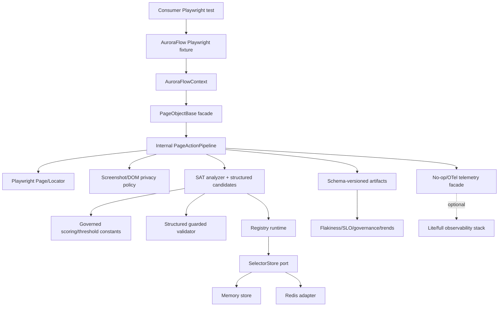

# Architecture Improvement Plan

## 1. Executive Summary

This plan turns `docs/ARCHITECTURE_REVIEW.md` into a sequenced, evidence-backed improvement blueprint. The review is authoritative for issue discovery; repository inspection was used only to verify major claims and make actions concrete.

Recommended direction: **conservative evolution with internal seams**. Keep one npm package, preserve current root import compatibility, avoid a rewrite, and harden the design by fixing credibility, governance, privacy, release, data-consistency, and lifecycle gaps before considering package splits or hosted services.

Top themes:

1. **Self-healing credibility:** default guarded healing, scoring, candidate representation, history, and promotion bootstrap must become one coherent contract.
2. **Safety and privacy:** screenshots, visible DOM text, artifacts, logs, telemetry, Redis data, and audit records need explicit policies and controls.
3. **Governance:** public API tiers, compatibility surfaces, release provenance, changelog, deprecation, SBOM/signing decisions, CODEOWNERS, and ADRs must be explicit.
4. **Runtime isolation:** process-global env/singletons should gain an `AuroraFlowContext`-style injection path plus a lifecycle helper and Playwright fixture.
5. **Right-sized operations:** Redis and observability remain optional/operator-owned; add runbooks, lite paths, budgets, and support boundaries without making AuroraFlow a service platform.

Highest-priority actions:

- Decide and test the default guarded-healing bootstrap policy.
- Replace string-parsed locator candidates with structured locator candidates.
- Single-source or explicitly govern scoring, thresholds, SLO constants, schema versions, metric labels, and compatibility surfaces.
- Make candidate history atomic and align TTL defaults with actual persistence.
- Add invalid self-healing config diagnostics and effective-config output.
- Add artifact privacy controls and retention guidance.
- Add API stability tiers and release/provenance workflow.

Expected result after roadmap completion: AuroraFlow remains a lightweight, embeddable Playwright framework, but its self-healing behavior is predictable, its artifacts are safer to adopt, its public surface is governable, its operational boundaries are clear, and a small team can maintain it without premature platform expansion.

This plan recommends **balanced modernization through conservative evolution with internal seams**: more ambitious than pure hardening, far less risky than package splitting, managed service work, or rewrite.

| Item | Result |
| --- | --- |
| File created or updated | `docs/ARCHITECTURE_IMPROVEMENT_PLAN.md` |
| Source findings extracted | 129 |
| Canonical issues identified | 42 |
| Highest-priority themes | guarded-healing contract, structured candidates, data atomicity, privacy, API/release governance, runtime lifecycle |
| Recommended target architecture option | Conservative evolution with internal seams |
| Key stakeholder unknowns | product adoption target, default healing policy, scale/SLOs, data retention/compliance, shared Redis ownership, promotion authorization, observability support level |
| Production code modified | No |

## 2. Source Review Coverage and Methodology

Analysis method:

- Read `docs/ARCHITECTURE_REVIEW.md` end-to-end, including executive summary, component deep dive, runtime flows, domain invariants, data/security/reliability/performance/operability/testing/release/dependency sections, risk register, recommendations, roadmap, options, open questions, and appendix.
- Ran issue-bearing search passes for risk, gap, missing, unknown, concern, limitation, mismatch, recommendation, should, needs, lacks, manual, singleton, bus factor, security, privacy, reliability, performance, scalability, observability, operability, testing, release, governance, adoption, preserve, defer, and non-goal language.
- Normalized duplicate findings into one canonical issue when they shared the same root architectural decision or implementation seam.
- Treated strengths as guardrails, not defects, when weakening them would create architectural risk.
- Treated review unknowns as stakeholder decision gates.
- Treated deferred options as governance decisions with explicit revisit triggers.

Repository evidence inspected for verification:

- `package.json`, `package-lock.json`, `vitest.config.mts`, `.github/workflows/*.yml`, `.github/dependabot.yml`.
- `src/index.ts`, `src/pageObjects/pageObjectBase.ts`, `src/helpers/pageFactory.ts`, `src/helpers/helpers.ts`.
- `src/framework/selfHealing/config.ts`, `guardedValidation.ts`, `candidateScoring.ts`, `domCandidateExtraction.ts`, `historyRepository.ts`, `promotionRepository.ts`, `promotionWorkflow.ts`, `registryRuntime.ts`.
- `src/data/selectors/selectorRegistry.ts`, `redisSelectorStore.ts`, `src/utils/logger.ts`, `src/utils/redisClient.ts`.
- `src/framework/observability/telemetry.ts`, `sloDashboard.ts`, `trends.ts`.
- `scripts/self-healing-promotions.ts`, `scripts/self-healing-registry-cleanup.ts`, observability docs/assets, and relevant docs.

Limitations:

- No production services were started.
- No dependency installation or test execution was needed for this documentation-only task.
- Some findings remain **Unknown / requires stakeholder clarification** because the review intentionally raises product, compliance, and ownership questions that repository inspection cannot answer.
- `docs/ARCHITECTURE_REVIEW.md` appears untracked in the current working tree; it was read but not modified.

Duplicate normalization:

- Scoring thresholds, SLO thresholds, and dashboard/policy/rule drift are merged under `AUR-ARCH-003`.
- Telemetry/Redis singletons, env-driven config bleed, and missing multi-context support are merged under `AUR-ARCH-011`, while cleanup ergonomics is separately tracked under `AUR-ARCH-012`.
- Promotion reviewer strings, Redis prefix isolation, and shared-registry authorization are split into authorization (`AUR-ARCH-014`) and namespace/access-control semantics (`AUR-ARCH-029`).
- Observability heaviness, production reference boundary, and local-stack support burden are grouped under `AUR-ARCH-019` and `AUR-ARCH-042`.

All 129 extracted source findings are represented in the coverage matrix in Section 4 and in the raw finding list in Section 19.

## 3. Canonical Issue Inventory

Evidence labels used below:

- **Review:** observed from `docs/ARCHITECTURE_REVIEW.md`.
- **Repo:** observed from repository files inspected during this task.
- **Inferred:** derived from review/repository evidence, not directly stated as a fact.
- **Unknown:** requires stakeholder clarification.

### AUR-ARCH-001 — Guarded-healing defaults and promotion bootstrap are incoherent

- Category: Reliability / Architecture. Severity: High. Priority: P0. Confidence: High.
- Source refs: Review §§1.2, 1.3, 6.8, 6.12, 20 R1, 21.1, 24.
- Repo evidence: `src/framework/selfHealing/config.ts:10`, `pageObjectBase.ts:297-328`, `registryPersistence` path described by review.
- Current state: default confidence is `0.92`; normal heuristic/DOM candidates often cannot reach it without history or seeded registry confidence; pending promotions require successful guarded apply.
- Architectural impact: learning loop can be unreachable at defaults.
- Product impact: users may enable guarded mode and see no useful recovery.
- Operational impact: triage and promotion workflows may not bootstrap naturally.
- Security/privacy impact: none direct; safety posture is positive.
- Risk of doing nothing: self-healing feature credibility erodes.
- Related: `AUR-ARCH-003`, `004`, `006`, `036`, `038`, `040`.
- Disposition: Fix now. Owner: self-healing/runtime. Phase: 0.

### AUR-ARCH-002 — Locator candidates are stringly typed and parser/emitter mismatch is live

- Category: Architecture / Reliability. Severity: High. Priority: P0. Confidence: High.
- Source refs: Review §§1.2, 5.7, 6.9, 6.10, 20 R2, 21.1, 21.2.
- Repo evidence: `guardedValidation.ts:48-85`, `domCandidateExtraction.ts` locator-string emitters, `suggestionEngine.ts` locator strings.
- Current state: candidate producers emit Playwright-like strings; guarded validation regex-parses them; embedded quotes can become unsupported.
- Architectural impact: runtime behavior depends on a lossy DSL instead of typed locator semantics.
- Product impact: valid user-facing text like apostrophes can fail to heal.
- Operational impact: artifacts show unsupported locator statuses that are hard to interpret.
- Security/privacy impact: no direct new exposure.
- Risk of doing nothing: guarded validation remains fragile and hard to extend.
- Related: `AUR-ARCH-001`, `008`, `022`, `027`.
- Disposition: Fix now. Owner: self-healing/runtime. Phase: 0-1.

### AUR-ARCH-003 — Scoring, threshold, and SLO constants are duplicated or divergent

- Category: Governance / Reliability. Severity: High. Priority: P0. Confidence: High.
- Source refs: Review §§1.2, 6.8, 6.14, 10.3, 14, 20 R3, 21.1, 21.3.
- Repo evidence: `candidateScoring.ts` constants, `suggestionEngine.ts` strategy signals, `sloDashboard.ts:75+`, `configs/quality/slo-alert-policy.json`, `observability/prometheus/rules/auroraflow.yml`.
- Current state: scoring weights, strategy reliability, dashboard targets, policy JSON, and Prometheus rules are not governed from one source or asserted relationship.
- Architectural impact: judgment logic can drift without visible decision record.
- Product impact: users cannot tell whether thresholds are calibrated policy or placeholder defaults.
- Operational impact: SLO dashboards and alerts can disagree.
- Security/privacy impact: none direct.
- Risk of doing nothing: silent threshold drift and inconsistent governance decisions.
- Related: `AUR-ARCH-001`, `038`, `041`.
- Disposition: Fix now. Owner: self-healing + observability. Phase: 0.

### AUR-ARCH-004 — Candidate history writes are not atomic

- Category: Reliability / Scalability. Severity: High. Priority: P0. Confidence: High.
- Source refs: Review §§1.2, 6.12, 9.3, 12, 20 R4, 21.1.
- Repo evidence: `historyRepository.ts:117-135`, `147-160` perform GET -> mutate -> SET.
- Current state: parallel workers can overwrite increments.
- Architectural impact: historical signal becomes untrustworthy.
- Product impact: candidate ranking and promotion confidence learn wrong data.
- Operational impact: high-shard CI loses telemetry integrity.
- Security/privacy impact: none direct.
- Risk of doing nothing: self-healing decisions become noisy under concurrency.
- Related: `AUR-ARCH-001`, `005`, `022`.
- Disposition: Fix now. Owner: data/self-healing. Phase: 0.

### AUR-ARCH-005 — Candidate history TTL default differs from actual clamp

- Category: Operability / Governance. Severity: Medium. Priority: P0. Confidence: High.
- Source refs: Review §§6.12, 9.1, 20 R5, 21.1.
- Repo evidence: `historyRepository.ts:13-26` exports 90 days and clamps to 30 days.
- Current state: public default implies longer retention than persisted records can receive.
- Architectural impact: retention contract is misleading.
- Product impact: users overestimate trend/history horizon.
- Operational impact: cleanup and capacity planning are unclear.
- Security/privacy impact: shorter retention reduces exposure, but mismatch undermines governance.
- Risk of doing nothing: documentation, schemas, and operational policy disagree.
- Related: `AUR-ARCH-004`, `030`, `037`.
- Disposition: Fix now. Owner: data/self-healing. Phase: 0.

### AUR-ARCH-006 — Self-healing config silently falls back and has dead/unclear promotion mode

- Category: Operability / Reliability. Severity: High. Priority: P0. Confidence: High.
- Source refs: Review §§5.6, 6.7, 12, 20, 21.1.
- Repo evidence: `config.ts:67-118`, `219-235`; `docs/configuration.md` documents `SELF_HEAL_PROMOTION_MODE`.
- Current state: invalid `SELF_HEAL_*` values can silently default; promotion mode is parsed but not clearly governing runtime behavior.
- Architectural impact: environment config is not a reliable contract.
- Product impact: typos can disable self-healing without actionable signal.
- Operational impact: CI diagnostics become difficult.
- Security/privacy impact: misconfigured mode could capture or skip diagnostics unexpectedly.
- Risk of doing nothing: operators cannot trust effective runtime mode.
- Related: `AUR-ARCH-001`, `011`, `012`.
- Disposition: Fix now. Owner: runtime/config. Phase: 0.

### AUR-ARCH-007 — Screenshots, DOM text, artifacts, logs, Redis data, and telemetry need privacy controls

- Category: Privacy / Security. Severity: High. Priority: P1. Confidence: High.
- Source refs: Review §§1.2, 5.7, 6.4, 6.9, 9.2, 9.4, 11, 20 R8, 21.1.
- Repo evidence: `pageObjectBase.ts:239-249`, `467-470`; DOM capture docs; `logger.ts` redaction defaults; `observability/logstash/pipeline/auroraflow.conf`.
- Current state: logs and some DOM attributes are redacted; screenshots and visible DOM text remain high-risk.
- Architectural impact: failure-evidence subsystem lacks a privacy policy seam.
- Product impact: adoption is blocked in PII/regulatory environments.
- Operational impact: CI artifact retention and local Elasticsearch ingestion can spread sensitive data.
- Security/privacy impact: direct PII/secret exposure.
- Risk of doing nothing: unsafe artifacts and security-review failure.
- Related: `AUR-ARCH-029`, `030`, `037`, `041`.
- Disposition: Plan near-term. Owner: security/privacy + runtime. Phase: 1.

### AUR-ARCH-008 — Public API lacks stability tiers and compatibility governance

- Category: Governance / Developer Experience. Severity: High. Priority: P1. Confidence: High.
- Source refs: Review §§1.2, 6.1, 10.1, 10.3, 17, 20 R6, 21.1.
- Repo evidence: `src/index.ts` exports broad root surface including low-level internals.
- Current state: stable, advanced, experimental, deprecated, and internal APIs are not distinguished.
- Architectural impact: internals can become accidental semver commitments.
- Product impact: consumers lack upgrade expectations.
- Operational impact: release maintainers cannot assess breaking changes.
- Security/privacy impact: low-level helpers may be used outside intended safety envelopes.
- Risk of doing nothing: semver debt before meaningful adoption.
- Related: `AUR-ARCH-002`, `009`, `031`, `039`.
- Disposition: Plan near-term. Owner: maintainers/API governance. Phase: 1.

### AUR-ARCH-009 — Release, changelog, SBOM, signing, provenance, and rollback workflow are absent

- Category: Build / Release. Severity: High. Priority: P1. Confidence: High.
- Source refs: Review §§2, 6.15, 10.2, 11, 16, 20 R7, 21.1.
- Repo evidence: `package.json` has build/dry-pack; `.github/workflows/` has ci/examples/quality/security only; no publish workflow found.
- Current state: package can build and dry-pack, but publish governance is manual/undefined.
- Architectural impact: supply-chain trust path is incomplete.
- Product impact: public npm adoption is riskier.
- Operational impact: release rollback and deprecation paths are ad hoc.
- Security/privacy impact: lack of provenance/SBOM/signing policy increases supply-chain risk.
- Risk of doing nothing: releases remain unreproducible and hard to audit.
- Related: `AUR-ARCH-008`, `035`, `037`.
- Disposition: Plan near-term. Owner: release/security. Phase: 1.

### AUR-ARCH-010 — `PageObjectBase` over-centralizes action orchestration

- Category: Architecture. Severity: High. Priority: P1. Confidence: High.
- Source refs: Review §§1.2, 5.7, 6.2, 17, 18, 20 R9, 21.3.
- Repo evidence: `pageObjectBase.ts:162-465` orchestrates telemetry, screenshots, config, SAT, guarded validation, registry persistence, retry, and error wrapping.
- Current state: correct public facade, but too many infrastructure concerns inside one class.
- Architectural impact: hard to test action pipeline independently or add actions safely.
- Product impact: behavior changes risk broad regressions.
- Operational impact: failure envelope is difficult to tune.
- Security/privacy impact: screenshot and artifact controls are coupled to actions.
- Risk of doing nothing: central class becomes bottleneck and regression hotspot.
- Related: `AUR-ARCH-011`, `012`, `027`, `028`.
- Disposition: Plan near-term. Owner: runtime architecture. Phase: 2.

### AUR-ARCH-011 — Process-global env and singleton runtime model limit isolation

- Category: Architecture / Operability. Severity: High. Priority: P1. Confidence: High.
- Source refs: Review §§1.2, 5.6, 5.7, 6.2, 6.5, 6.13, 12, 17, 20 R10.
- Repo evidence: `pageObjectBase.ts:170`, `197`, `251`; `telemetry.ts:46-100`; `redisClient.ts:718-733`.
- Current state: logger, telemetry, Redis, and self-healing config resolve through process state or module singletons.
- Architectural impact: multi-project/multi-context workers cannot isolate runtime policy cleanly.
- Product impact: advanced users cannot run different configs in one process.
- Operational impact: cleanup and test parallelism are harder.
- Security/privacy impact: config bleed can leak data policy across contexts.
- Risk of doing nothing: larger CI runners and shared libraries hit isolation bugs.
- Related: `AUR-ARCH-006`, `010`, `012`, `023`.
- Disposition: Plan near-term. Owner: runtime architecture. Phase: 2.

### AUR-ARCH-012 — Package-level lifecycle helper and Playwright fixture are missing

- Category: Operability / Developer Experience. Severity: Medium. Priority: P1. Confidence: High.
- Source refs: Review §§1.3, 5.7, 6.13, 7.5, 12, 20 R18, 21.2.
- Repo evidence: `telemetry.ts:94-100`, `redisClient.ts:384+`, `720-733`; no unified helper found.
- Current state: consumers must remember separate telemetry and Redis shutdown calls.
- Architectural impact: resource lifecycle is not a first-class package contract.
- Product impact: users can get hanging workers or dropped telemetry.
- Operational impact: worker cleanup is inconsistent.
- Security/privacy impact: lingering clients can hold credentials longer than needed.
- Risk of doing nothing: flaky teardown and resource leaks.
- Related: `AUR-ARCH-011`, `024`.
- Disposition: Plan near-term. Owner: runtime/devex. Phase: 1.

### AUR-ARCH-013 — No per-run self-healing budget or failure-storm breaker

- Category: Reliability / Performance. Severity: High. Priority: P1. Confidence: High.
- Source refs: Review §§12, 13.2, 20 R13, 21.2.
- Repo evidence: search found no `SELF_HEAL_MAX_EVENTS_PER_RUN` or breaker equivalent.
- Current state: individual operations are bounded, but aggregate failure-path diagnostics are not.
- Architectural impact: outage conditions can amplify screenshots, DOM walks, probes, Redis writes, and artifacts.
- Product impact: self-healing may worsen suite failure storms.
- Operational impact: CI cost, backend load, and artifact volume can spike.
- Security/privacy impact: more failure artifacts mean larger data-exposure surface.
- Risk of doing nothing: cascading diagnostic overload during app outages.
- Related: `AUR-ARCH-007`, `028`, `041`.
- Disposition: Plan near-term. Owner: reliability/runtime. Phase: 2.

### AUR-ARCH-014 — Promotion authorization is identity string based, not policy based

- Category: Security / Governance. Severity: High. Priority: P1. Confidence: Medium.
- Source refs: Review §§6.12, 6.15, 9.4, 11, 20 R11, 21.2.
- Repo evidence: `scripts/self-healing-promotions.ts:87-92`, `131-154`; workflow accepts reviewer string/GitHub actor.
- Current state: reviewer identity is recorded but not authorized against policy.
- Architectural impact: shared registries lack enforceable approval rules.
- Product impact: teams cannot safely delegate promotions.
- Operational impact: protected workflow/environment controls are undefined.
- Security/privacy impact: unauthorized selector changes could alter test behavior.
- Risk of doing nothing: shared registry use is unsafe.
- Related: `AUR-ARCH-015`, `029`, `030`, `037`.
- Disposition: Plan near-term. Owner: security/platform. Phase: 2.

### AUR-ARCH-015 — Promotion record updates lack expected-status concurrency semantics

- Category: Reliability / Governance. Severity: Medium. Priority: P2. Confidence: Medium.
- Source refs: Review §§6.12, 9.3, 12, 20 R12.
- Repo evidence: `promotionRepository.ts:105-113`; `promotionWorkflow.ts:183-258`, `326-335` use upsert after load.
- Current state: active selector CAS is strong, but promotion record status updates are last-writer-wins.
- Architectural impact: reviewer race outcomes can be ambiguous.
- Product impact: promotion UX can show stale/conflicting state.
- Operational impact: audit trail may not capture expected-state conflict.
- Security/privacy impact: governance records can misrepresent who won a race.
- Risk of doing nothing: concurrent reviewers create inconsistent promotion records.
- Related: `AUR-ARCH-014`, `030`.
- Disposition: Plan near-term. Owner: data/governance. Phase: 2.

### AUR-ARCH-016 — Redis production lifecycle is incomplete

- Category: Operability / Reliability. Severity: Medium. Priority: P2. Confidence: High.
- Source refs: Review §§6.5, 9, 10.2, 14, 20 R14, 21.3, 24.
- Repo evidence: Redis docs cover config/local use; production ownership/runbook for backup/restore/eviction/access remains incomplete.
- Current state: Redis is strong as a client/backend, but operational ownership is consumer-defined.
- Architectural impact: durable registry use depends on external runbook.
- Product impact: teams cannot adopt shared Redis confidently.
- Operational impact: backup, restore, TLS, auth, eviction, capacity, retention, and incident response are undefined.
- Security/privacy impact: Redis can store selectors, histories, promotions, audits.
- Risk of doing nothing: data loss or insecure shared deployments.
- Related: `AUR-ARCH-029`, `030`, `037`, `042`.
- Disposition: Defer intentionally / plan Phase 3. Owner: platform/SRE. Phase: 3.

### AUR-ARCH-017 — Registry schema migration, index repair, and scale ceilings need hardening

- Category: Data Architecture / Scalability. Severity: Medium. Priority: P2. Confidence: High.
- Source refs: Review §§6.6, 9.3, 13.3, 20 R15, 21.3.
- Repo evidence: `selectorRegistry.ts:31-41` has no `schemaVersion`; `updateIndexes()` is separate write; `listByPageObject()` scans all records.
- Current state: selector records are validated, but migration metadata and repair tooling are absent.
- Architectural impact: future record evolution is risky.
- Product impact: larger registries can degrade or drift.
- Operational impact: stale indexes are tolerated but not repaired.
- Security/privacy impact: low direct.
- Risk of doing nothing: registry data becomes hard to evolve.
- Related: `AUR-ARCH-016`, `026`, `037`.
- Disposition: Plan near-term. Owner: data. Phase: 3.

### AUR-ARCH-018 — Trend history is cache-backed and strict-parsed

- Category: Observability / Reliability. Severity: Medium. Priority: P2. Confidence: High.
- Source refs: Review §§6.14, 9.2, 9.3, 12, 20 R16, 21.2.
- Repo evidence: `trends.ts:559-594` throws on one malformed line.
- Current state: trends are JSONL and atomically written, but cache durability and corruption tolerance are weak.
- Architectural impact: reporting plane lacks robust long-horizon storage contract.
- Product impact: trend dashboards can disappear or fail.
- Operational impact: one corrupt line can block trend read.
- Security/privacy impact: trend retention policy needs classification.
- Risk of doing nothing: trend evidence is brittle.
- Related: `AUR-ARCH-003`, `037`, `041`.
- Disposition: Plan near-term. Owner: observability/reporting. Phase: 1-3.

### AUR-ARCH-019 — Observability stack is valuable but heavy and needs lite/support boundaries

- Category: Observability / Operability. Severity: Medium. Priority: P2. Confidence: High.
- Source refs: Review §§1.2, 6.15, 11, 14, 18, 20 R20, 21.3.
- Repo evidence: `docker-compose.observability.yml`, `observability/**`, `docs/architecture/observability-stack.md`, `observability/README.md`.
- Current state: full local/reference stack is strong, but maintenance-heavy.
- Architectural impact: optional perimeter can outgrow library scope.
- Product impact: users may assume production support that maintainers do not provide.
- Operational impact: full-stack smokes and assets require upkeep.
- Security/privacy impact: local stack auth exceptions must remain local-only.
- Risk of doing nothing: maintainer burden and support ambiguity.
- Related: `AUR-ARCH-041`, `042`.
- Disposition: Defer intentionally / contain. Owner: observability/platform. Phase: 3.

### AUR-ARCH-020 — Playwright peer range lacks explicit version matrix coverage

- Category: Dependency Management / Testing. Severity: Medium. Priority: P2. Confidence: Medium.
- Source refs: Review §§2, 4, 10.2, 15, 20 R19, 21.2.
- Repo evidence: `package.json` peer `playwright >=1.59 <2`; workflows install lockfile version, not floor/current/latest lanes.
- Current state: broad peer range is declared but not matrix-tested across versions.
- Architectural impact: external substrate compatibility is not proven.
- Product impact: consumers may hit unsupported minors.
- Operational impact: CI cannot detect floor breakage.
- Security/privacy impact: dependency upgrades can change behavior.
- Risk of doing nothing: accidental peer-range false advertising.
- Related: `AUR-ARCH-022`, `033`.
- Disposition: Plan near-term. Owner: testing/release. Phase: 1.

### AUR-ARCH-021 — OTLP integration near the code path needs coverage

- Category: Observability / Testing. Severity: Medium. Priority: P2. Confidence: Medium.
- Source refs: Review §§6.13, 15, 21.2.
- Repo evidence: full-stack observability smokes exist; review calls for closer mock/collector integration.
- Current state: no-op telemetry and full-stack checks are strong; code-path integration needs faster feedback.
- Architectural impact: OTel upgrades can regress silently until heavy CI.
- Product impact: telemetry users get less confidence.
- Operational impact: failures are slower to diagnose.
- Security/privacy impact: telemetry label/data export changes need tests.
- Risk of doing nothing: OTel upgrades break export path.
- Related: `AUR-ARCH-019`, `022`.
- Disposition: Plan near-term. Owner: observability/testing. Phase: 1.

### AUR-ARCH-022 — Coverage thresholds, property tests, and concurrency tests are missing in critical areas

- Category: Testing. Severity: Medium. Priority: P2. Confidence: High.
- Source refs: Review §§2, 15, 20, 21.3.
- Repo evidence: `vitest.config.mts` lacks coverage config; grep found no coverage script/threshold.
- Current state: broad tests exist, but no measured threshold or required property/concurrency tests for parsers/state.
- Architectural impact: critical contracts can regress without quantified gate.
- Product impact: feature credibility depends on edge cases.
- Operational impact: false confidence in complex self-healing paths.
- Security/privacy impact: privacy controls will need regression tests.
- Risk of doing nothing: untested edge cases recur.
- Related: `AUR-ARCH-001`, `002`, `004`, `007`, `020`, `021`.
- Disposition: Plan near-term. Owner: QA/testing. Phase: 1-2.

### AUR-ARCH-023 — Logger has import-time side effects

- Category: Developer Experience / Operability. Severity: Low. Priority: P2. Confidence: High.
- Source refs: Review §§4, 6.4, 12, 20 R17, 21.3.
- Repo evidence: `logger.ts:223-245` creates `mainLogger` at module load.
- Current state: importing package can validate env/open transports/spawn transport worker.
- Architectural impact: library import has avoidable side effects.
- Product impact: consumers may see unexpected failures on import.
- Operational impact: tests/tools can hang or write logs earlier than expected.
- Security/privacy impact: log destinations may open without explicit runtime setup.
- Risk of doing nothing: embeddability friction.
- Related: `AUR-ARCH-011`, `012`.
- Disposition: Plan near-term. Owner: runtime/devex. Phase: 2.

### AUR-ARCH-024 — `PageFactory` cache invalidation is manual

- Category: Developer Experience. Severity: Low. Priority: P3. Confidence: High.
- Source refs: Review §§6.3, 20 R24.
- Repo evidence: `pageFactory.ts:9-39` caches per constructor; no dispose/invalidation hook.
- Current state: cached page object can outlive Playwright `Page` if factory reused incorrectly.
- Architectural impact: lifecycle contract is implicit.
- Product impact: subtle stale-page bugs.
- Operational impact: low.
- Security/privacy impact: none direct.
- Risk of doing nothing: occasional misuse by test authors.
- Related: `AUR-ARCH-012`.
- Disposition: Monitor / document. Owner: devex/docs. Phase: 1.

### AUR-ARCH-025 — Retry helper loses original error object and cause chain

- Category: Reliability / Developer Experience. Severity: Low. Priority: P3. Confidence: High.
- Source refs: Review §6.3.
- Repo evidence: `helpers.ts:110-116` throws new `Error` without `cause`.
- Current state: retry exhaustion wraps message but drops original stack/cause.
- Architectural impact: failure evidence principle is weakened.
- Product impact: debugging retries is harder.
- Operational impact: low.
- Security/privacy impact: none direct.
- Risk of doing nothing: diagnostics lose evidence.
- Related: `AUR-ARCH-041`.
- Disposition: Monitor / small fix. Owner: runtime/devex. Phase: 2.

### AUR-ARCH-026 — Productized memory selector store and store conformance suite are missing

- Category: Architecture / Adoption. Severity: Medium. Priority: P2. Confidence: High.
- Source refs: Review §§6.6, 21.2, 19.
- Repo evidence: test-only in-memory stores exist; exported durable adapter is Redis.
- Current state: `SelectorStore` seam exists, but local/small-team no-Redis path is not productized.
- Architectural impact: store abstraction is underleveraged.
- Product impact: adoption requires Redis sooner than necessary for registry workflows.
- Operational impact: promotion CLI tests and local workflows depend on Redis.
- Security/privacy impact: local store can reduce network secret needs.
- Risk of doing nothing: higher adoption friction and less store-contract confidence.
- Related: `AUR-ARCH-016`, `017`, `031`.
- Disposition: Plan near-term. Owner: data/devex. Phase: 1.

### AUR-ARCH-027 — Locator-first Playwright API ergonomics are missing

- Category: Developer Experience / Architecture. Severity: Medium. Priority: P2. Confidence: High.
- Source refs: Review §§6.2, 21.3.
- Repo evidence: `PageObjectBase` public actions are string-selector-first.
- Current state: modern Playwright favors `Locator`; AuroraFlow APIs still center string selectors.
- Architectural impact: action metadata needs a typed way to preserve locator context.
- Product impact: consumers may bypass framework action envelope.
- Operational impact: direct Playwright calls lose artifacts/telemetry.
- Security/privacy impact: framework controls may be skipped.
- Risk of doing nothing: lower adoption by Playwright-native users.
- Related: `AUR-ARCH-010`, `002`.
- Disposition: Defer intentionally until pipeline seam. Owner: runtime/API. Phase: 2.

### AUR-ARCH-028 — Failure-path performance benchmark and DOM snapshot latency metric are missing

- Category: Performance / Observability. Severity: Medium. Priority: P2. Confidence: Medium.
- Source refs: Review §§6.9, 12, 13.2, 21.3.
- Repo evidence: failure path has bounded operations; no benchmark/latency metric found for aggregate failure path.
- Current state: individual limits exist but total failure-path cost is not measured.
- Architectural impact: cannot quantify cost of SAT improvements.
- Product impact: users cannot budget self-healing diagnostics.
- Operational impact: failure storms can hide latency regressions.
- Security/privacy impact: slower failure paths produce more artifacts over time.
- Risk of doing nothing: performance regressions go unbounded.
- Related: `AUR-ARCH-013`, `019`.
- Disposition: Plan near-term. Owner: performance/observability. Phase: 3.

### AUR-ARCH-029 — Redis prefixing is namespace hygiene, not authorization

- Category: Security / Operability. Severity: Medium. Priority: P2. Confidence: High.
- Source refs: Review §§9.4, 11, 20 R11/R14, 24.
- Repo evidence: Redis key prefix config exists; no ACL mapping policy found.
- Current state: key prefixes separate records but do not enforce access control.
- Architectural impact: shared-registry tenancy assumptions are undefined.
- Product impact: multi-team use needs explicit namespace policy.
- Operational impact: operator ACLs, credentials, and prefixes need mapping.
- Security/privacy impact: unauthorized read/write risk.
- Risk of doing nothing: false isolation assumption in shared Redis.
- Related: `AUR-ARCH-014`, `016`, `037`.
- Disposition: Plan near-term. Owner: security/platform. Phase: 3.

### AUR-ARCH-030 — Audit namespace is unbounded and cleanup skips audit records

- Category: Operability / Governance. Severity: Medium. Priority: P3. Confidence: High.
- Source refs: Review §§6.12, 9.1, 20 R22, 21.2.
- Repo evidence: cleanup script comments leave active/audit keys intact; audit records have no TTL per review.
- Current state: audit retention is undefined.
- Architectural impact: governance evidence lacks retention policy.
- Product impact: audit can grow without bounds.
- Operational impact: Redis memory/cost grows.
- Security/privacy impact: audit data may contain sensitive selector context.
- Risk of doing nothing: storage growth and privacy retention violation.
- Related: `AUR-ARCH-014`, `015`, `016`, `037`.
- Disposition: Plan near-term. Owner: governance/platform. Phase: 2.

### AUR-ARCH-031 — Redis and OTel unconditional dependency weight needs monitoring, not premature split

- Category: Dependency Management / Adoption. Severity: Low. Priority: P3. Confidence: High.
- Source refs: Review §§17, 20 R21, 21.4, 22.
- Repo evidence: `package.json` runtime dependencies include Redis, OTel, Pino.
- Current state: one-package install includes optional subsystem dependencies.
- Architectural impact: package split could reduce install weight, but adds release complexity.
- Product impact: current adoption evidence does not justify split.
- Operational impact: dependency upgrades remain centralized.
- Security/privacy impact: larger dependency surface to monitor.
- Risk of doing nothing: dependency weight may bother future users; premature split is worse now.
- Related: `AUR-ARCH-039`, `042`.
- Disposition: Monitor. Owner: architecture/release. Phase: 5.

### AUR-ARCH-032 — Redis-to-observability dependency inversion may block future lightweight split

- Category: Architecture / Dependency Management. Severity: Low. Priority: P3. Confidence: High.
- Source refs: Review §§5.4, 6.5, 17, 21.3.
- Repo evidence: review notes `utils/redisClient.ts -> framework/observability`.
- Current state: acceptable in single package, but a future Redis-only install would need inversion.
- Architectural impact: future package boundaries are constrained.
- Product impact: no immediate issue unless split trigger is met.
- Operational impact: OTel changes can touch Redis client.
- Security/privacy impact: none direct.
- Risk of doing nothing: future split costs grow modestly.
- Related: `AUR-ARCH-031`, `039`.
- Disposition: Defer intentionally. Owner: architecture. Phase: 5.

### AUR-ARCH-033 — GitHub Actions is the only first-class CI orchestration

- Category: Adoption / Developer Experience. Severity: Low. Priority: P3. Confidence: High.
- Source refs: Review §§6.15, 10.2, 24.
- Repo evidence: `.github/workflows/*`, docs focus on GitHub Actions.
- Current state: GitHub workflows are strong; GitLab/Azure/Jenkins/Circle are open questions.
- Architectural impact: scripts are portable but orchestration docs are GitHub-centric.
- Product impact: non-GitHub users need translation.
- Operational impact: adoption support burden if demand appears.
- Security/privacy impact: CI permission patterns need porting.
- Risk of doing nothing: limited non-GitHub adoption.
- Related: `AUR-ARCH-036`, `039`.
- Disposition: Monitor. Owner: adoption/docs. Phase: 5.

### AUR-ARCH-034 — Single-maintainer bus factor is a project risk

- Category: Organizational Risk. Severity: Medium. Priority: P3. Confidence: High.
- Source refs: Review §§2, 20 R23, 21.3.
- Repo evidence: review cites author history; repository lacks CODEOWNERS/CONTRIBUTING in root.
- Current state: one primary maintainer plus Dependabot.
- Architectural impact: complex self-healing/observability decisions are concentrated.
- Product impact: external adoption trust depends on maintainer resilience.
- Operational impact: releases/reviews may bottleneck.
- Security/privacy impact: review coverage risk.
- Risk of doing nothing: project continuity risk.
- Related: `AUR-ARCH-035`, `009`.
- Disposition: Monitor / plan governance. Owner: maintainers. Phase: 3.

### AUR-ARCH-035 — Contributor onboarding, CODEOWNERS, and ADRs are missing

- Category: Governance / Documentation. Severity: Medium. Priority: P3. Confidence: High.
- Source refs: Review §§20 R23, 21.3, 23.
- Repo evidence: find found no root `CODEOWNERS`, `CONTRIBUTING*`, or ADR directory outside dependencies.
- Current state: docs are strong, but maintainer handoff and decision history need more structure.
- Architectural impact: future changes lack governance trail.
- Product impact: contributors have higher ramp cost.
- Operational impact: release/security ownership unclear.
- Security/privacy impact: ownership gaps on sensitive areas.
- Risk of doing nothing: bus factor remains high.
- Related: `AUR-ARCH-034`, `009`.
- Disposition: Plan near-term. Owner: maintainers. Phase: 3.

### AUR-ARCH-036 — Product direction and target market are unresolved

- Category: Stakeholder Decision / Product Fit. Severity: High. Priority: P1. Confidence: High.
- Source refs: Review §§3, 18, 21.4, 24.
- Repo evidence: docs frame public npm/library plus reference assets; no product roadmap file inspected.
- Current state: public npm, internal org use, portfolio/reference, and commercial productization have different architecture needs.
- Architectural impact: determines API stability, release rigor, observability support, and hosted SAT relevance.
- Product impact: feature prioritization changes materially.
- Operational impact: support/on-call expectations depend on product model.
- Security/privacy impact: compliance controls differ by market.
- Risk of doing nothing: architecture over- or under-shoots real adoption.
- Related: `AUR-ARCH-039`, `042`.
- Disposition: Resolve via stakeholder decision. Owner: product/maintainers. Phase: 0.

### AUR-ARCH-037 — Scale, compliance, retention, SLO, and shared-ops assumptions are unknown

- Category: Stakeholder Decision / Operability. Severity: High. Priority: P1. Confidence: High.
- Source refs: Review §§13.3, 14, 24.
- Repo evidence: review questions cannot be answered from code.
- Current state: expected project count, selector count, shard count, failure rate, data sensitivity, retention, and Redis ownership are undecided.
- Architectural impact: influences Redis design, retention, privacy defaults, SLO gates, and observability topology.
- Product impact: wrong assumptions can make project too heavy or too weak.
- Operational impact: runbooks and budgets need real scale.
- Security/privacy impact: data-classification policy depends on test data sensitivity.
- Risk of doing nothing: premature or insufficient hardening.
- Related: `AUR-ARCH-007`, `013`, `016`, `029`, `030`, `038`.
- Disposition: Resolve via stakeholder decision. Owner: product/SRE/security. Phase: 0.

### AUR-ARCH-038 — Observability SLO and alert thresholds need policy ownership

- Category: Stakeholder Decision / Observability. Severity: Medium. Priority: P2. Confidence: High.
- Source refs: Review §§6.14, 14, 24.
- Repo evidence: thresholds differ in dashboard, policy JSON, and Prometheus rules.
- Current state: unclear whether SLOs are policy or starter placeholders.
- Architectural impact: affects merge-gate behavior and alert semantics.
- Product impact: users may copy thresholds without understanding intent.
- Operational impact: SLO breaches may warn or block depending on unresolved policy.
- Security/privacy impact: none direct.
- Risk of doing nothing: noisy or misleading reliability governance.
- Related: `AUR-ARCH-003`, `019`.
- Disposition: Resolve via stakeholder decision. Owner: QA/SRE/product. Phase: 0-1.

### AUR-ARCH-039 — Package split and hosted SAT are deferred strategic decision points

- Category: Stakeholder Decision / Architecture. Severity: Medium. Priority: P3. Confidence: High.
- Source refs: Review §§1.3, 21.4, 22, 24.
- Repo evidence: one-package architecture and runtime dependencies verified in `package.json`.
- Current state: review explicitly recommends no split or hosted platform now.
- Architectural impact: prevents over-engineering while preserving revisit triggers.
- Product impact: avoids building a service before adoption/funding.
- Operational impact: no new tenancy/storage/on-call/compliance burden.
- Security/privacy impact: avoids service data custody.
- Risk of doing nothing: none now; risk is failing to revisit when evidence changes.
- Related: `AUR-ARCH-031`, `032`, `036`, `042`.
- Disposition: Defer intentionally. Owner: architecture/product. Phase: 5.

### AUR-ARCH-040 — Safety-first self-healing invariants must be preserved

- Category: Governance / Reliability. Severity: High. Priority: P1. Confidence: High.
- Source refs: Review §§1.2, 3.3, 7.3, 8, 19, 26.
- Repo evidence: guarded validation, promotion workflow, CAS, and action policies exist.
- Current state: strongest product differentiator is governed diagnostics, not silent mutation.
- Architectural impact: all improvements must preserve dry-run, policy gates, one retry, no source rewrite, no active selector runtime mutation, review workflow, rollback, and audit.
- Product impact: trust boundary is core to adoption.
- Operational impact: release governance should block regressions.
- Security/privacy impact: prevents unsafe autonomous behavior.
- Risk of doing nothing: future changes may erode core trust model.
- Related: `AUR-ARCH-001`, `014`, `039`.
- Disposition: Preserve as intentional design. Owner: architecture/governance. Phase: all.

### AUR-ARCH-041 — Artifact-first observability and no-op optional subsystem defaults must be preserved

- Category: Governance / Observability. Severity: High. Priority: P1. Confidence: High.
- Source refs: Review §§1.2, 3.3, 6.13, 14, 19, 26.
- Repo evidence: telemetry no-op default in `telemetry.ts`; docs emphasize artifacts as source of truth.
- Current state: JSON/Markdown artifacts work without live telemetry; optional Redis/telemetry should not make basic page objects flaky.
- Architectural impact: target design must not require full observability stack for correctness.
- Product impact: lightweight adoption remains possible.
- Operational impact: CI evidence stays deterministic.
- Security/privacy impact: optional live export reduces data exposure by default.
- Risk of doing nothing: future features may make optional systems mandatory.
- Related: `AUR-ARCH-007`, `019`, `042`.
- Disposition: Preserve as intentional design. Owner: architecture/observability. Phase: all.

### AUR-ARCH-042 — Production ownership boundaries and anti-goals must remain explicit

- Category: Governance / Product Fit. Severity: Medium. Priority: P1. Confidence: High.
- Source refs: Review §§3.3, 5.1, 5.5, 11, 14, 18, 21.4, 22.
- Repo evidence: README/docs state local/reference production boundaries.
- Current state: AuroraFlow is a framework package, not SaaS, hosted test service, source rewriter, or production Redis/observability owner.
- Architectural impact: prevents service-architecture drift.
- Product impact: sets honest expectations.
- Operational impact: operators own Redis/observability deployments.
- Security/privacy impact: avoids implicit custody claims.
- Risk of doing nothing: support boundaries blur and over-engineering pressure rises.
- Related: `AUR-ARCH-016`, `019`, `039`, `041`.
- Disposition: Preserve as intentional design. Owner: architecture/product. Phase: all.

## 4. Source-to-Issue Coverage Matrix

Total source findings extracted: 129

Total canonical issues: 42

| Source section in `ARCHITECTURE_REVIEW.md` | Source finding / quote-level summary | Finding type | Canonical issue ID | Disposition | Target architecture impact | Roadmap phase |
| --- | --- | --- | --- | --- | --- | --- |
| §1.1 | Four product surfaces: page-object runtime, SAT, Redis selector data, artifact observability | context only | `AUR-ARCH-041`, `042` | Preserved strength | Keep one package with optional planes | All |
| §1.1 | Product thesis depends on trust boundary and no silent selector mutation | preservation risk | `AUR-ARCH-040` | Preserve | Governance guardrail for all self-healing work | All |
| §1.2 | Default-off, suggest/guarded, dry-run, one retry, reviewed promotions are strengths | preservation risk | `AUR-ARCH-040` | Preserve | Test invariants; no autonomous mutation | All |
| §1.2 | Guarded default confidence may be unreachable | explicit issue | `AUR-ARCH-001` | Fix now | Coherent healing contract | 0 |
| §1.2 | Locator candidates are stringly typed | explicit issue | `AUR-ARCH-002` | Fix now | Structured candidate model | 0-1 |
| §1.2 | Judgment constants duplicated/divergent | explicit issue | `AUR-ARCH-003` | Fix now | Constant governance | 0 |
| §1.2 | Candidate history is not atomic | explicit issue | `AUR-ARCH-004` | Fix now | Atomic history repository | 0 |
| §1.2 | `PageObjectBase` is biggest coupling point | explicit issue | `AUR-ARCH-010` | Plan | Internal pipeline | 2 |
| §1.2 | Public API broad and under-governed | explicit issue | `AUR-ARCH-008` | Plan | API tiers | 1 |
| §1.2 | Artifacts/screenshots privacy-sensitive | explicit issue | `AUR-ARCH-007` | Plan | Privacy policy seam | 1 |
| §1.2 | Singleton/env runtime model limits isolation | explicit issue | `AUR-ARCH-011` | Plan | Context injection | 2 |
| §1.2 | Observability perimeter valuable but heavy | explicit issue | `AUR-ARCH-019` | Contain | Lite/support boundary | 3 |
| §1.3 | Choose conservative hardening with seams | recommendation | `AUR-ARCH-039` | Accept | Default target architecture | All |
| §1.3 | Keep one npm package and root import compatibility | anti-goal | `AUR-ARCH-008`, `039` | Accepted trade-off | No package split now | All |
| §1.3 | Do not rewrite, split packages, or build hosted SAT now | anti-goal | `AUR-ARCH-039`, `042` | Preserve | Avoid over-engineering | All |
| §1.3 | Need scoring/threshold/history/promotion contract | recommendation | `AUR-ARCH-001`, `003`, `004` | Fix | Self-healing coherence | 0 |
| §1.3 | Need structured candidates | recommendation | `AUR-ARCH-002` | Fix | Typed locator pipeline | 0-1 |
| §1.3 | Need `AuroraFlowContext` | recommendation | `AUR-ARCH-011` | Plan | Runtime isolation | 2 |
| §1.3 | Need lifecycle helper/fixture | recommendation | `AUR-ARCH-012` | Plan | Resource cleanup | 1 |
| §1.3 | Need API tiers/release provenance/privacy/Redis runbooks | recommendation | `AUR-ARCH-007`, `008`, `009`, `016` | Plan | Adoption governance | 1-3 |
| §2 | Release automation dry-pack exists; publish/provenance absent | explicit issue | `AUR-ARCH-009` | Plan | Release workflow | 1 |
| §2 | No coverage reporter/threshold | explicit issue | `AUR-ARCH-022` | Plan | Quality gate | 1-2 |
| §2 | One primary maintainer plus Dependabot | explicit issue | `AUR-ARCH-034` | Monitor | Contributor governance | 3 |
| §3.1 | Self-healing should improve diagnostics without silent mutation | preservation risk | `AUR-ARCH-040` | Preserve | Safety model | All |
| §3.3 | Framework package, not SaaS/hosted service | anti-goal | `AUR-ARCH-042` | Preserve | Library-first boundary | All |
| §3.3 | Does not rewrite source or silently mutate selectors | anti-goal | `AUR-ARCH-040` | Preserve | Guarded workflow only | All |
| §3.3 | Does not own production Redis/observability | anti-goal | `AUR-ARCH-042`, `016`, `019` | Preserve | Operator-owned runbooks | 3 |
| §4 | Playwright peer range broad and needs matrix coverage | explicit issue | `AUR-ARCH-020` | Plan | Dependency matrix | 1 |
| §4 | Vitest strong but no coverage threshold | explicit issue | `AUR-ARCH-022` | Plan | Coverage gates | 1-2 |
| §4 | Redis good first backend; needs runbook/fallback store | recommendation | `AUR-ARCH-016`, `026` | Plan | Store strategy | 1-3 |
| §4 | OTel no-op default correct; lifecycle helper needed | recommendation | `AUR-ARCH-012`, `041` | Preserve + plan | Lifecycle helper | 1 |
| §4 | Docker Compose stacks reference assets, not production ownership | anti-goal | `AUR-ARCH-019`, `042` | Preserve | Support tiers | 3 |
| §5.4 | Redis imports observability; future split inversion candidate | deferred option | `AUR-ARCH-032` | Defer | Metrics port only if split | 5 |
| §5.5 | State lives in Redis, filesystem, CI, optional backends | context only | `AUR-ARCH-007`, `016`, `041` | Context | Retention/data classification | 1-3 |
| §5.6 | Invalid config behavior inconsistent | explicit issue | `AUR-ARCH-006` | Fix | Config validation | 0 |
| §5.6 | Env reads prevent multiple independent configs | explicit issue | `AUR-ARCH-011` | Plan | Context injection | 2 |
| §5.6 | Env surface needs effective-config diagnostics | recommendation | `AUR-ARCH-006` | Fix | Diagnostics output | 0 |
| §5.6 | Typo like `gaurded` can silently disable feature | explicit issue | `AUR-ARCH-006` | Fix | Strict/warn mode | 0 |
| §5.7 | Strong `SelectorStore`, telemetry, writer seams exist | preservation risk | `AUR-ARCH-026`, `041` | Preserve | Extend conformance | 1 |
| §5.7 | Action pipeline embedded in `PageObjectBase` | explicit issue | `AUR-ARCH-010` | Plan | Internal executor | 2 |
| §5.7 | Runtime context/config not injected | explicit issue | `AUR-ARCH-011` | Plan | `AuroraFlowContext` | 2 |
| §5.7 | Screenshot policy not strategy interface | explicit issue | `AUR-ARCH-007` | Plan | Privacy hook | 1 |
| §5.7 | API stability levels undeclared | explicit issue | `AUR-ARCH-008` | Plan | API tiers | 1 |
| §5.7 | Lifecycle cleanup not one package operation | explicit issue | `AUR-ARCH-012` | Plan | `closeAuroraFlow()` | 1 |
| §6.1 | Root exports low-level internals | explicit issue | `AUR-ARCH-008` | Plan | Tier contracts | 1 |
| §6.1 | Semver, schemas, Redis records, metrics, CLI outputs are separate surfaces | implicit issue | `AUR-ARCH-008` | Plan | Compatibility registry | 1 |
| §6.2 | Public actions string-selector-first, Playwright favors Locators | recommendation | `AUR-ARCH-027` | Defer | Locator-first overloads | 2 |
| §6.2 | Adding actions requires touching central class | explicit issue | `AUR-ARCH-010` | Plan | Pipeline tests | 2 |
| §6.3 | `PageFactory` lifecycle assumption should be louder | explicit issue | `AUR-ARCH-024` | Monitor | Fixture/lifecycle docs | 1 |
| §6.3 | `retry()` loses original error object/stack/cause | explicit issue | `AUR-ARCH-025` | Monitor | Preserve error cause | 2 |
| §6.4 | Logger import-time behavior | explicit issue | `AUR-ARCH-023` | Plan | Lazy logger | 2 |
| §6.4 | Add AuroraFlow secret env names to redaction guidance/defaults | recommendation | `AUR-ARCH-007` | Plan | Redaction defaults | 1 |
| §6.5 | Redis retries and reconnect can multiply latency | explicit issue | `AUR-ARCH-028`, `016` | Plan | Benchmark/runbook | 3 |
| §6.5 | `getRedisClient()` singleton weak for isolation | explicit issue | `AUR-ARCH-011` | Plan | Context-owned Redis | 2 |
| §6.5 | Managed Redis Lua `cjson` assumptions need docs | recommendation | `AUR-ARCH-016` | Plan | Compatibility runbook | 3 |
| §6.6 | Active record and index update are separate operations | explicit issue | `AUR-ARCH-017` | Plan | Repair tooling | 3 |
| §6.6 | `listByPageObject()` O(n) scan | scalability limitation | `AUR-ARCH-017` | Monitor/plan | Scale thresholds | 3 |
| §6.6 | No record `schemaVersion` | explicit issue | `AUR-ARCH-017` | Plan | Schema migration | 3 |
| §6.6 | Only Redis shipped as durable backend | explicit issue | `AUR-ARCH-026` | Plan | Memory store | 1 |
| §6.7 | Silent invalid `SELF_HEAL_*` fallback | explicit issue | `AUR-ARCH-006` | Fix | Strict/warn config | 0 |
| §6.7 | `SELF_HEAL_PROMOTION_MODE` unclear/dead | explicit issue | `AUR-ARCH-006` | Fix | Wire/remove | 0 |
| §6.8 | Default confidence does not compose with scores/history | explicit issue | `AUR-ARCH-001`, `003` | Fix | Calibration policy | 0 |
| §6.8 | Need choose registry-only, DOM-pass, or seeding workflow | unknown | `AUR-ARCH-001`, `036`, `038` | Stakeholder question | Decision gate | 0 |
| §6.9 | Visible DOM text can contain PII/regulatory data | explicit issue | `AUR-ARCH-007` | Plan | DOM text policy | 1 |
| §6.9 | Screenshots are larger privacy surface | explicit issue | `AUR-ARCH-007` | Plan | Screenshot policy | 1 |
| §6.9 | DOM snapshot latency instrumentation if failure-path matters | recommendation | `AUR-ARCH-028` | Plan | Perf metrics | 3 |
| §6.10 | Regex parser rejects emitted valid locator strings | explicit issue | `AUR-ARCH-002` | Fix | Structured locators | 0-1 |
| §6.11 | Structured candidates need artifact schema bump and legacy read path | recommendation | `AUR-ARCH-002`, `008` | Plan | Schema versioning | 1 |
| §6.12 | Pending promotion requires successful guarded apply | implicit issue | `AUR-ARCH-001` | Fix | Bootstrap policy | 0 |
| §6.12 | History GET/mutate/SET | explicit issue | `AUR-ARCH-004` | Fix | Atomic counters | 0 |
| §6.12 | History TTL 90d vs 30d clamp | explicit issue | `AUR-ARCH-005` | Fix | Align contract | 0 |
| §6.12 | Reviewer identity string, not authorization | explicit issue | `AUR-ARCH-014` | Plan | Policy gate | 2 |
| §6.12 | Promotion status updates last-writer-wins | explicit issue | `AUR-ARCH-015` | Plan | CAS status updates | 2 |
| §6.12 | Audit records no TTL; cleanup skips audit | explicit issue | `AUR-ARCH-030` | Plan | Audit retention | 2 |
| §6.12 | `approved` status exists but no workflow path | implicit issue | `AUR-ARCH-015` | Candidate improvement | Status model cleanup | 2 |
| §6.13 | Telemetry module singleton | explicit issue | `AUR-ARCH-011` | Plan | Context telemetry | 2 |
| §6.13 | Consumers must remember `shutdownTelemetry()` | explicit issue | `AUR-ARCH-012` | Plan | Lifecycle helper | 1 |
| §6.14 | Trends use evictable branch-scoped cache | explicit issue | `AUR-ARCH-018` | Plan | Durable export option | 3 |
| §6.14 | Strict JSONL parse can poison read | explicit issue | `AUR-ARCH-018` | Plan | Skip malformed lines | 1 |
| §6.14 | SLO targets differ across dashboard/policy/Prometheus | explicit issue | `AUR-ARCH-003`, `038` | Fix/decide | Constant governance | 0-1 |
| §6.14 | Playwright JSON reporter shape external | implicit issue | `AUR-ARCH-020`, `022` | Plan | Version fixtures | 1 |
| §6.15 | No release/publish workflow | explicit issue | `AUR-ARCH-009` | Plan | Release CI | 1 |
| §6.15 | No changelog/provenance/SBOM policy | explicit issue | `AUR-ARCH-009` | Plan | Supply-chain policy | 1 |
| §6.15 | Full observability stack heavy | explicit issue | `AUR-ARCH-019` | Contain | Lite mode | 3 |
| §6.15 | GitHub Actions only first-class orchestration | adoption gap | `AUR-ARCH-033` | Monitor | Integration decision | 5 |
| §7 | Runtime flow invariant: original failure primary unless retry succeeds | preservation risk | `AUR-ARCH-040` | Preserve | Pipeline invariant tests | All |
| §7.5 | Explicit telemetry/Redis shutdown, no unified helper | explicit issue | `AUR-ARCH-012` | Plan | Fixture/helper | 1 |
| §8 | "Self-healing" name suggests autonomy; actual model governed diagnostics | product mismatch | `AUR-ARCH-036`, `040` | Stakeholder question | Messaging guardrail | 0 |
| §8 | Structured locator concepts encoded as strings | explicit issue | `AUR-ARCH-002` | Fix | Candidate union | 0-1 |
| §8 | Process env acts as global runtime context | explicit issue | `AUR-ARCH-011` | Plan | Context model | 2 |
| §8 | Registry records lack migration metadata | explicit issue | `AUR-ARCH-017` | Plan | SchemaVersion | 3 |
| §8 | Promotion status not produced by workflow | implicit issue | `AUR-ARCH-015` | Candidate improvement | Status cleanup | 2 |
| §9.1 | Audit namespace unbounded | explicit issue | `AUR-ARCH-030` | Plan | Audit retention | 2 |
| §9.3 | Weak consistency: history, promotion, index, trends | explicit issue | `AUR-ARCH-004`, `015`, `017`, `018` | Plan | Data consistency hardening | 0-3 |
| §9.4 | Sensitive data includes URLs, DOM text, screenshots, stacks, Redis, telemetry | explicit issue | `AUR-ARCH-007` | Plan | Data classification | 1 |
| §9.4 | Redis prefixing not authorization | explicit issue | `AUR-ARCH-029` | Plan | Namespace/ACL policy | 3 |
| §10.1 | API should be tiered stable/advanced/experimental/internal | recommendation | `AUR-ARCH-008` | Plan | API contract tests | 1 |
| §10.2 | Redis production lifecycle/RBAC/backup/fallback risk | explicit issue | `AUR-ARCH-016`, `026`, `029` | Plan | Runbook/store strategy | 1-3 |
| §10.2 | npm registry deployment lacks provenance | explicit issue | `AUR-ARCH-009` | Plan | Provenance publish | 1 |
| §10.3 | Package version cannot describe all compatibility surfaces | implicit issue | `AUR-ARCH-008`, `003` | Plan | Compatibility ledger | 1 |
| §11 | Screenshot PII/secrets | explicit issue | `AUR-ARCH-007` | Plan | Screenshot controls | 1 |
| §11 | Promotion authorization if shared | explicit issue | `AUR-ARCH-014` | Plan | Auth policy | 2 |
| §11 | Local stack auth disabled is low only if local-only | accepted trade-off | `AUR-ARCH-019`, `042` | Preserve warning | Support boundary | 3 |
| §12 | Failure storm amplification | explicit issue | `AUR-ARCH-013` | Plan | Run budget/breaker | 2 |
| §12 | Telemetry not flushed / singleton bleed / import logger side effects | explicit issue | `AUR-ARCH-011`, `012`, `023` | Plan | Runtime lifecycle | 1-2 |
| §12 | Retry helper loses cause | explicit issue | `AUR-ARCH-025` | Monitor | Error evidence | 2 |
| §13 | Missing aggregate failure-path bound | explicit issue | `AUR-ARCH-013`, `028` | Plan | Budget + benchmark | 2-3 |
| §13.3 | Thousands-scale okay; large shared registry has ceilings | scalability limitation | `AUR-ARCH-017`, `037` | Monitor/decide | Scale triggers | 3 |
| §14 | Label-truth gate is standout strength | preservation risk | `AUR-ARCH-041` | Preserve | Observability contracts | All |
| §14 | Production Redis partial; observability reference-only | explicit issue | `AUR-ARCH-016`, `019`, `042` | Plan/preserve | Runbooks/support tiers | 3 |
| §15 | Missing tests table | recommendation | `AUR-ARCH-001`, `002`, `004`, `020`, `021`, `022` | Plan | Test matrix | 0-2 |
| §16 | Release workflow steps recommended | recommendation | `AUR-ARCH-009` | Plan | Release pipeline | 1 |
| §17 | Weak dependency boundaries and package split prerequisites | deferred option | `AUR-ARCH-031`, `032`, `039` | Monitor/defer | Split trigger list | 5 |
| §18 | Not under-architected; make design sharper, not larger | anti-goal | `AUR-ARCH-039`, `042` | Preserve | Proportionality guardrail | All |
| §19 | Strengths to preserve list | preservation risk | `AUR-ARCH-040`, `041`, `042` | Preserve | Guardrails | All |
| §20 | Risk register R1-R24 | roadmap item | All relevant IDs | Accounted | Canonical inventory | 0-5 |
| §21.1 | Immediate recommendations | roadmap item | `AUR-ARCH-001`-`009` | Plan | Phase 0/1 | 0-1 |
| §21.2 | Near-term recommendations | roadmap item | `AUR-ARCH-002`, `011`, `012`, `013`, `018`, `020`, `021`, `026`, `030` | Plan | Phase 1/2 | 1-2 |
| §21.3 | Medium-term recommendations | roadmap item | `AUR-ARCH-010`, `017`, `019`, `022`, `027`, `028`, `035` | Plan | Phase 2/3 | 2-3 |
| §21.4 | Long-term recommendations | deferred option | `AUR-ARCH-031`, `033`, `039` | Defer | Phase 5 decision | 5 |
| §22 | Options A/A+/B/C | deferred option | `AUR-ARCH-039` | Accept A+ | Target architecture | All |
| §23 | Suggested roadmap | roadmap item | All relevant IDs | Superseded by Section 11 | Sequenced roadmap | 0-5 |
| §24 | Product direction questions | unknown | `AUR-ARCH-036`, `039` | Stakeholder question | Decision log | 0/5 |
| §24 | Self-healing policy questions | unknown | `AUR-ARCH-001`, `003`, `038` | Stakeholder question | Calibration gate | 0 |
| §24 | Scale/operations questions | unknown | `AUR-ARCH-016`, `029`, `037` | Stakeholder question | Runbooks | 0/3 |
| §24 | Security/compliance questions | unknown | `AUR-ARCH-007`, `014`, `030`, `037` | Stakeholder question | Privacy/auth policy | 0-2 |
| §24 | Observability questions | unknown | `AUR-ARCH-019`, `038`, `041` | Stakeholder question | Lite/support/SLO | 1-3 |
| §24 | Integration/store questions | unknown | `AUR-ARCH-026`, `033`, `039` | Stakeholder question | Adoption gates | 5 |
| §26 | Final thesis: win trust before expanding scope | anti-goal | `AUR-ARCH-039`, `040`, `041`, `042` | Preserve | Target principle | All |

## 5. Root-Cause Analysis

| Root cause | Description | Issues influenced | Why it exists | Type | If only symptoms are fixed | Best systemic improvement |
| --- | --- | --- | --- | --- | --- | --- |
| Early-stage single-maintainer maturity | Strong code exists before full governance and release machinery | `008`, `009`, `034`, `035` | Young package, one primary maintainer | Organizational/governance | API/release debt returns | Add API tiers, release workflow, CODEOWNERS, ADRs |
| Self-healing complexity concentrated in one orchestration path | `PageObjectBase` composes config, telemetry, SAT, artifacts, registry, retry | `001`, `002`, `006`, `010`, `011`, `013` | Facade grew around valuable failure envelope | Local patches keep increasing coupling | Internal action pipeline plus runtime context |
| Process-global runtime configuration | Env and module singletons are convenient for CI but weak in embedded multi-project use | `006`, `011`, `012`, `023` | Library began with simple process model | More env flags amplify bleed | `AuroraFlowContext` with env-backed default |
| Missing cross-run persistence/retention model | History, audit, trends, screenshots, Redis records have uneven retention contracts | `005`, `007`, `016`, `018`, `030`, `037` | Artifacts and Redis evolved independently | Storage/privacy surprises persist | Data classification and retention policy by data class |
| Production-grade ambition ahead of adoption | Observability assets and Redis lifecycle are advanced but support ownership is unclear | `016`, `019`, `031`, `033`, `039`, `042` | Repository demonstrates capability and CI validation | Over-engineering or support ambiguity | Optional/lite topology and explicit revisit triggers |
| Manual/incomplete release governance | Build and quality gates exist, publish/provenance/deprecation policy does not | `008`, `009`, `035` | Pre-public-adoption maturity | Releases remain non-auditable | Tag-triggered provenance workflow and compatibility ledger |
| Missing product scale and market decisions | Several choices depend on target market, data sensitivity, team count, and SLOs | `036`, `037`, `038`, `039` | Review intentionally exposes unknowns | Architecture either too heavy or too weak | Decision gates with default conservative assumptions |

## 6. Improvement Principles and Guardrails

| Principle | Rationale | Protects | Implementation implications | Rules out |
| --- | --- | --- | --- | --- |
| Preserve safety-first self-healing | Trust boundary is product differentiator | `AUR-ARCH-040` | Tests for dry-run, one retry, policy gates, reviewed promotions | Silent selector mutation, source rewrites, autonomous promotion |
| Preserve no-op defaults for optional subsystems | Basic page-object use must remain lightweight | `AUR-ARCH-041` | Redis/telemetry optional; diagnostics never mask original failure | Mandatory OTel/Redis for core actions |
| Preserve artifact-first observability | CI evidence must work without live backend | `AUR-ARCH-041` | JSON/Markdown schemas remain authoritative | Dashboard-only merge gates |
| Prefer additive evolution over rewrites | Current architecture is strong and young | `AUR-ARCH-039`, `042` | Internal seams behind existing exports | Full rewrite, package split now |
| Keep architecture proportional to adoption/team size | One maintainer/small team cannot own platform complexity | `AUR-ARCH-034`, `039` | Defer hosted SAT, multi-store expansions until triggers | Managed service, tenancy, on-call without funding |
| Make every improvement observable and testable | Self-healing and privacy controls need proof | `AUR-ARCH-001`, `007`, `022` | Add contract, property, concurrency, integration tests | Undocumented behavior-only fixes |
| Convert product unknowns into decision gates | Code cannot answer market/compliance/scale | `AUR-ARCH-036`, `037`, `038` | Track decisions with owner/evidence/default | Guessing SLOs or retention as facts |
| Maintain backward compatibility unless intentionally versioned | Root API already broad | `AUR-ARCH-008` | Legacy read paths, deprecation horizon, package-surface tests | Breaking public exports silently |
| Reduce operational burden before expanding scope | Observability/Redis already broad | `AUR-ARCH-016`, `019` | Runbooks, lite path, support tiers | New integrations before lifecycle hardening |
| Prefer internal seams before package-level splits | A+ solves main risks without release complexity | `AUR-ARCH-010`, `011`, `031` | Context, ports, pipeline inside one package | Workspace/package split absent adoption evidence |

## 7. Recommended Target Architecture

Target: **single npm package with internal seams**.

Target package shape:

- Keep `auroraflow` as one package.
- Keep root import compatibility.
- Add documented API tiers:
  - Stable: `PageObjectBase`, `PageFactory`, action errors/options, artifact parsers, report builders, telemetry facade.
  - Advanced: registry, Redis adapter, promotion workflow, runtime context/lifecycle helpers.
  - Experimental: scoring internals, raw DOM extraction, guarded validation internals, low-level metric/attribute helpers.
  - Internal: constants/helpers not intended for consumers; stop exporting or mark explicitly.

Target internal module boundaries:

- `runtime/context`: `AuroraFlowContext`, default env-backed context, lifecycle registry.
- `runtime/actions`: internal page-action pipeline with ports for Playwright operation, telemetry, screenshot policy, SAT analyzer, guarded validator, artifact writer, registry persistence, and retry application.
- `selfHealing/candidates`: structured locator candidate model plus legacy display string.
- `selfHealing/scoring`: single governed source for score dimensions and reachability tests.
- `data/selectors`: store contracts, Redis adapter, memory store, store conformance tests, schema migrators, repair tools.
- `observability`: no-op default telemetry, OTel adapter, report builders, trend persistence, lite topology assets.
- `release/governance`: API tier contract tests, schema/metric compatibility ledger, provenance workflow.

Runtime context model:

- Existing env defaults remain.
- Consumers can pass an `AuroraFlowContext` to page objects/factory/fixture.
- Context owns logger, telemetry, registry runtime, self-healing config, artifact writer, screenshot policy, clock/random, and disposal.
- `getTelemetry()` and `getRedisClient()` stay for compatibility but become default-context adapters.

Page-action pipeline:

- `PageObjectBase` remains facade.
- `safeAction()` delegates to internal pipeline.
- Pipeline phases: validate input -> ensure initialized -> execute Playwright action -> on failure capture screenshot under policy -> analyze SAT -> guarded dry-run -> optional one retry -> write artifact -> optional registry writes -> emit telemetry -> throw original-wrapped error if not healed.

Self-healing / SAT model:

- Keep modes `off`, `suggest`, `guarded`.
- Decide bootstrap policy:
  - preferred default: high-quality DOM can pass **or** registry-curated-only is explicitly documented and tested.
- Add run-level budget/breaker; after budget exhaustion downgrade to capture-only and emit warning.

Structured candidate model:

```ts
type CandidateLocator =
  | { kind: 'testId'; value: string }
  | { kind: 'text'; value: string; exact?: boolean }
  | { kind: 'label'; value: string }
  | { kind: 'role'; role: string; name?: string | RegExp }
  | { kind: 'css'; selector: string };
```

- Runtime validation switches on `kind`.
- Legacy string remains only as `displayLocator` / artifact compatibility field.
- Candidate IDs include structured normalized locator data and schema version.

Selector registry and store abstraction:

- Add productized memory store for local/small-team workflows.
- Keep Redis as first durable backend.
- Add store conformance suite.
- Add selector record `schemaVersion`, read-time upgraders, index audit/repair, expected-status promotion writes, audit retention.

Redis role and lifecycle:

- Optional durable registry/history/promotion backend.
- Context-owned client or explicit injected client preferred.
- Runbook covers TLS, auth/ACLs, key prefixes, backup/restore, eviction policy, retention, capacity, and incident response.

Telemetry and lifecycle:

- No-op default preserved.
- `closeAuroraFlow()` disposes telemetry, Redis, logger transports where relevant.
- Playwright fixture wraps context and disposal.
- OTel strict mode remains opt-in.

Artifact and privacy model:

- Data classes: screenshots, DOM text, failure events, logs, Redis records, telemetry, trends, audits.
- Capture policy controls: disable screenshots, mask hooks, DOM text redaction/truncation, sensitive-mode preset, artifact retention docs, telemetry/log redaction defaults.

Reporting and trends:

- Reports remain deterministic artifacts.
- Trend reader skips malformed lines with warning counts.
- Durable export option is explicit and optional.
- SLO thresholds are governed from one source or asserted as intentionally different.

Observability topology:

- Default: artifacts only.
- Lite: collector-only/OTLP smoke and local logs.
- Full local/reference: Prometheus/Grafana/Jaeger/ELK.
- Production manifests remain reference-only with support boundaries.

Release and provenance:

- Tag-triggered release workflow: verify -> build -> pack -> changelog -> provenance publish -> GitHub release -> rollback notes.
- API, schema, Redis records, metrics/labels, CLI outputs tracked as separate compatibility surfaces.

Testing and quality gates:

- Score reachability, candidate property/round-trip, atomic history concurrency, config strictness, privacy controls, API surface tiers, release dry-run, Playwright floor/current/latest, OTLP integration, store conformance, trend corruption tests.

Contributor governance:

- CODEOWNERS, CONTRIBUTING architecture tour, ADRs for safety model, scoring, API tiers, observability boundary, release policy, Redis strategy.



Caption: target keeps `PageObjectBase` public while moving mutable infrastructure behind context, pipeline, ports, and policies. It shows why package splitting is unnecessary for the next roadmap.

## 8. Current-to-Target Gap Analysis

| Current capability or weakness | Target-state capability | Gap | Issues addressed | Required work | Migration risk | Validation method |
| --- | --- | --- | --- | --- | --- | --- |
| Guarded default threshold often unreachable | Explicit bootstrap policy with reachability tests | Policy/calibration mismatch | `001`, `003`, `038` | Decide policy, adjust constants/docs/tests | Medium | Unit + E2E reachability |
| Locator strings parsed by regex | Structured candidate union | Representation mismatch | `002` | Model, converters, schema bump | Medium | Property tests + legacy read |
| Constants in multiple files | Governed constants/relationships | Drift risk | `003` | Single source or assertions | Low | Contract tests |
| History GET/mutate/SET | Atomic counters/CAS/append | Lost increments | `004` | Store atomic API or Redis Lua | Medium | Concurrency tests |
| TTL exported 90d, clamped 30d | Aligned retention contract | Misleading retention | `005` | Align code/docs/schema | Low | Unit tests |
| Env fallback silent | Strict/warn mode + effective config | Misconfiguration hidden | `006` | Config diagnostics | Low | Config tests |
| Screenshots/DOM text sensitive | Privacy policy hooks/presets | PII risk | `007` | Controls/docs/tests | Medium | Privacy fixtures |
| Broad root exports | API tiers/deprecation | Accidental API | `008` | Docs/contracts | Low | Package-surface tests |
| No publish/provenance workflow | Auditable release pipeline | Supply-chain gap | `009` | GitHub release workflow | Medium | Dry-run |
| `PageObjectBase` does everything | Internal pipeline | Coupling | `010` | Incremental extraction | Medium | Pipeline tests |
| Env/singletons | Context injection | Isolation gap | `011` | Context default + injection | Medium | Two-context test |
| Manual shutdown | Lifecycle helper/fixture | Resource leaks | `012` | Helper + fixture | Low | Teardown tests |
| No run budget | Failure-storm breaker | Aggregate overload | `013` | Budget counter | Medium | Failure-storm test |
| Reviewer string only | Authorization policy | Shared-registry risk | `014`, `029` | Policy/CI env docs | Medium | CLI tests |
| Promotion status upsert | Expected-status CAS | Race risk | `015` | Repository CAS | Medium | Race tests |
| Redis runbook partial | Operator runbook | Ops gap | `016` | Docs/runbook | Low | Doc review |
| No `schemaVersion`/repair | Migration + repair CLI | Data evolution gap | `017` | Upgraders/repair | Medium | Migration tests |
| Trend strict parse | Tolerant reader + durable export | Fragile trends | `018` | Reader changes/docs | Low | Corrupt JSONL tests |
| Heavy full stack | Lite topology + support tiers | Maintenance burden | `019` | Compose/docs | Low | Smoke |
| Peer range untested | Floor/current/latest matrix | Compatibility gap | `020` | Matrix lane | Medium | CI |
| No close OTLP test | Mock/collector integration | Upgrade risk | `021` | Test harness | Medium | Integration |
| No coverage thresholds | Critical-module coverage | Confidence gap | `022` | v8 coverage | Medium | CI gate |
| Logger eager | Lazy logger | Import side effect | `023` | Lazy singleton | Low | Import tests |
| PageFactory lifecycle implicit | Fixture/docs/cache hints | Stale page risk | `024` | Docs/helper | Low | Unit docs contract |
| Retry drops cause | Cause-preserving retry error | Diagnostics loss | `025` | Error cause | Low | Unit test |

## 9. Detailed Improvement Designs

### DID-01 — Guarded-healing calibration and bootstrap policy

- Issue IDs: `AUR-ARCH-001`, `003`, `036`, `038`.
- Problem: default guarded mode may not accept normal candidates; promotion/history loop may not bootstrap.
- Current behavior: `DEFAULT_SELF_HEAL_MIN_CONFIDENCE=0.92`; history and promotions depend on accepted/successful guarded apply.
- Target behavior: default policy is explicit and tested: either registry-curated-only, DOM-can-pass, or seeded-registry workflow.
- Proposed design: create a calibration ADR; add reachability fixtures for heuristic, DOM, registry, and history candidates; document what can pass default; adjust threshold/scoring or keep threshold and label default guarded as registry-curated.
- Simpler alternative considered: lower threshold only. Rejected as insufficient without documented product contract.
- Proportionality: small code/test/doc change prevents larger SAT redesign.
- Files/areas: `config.ts`, `candidateScoring.ts`, `suggestionEngine.ts`, self-healing docs/tests.
- Docs/tests: ADR, config docs, score reachability tests, default guarded E2E or intentional-unreachable test.
- Compatibility: preserve env names; behavior change requires release note.
- Impacts: reliability high; security neutral; performance neutral; operations clearer.
- Steps: inventory scores -> pick policy -> add tests -> adjust constants/docs -> release note.
- Acceptance: default guarded behavior is predicted by tests; docs name candidate classes that can pass.
- Metrics: `guarded_validation_below_threshold_rate`; baseline required; threshold: no unexpected below-threshold for configured default fixtures.
- Rollback: restore previous threshold/scoring and docs.
- Effort: Medium. Owner: self-healing. Dependencies: DID-03.

### DID-02 — Structured locator candidates

- Issue IDs: `AUR-ARCH-002`, `008`, `022`.
- Problem: runtime parses Playwright-like strings and rejects valid emitted values.
- Current behavior: `resolveLocatorExpression()` regex-parses strings.
- Target behavior: runtime uses typed `CandidateLocator`; display strings are legacy/human-readable only.
- Proposed design: add discriminated union; emit structured locator from heuristic/DOM/registry; validator switches on `kind`; artifact schema vNext includes `locator` object and `displayLocator`; legacy read converts old string records where safe.
- Simpler alternative: patch regex quoting. Accept only as emergency Phase 0 hotfix, not target.
- Proportionality: medium refactor fixes a known bug and unlocks locator-first APIs.
- Files/areas: `candidateTypes.ts`, `types.ts`, `domCandidateExtraction.ts`, `suggestionEngine.ts`, `candidateScoring.ts`, `guardedValidation.ts`, schemas.
- Docs/tests: property tests for quotes/apostrophes/regex names/CSS; artifact schema tests.
- Compatibility: schema bump with legacy read path.
- Impacts: reliability high; performance neutral; privacy neutral.
- Steps: model -> converters -> validators -> scoring IDs -> schemas -> tests -> docs.
- Acceptance: no guarded runtime path parses locator strings for new artifacts.
- Metrics: unsupported locator status rate; threshold: known quote fixtures all validate.
- Rollback: keep legacy string path behind compatibility flag.
- Effort: Large. Owner: self-healing/runtime. Dependencies: DID-01, DID-03.

### DID-03 — Scoring, threshold, and SLO constant governance

- Issue IDs: `AUR-ARCH-003`, `038`, `041`.
- Problem: judgment constants can drift.
- Current behavior: scoring and SLO thresholds live in several files with partly different semantics.
- Target behavior: constants are single-sourced or differences are asserted and documented.
- Proposed design: create `selfHealing/scoringPolicy.ts` and `observability/sloPolicy.ts`, plus generated/validated dashboard/policy/rule relationships; add ADR for calibrated dimensions.
- Simpler alternative: comments only. Rejected because drift is mechanical.
- Proportionality: small governance layer over existing code.
- Files/areas: scoring modules, SLO dashboard, policy JSON, Prometheus rules, docs.
- Tests: contract test that policy JSON/dashboard/rules match or declare allowed differences.
- Compatibility: no breaking API.
- Impacts: reliability and operability improve.
- Steps: inventory -> decide source -> wire/assert -> docs -> tests.
- Acceptance: CI fails on unintended threshold drift.
- Metrics: drift test count; threshold: zero unclassified differences.
- Rollback: keep explicit assertions without generator.
- Effort: Medium. Owner: self-healing/observability.

### DID-04 — Atomic candidate history updates and TTL alignment

- Issue IDs: `AUR-ARCH-004`, `005`, `026`.
- Problem: history counters can lose updates; TTL contract mismatches code.
- Current behavior: GET -> mutate -> SET; 90d default clamped to 30d.
- Target behavior: atomic counter updates with documented TTL.
- Proposed design: extend `SelectorStore` with optional atomic history update or compare-and-set; Redis adapter uses Lua/hash counters or CAS loop; memory store implements same semantics; align TTL default/clamp/docs.
- Simpler alternative: lock in process. Rejected: does not solve multi-worker/multi-process.
- Proportionality: focuses only on history, not full event sourcing yet.
- Files/areas: `historyRepository.ts`, `SelectorStore`, Redis/memory stores, schemas/docs.
- Tests: parallel update stress test; TTL unit tests.
- Compatibility: exported constant value may change; note in changelog.
- Impacts: reliability high; performance improves under contention.
- Steps: choose atomic shape -> implement Redis + memory -> tests -> docs.
- Acceptance: concurrent N writes produce exact N counts.
- Metrics: lost-increment test; threshold: 0 lost increments.
- Rollback: retain old repository behind legacy option.
- Effort: Medium. Owner: data/self-healing.

### DID-05 — Self-healing config validation and effective-config diagnostics

- Issue IDs: `AUR-ARCH-006`, `011`.
- Problem: invalid `SELF_HEAL_*` values can silently change behavior.
- Target behavior: strict/warn modes plus effective config output.
- Proposed design: parser returns diagnostics; default warn for invalid values, strict throw via `AURORAFLOW_CONFIG_STRICT=true`; expose `resolveSelfHealingConfigDiagnostics()`; wire/remove promotion mode.
- Simpler alternative: always throw. Too risky for existing CI.
- Proportionality: additive and compatible.
- Areas: `config.ts`, docs, telemetry/logging.
- Tests: invalid modes, invalid booleans, promotion mode wiring.
- Acceptance: typo `SELF_HEAL_MODE=gaurded` emits diagnostic or throws in strict.
- Metrics: config diagnostic count; baseline required.
- Rollback: disable strict by default.
- Effort: Small. Owner: runtime/config.

### DID-06 — Privacy controls for DOM text, screenshots, artifacts, logs, telemetry

- Issue IDs: `AUR-ARCH-007`, `029`, `030`, `037`.
- Problem: failure evidence may contain PII/secrets.
- Target behavior: privacy policy seam and data-classification docs.
- Proposed design: `ArtifactPrivacyPolicy` with screenshot mode (`on|off|mask|custom`), DOM text mode (`capture|hash|redact|off`), redaction hooks, sensitive env preset, retention docs, additional default redaction paths for AuroraFlow secret envs.
- Simpler alternative: docs only. Rejected because screenshots/DOM text need controls.
- Areas: `PageObjectBase`/pipeline, DOM snapshot, artifact writer, logger docs, schemas.
- Tests: fake PII visible text and screenshot policy fixtures.
- Acceptance: sensitive preset captures no visible text and disables/masks screenshots.
- Metrics: privacy fixture leak count = 0.
- Rollback: policies default to current behavior for compatibility.
- Effort: Large. Owner: security/privacy/runtime.

### DID-07 — API stability tiers and deprecation policy

- Issue IDs: `AUR-ARCH-008`, `009`, `031`.
- Problem: broad root exports freeze internals by accident.
- Target behavior: API tier documentation and contract tests.
- Proposed design: add `docs/api-stability.md`; annotate exports by tier; package-surface test asserts stable API and classifies advanced/experimental; deprecation policy includes horizon and changelog labels.
- Simpler alternative: stop exporting internals now. Rejected as breaking.
- Areas: `src/index.ts`, package-surface tests, docs.
- Acceptance: every root export has a tier; stable API diff is reviewed.
- Metrics: unclassified export count = 0.
- Rollback: tiers as docs-only first.
- Effort: Medium. Owner: API governance.

### DID-08 — Release, changelog, SBOM, and npm provenance workflow

- Issue IDs: `AUR-ARCH-009`.
- Problem: publish path is manual/absent.
- Target behavior: auditable tag-triggered release.
- Proposed design: GitHub workflow requiring protected environment; `npm ci`, verify, build, dry pack, changelog/release notes, SBOM decision/generation if required, `npm publish --provenance`, GitHub release, rollback checklist.
- Simpler alternative: manual checklist. Insufficient for provenance.
- Areas: `.github/workflows/release.yml`, docs/release.
- Tests: release dry-run on workflow_dispatch without publish.
- Acceptance: dry-run produces package tarball evidence and release notes.
- Metrics: release dry-run success rate 100% before first publish.
- Rollback: npm deprecate/unpublish policy documented.
- Effort: Medium. Owner: release/security.

### DID-09 — `AuroraFlowContext` runtime injection

- Issue IDs: `AUR-ARCH-011`, `010`, `006`.
- Problem: env/singletons prevent isolation.
- Target behavior: context injection with env-backed default.
- Proposed design: context object owns logger, telemetry, registry runtime, self-healing config, artifact writer, privacy policy, clock/random, lifecycle disposables; `PageFactory` can receive context; `PageObjectBase` constructor overload remains compatible.
- Simpler alternative: more env vars. Rejected: increases global bleed.
- Areas: runtime module, page factory/base, telemetry/Redis adapters.
- Tests: two contexts with different minConfidence/logger/telemetry in one process.
- Acceptance: no process env read inside action pipeline when context supplied.
- Metrics: singleton access in context tests = 0.
- Rollback: default context still uses current globals.
- Effort: Large. Owner: runtime architecture.

### DID-10 — Lifecycle helper and Playwright fixture

- Issue IDs: `AUR-ARCH-012`, `024`.
- Problem: users must remember Redis/telemetry cleanup and factory lifecycle.
- Target behavior: `closeAuroraFlow()` plus fixture-managed context/factory.
- Proposed design: package-level disposer calls telemetry shutdown, Redis disconnect, logger flush/transport cleanup if available; fixture creates new factory per Playwright page/context.
- Simpler alternative: docs only. Insufficient for leak prevention.
- Areas: runtime lifecycle, examples, docs.
- Tests: disposer idempotency, fixture cleanup, no hanging handles.
- Acceptance: fixture example needs no manual shutdown.
- Metrics: open handle count in tests stable.
- Rollback: helper additive.
- Effort: Medium. Owner: devex/runtime.

### DID-11 — Internal page-action pipeline behind `PageObjectBase`

- Issue IDs: `AUR-ARCH-010`, `011`, `027`, `028`.
- Problem: central class owns too many concerns.
- Target behavior: `PageObjectBase` delegates to testable action pipeline.
- Proposed design: create `PageActionPipeline` with ports; migrate `click` and `type` first, then remaining actions; preserve errors and telemetry names.
- Simpler alternative: split `PageObjectBase` subclasses. Rejected: public complexity.
- Areas: `pageObjectBase.ts`, new runtime action module.
- Tests: pipeline unit tests, facade compatibility tests.
- Acceptance: `click`/`type` behavior unchanged with pipeline tests covering failure path.
- Metrics: `PageObjectBase` LOC/cyclomatic trend decreases; baseline required.
- Rollback: per-action delegation can be reverted.
- Effort: Large. Owner: runtime architecture.

### DID-12 — Run-level self-healing budget and failure-storm breaker

- Issue IDs: `AUR-ARCH-013`, `028`, `007`.
- Problem: aggregate failure diagnostics unbounded.
- Target behavior: per-run SAT budget and breaker.
- Proposed design: context budget counters for SAT events, screenshots, DOM snapshots, guarded probes, Redis writes; after exhaustion downgrade to capture-only or original-error-only depending policy.
- Simpler alternative: lower per-action caps. Does not solve many failures.
- Areas: context/pipeline/SAT config/docs.
- Tests: simulated 100 failures; budget stops extra DOM/probes.
- Acceptance: over-budget run emits one warning and bounded artifacts.
- Metrics: SAT events per run <= configured max.
- Rollback: default unlimited for one release with warning-only mode.
- Effort: Medium. Owner: reliability/runtime.

### DID-13 — Redis production runbook and selector-store strategy

- Issue IDs: `AUR-ARCH-016`, `026`, `029`, `017`.
- Problem: Redis use is technically strong but operationally incomplete.
- Target behavior: Redis is optional durable backend with operator runbook and memory store fallback.
- Proposed design: docs for TLS/auth/ACLs, prefix/credential mapping, backup/restore, eviction (`noeviction` recommended for registry), retention, capacity, compatibility (Lua `cjson`), incident response; add memory store and store conformance tests.
- Simpler alternative: Redis docs only. Misses local adoption path.
- Areas: docs, selector store, tests, scripts.
- Acceptance: runbook covers required controls; memory store can run promotion CLI tests.
- Metrics: store conformance suite passes for memory and Redis.
- Rollback: memory store experimental tier.
- Effort: Medium. Owner: data/platform.

### DID-14 — Promotion authorization, expected-status updates, and audit retention

- Issue IDs: `AUR-ARCH-014`, `015`, `030`, `029`.
- Problem: shared promotion workflow lacks policy, CAS status updates, retention.
- Target behavior: policy-authorized reviewer actions and race-safe promotion states.
- Proposed design: `PromotionAuthorizationPolicy` checks reviewer/namespace/action; CLI loads policy from file/env; promotion repository supports expected current status; audit retention policy and cleanup.
- Simpler alternative: rely on protected CI only. Useful but not portable.
- Areas: promotion workflow/repository/scripts/docs.
- Tests: unauthorized reviewer denied, concurrent approve/reject conflict, audit cleanup.
- Acceptance: all mutating commands require explicit authorized reviewer in shared mode.
- Metrics: unauthorized promotion writes = 0 in tests.
- Rollback: policy defaults permissive for single-user local mode with warning.
- Effort: Large. Owner: security/data.

### DID-15 — Trend resilience and durable export option

- Issue IDs: `AUR-ARCH-018`, `037`.
- Problem: one corrupt JSONL line can fail trend read; cache durability is limited.
- Target behavior: tolerant reader plus optional durable export.
- Proposed design: read function returns points plus skipped-line count/warnings; scripts surface warning; docs state cache limits; optional export to artifact/S3/GCS path remains consumer-owned.
- Simpler alternative: delete corrupt file. Loses history.
- Areas: `trends.ts`, scripts, docs.
- Tests: malformed line skipped; count emitted.
- Acceptance: one malformed line does not block valid trend points.
- Metrics: malformed trend lines count; threshold alert if >0.
- Rollback: strict mode flag.
- Effort: Small. Owner: reporting.

### DID-16 — Observability-lite mode and support boundaries

- Issue IDs: `AUR-ARCH-019`, `041`, `042`.
- Problem: full stack is useful but heavy.
- Target behavior: default artifacts, lite OTLP/local path, full reference stack, production reference-only boundaries.
- Proposed design: add docs/table and optional compose/profile for collector-only or minimal stack; label support levels; keep label-truth CI for full stack only when relevant paths change.
- Simpler alternative: remove full stack. Rejected; it is a differentiator.
- Areas: observability docs/compose/workflows.
- Tests: lite smoke and existing full smoke.
- Acceptance: docs state what maintainers support vs reference-only.
- Metrics: observability smoke duration baseline; lite target < full stack by agreed percent.
- Rollback: docs-only boundary first.
- Effort: Medium. Owner: observability/platform.

### DID-17 — Playwright and OTLP integration coverage

- Issue IDs: `AUR-ARCH-020`, `021`, `022`.
- Problem: broad peer range and telemetry path need faster integration proof.
- Target behavior: floor/current/latest Playwright lanes and mock/collector OTLP test.
- Proposed design: add scheduled or targeted matrix for Playwright min/current/latest within `>=1.59 <2`; add local OTLP receiver or collector container focused on telemetry code path.
- Simpler alternative: rely on lockfile and full stack. Insufficient for peer claims.
- Areas: workflows/tests.
- Acceptance: CI proves min peer compatibility before release.
- Metrics: matrix pass rate; OTLP export assertions.
- Rollback: scheduled-only lane if PR cost too high.
- Effort: Medium. Owner: QA/observability.

### DID-18 — Coverage thresholds and property/concurrency tests

- Issue IDs: `AUR-ARCH-022`, `001`, `002`, `004`, `007`, `018`.
- Problem: critical areas need quantified gates and generative tests.
- Target behavior: v8 coverage thresholds for critical modules plus property/concurrency suites.
- Proposed design: add Vitest coverage with initial modest thresholds for `selfHealing`, `data/selectors`, parsers; add fast-check or table-driven fuzz if dependency accepted; otherwise custom generators.
- Simpler alternative: manual tests only. Rejected for parser/stateful logic.
- Areas: `vitest.config.mts`, tests.
- Acceptance: coverage gate passes and fails on removed critical tests.
- Metrics: coverage thresholds; baseline required.
- Rollback: thresholds warning-only for first release.
- Effort: Medium. Owner: QA.

### DID-19 — Contributor onboarding, CODEOWNERS, and ADRs

- Issue IDs: `AUR-ARCH-034`, `035`, `009`, `040`, `041`.
- Problem: complex architecture has low bus-factor governance.
- Target behavior: contributor path and ownership map.
- Proposed design: add `CONTRIBUTING.md`, `CODEOWNERS`, ADR directory with initial ADRs: safety model, scoring policy, API tiers, observability boundary, Redis strategy, release policy.
- Simpler alternative: rely on existing docs. Existing docs are user-facing, not governance.
- Areas: docs/governance files.
- Acceptance: each sensitive area has owner and ADR.
- Metrics: unowned critical paths = 0.
- Rollback: CODEOWNERS can start advisory.
- Effort: Small. Owner: maintainers.

### DID-20 — Stakeholder decision gates

- Issue IDs: `AUR-ARCH-036`, `037`, `038`, `039`, `042`.
- Problem: architecture choices depend on product/scale/compliance unknowns.
- Target behavior: explicit decisions with default assumptions and revisit triggers.
- Proposed design: maintain decision log in docs; require answers for default healing policy, adoption target, SLO policy, data sensitivity/retention, shared Redis ownership, promotion authorization, observability support, package split/hosted SAT triggers.
- Simpler alternative: choose defaults silently. Rejected.
- Areas: docs/ADRs/roadmap.
- Acceptance: every unknown from review maps to a decision owner/evidence/default.
- Metrics: open P0/P1 decision gates = 0 before Phase 1 exit.
- Rollback: not applicable; documentation/governance only.
- Effort: Small. Owner: product/architecture/security/SRE.

## 10. Target Architecture Options Revisited

| Option | Summary | Solves | Does not solve | Cost | Risk | Org requirements | Product assumptions | Migration complexity | Compatibility impact | Choose when | Do not choose when | Revisit triggers |
| --- | --- | --- | --- | --- | --- | --- | --- | --- | --- | --- | --- | --- |
| Conservative evolution | Fix defects/governance in current shape | `001`-`009`, `022` | Coupling/isolation remains | Low | Low | Maintainer | Early adoption | Low | Minimal | Need quick trust fixes | Multi-context or maintainability pain dominates | After Phase 0 |
| Conservative evolution with internal seams | Keep package/API, add context/pipeline/structured candidates | Most P0/P1 and key P2s | Install weight/package segmentation | Medium | Medium | Small team | Library-first, growing adoption | Medium | Backward-compatible with care | Default path | Team cannot sustain refactor tests | If seams prove insufficient |
| Balanced modernization / package split | Workspaces: core/self-healing/redis/observability/reports | Dependency weight, ownership segmentation | Product policy, privacy, release governance still needed | High | High | Multiple maintainers | Users demand smaller installs/standalone reports | High | Possible breaking changes | After adoption evidence | Single maintainer/no demand | Consumer requests, install pain, separable ownership |
| Hosted SAT / managed platform | Service owns registry/history/promotion/analytics | Central governance/tenancy/analytics | Library trust and compliance still complex | Very high | Very high | Funded team, on-call, security/compliance | Multi-team paid demand | Very high | New SDK/service contracts | Funded product mandate | Current maturity | Revenue/funding, SLA need, compliance ownership |

Default recommendation: **Conservative evolution with internal seams**. It addresses P0/P1 credibility, privacy, API, release, lifecycle, and coupling risks without introducing release/test/support complexity of a package split or the operational burden of a hosted platform.

## 11. Sequenced Roadmap

### Phase 0: Credibility, safety, and decision setup

- Goals: make self-healing defaults truthful; unblock planning decisions.
- Issues: `001`, `002`, `003`, `004`, `005`, `006`, `036`, `037`, `038`.
- Work items: calibration ADR; structured-candidate hotfix/design; atomic history plan; TTL alignment; config diagnostics; decision log.
- Dependencies: none.
- Deliverables: tests/docs/ADRs proving guarded behavior and source-finding coverage.
- Acceptance: default guarded behavior is explainable; history counters safe design approved; P0 decision gates owned.
- Risks: changing defaults may surprise users.
- Exit criteria: no P0 issue lacks owner/test plan.
- Order: decisions -> tests -> constants/config -> history/TTL.

### Phase 1: Release, API, privacy, and documentation foundation

- Goals: make package safer to adopt.
- Issues: `007`, `008`, `009`, `012`, `018`, `020`, `021`, `022`, `024`, `026`.
- Work items: API tiers; release/provenance workflow; privacy policy docs/controls; lifecycle helper/fixture; memory store; trend tolerance; peer/OTLP tests; coverage baseline.
- Dependencies: Phase 0 decisions.
- Deliverables: release dry-run, privacy guidance, fixture examples, store conformance.
- Acceptance: every root export tiered; release dry-run passes; sensitive preset documented.
- Risks: CI cost rises.
- Exit criteria: public adoption no longer blocked by basic governance/privacy/release gaps.
- Order: API/release -> privacy -> lifecycle -> test matrix.

### Phase 2: Self-healing hardening and lifecycle isolation

- Goals: make runtime predictable and isolated.
- Issues: `010`, `011`, `013`, `014`, `015`, `022`, `027`, `030`.
- Work items: `AuroraFlowContext`; internal pipeline migration; run budget; promotion auth/status CAS; audit retention; locator-first overload design.
- Dependencies: structured candidates and lifecycle helper.
- Deliverables: context injection, pipeline tests, failure-storm breaker, promotion policy.
- Acceptance: two independent contexts run in one process; over-budget failure storm bounded.
- Risks: refactor regression.
- Exit criteria: action orchestration testable outside facade.
- Order: context -> lifecycle -> pipeline -> budget -> promotion policy.

### Phase 3: Runtime, data, and observability modernization

- Goals: harden data evolution and right-size operations.
- Issues: `016`, `017`, `018`, `019`, `023`, `028`, `029`, `035`.
- Work items: Redis runbook; schemaVersion/upgraders; index repair; observability-lite; lazy logger; failure benchmark; namespace/ACL docs; ADRs/CODEOWNERS.
- Dependencies: API/release and context.
- Deliverables: runbooks, repair CLI, lite mode, perf baseline, governance docs.
- Acceptance: shared-registry readiness checklist exists; full stack support boundary clear.
- Risks: documentation may outrun implementation.
- Exit criteria: second maintainer can safely modify data/observability/runtime.
- Order: runbooks/governance -> data migration -> observability-lite -> perf benchmark.

### Phase 4: Adoption readiness and backend extensibility

- Goals: prepare wider usage without platform expansion.
- Issues: `026`, `031`, `033`, `037`, `039`.
- Work items: evaluate adoption data; enhance store conformance; add non-GitHub docs only if demand; durable trend export if needed.
- Dependencies: Phases 1-3.
- Deliverables: adoption report and next-architecture decision brief.
- Acceptance: package split/backend additions are evidence-based.
- Risks: adding integrations too early.
- Exit criteria: maintainers decide whether current one-package shape remains sufficient.
- Order: collect evidence -> decide -> implement smallest justified addition.

### Phase 5: Future architecture decision point

- Goals: revisit strategic options only with evidence.
- Issues: `031`, `032`, `033`, `039`, `042`.
- Work items: package split decision, companion observability repo, durable analytics backend, promotion UX, hosted SAT discovery.
- Dependencies: adoption/funding/team evidence.
- Deliverables: ADR choosing continue/defer/split/platform.
- Acceptance: no strategic expansion without owner, budget, migration plan, support model.
- Risks: over-expansion.
- Exit criteria: explicit decision recorded.
- Order: adoption evidence -> cost/risk review -> ADR.

## 12. Work Breakdown Suitable for GitHub Issues

Each card includes title, type, priority, labels, background, scope, non-goals, proposed implementation, acceptance criteria, tests/validation, dependencies, estimated size, and related canonical issue IDs.

### Phase 0 cards

1. **Title:** Decide and test guarded-healing bootstrap policy. **Type:** governance. **Priority:** P0. **Labels:** `architecture`, `self-healing`, `p0`. **Background:** default threshold may be unreachable. **Scope:** ADR, reachability tests, docs. **Non-goals:** full candidate refactor. **Proposed implementation:** enumerate candidate classes and expected pass/fail under defaults. **Acceptance criteria:** tests prove default behavior and docs name passable candidates. **Tests/validation:** unit plus E2E or intentional-unreachable test. **Dependencies:** none. **Estimated size:** M. **Related:** `AUR-ARCH-001`, `003`, `038`.
2. **Title:** Add structured-candidate design and quote-regression safety net. **Type:** refactor. **Priority:** P0. **Labels:** `self-healing`, `candidate-model`. **Background:** string DSL rejects valid emitted locators. **Scope:** design doc, regression tests, optional parser hotfix. **Non-goals:** complete schema migration in same PR. **Proposed implementation:** add fixtures for apostrophes, quotes, labels, roles, CSS; draft candidate union. **Acceptance criteria:** known quote cases no longer regress. **Tests/validation:** guarded-validation unit/property tests. **Dependencies:** card 1 policy decision. **Estimated size:** M. **Related:** `AUR-ARCH-002`.
3. **Title:** Make candidate history writes atomic and align TTL. **Type:** refactor. **Priority:** P0. **Labels:** `data`, `redis`, `concurrency`. **Background:** GET/mutate/SET loses increments; TTL default/clamp conflict. **Scope:** atomic update path, TTL code/docs/schema alignment. **Non-goals:** full event sourcing. **Proposed implementation:** CAS loop/Lua/hash counter plus exact TTL constant. **Acceptance criteria:** concurrent writes exact; TTL matches docs. **Tests/validation:** parallel-write test and TTL unit test. **Dependencies:** store capability decision. **Estimated size:** M. **Related:** `AUR-ARCH-004`, `005`.
4. **Title:** Add self-healing config diagnostics. **Type:** feature. **Priority:** P0. **Labels:** `config`, `operability`. **Background:** invalid `SELF_HEAL_*` silently falls back. **Scope:** warn/strict behavior, effective config output, promotion mode wire/remove. **Non-goals:** replacing env config. **Proposed implementation:** parser diagnostics plus strict mode. **Acceptance criteria:** typo such as `gaurded` detected. **Tests/validation:** config unit tests. **Dependencies:** none. **Estimated size:** S. **Related:** `AUR-ARCH-006`.
5. **Title:** Create architecture decision log for stakeholder gates. **Type:** governance. **Priority:** P0. **Labels:** `decision`, `product`. **Background:** product/scale/compliance unknowns block architecture choices. **Scope:** decision records for product target, scale, SLO, privacy, Redis ownership, hosted SAT. **Non-goals:** resolving all decisions in one PR. **Proposed implementation:** ADR/decision-log template with owner/default/evidence. **Acceptance criteria:** every review unknown has a decision row. **Tests/validation:** documentation review. **Dependencies:** stakeholder availability. **Estimated size:** S. **Related:** `AUR-ARCH-036`, `037`, `038`, `039`.

### Phase 1 cards

6. **Title:** Document API stability tiers and deprecation policy. **Type:** docs. **Priority:** P1. **Labels:** `api`, `semver`. **Background:** broad root exports create accidental API. **Scope:** export tiers, deprecation rules, package-surface contract updates. **Non-goals:** removing exports. **Proposed implementation:** classify each export as stable/advanced/experimental/internal. **Acceptance criteria:** no unclassified root export. **Tests/validation:** package-surface tests. **Dependencies:** release policy card. **Estimated size:** M. **Related:** `AUR-ARCH-008`.
7. **Title:** Add release dry-run and npm provenance workflow. **Type:** release. **Priority:** P1. **Labels:** `release`, `supply-chain`. **Background:** no publish/provenance/changelog workflow exists. **Scope:** tag workflow, dry-run mode, changelog, rollback checklist, SBOM/signing decision. **Non-goals:** publishing from first PR. **Proposed implementation:** protected workflow using verify/build/pack/provenance steps. **Acceptance criteria:** dry-run succeeds without publishing. **Tests/validation:** workflow_dispatch dry-run and package artifact review. **Dependencies:** API tier docs. **Estimated size:** M. **Related:** `AUR-ARCH-009`.
8. **Title:** Add artifact privacy classification and controls. **Type:** privacy. **Priority:** P1. **Labels:** `privacy`, `artifacts`. **Background:** screenshots/DOM text can contain PII/secrets. **Scope:** screenshot/DOM/log/telemetry/Redis data classes, sensitive preset, retention guidance. **Non-goals:** full DLP system. **Proposed implementation:** policy hooks and docs. **Acceptance criteria:** privacy fixture leaks zero synthetic secrets. **Tests/validation:** redaction/privacy tests. **Dependencies:** stakeholder retention decision. **Estimated size:** L. **Related:** `AUR-ARCH-007`.
9. **Title:** Add `closeAuroraFlow()` and Playwright fixture. **Type:** feature. **Priority:** P1. **Labels:** `lifecycle`, `playwright`. **Background:** telemetry/Redis cleanup is manual. **Scope:** dispose helper and fixture-managed `PageFactory`. **Non-goals:** automatic global process hooks. **Proposed implementation:** idempotent disposer and example fixture. **Acceptance criteria:** fixture example passes without manual shutdown. **Tests/validation:** teardown/open-handle tests. **Dependencies:** none. **Estimated size:** M. **Related:** `AUR-ARCH-012`, `024`.
10. **Title:** Productize memory selector store and conformance suite. **Type:** feature. **Priority:** P2. **Labels:** `data`, `selector-store`. **Background:** only Redis adapter is productized; memory stores are test-local. **Scope:** memory store, shared store tests, promotion CLI test path. **Non-goals:** adding SQL/NoSQL stores. **Proposed implementation:** exported advanced-tier memory store plus conformance spec. **Acceptance criteria:** memory and Redis stores pass conformance. **Tests/validation:** unit/integration store suite. **Dependencies:** history atomicity design. **Estimated size:** M. **Related:** `AUR-ARCH-026`, `017`.
11. **Title:** Add trend malformed-line tolerance. **Type:** refactor. **Priority:** P2. **Labels:** `observability`, `trends`. **Background:** one corrupt JSONL line blocks trend read. **Scope:** tolerant reader and warning counts. **Non-goals:** durable backend. **Proposed implementation:** skip malformed lines and return/report count. **Acceptance criteria:** corrupt JSONL line skipped. **Tests/validation:** trend parser test. **Dependencies:** none. **Estimated size:** S. **Related:** `AUR-ARCH-018`.
12. **Title:** Add Playwright peer and OTLP integration coverage. **Type:** test. **Priority:** P2. **Labels:** `playwright`, `otel`, `compatibility`. **Background:** peer range and telemetry path need proof. **Scope:** floor/current/latest Playwright lanes and focused OTLP export test. **Non-goals:** full browser/device matrix for every version. **Proposed implementation:** scheduled/release matrix plus mock/collector receiver. **Acceptance criteria:** matrix passes before release. **Tests/validation:** CI and OTLP assertion. **Dependencies:** release workflow. **Estimated size:** M. **Related:** `AUR-ARCH-020`, `021`.
13. **Title:** Add critical-module coverage thresholds and property tests. **Type:** test. **Priority:** P2. **Labels:** `coverage`, `property-testing`. **Background:** critical parsers/stateful logic lack quantified gates. **Scope:** v8 coverage and parser/stateful tests. **Non-goals:** 100% repo-wide coverage immediately. **Proposed implementation:** initial thresholds for self-healing/data/parsers. **Acceptance criteria:** CI enforces baseline thresholds. **Tests/validation:** coverage job. **Dependencies:** CI capacity decision. **Estimated size:** M. **Related:** `AUR-ARCH-022`.

### Phase 2 cards

14. **Title:** Introduce `AuroraFlowContext`. **Type:** refactor. **Priority:** P1. **Labels:** `runtime`, `context`. **Background:** env/singletons limit isolation. **Scope:** injected logger, telemetry, registry, config, writer, privacy policy with env default. **Non-goals:** removing existing global helpers in same release. **Proposed implementation:** context object and default-context adapter. **Acceptance criteria:** two contexts in one process isolated. **Tests/validation:** runtime isolation tests. **Dependencies:** lifecycle helper. **Estimated size:** L. **Related:** `AUR-ARCH-011`, `006`.
15. **Title:** Extract internal page-action pipeline. **Type:** refactor. **Priority:** P1. **Labels:** `runtime`, `page-object`. **Background:** `PageObjectBase` over-centralizes concerns. **Scope:** migrate `click`/`type` first. **Non-goals:** public API break. **Proposed implementation:** `PageActionPipeline` with ports. **Acceptance criteria:** facade compatibility and pipeline tests pass. **Tests/validation:** unit/integration failure-path tests. **Dependencies:** context design. **Estimated size:** L. **Related:** `AUR-ARCH-010`, `027`.
16. **Title:** Add run-level self-healing budget and breaker. **Type:** feature. **Priority:** P1. **Labels:** `self-healing`, `resilience`. **Background:** failure storms can amplify diagnostics. **Scope:** budget counters, capture-only downgrade, warnings. **Non-goals:** distributed global quotas. **Proposed implementation:** context-level counters with config. **Acceptance criteria:** failure-storm fixture bounded. **Tests/validation:** stress/failure-storm test. **Dependencies:** context or run-state seam. **Estimated size:** M. **Related:** `AUR-ARCH-013`, `028`.
17. **Title:** Add promotion authorization policy and status CAS. **Type:** security. **Priority:** P1. **Labels:** `security`, `governance`, `redis`. **Background:** reviewer string is not authorization; status updates race. **Scope:** reviewer/namespace policy, expected-status updates, tests. **Non-goals:** full identity provider integration. **Proposed implementation:** policy interface plus repository expected-status write. **Acceptance criteria:** unauthorized and racing updates blocked/conflicted. **Tests/validation:** CLI and concurrency tests. **Dependencies:** store CAS capabilities. **Estimated size:** L. **Related:** `AUR-ARCH-014`, `015`, `029`.
18. **Title:** Add audit retention policy and cleanup. **Type:** governance. **Priority:** P2. **Labels:** `audit`, `retention`. **Background:** audit namespace is unbounded. **Scope:** docs, config, cleanup logic for audit namespace. **Non-goals:** external archive service. **Proposed implementation:** configurable audit TTL/cleanup with legal-hold escape hatch. **Acceptance criteria:** retention tests and docs. **Tests/validation:** cleanup unit/integration tests. **Dependencies:** stakeholder retention decision. **Estimated size:** M. **Related:** `AUR-ARCH-030`.

### Phase 3 cards

19. **Title:** Write Redis production registry runbook. **Type:** docs. **Priority:** P2. **Labels:** `redis`, `runbook`. **Background:** Redis production lifecycle is incomplete. **Scope:** TLS, ACLs, backups, restore, eviction, retention, capacity, incident response. **Non-goals:** claiming AuroraFlow owns consumer Redis. **Proposed implementation:** SRE checklist and sample operator decisions. **Acceptance criteria:** runbook covers all listed controls. **Tests/validation:** manual SRE/security review. **Dependencies:** stakeholder Redis ownership decision. **Estimated size:** S. **Related:** `AUR-ARCH-016`, `029`.
20. **Title:** Add registry schemaVersion, upgraders, and repair CLI. **Type:** feature. **Priority:** P2. **Labels:** `data`, `migration`. **Background:** record evolution and stale indexes lack tooling. **Scope:** record schema versioning, read-time migration, index audit/repair. **Non-goals:** changing selector IDs. **Proposed implementation:** `schemaVersion`, upgraders, repair command. **Acceptance criteria:** migration and repair tests pass. **Tests/validation:** fixture migration and drift repair tests. **Dependencies:** release/schema policy. **Estimated size:** L. **Related:** `AUR-ARCH-017`.
21. **Title:** Add observability-lite mode and support-level docs. **Type:** observability. **Priority:** P2. **Labels:** `observability`, `devex`. **Background:** full stack is heavy and support boundary needs clarity. **Scope:** lite topology, support tiers, production reference warning. **Non-goals:** removing full stack. **Proposed implementation:** lite compose/profile and docs table. **Acceptance criteria:** lite smoke and docs pass. **Tests/validation:** observability smoke/contract tests. **Dependencies:** none. **Estimated size:** M. **Related:** `AUR-ARCH-019`, `042`.
22. **Title:** Make logger initialization lazy. **Type:** refactor. **Priority:** P2. **Labels:** `logger`, `library-side-effects`. **Background:** logger initializes at import time. **Scope:** defer main logger creation until first use. **Non-goals:** replacing Pino. **Proposed implementation:** lazy singleton getter and child logger adapter. **Acceptance criteria:** import test has no transport side effects. **Tests/validation:** import-side-effect unit test. **Dependencies:** lifecycle helper if logger flush added. **Estimated size:** S. **Related:** `AUR-ARCH-023`.
23. **Title:** Add failure-path benchmark and DOM snapshot latency metric. **Type:** observability. **Priority:** P2. **Labels:** `performance`, `self-healing`. **Background:** failure-path aggregate cost is unmeasured. **Scope:** benchmark fixture and optional metric. **Non-goals:** hard SLO gate before baseline. **Proposed implementation:** benchmark DOM capture, guarded probes, Redis I/O, artifact writes. **Acceptance criteria:** baseline recorded. **Tests/validation:** benchmark smoke and metric assertion. **Dependencies:** budget config. **Estimated size:** M. **Related:** `AUR-ARCH-028`, `013`.
24. **Title:** Add contributor governance files and ADRs. **Type:** governance. **Priority:** P3. **Labels:** `contributors`, `adr`. **Background:** bus factor is high. **Scope:** CONTRIBUTING, CODEOWNERS, ADRs. **Non-goals:** heavy RFC process. **Proposed implementation:** concise ownership map and initial ADR set. **Acceptance criteria:** critical paths have owners. **Tests/validation:** docs contract/manual review. **Dependencies:** maintainer approval. **Estimated size:** S. **Related:** `AUR-ARCH-034`, `035`.

### Phase 4-5 cards

25. **Title:** Produce adoption evidence report before package split decision. **Type:** governance. **Priority:** P3. **Labels:** `architecture`, `adoption`. **Background:** split is deferred until evidence exists. **Scope:** install weight, consumer feedback, ownership, support data. **Non-goals:** implementing split. **Proposed implementation:** decision brief with triggers and costs. **Acceptance criteria:** ADR says continue/defer/split. **Tests/validation:** architecture review. **Dependencies:** adoption data. **Estimated size:** S. **Related:** `AUR-ARCH-031`, `032`, `039`.
26. **Title:** Decide non-GitHub CI and additional selector stores from demand. **Type:** governance. **Priority:** P3. **Labels:** `adoption`, `integration`. **Background:** integrations and extra stores are open questions. **Scope:** evidence collection, docs or store design only if justified. **Non-goals:** speculative adapters/templates. **Proposed implementation:** gather user requests and write decision record. **Acceptance criteria:** decision recorded. **Tests/validation:** stakeholder review. **Dependencies:** adoption evidence. **Estimated size:** S. **Related:** `AUR-ARCH-026`, `033`, `039`.

## 13. Validation Strategy

| Validation method | Purpose | Canonical issues |
| --- | --- | --- |
| Score reachability unit tests | Prove default guarded policy | `001`, `003`, `038` |
| Candidate property/round-trip tests | Quotes, roles, labels, CSS, legacy read | `002`, `022` |
| History concurrency tests | Detect lost increments | `004`, `022` |
| TTL contract tests | Align code/docs/schema | `005` |
| Config strict/warn tests | Prevent silent env typos | `006` |
| Privacy fixtures | Ensure DOM/screenshot/log/telemetry redaction | `007`, `030`, `037` |
| Package-surface compatibility tests | Enforce API tiers/deprecation | `008` |
| Release dry-runs | Verify publish path without publishing | `009` |
| Pipeline unit/integration tests | Exercise action phases outside facade | `010`, `011`, `013` |
| Two-context runtime test | Prove isolation | `011`, `012` |
| Lifecycle teardown tests | Flush telemetry/disconnect Redis | `012`, `023`, `024` |
| Failure-storm tests | Bound aggregate SAT work | `013`, `028` |
| Promotion authorization/race tests | Enforce reviewer policy and status CAS | `014`, `015`, `029` |
| Redis integration and conformance tests | Store behavior across memory/Redis | `016`, `017`, `026` |
| Trend malformed-line tests | Tolerate corrupt JSONL | `018` |
| Observability lite/full smokes | Preserve optional telemetry paths | `019`, `021`, `041` |
| Playwright version matrix | Validate peer range | `020` |
| Coverage thresholds | Quantify critical-module confidence | `022` |
| Security scans and redaction review | Validate secret/PII posture | `007`, `009`, `014` |
| Documentation validation/contracts | Keep docs aligned with package claims | `008`, `016`, `019`, `035`, `042` |
| Performance benchmark | Track failure-path cost | `013`, `028` |
| Manual review gates | Approve ADRs, release, privacy, SLOs | `036`, `037`, `038`, `039` |

## 14. Security, Privacy, Reliability, and Operability Plan

| Item | Issue IDs | Recommended control | Owner area | Validation | Residual risk |
| --- | --- | --- | --- | --- | --- |
| Screenshot privacy | `007` | Disable/mask/custom capture policy; sensitive preset | Security/runtime | Privacy fixture | Visual PII in custom captures |
| DOM text privacy | `007` | Redact/hash/off modes; bounded text | Security/runtime | DOM fixture | Context-dependent PII |
| Artifact retention | `007`, `030`, `037` | Data-class retention table and CI guidance | Security/SRE | Doc review | Consumer CI may override |
| Logs/telemetry redaction | `007`, `041` | Add AuroraFlow secret env paths; raw selector opt-in preserved | Security/observability | Redaction tests | User-added fields |
| Redis TLS/auth/backup/restore | `016`, `029` | Runbook and ACL/prefix mapping | SRE/platform | Checklist + integration | Consumer-owned infra |
| Redis eviction/retention | `005`, `016`, `030` | Capacity planning and noeviction/TTL policy | SRE/platform | Runbook review | Misconfigured managed Redis |
| Promotion authorization | `014`, `029` | Policy file/env, protected workflow guidance | Security/platform | CLI tests | Local permissive mode |
| Audit retention | `030` | Configurable TTL/cleanup and export guidance | Governance/SRE | Cleanup tests | Legal hold exceptions |
| Failure storm | `013`, `028` | Per-run budget/breaker | Runtime/reliability | Stress test | Budget too low/high until calibrated |
| Telemetry/Redis shutdown | `012` | `closeAuroraFlow()` and fixture | Runtime/devex | Open-handle tests | User bypasses fixture |
| Trend durability | `018`, `037` | Tolerant parse, optional durable export | Observability | Corrupt-line tests | Cache eviction |
| Observability support boundaries | `019`, `042` | Lite/full/reference tiers | Observability/platform | Docs + smoke | User assumes production support |
| Operational runbooks | `016`, `019`, `042` | Redis and observability runbooks | SRE/platform | Manual review | Environment-specific gaps |

## 15. Release, API, and Dependency Governance Plan

- Public API stability tiers: stable, advanced, experimental, internal. Each root export classified and contract-tested.
- Deprecation policy: warn in docs/changelog for at least one minor release; remove only in next major unless security demands faster.
- Package-surface contracts: stable export golden file plus advanced/experimental inventory.
- Artifact schema versioning: structured candidate migration bumps schema; legacy readers retained for one major.
- Redis record schema evolution: add `schemaVersion`, read-time upgraders, migration tests, repair CLI.
- Telemetry metric/label compatibility: metric names closed; label changes require compatibility note and dashboard/rule tests.
- CLI outputs: JSON outputs treated as compatibility surfaces; schema or sample contracts added where consumers may automate.
- Release workflow: protected tag -> verify -> build -> dry pack -> changelog -> provenance publish -> GitHub release.
- npm provenance: use `npm publish --provenance` for public publish.
- Changelog policy: group breaking/stable/advanced/experimental/security/privacy/operability changes.
- SBOM/signing: stakeholder decision before public publish; default to SBOM if public adoption is intended.
- Dependency upgrades: Dependabot retained; OTel/Redis/Playwright upgrades require targeted integration tests.
- Playwright peer matrix: min supported, lockfile/current, latest within `<2` on scheduled and release lanes.
- OpenTelemetry upgrade risk: mock/collector integration test and label/metric contract smoke.

## 16. Risk Management and Trade-Offs

| Risk | Mitigation |
| --- | --- |
| Improvement plan becomes too broad for single maintainer | Phase work; keep P0/P1 first; defer package split/hosted SAT |
| Overcorrecting by adding framework complexity | Default to additive seams; keep env defaults and no-op behavior |
| Undercorrecting self-healing credibility | Require reachability and property tests before release |
| Backward compatibility regression | API tiers, legacy artifact read path, deprecation policy |
| CI cost increase | Put heavy Playwright/OTLP/full observability lanes on scheduled/release/path-filtered jobs |
| Privacy controls break diagnostics | Provide policy modes; default compatible first, sensitive preset opt-in until major decision |
| Runtime context refactor introduces bugs | Migrate action-by-action behind facade with compatibility tests |
| Redis atomic update implementation becomes backend-specific | Use store optional capabilities and conformance tests |
| Release workflow exposes secrets | Protected environment, minimal permissions, provenance, dry-run validation |
| Contributor burden grows | ADR templates and CODEOWNERS; avoid process for trivial changes |
| Opportunity cost vs product features | Phase 0-1 hardening prioritized because adoption depends on trust |

## 17. Decision Log and Stakeholder Questions

| ID | Question | Why it matters | Options | Recommended default | Evidence to resolve | Phase affected | Issues |
| --- | --- | --- | --- | --- | --- | --- | --- |
| DQ-001 | Is AuroraFlow public npm, internal tool, portfolio/reference, or commercial product? | Sets release/API/security bar | public/internal/reference/commercial | Assume public library because package metadata targets npm | Maintainer/product statement | 0 | `036`, `009`, `008` |
| DQ-002 | Should default guarded mode allow DOM candidates to pass? | Determines threshold/scoring | DOM-pass / registry-only / seeded registry | Registry-only unless threshold recalibrated and tested | User expectations and success-rate fixtures | 0 | `001`, `003` |
| DQ-003 | Is `0.92` calibrated policy or placeholder? | Drives scoring contract | keep/lower/dynamic | Treat as policy until ADR | Score reachability data | 0 | `001`, `003` |
| DQ-004 | What failure-path latency budget is acceptable? | Sets budgets/benchmarks | strict/moderate/best-effort | Baseline first, no gate until measured | Benchmark results | 2-3 | `013`, `028` |
| DQ-005 | Expected scale: projects/selectors/shards/failures? | Determines Redis/index design | small/medium/shared-large | Small-to-medium per repo | Adoption telemetry/user input | 0/3 | `017`, `037` |
| DQ-006 | Will multiple teams share Redis? | Determines auth/ACL/prefix policy | no / yes by namespace / yes by tenant | No shared registry until policy exists | Operator plans | 2-3 | `014`, `016`, `029` |
| DQ-007 | Who owns Redis backup/restore/TLS/auth/incidents? | Avoids false ownership | consumer/platform/AuroraFlow | Consumer/operator-owned | SRE owner assignment | 3 | `016`, `042` |
| DQ-008 | What data sensitivity exists in tested pages? | Sets privacy defaults | synthetic/non-prod PII/regulated/prod-like | Assume possible PII in CI artifacts | Security classification | 1 | `007`, `037` |
| DQ-009 | Artifact retention targets? | Controls screenshots/audits/trends | short/medium/legal hold | Minimum retention needed for triage | Compliance/security input | 1-2 | `007`, `030` |
| DQ-010 | Who can approve selector promotions? | Shared-registry safety | any actor/CODEOWNERS/team policy | CODEOWNERS/protected workflow | Governance owner | 2 | `014`, `015` |
| DQ-011 | Are SBOM/signed releases required? | Public supply-chain posture | none/SBOM/signing/both | SBOM + provenance for public npm | Security/release policy | 1 | `009` |
| DQ-012 | Are production observability manifests supported or reference-only? | Support boundary | reference/supported/unsupported | Reference-only | Maintainer statement | 3 | `019`, `042` |
| DQ-013 | Should SLO breaches block merges? | CI behavior | warn/block/configurable | Warn by default | QA/SRE policy | 0-1 | `003`, `038` |
| DQ-014 | Which CI systems need first-class docs? | Adoption scope | GitHub only/GitLab/Azure/Jenkins/Circle | GitHub only until demand | User requests | 5 | `033` |
| DQ-015 | Should additional selector stores be supported? | Store roadmap | memory/SQLite/Postgres/Dynamo/Valkey | Memory now; others later | Adoption and ops needs | 4-5 | `026`, `039` |
| DQ-016 | Is hosted SAT real roadmap? | Avoids service drift | no/defer/discovery/funded | Defer | Funding, team, SLAs | 5 | `039`, `042` |

## 18. Non-Goals

| Non-goal | Rationale | Revisit trigger | Related decision gate |
| --- | --- | --- | --- |
| No full rewrite | Review says core foundation is strong | Evidence seams cannot contain complexity | DQ-001 |
| No hosted SAT / managed service now | Requires auth, tenancy, storage, on-call, compliance, product team | Funded multi-team demand | DQ-016 |
| No premature package split/monorepo extraction | One package still fits; split adds release/test complexity | Install weight or ownership pain from users | DQ-001, DQ-015 |
| No autonomous selector mutation beyond guarded/reviewed workflows | Trust boundary and safety model | Explicit product decision and security review | DQ-002, DQ-010 |
| No mandatory heavy observability stack for every developer | Artifact-first/no-op default is core | None; keep optional | DQ-012 |
| No production ownership claim over consumer Redis/observability | AuroraFlow is library package | New funded service model | DQ-007, DQ-012 |
| No breaking public API changes without versioned release planning | Root exports already broad | Major version with migration plan | DQ-001 |
| No expansion beyond product maturity/maintainer capacity | Single-maintainer risk | Additional maintainers/owners | DQ-001 |
| No new external CI integrations without demand | GitHub path already strong | User requests/non-GitHub adoption | DQ-014 |

## 19. Appendix

### Files inspected

- `docs/ARCHITECTURE_REVIEW.md`
- `package.json`, `package-lock.json`, `vitest.config.mts`
- `.github/workflows/ci.yml`, `examples.yml`, `quality.yml`, `security.yml`, `.github/dependabot.yml`
- `src/index.ts`
- `src/pageObjects/pageObjectBase.ts`
- `src/helpers/pageFactory.ts`, `src/helpers/helpers.ts`
- `src/utils/logger.ts`, `src/utils/redisClient.ts`
- `src/data/selectors/selectorRegistry.ts`, `src/data/selectors/redisSelectorStore.ts`
- `src/framework/selfHealing/config.ts`, `guardedValidation.ts`, `candidateScoring.ts`, `domCandidateExtraction.ts`, `suggestionEngine.ts`, `historyRepository.ts`, `promotionRepository.ts`, `promotionWorkflow.ts`, `registryRuntime.ts`
- `src/framework/observability/telemetry.ts`, `sloDashboard.ts`, `trends.ts`
- `scripts/self-healing-promotions.ts`, `scripts/self-healing-registry-cleanup.ts`
- `docs/api.md`, `docs/configuration.md`, `docs/development.md`, `docs/architecture/data-layer.md`, `docs/architecture/self-healing.md`, `docs/architecture/observability-stack.md`, `docs/operations/*`
- `observability/**`, `docker-compose*.yml`, `README.md`

### Commands run

- `rtk --version`
- `rtk git status --short`
- `rtk ls docs`
- `rtk wc -l docs/ARCHITECTURE_REVIEW.md`
- `rtk grep -n '^##\\|^#\\|^###' docs/ARCHITECTURE_REVIEW.md`
- `rtk proxy cat docs/ARCHITECTURE_REVIEW.md`
- `rtk proxy sed -n ... docs/ARCHITECTURE_REVIEW.md`
- `rtk grep -n "<issue-bearing terms>" docs/ARCHITECTURE_REVIEW.md`
- `rtk git ls-files ...`
- `rtk proxy sed -n ... package.json vitest.config.mts src/...`
- `rtk grep -RIn ... docs README.md observability scripts src tests .github/workflows`
- Serena MCP: `initial_instructions`, `activate_project`, `read_memory`, `search_for_pattern`, `get_symbols_overview`

### Raw source finding list

Raw extracted findings are the 129 data rows in the Section 4 matrix. They include explicit issues, implicit issues, recommendations, roadmap items, unknowns, preservation risks, deferred options, anti-goals, accepted trade-offs, and context-only findings.

### Merged / duplicate issue notes

- Review risks R1 and recommendations around scoring/history/promotion bootstrap merged into `AUR-ARCH-001` with supporting constants issue `AUR-ARCH-003`.
- Locator DSL findings from DOM extraction, guarded validation, artifact schema, and tests merged into `AUR-ARCH-002`.
- Scoring constants and SLO thresholds merged into `AUR-ARCH-003` because both are governance of judgment constants.
- Telemetry singleton, Redis singleton, env config, and multi-context concerns merged into `AUR-ARCH-011`; cleanup ergonomics separated as `AUR-ARCH-012`.
- Redis production runbook, prefix/ACL, audit retention, and shared promotion authorization split across `AUR-ARCH-014`, `016`, `029`, `030` to preserve owner boundaries.
- Observability heavy stack, local auth trade-off, support boundary, and reference-only production posture merged under `AUR-ARCH-019` and `042`.

### Candidate improvements accepted, deferred, rejected, or context-only

| Candidate | Status | Rationale |
| --- | --- | --- |
| Structured candidates | Accept | Fixes live parser/emitter mismatch |
| Parser quote hotfix only | Defer/temporary | Useful only as stopgap |
| Memory selector store | Accept | Lowers adoption friction and tests store seam |
| Package split | Defer | Needs adoption/install/ownership evidence |
| Hosted SAT | Defer | Requires funded product/service ownership |
| Companion observability repo | Monitor | Useful only if maintenance burden becomes real |
| Durable analytics backend | Monitor | Only if long-horizon trends become product-critical |
| Non-GitHub CI templates | Monitor | Demand-driven |
| Local stack auth hardening | Context-only | Current local-only trade-off accepted if warnings remain |

### Assumptions

- Existing root import compatibility should be preserved for 1.x unless a versioned breaking release is planned.
- Basic page-object usage should not require Redis, OTel, Docker Compose, or live observability.
- Public npm adoption is plausible enough to justify release provenance and API tiers.
- Single-maintainer/small-team capacity should constrain roadmap ambition.

### Unknowns

Unknowns are captured as DQ-001 through DQ-016 in Section 17. They cover product target, self-healing policy, scale, SLOs, data sensitivity, retention, Redis ownership, promotion authorization, release security requirements, observability support, integrations, store roadmap, and hosted SAT.

### Glossary

| Term | Meaning |
| --- | --- |
| SAT | Selector Analysis Tooling: failure evidence, candidate generation, scoring, validation, history, and promotion support. |
| Guarded mode | Self-healing mode that dry-runs candidates and may retry once under policy. |
| Candidate | Alternative locator proposal from heuristic, DOM, registry, or history evidence. |
| Structured candidate | Proposed typed locator object replacing runtime string parsing. |
| CAS | Compare-and-set optimistic concurrency. |
| Artifact-first observability | JSON/Markdown files remain authoritative even when live telemetry is disabled. |
| Label-truth gate | CI check that emitted metrics, labels, dashboards, and alert rules agree against live backend snapshots. |
| `AuroraFlowContext` | Proposed runtime dependency container for logger, telemetry, config, registry, privacy policy, artifact writer, and lifecycle hooks. |
| Hosted SAT | Deferred managed service idea for centralized selector analysis, history, promotion, analytics, auth, and tenancy. |
