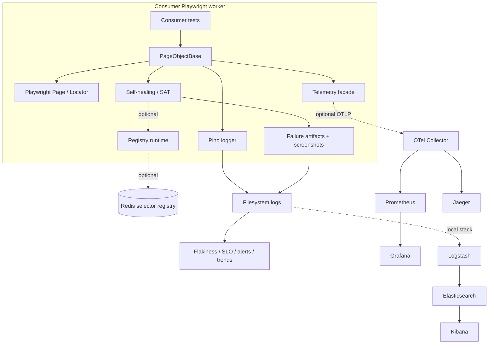
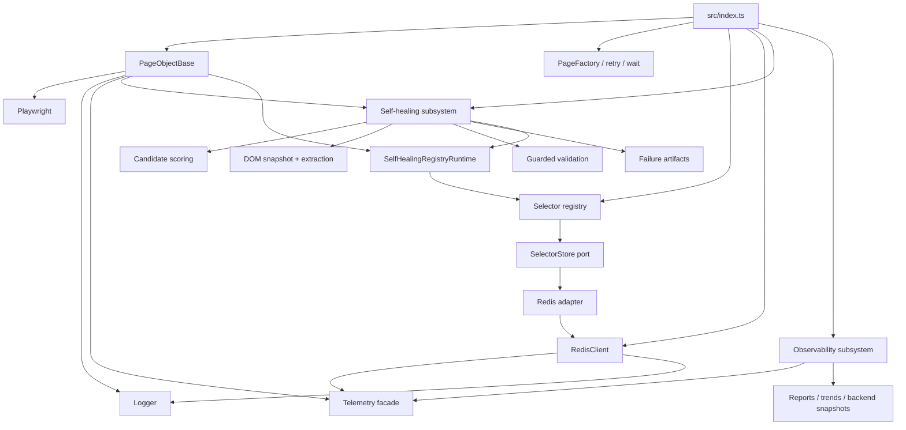
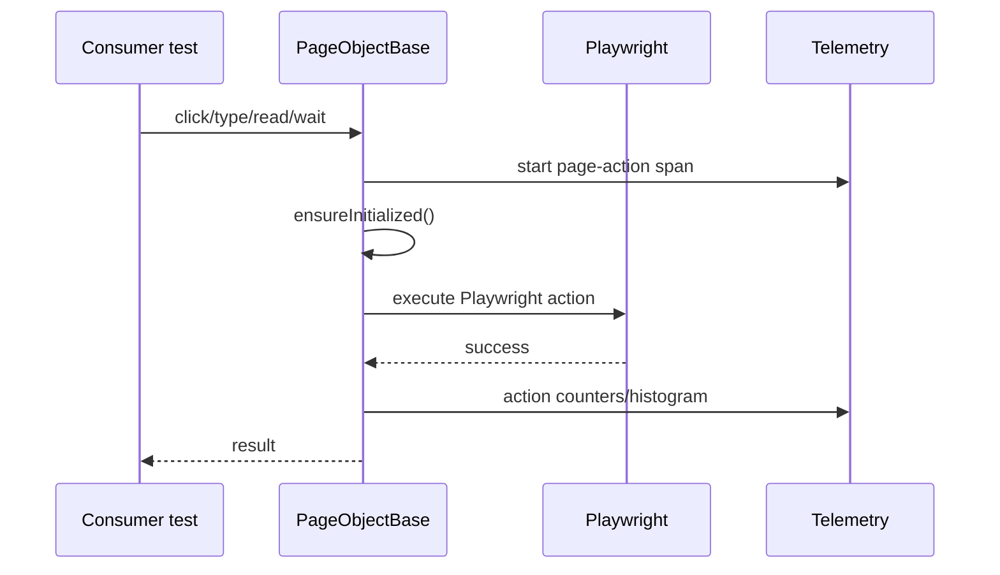
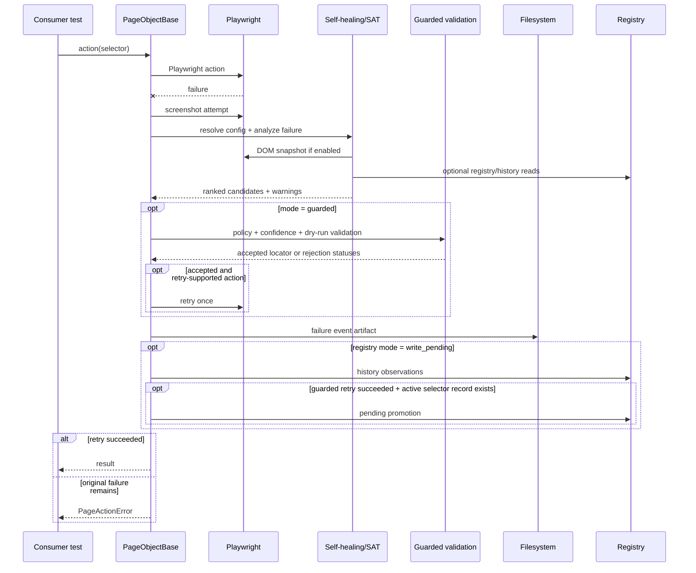
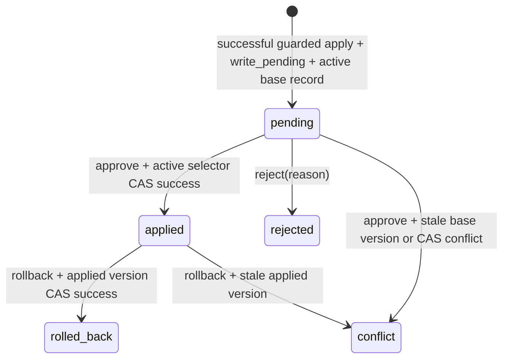
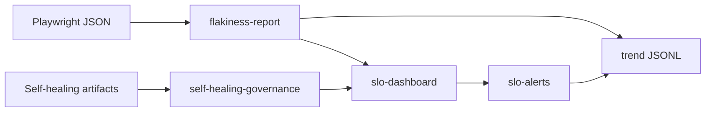

# AuroraFlow — Canonical Architecture Review

**Review date:** 2026-06-10  
**Repository:** `jsugg/auroraflow`  
**Snapshot reviewed:** `main` at commit `f21d6c8`  
**Scope:** source, tests, documentation, package metadata, schemas, scripts, CI workflows, and local/reference observability assets.

---

## 1. Executive Summary

### 1.1 System identity

AuroraFlow is a TypeScript npm package for Playwright test automation. It runs inside the consumer's Node.js Playwright process; it is not a hosted service, request-serving backend, or database-owning application. The package currently combines four product surfaces:

1. **Page-object runtime** — `PageObjectBase` and `PageFactory` provide a page-object authoring model with common action envelopes for logging, screenshots, telemetry, and self-healing diagnostics.
2. **Self-healing / SAT** — Selector Analysis Tooling captures failure evidence, generates locator candidates from heuristics, DOM evidence, registry records, and history, optionally validates a candidate in guarded mode, and retries a failed action once when policy permits.
3. **Selector data layer** — a Redis-backed, store-abstracted selector registry stores active selector records, lookup indexes, candidate histories, pending promotions, and audit records.
4. **Artifact-first observability** — deterministic JSON/Markdown reports, JSON Schemas, OTel telemetry, structured logs, trend JSONL files, and optional local/reference observability stacks make test-suite health inspectable with or without live telemetry.

The product thesis is strong: browser E2E suites frequently fail because selectors decay and triage evidence is poor. AuroraFlow's differentiation is that it tries to improve recovery and diagnostics without crossing the trust boundary into unreviewed source rewrites or silent selector mutation.

### 1.2 Architectural verdict

AuroraFlow has a strong architectural foundation and an unusually rigorous CI/contract-test culture for a young framework. The core design is safety-first, typed, deterministic, and intentionally library-shaped. Its strongest ideas are worth preserving:

- default-off self-healing;
- suggest versus guarded modes;
- dry-run validation before any retry;
- one guarded retry at most;
- no runtime mutation of active selectors;
- reviewed promotion workflow with version checks and audit records;
- no-op telemetry by default;
- deterministic report artifacts as merge-gate evidence;
- contract tests over workflows, package metadata, docs, schemas, and observability assets.

The main risks are not macro-architecture problems. They are concentrated local issues that undermine credibility, operability, or future evolution:

1. **Guarded healing is not coherent at default calibration.** The default confidence gate is `0.92`, while normal heuristic and DOM candidates usually top out below it. The promotion and learning loops require a successful guarded apply, so the system cannot naturally bootstrap without seeded high-confidence registry records or a lower threshold.
2. **Locator candidates are stringly typed.** Candidate producers serialize Playwright-like expressions and guarded validation regex-parses them back. The current emitter/parser pair already disagrees for values containing quotes, so valid human-facing text such as `It's saved` can become unguardable.
3. **Judgment constants are duplicated and divergent.** Scoring weights/reliability tables and SLO thresholds live in multiple places, making drift likely and decision rationale unclear.
4. **Candidate history is not atomic.** History writes use read-modify-write without CAS or atomic counters, so parallel workers can corrupt the signal used to improve candidate rankings.
5. **`PageObjectBase` is both the right facade and the biggest coupling point.** It currently owns Playwright actions, initialization, telemetry, screenshots, config resolution, SAT analysis, guarded validation, retries, registry persistence, artifact writing, and error wrapping.
6. **The public API is broad and under-governed.** Many internals are exported from the root package without stability tiers, deprecation rules, or release provenance.
7. **Artifacts and screenshots are privacy-sensitive.** Logs and telemetry have redaction controls, but screenshots and visible DOM text can still capture PII, secrets, or regulated UI state.
8. **Singleton/env runtime model limits isolation.** Logger, telemetry, Redis, and self-healing config rely on process-level state, making multi-project runners and cleanup harder.
9. **The observability perimeter is valuable but heavy.** It is excellent as proof-of-capability and CI validation, but needs containment so it does not outgrow maintainer capacity.

### 1.3 Strategic recommendation

Choose **conservative evolutionary hardening with internal seams**.

Keep one npm package and preserve root import compatibility. Do not rewrite the framework, split packages, or build a hosted SAT platform now. Fix feature credibility and governance first, then introduce internal seams behind existing public APIs:

- one coherent scoring/threshold/history/promotion contract;
- structured locator candidates;
- `AuroraFlowContext` or equivalent runtime context injection;
- internal page-action pipeline behind `PageObjectBase`;
- lifecycle helper / Playwright fixture for telemetry and Redis cleanup;
- API stability tiers and release provenance;
- artifact privacy controls and retention policy;
- atomic history updates and Redis operational runbooks.

Option B-style modularization should remain an explicit future trigger, not a default next step. Choose it only after real users ask for a smaller install, standalone report tooling, or separate ownership of observability assets. A hosted platform should remain out of scope unless there is funded, multi-team demand and an owning team.

---

## 2. Current Repository Facts

| Area | Current fact |
| --- | --- |
| Package | `auroraflow@1.0.0`, MIT, npm package |
| Runtime target | Node `>=20 <25` |
| Core peer | `playwright >=1.59 <2` |
| Source | 39 TypeScript files under `src/`, 10,703 LOC |
| Scripts | 13 scripts: 9 TypeScript, 2 MJS, 2 shell; about 3k LOC |
| Tests | 62 files under `tests/suites`; 60 `.spec.ts` files; 9,712 LOC |
| Workflows | 4 GitHub Actions workflows, 1,045 lines |
| Schemas | 10 JSON Schemas |
| Docs | 17 files under `docs/` including 16 Markdown documents |
| Observability assets | 7 Grafana dashboards, Prometheus rules, Collector, Jaeger, Logstash, Elasticsearch, Kibana assets |
| Registered metrics | 19 `auroraflow_*` metric names |
| CI quality matrix | Node 20/22/24 |
| E2E matrix | six browser/device projects, two shards in scheduled/main CI |
| Release automation | build and dry-pack scripts exist; publish/provenance workflow absent |
| Coverage | no coverage reporter/threshold configured in `vitest.config.mts` |
| History | 161 commits; author history indicates one primary maintainer plus Dependabot |

Important package dependencies:

- TypeScript `^6.0.3`;
- Playwright dev/runtime test tooling: `playwright ^1.59.1`, `@playwright/test ^1.60.0`;
- `redis ^5.12.1`;
- OpenTelemetry API/SDK/exporter packages;
- `pino` and `pino-pretty`;
- Vitest, Ajv, Testcontainers, ESLint 9, Prettier, actionlint, zizmor, gitleaks, CodeQL workflow tooling.

---

## 3. Product Context and Boundaries

### 3.1 Problem solved

AuroraFlow targets recurring E2E pain points:

- selectors tied to unstable implementation details;
- low-quality failure evidence;
- gradual flakiness regressions;
- test-suite health that is hard to quantify;
- distrust of tools that "self-heal" by changing selectors silently;
- fragmented CI artifacts, telemetry, logs, screenshots, dashboards, and governance records.

The current design answers this with governed diagnostics:

1. wrap page actions in a consistent safety envelope;
2. capture structured failure evidence;
3. generate deterministic locator candidates;
4. optionally dry-run candidates under action/domain policy;
5. retry once only when the accepted candidate is policy-safe and confidence-eligible;
6. persist history and pending promotions for review;
7. keep deterministic reports authoritative even when telemetry is disabled;
8. export optional live telemetry through OTel and local/reference stacks.

### 3.2 Primary users and actors

| Actor | Goals | Main touchpoints |
| --- | --- | --- |
| Test authors | Write maintainable Playwright page objects; get better failure evidence | `PageObjectBase`, `PageFactory`, examples, API docs |
| QA/platform engineers | Govern selector changes and suite reliability | failure artifacts, candidate history, promotion workflow, governance scripts |
| CI maintainers | Run quality gates, reports, SLO checks, browser matrix jobs | workflows, scripts, JSON Schemas, Playwright config |
| SRE/observability engineers | Integrate telemetry, dashboards, log/artifact ingestion | OTel config, Collector, Prometheus, Grafana, ELK, Jaeger assets |
| Security reviewers | Prevent secrets/PII leakage and unsafe automation | redaction config, artifact policies, workflow permissions, release provenance |
| Release maintainers | Ship reproducible package versions | package metadata, build scripts, package contracts, future release workflow |

### 3.3 Non-goals that should remain explicit

- AuroraFlow is a framework package, not a SaaS platform.
- It does not run a hosted test service.
- It does not rewrite source code.
- It does not silently mutate active selector records.
- It does not own production Redis or observability operations.
- Local Compose stacks are not production deployments.
- Live telemetry is optional; JSON/Markdown artifacts remain the source of truth for CI evidence.

---

## 4. Repository and Technology Map

```text
auroraflow/
├── src/
│   ├── index.ts                              # root public export surface
│   ├── pageObjects/pageObjectBase.ts         # action facade and failure envelope
│   ├── helpers/
│   │   ├── helpers.ts                        # retry/wait utilities
│   │   └── pageFactory.ts                    # per-page factory/cache
│   ├── utils/
│   │   ├── logger.ts                         # pino configuration and child loggers
│   │   └── redisClient.ts                    # Redis wrapper, retry, SCAN, Lua CAS
│   ├── data/selectors/
│   │   ├── selectorRegistry.ts               # store-abstracted selector repository
│   │   └── redisSelectorStore.ts             # RedisClient -> SelectorStore adapter
│   └── framework/
│       ├── selfHealing/                      # SAT, scoring, validation, artifacts, promotion
│       └── observability/                    # telemetry facade, reports, trends, snapshots
├── tests/suites/
│   ├── unit/
│   ├── integration/
│   ├── contracts/
│   └── e2e/examples/
├── scripts/                                  # reports, governance, schemas, workflow, smoke CLIs
├── schemas/                                  # artifact JSON Schemas
├── configs/                                  # Playwright and alert policy configuration
├── docs/                                     # user, architecture, and operations docs
├── examples/                                 # examples and workflow templates
├── observability/                            # local/reference stack assets
├── .github/workflows/                        # quality, ci, security, examples
└── docker-compose*.yml
```

Technology choices are coherent for a library-first Playwright framework:

| Technology | Role | Architectural note |
| --- | --- | --- |
| TypeScript strict mode | implementation and public declarations | Good for package consumers; TS 6 support policy should be explicit |
| Node 20/22/24 | runtime and CI matrix | Clear current engine band |
| Playwright | browser automation substrate | Correct core dependency; broad peer range needs matrix coverage |
| Vitest | unit/integration/contract tests | Strong suite breadth; no coverage threshold yet |
| Redis | optional durable selector registry | Good first backend; needs operational runbook and fallback store |
| Pino | structured logs | Good redaction/correlation; eager initialization is a library side effect |
| OpenTelemetry | optional spans/metrics | No-op default is correct; lifecycle helper needed |
| Ajv / JSON Schema | artifact contract validation | Strong external-contract discipline |
| GitHub Actions | CI/report/governance choreography | Strong but GitHub-specific |
| Docker Compose | Redis and observability local stacks | Useful validation/reference assets, not production ownership |

---

## 5. System Architecture

### 5.1 Architectural style

AuroraFlow is a **single-package, layered framework library with operational tooling**:

- **Package facade:** `src/index.ts`.
- **Runtime facade:** `PageObjectBase`.
- **Domain subsystems:** self-healing/SAT, selector registry, observability/reporting.
- **Ports/adapters:** `SelectorStore`, registry runtime contracts, telemetry facade, failure artifact writer.
- **Operational plane:** scripts, schemas, workflows, docs, Compose assets.

This is the right style for the current product. The key architectural task is to keep the library safe, deterministic, lightweight by default, and easy to embed, not to introduce service architecture.

### 5.2 Runtime planes

1. **In-test plane** — runs inside consumer Playwright workers. Owns page action envelopes, failure evidence, SAT, optional Redis I/O, telemetry, logs, and screenshots.
2. **Reporting plane** — runs in scripts/CI after tests. Converts Playwright JSON and self-healing artifacts into flakiness summaries, SLO dashboards, alert evaluations, governance summaries, and trend points.
3. **Observability plane** — optional local/reference infrastructure. Receives OTLP spans/metrics and file/artifact/log ingestion into Prometheus/Grafana/Jaeger/Elasticsearch/Kibana.



### 5.3 Component relationships



### 5.4 Dependency direction

The graph is mostly acyclic and healthy:

- `pageObjects` depends on Playwright, self-healing, telemetry, and logger.
- `selfHealing` depends on registry contracts, selector data abstractions, and observability core.
- `data/selectors` is store-abstracted.
- `redisSelectorStore` binds Redis to the store port.
- report modules depend on telemetry core and pure parsers/builders.
- scripts import framework internals directly, appropriate while the repository is one package.

The notable inversion is `utils/redisClient.ts -> framework/observability`. This is acceptable in a single package, but it is the first dependency to invert if the package ever splits, because it blocks a "Redis without OTel" install profile.

### 5.5 State ownership

AuroraFlow owns no service database. State lives in:

- Redis, when selector registry/history/promotion features are enabled;
- filesystem artifacts (`test-results/`, `test-reports/`, `logs/`, trend JSONL);
- GitHub Actions artifacts/cache;
- optional observability backend volumes/indices.

This state model is suitable for a library, provided operational ownership is explicit.

### 5.6 Configuration model

Configuration is environment-variable driven:

- `SELF_HEAL_*` for modes, thresholds, SAT, registry, and promotion settings;
- `AURORAFLOW_REDIS_*` for Redis;
- `AURORAFLOW_OBSERVABILITY_*` and `OTEL_*` for telemetry;
- `AURORAFLOW_LOG_*` for logging;
- `AURORAFLOW_*`, `GITHUB_*`, and `PLAYWRIGHT_*` for correlation/trend metadata;
- script-specific variables for governance and SLO behavior.

This fits CI and containers. It has three architectural costs:

1. invalid-config behavior is inconsistent across subsystems;
2. process-global env reads prevent multiple independent configurations in one process;
3. the env surface is large enough to need effective-config diagnostics.

Self-healing config is the most important inconsistency: invalid values fall back silently. Redis, telemetry, and logger config are stricter and throw typed errors. A typo such as `SELF_HEAL_MODE=gaurded` can silently disable the feature.

### 5.7 Extension points

Strong seams already exist:

- `SelectorStore` with optional `getMany`, `compareAndSet`, and `scanKeys` capabilities;
- registry runtime contracts for selectors, history, and promotions;
- `FailureArtifactWriter`;
- event decoration in failure capture;
- telemetry facade (`AuroraFlowTelemetry`);
- injectable clock/random/sleep/client/writer seams across multiple modules.

Missing or weak seams:

- action execution pipeline is embedded in `PageObjectBase`;
- runtime context/config is not injected into page objects;
- screenshot redaction/capture policy is not a strategy interface;
- locator candidates are serialized as strings, not structured data;
- API stability levels are not declared;
- lifecycle cleanup is not provided as one package-level operation.

---

## 6. Module and Component Deep Dive

### 6.1 Root package surface: `src/index.ts`

The root entrypoint exports page-object primitives, helpers, logger APIs, Redis APIs, selector registry APIs, self-healing configuration and runtime pieces, artifact parsers, candidate scoring, DOM capture, guarded validation, telemetry, report builders, alert/trend helpers, metric/attribute names, and many types.

Strengths:

- one ergonomic import path;
- package metadata and export surface are contract-tested;
- declarations are generated;
- docs and schemas are included in the npm package files.

Risks:

- root exports are broad enough to freeze internals as accidental public API;
- low-level scoring, parsing, registry, Redis, and telemetry helpers are easy to use outside intended flows;
- no stable/advanced/experimental/deprecated grouping exists;
- package semver, artifact schema versions, Redis record shape, metric labels, and CLI outputs are all separate compatibility surfaces.

Recommendation: keep root import compatibility, but define stability tiers and expand package-surface contracts around stable exports. Internal-looking helpers can remain exported if they are explicitly marked advanced or experimental.

### 6.2 Page-object runtime: `PageObjectBase`

`PageObjectBase` is the keystone. It wraps:

- `navigateTo`;
- `open`;
- `getTitle`;
- `click`;
- protected `clickWhenVisible`;
- `type`;
- `getText`;
- `waitForSelector`;
- `waitForTimeout`;
- `takeScreenshot`;
- `close`.

The shared action envelope performs lazy initialization, telemetry spans/metrics, logging, Playwright operation execution, screenshot capture, self-healing analysis, guarded validation, optional guarded retry, artifact capture, registry persistence summary attachment, and final error wrapping.

Good design:

- all public actions use a common safety envelope;
- initialization is promise-guarded;
- ancillary diagnostics failures are contained;
- original Playwright failure remains primary unless guarded retry succeeds;
- action timeouts and wait timeouts are bounded;
- guarded retry is narrow and explicit.

Design pressure:

- the class directly orchestrates too many subsystems;
- config and registry runtime are resolved from process state at failure time;
- public actions are string-selector-first, while modern Playwright favors `Locator`s;
- adding actions or behavior changes requires touching the central class.

Recommendation: preserve `PageObjectBase` as the public facade, but introduce an internal `PageActionPipeline` / `ActionExecutor` with ports for telemetry, screenshots, SAT, artifact writing, registry persistence, and retry application. Migrate incrementally, starting with `click` and `type`.

### 6.3 `PageFactory` and helper utilities

`PageFactory` caches one page-object instance per constructor per factory. That is useful and simple. The lifecycle assumption should be louder: create a new factory for each Playwright `Page`/context, or a cached page object may outlive its underlying `Page`.

`retry()` has bounded retries, delay, backoff, jitter, and injectable randomness. Its main weakness is diagnostic: on exhaustion it wraps the final error message in a fresh `Error`, losing the original object, stack, and cause chain. Fixing this is small but aligned with AuroraFlow's value proposition: never lose failure evidence.

### 6.4 Logger

The logger is featureful:

- pino-based structured logs;
- default redaction;
- configurable destination, level, file path, redaction paths, censor value;
- trace/span correlation injection from active OTel span.

The concern is import-time behavior. The main logger is created at module load, so importing the package can validate logger env, open file sinks, and spawn transport workers. For an embeddable library, that is an avoidable side effect.

Recommendation:

- make main logger initialization lazy;
- include AuroraFlow's own secret-bearing env names in default/redaction guidance (`AURORAFLOW_REDIS_PASSWORD`, `OTEL_EXPORTER_OTLP_HEADERS`);
- add lifecycle docs or helper support for file/log cleanup where relevant.

### 6.5 Redis client

`RedisClient` is one of the strongest low-level modules:

- validates URL, protocol, host, port, DB, key prefix, TLS, timeouts, retry counts, and backoff bounds;
- prefixes and validates keys/patterns;
- uses SCAN rather than blocking `KEYS`;
- batches reads;
- deduplicates connect attempts;
- wraps operations in bounded retries and telemetry;
- supports TTL set operations;
- implements JSON-version CAS through a Lua `EVAL` script.

Risks and notes:

- operation-level retries and node-redis socket reconnect strategy can multiply latency when Redis is unavailable;
- module singleton `getRedisClient()` is convenient but weak for multi-project isolation;
- CAS script assumes Redis-compatible Lua `cjson` behavior;
- Redis imports observability, complicating a future lightweight split.

Recommendation:

- keep Redis as the first durable backend;
- document managed Redis compatibility assumptions;
- add context/lifecycle injection;
- invert Redis telemetry behind a tiny metrics port only if package splitting becomes real.

### 6.6 Selector registry

`SelectorRegistryRepository` is a good key-value repository:

- validates IDs, page object names, action types, locators, confidence, notes, versions, and record shape;
- revalidates deserialized records and reports typed data errors;
- uses CAS when `expectedVersion` is supplied and the store supports it;
- maintains page/action index keys;
- batches reads and sorts deterministically;
- tolerates stale index entries by skipping invalid/missing payloads.

Weaknesses:

- active record write and index update are separate operations;
- `listByPageObject()` is an O(n) scan;
- stale index entries are tolerated but not repaired;
- record shapes have no `schemaVersion`;
- only Redis is shipped as durable backend.

Recommendation:

- add registry `schemaVersion` and read-time upgraders;
- ship index audit/repair tooling;
- productize a memory store for local/small-team use and testing;
- create a shared store conformance suite.

### 6.7 Self-healing configuration

Current defaults:

- `SELF_HEAL_MODE=off`;
- `SELF_HEAL_MIN_CONFIDENCE=0.92`;
- SAT enabled for suggest/guarded modes;
- DOM node default/hard cap: 500 / 5000;
- candidate default/hard cap: 10 / 50;
- text default/hard cap: 120 / 500;
- registry mode default: `read`;
- promotion mode default: `manual`;
- allowed actions default excludes `navigate`, `close`, and `unknown`;
- empty allowed-domain list means no domain restriction.

The safety posture is good. The silent invalid-value fallback is not. `SELF_HEAL_PROMOTION_MODE` is also parsed and documented but currently does not appear to drive a meaningful runtime persistence or workflow decision. Dead configuration is a governance hazard.

Recommendation:

- warn or throw on invalid `SELF_HEAL_*` values according to a documented strictness mode;
- add an effective-config diagnostic;
- remove or wire `SELF_HEAL_PROMOTION_MODE`.

### 6.8 Candidate generation and scoring

The heuristic suggestion engine derives candidates from failed target text:

- original selector;
- `data-testid`;
- ID-to-test-id/role/label variants;
- text targets;
- simplified CSS class;
- action-specific fallback.

Unified scoring combines role, accessible-name, uniqueness/reliability, history, and similarity signals. The ranking is deterministic and explainable. The problem is that the current constants do not compose with the default confidence gate:

- `DEFAULT_SELF_HEAL_MIN_CONFIDENCE = 0.92`;
- `STRATEGY_BASE_SIGNAL` in `suggestionEngine.ts` uses values such as `testId: 0.95`, `roleName: 0.78`, `ariaLabel: 0.72`;
- `STRATEGY_RELIABILITY` in `candidateScoring.ts` uses `testId: 1.0`, `roleName: 0.9`, `ariaLabel: 0.82`;
- heuristic `roleName` candidates top out around `0.87`;
- high-quality DOM evidence can top out around `0.90` before positive history;
- registry candidates can pass if stored confidence is high enough;
- history can lift candidates, but history requires observations that are themselves gated by validation and successful guarded apply.

Recommendation: treat scoring constants, threshold, history, and promotion bootstrap as one product contract. Pick one intended behavior and test it:

1. high-quality DOM evidence can pass the default gate; or
2. default guarded mode is explicitly registry-curated only; or
3. the product ships a registry-seeding workflow/runbook that makes high-confidence records available.

### 6.9 DOM snapshot and DOM candidate extraction

DOM snapshot capture is careful:

- runs in the browser context;
- skips invisible/non-useful elements;
- bounds node count and text length;
- allow-lists attributes;
- redacts sensitive attribute names and form values;
- infers roles and accessible names;
- produces stable CSS fallback paths;
- emits versioned snapshot payloads.

Residual risk remains: visible text is captured. If tested pages display PII, account data, tokens, or regulated data, that data can enter JSON artifacts and local Elasticsearch ingestion. Screenshots are an even larger privacy surface because they are not redacted at capture time.

DOM candidate extraction also reveals the locator DSL problem. It emits Playwright-like strings using single quotes, double quotes, or backticks depending on content. Guarded validation later rejects several of those valid emitted strings.

Recommendation:

- add privacy controls for DOM text and screenshots;
- add DOM snapshot latency instrumentation if failure-path performance matters;
- replace string candidate expressions with structured candidate data.

### 6.10 Guarded validation and locator DSL

Guarded validation is conceptually strong:

- action policy before probing;
- optional domain policy;
- score threshold before Playwright locator probes;
- bounded candidate count;
- first visible match accepted;
- status recorded for below-threshold, unsupported, no-match, not-visible, accepted, and evaluation errors.

The weak point is `resolveLocatorExpression()`. It regex-parses strings for a closed set of forms:

- `page.getByTestId(...)`;
- `page.getByText(...)`;
- `page.getByLabel(...)`;
- `page.getByRole(...)`;
- `page.locator(...)`.

The regex value patterns reject embedded quote characters in several cases. A candidate emitter can produce `page.getByText("It's saved")`, which is a valid idea but does not parse because the value contains an apostrophe. The result is an `unsupported_locator_expression` status rather than a guarded probe.

Recommendation: introduce a discriminated union:

```ts
type CandidateLocator =
  | { kind: 'testId'; value: string }
  | { kind: 'text'; value: string }
  | { kind: 'label'; value: string }
  | { kind: 'role'; role: string; name?: string }
  | { kind: 'css'; selector: string };
```

Artifact strings can remain as human-readable or legacy fields. Runtime validation should switch over structured data, not parse strings.

### 6.11 Failure artifacts and schemas

Failure artifacts are a core product strength:

- event-ID based;
- schema-versioned;
- enriched through a decorator hook;
- validated by runtime parsers and JSON Schemas;
- deterministic enough for CI governance and reporting.

The schema strategy is right: strict enough to catch malformed artifacts, permissive enough to allow forward-compatible fields. When structured candidates land, bump the artifact schema version and keep a legacy read path.

### 6.12 Registry persistence, history, and promotions

The write-pending path records candidate history and may create pending promotions. Important behavior:

- history observations are written for SAT candidates in `write_pending` mode;
- pending promotions require `guardedAutoHeal.succeeded === true`;
- a ranked accepted candidate must exist;
- a selector ID or registry record ID must resolve;
- an active registry record with version must exist;
- accepted locator must differ from the active locator.

This is safe but creates the bootstrap issue: the review loop requires successful guarded healing, and guarded healing often cannot pass the default gate without pre-existing high-confidence data.

History repository risk:

- `recordObservation()` and `recordOutcome()` use GET -> mutate -> SET;
- no CAS or atomic counter is used;
- exported default history TTL is 90 days, but the internal Redis TTL max clamps to 30 days.

Promotion workflow strengths:

- approve re-reads active selector;
- CAS protects active selector update;
- conflict is an explicit persisted state;
- reject requires reason;
- rollback uses previous selector snapshot and version checks;
- audit records are written.

Promotion workflow gaps:

- reviewer identity is a string, not authorization;
- promotion status updates are last-writer-wins on the promotion record;
- audit records have no TTL and cleanup intentionally skips audit namespace;
- a typed `approved` status exists but no normal workflow path produces it.

Recommendation:

- use CAS/atomic increments for history;
- align history TTL default and clamp;
- add expected-status/CAS semantics to promotion record updates;
- add promotion authorization policy before shared registries;
- define audit retention.

### 6.13 Telemetry and observability modules

The telemetry facade is the correct shape for a library:

- no-op by default;
- OTel enabled through configuration;
- strict mode can fail where CI wants telemetry correctness;
- non-strict mode degrades to no-op with warning;
- metric names are closed and centralized;
- attributes are centralized and cardinality-conscious;
- raw selector export is opt-in;
- logs can correlate with traces.

Gaps:

- telemetry is a module singleton;
- consumers must remember `shutdownTelemetry()`;
- no package-level lifecycle helper closes telemetry and Redis together;
- OTel SDK/exporter behavior is mostly delegated to upstream defaults.

Recommendation:

- add `closeAuroraFlow()` / `disposeAuroraFlowRuntime()`;
- provide a Playwright fixture wrapper;
- allow context injection for telemetry/logger/registry config;
- keep live telemetry optional and never required for basic test correctness.

### 6.14 Reporting, SLOs, alerts, and trends

Report generation is strategically important:

- Playwright JSON becomes flakiness summaries;
- flakiness and governance data feed SLO dashboards;
- alert policy evaluation can warn or fail;
- trends are appended as JSONL;
- report telemetry can re-emit aggregate metrics.

Risks:

- trend history uses GitHub Actions cache, which is evictable and branch-scoped;
- strict JSONL parsing can let one corrupt line poison a read;
- SLO targets exist in dashboard defaults, policy JSON, and Prometheus rules with partly different semantics;
- Playwright JSON reporter shape is external and not guaranteed by AuroraFlow.

Recommendation:

- tolerate malformed trend lines with warning counts;
- document trend cache limits honestly;
- single-source SLO thresholds or explicitly assert intended differences;
- add report fixtures generated by supported Playwright versions.

### 6.15 Scripts and CI automation

Scripts and workflows are part of the architecture because the framework's value appears in CI.

Strong practices:

- `npm run verify` aggregates local quality gates;
- workflows pin third-party actions by SHA;
- checkouts use `persist-credentials: false`;
- permissions are scoped;
- path filters reduce unnecessary heavy jobs;
- security workflow aggregates dependency review, npm audit, CodeQL, gitleaks, and zizmor;
- workflow contracts test CI assumptions locally;
- observability smokes validate live metric/dashboard/alert semantics;
- governance can open triage issues when configured.

Gaps:

- no release/publish workflow;
- no changelog/provenance/SBOM policy;
- full observability stack is heavy;
- GitHub Actions is the only first-class CI orchestration;
- promotion CLI lacks an authorization policy.

---

## 7. Runtime Flows

### 7.1 Successful page action



The success path is appropriately lean. Self-healing cost is paid only on failure.

### 7.2 Failed action with optional guarded healing



### 7.3 Promotion workflow



Important invariant: runtime failure handling never mutates active selectors. Only the review workflow can change active selector records.

### 7.4 Reporting chain



Report jobs should run even when tests fail; their purpose is to explain and quantify failure quality.

### 7.5 Shutdown and lifecycle

Current model:

- telemetry shutdown is explicit;
- Redis disconnect is explicit;
- scripts call shutdown in some paths;
- consumer tests own process lifecycle;
- no mandatory process hooks exist.

Recommended model:

- keep explicit shutdown as primary contract;
- add one package-level lifecycle helper;
- provide a Playwright fixture wrapper that disposes telemetry and Redis;
- avoid surprising automatic global hooks unless opt-in.

---

## 8. Domain Model and Invariants

| Entity | Identity | Persistence | Notes |
| --- | --- | --- | --- |
| Page object | class instance | memory | Consumer subclasses own page behavior |
| Action context | action metadata | memory/artifact/telemetry | Action type, target, alias, role/name, selector ID |
| Active selector | selector ID | Redis/store | Versioned and CAS-updated |
| Candidate | deterministic candidate ID | memory/history/artifact | Derived from page/action/selector/strategy/locator |
| Candidate history | candidate ID | Redis/store | Attempts, validation, guarded apply, promotion outcomes |
| DOM snapshot | schema version | artifact | Bounded failure evidence |
| Failure event | event ID | JSON artifact | Immutable triage unit |
| Pending promotion | promotion/event ID | Redis/store | Reviewable selector update proposal |
| Audit record | promotion/action/time key | Redis/store | Append-only, currently unbounded |
| Flakiness summary | run/project | JSON/Markdown | Derived from Playwright JSON |
| SLO dashboard | run/project | JSON/Markdown | Derived from reports/governance |
| Trend point | run/source | JSONL | Best-effort cross-run history |

Key invariants:

1. Self-healing never rewrites source.
2. Runtime self-healing never mutates active selectors.
3. Guarded mode dry-runs before retry.
4. Guarded retry is at most one attempt.
5. Action/domain policy gates run before locator probing.
6. Active selector writes use optimistic concurrency when CAS is available.
7. Promotion approval checks base selector version.
8. Rollback checks applied selector version and previous selector snapshot.
9. DOM capture is bounded by node count, text length, and attributes.
10. Telemetry raw selector export is opt-in.
11. Optional Redis/telemetry diagnostics must not mask original Playwright failures.
12. Artifacts are schema-versioned.

Domain/implementation mismatches:

- the product name "self-healing" suggests autonomy, but the actual model is governed diagnostics plus optional guarded retry;
- structured locator concepts are encoded as strings;
- process env acts as global runtime context;
- registry records lack schema migration metadata;
- promotion types include at least one status that is not produced by the workflow.

---

## 9. Data Architecture

### 9.1 Redis keyspaces

All Redis keys are prefix-qualified; default prefix is `auroraflow`.

| Namespace | Payload | TTL | Concurrency model |
| --- | --- | --- | --- |
| active selectors | `SelectorRecord` JSON | none | Lua CAS on embedded `version` |
| page/action indexes | active record key references | none | separate writes; eventual consistency |
| candidate history | counter/history JSON | intended default 90d, clamped to 30d | read-modify-write today |
| pending promotions | promotion JSON | default 30d via `expiresAt` | last writer wins on promotion record |
| audit | audit JSON | none | append-like, unbounded |

### 9.2 Filesystem, CI, and backend data

| Location | Content | Lifecycle risk |
| --- | --- | --- |
| `test-results/self-healing/*.json` | failure events | privacy and CI retention |
| `test-results/screenshots/*.png` | screenshots | highest privacy exposure |
| `test-reports/` | Playwright report output | CI/local cleanup |
| `logs/*.ndjson` / `logs/*.log` | structured logs | local rotation/retention not owned |
| `.auroraflow-trends/*.jsonl` | trends | cache eviction and corruption tolerance |
| Prometheus/Grafana/ES volumes | local stack state | local/reference only |

### 9.3 Consistency model

Strongest:

- active selector CAS;
- promotion approval/rollback version checks;
- artifact schema validation;
- deterministic sorts and IDs.

Weakest:

- candidate history counters;
- promotion record status updates;
- record/index multi-key updates;
- unbounded audit retention;
- trend history durability.

Recommended hardening sequence:

1. CAS/atomic history counters.
2. Expected-status promotion updates.
3. Registry `schemaVersion`.
4. Index audit/repair.
5. Audit retention.
6. Redis backup/restore/eviction/access runbook.
7. Store conformance tests.

### 9.4 Privacy classification

Potentially sensitive data:

- URLs and action targets;
- selectors and labels;
- visible DOM text;
- screenshots;
- error messages and stacks;
- Redis selector records and audit history;
- telemetry attributes;
- logs and artifacts ingested into local Elasticsearch.

Existing controls:

- raw selector telemetry disabled by default;
- DOM attribute allow-list;
- sensitive DOM attribute value redaction;
- form value redaction;
- pino default redaction;
- Logstash recursive redaction/dead-letter behavior;
- workflow secret scanning.

Gaps:

- screenshots are not redacted;
- visible DOM text can contain PII;
- artifact retention policy is not prominent enough;
- Redis prefixing is namespace hygiene, not authorization;
- reviewer string is not authorization.

---

## 10. API and Integration Surface

### 10.1 Public API posture

The root API should be governed by tiers:

| Tier | Candidate contents | Compatibility expectation |
| --- | --- | --- |
| Stable | `PageObjectBase`, `PageFactory`, main action options/errors, artifact parsers, report builders, telemetry facade | Semver protected |
| Advanced | selector registry, promotion workflow, Redis adapter, runtime composition helpers | Semver protected with narrower docs and cautions |
| Experimental | scoring internals, raw DOM extraction, guarded parser, low-level metric/attribute helpers | May change behind explicit warnings/deprecation |
| Internal-only | constants/helpers not intended for consumers | Avoid exporting or mark clearly |

Package-surface contracts should enforce stable export compatibility, not merely assert that many exports exist.

### 10.2 External integrations

| Integration | Current posture | Risk |
| --- | --- | --- |
| Playwright | peer dependency; core runtime substrate | broad range untested across minors |
| Redis | optional but only durable selector backend | production lifecycle, RBAC, backup, fallback store |
| OTLP / OTel | optional telemetry | lifecycle/backpressure/flush clarity |
| GitHub Actions | primary CI/report/governance workflow | platform-specific templates |
| Docker Compose observability | local/reference stack | heavy and not production ownership |
| npm registry | implied deployment target | no release provenance |

### 10.3 Versioned compatibility surfaces

Manage these independently:

- npm package semver;
- generated TypeScript declaration compatibility;
- JSON artifact schema versions;
- Redis record schemas;
- candidate ID scheme;
- telemetry metric names and labels;
- report-script CLI flags and output files;
- docs/examples;
- workflow templates.

The package version alone cannot describe all compatibility promises.

---

## 11. Security Architecture

### 11.1 Strengths

- workflows pin third-party actions by SHA;
- default workflow permissions are scoped;
- checkouts use `persist-credentials: false`;
- security workflow runs dependency review, npm audit, CodeQL, gitleaks, and zizmor;
- Dependabot and npm overrides are present;
- no hardcoded secrets were evident from repository inspection;
- `.env*` is ignored;
- telemetry raw selectors are opt-in;
- many runtime inputs are length/range/charset/protocol validated;
- local stack binds to localhost and is documented as non-production/reference;
- self-healing privilege ladder is conservative.

### 11.2 Gaps and mitigations

| Gap | Severity | Mitigation |
| --- | --- | --- |
| Screenshot PII/secrets | High | retention docs, disable/mask hooks, screenshot policy |
| Visible DOM text PII | Medium-High | redaction hooks, production/sensitive-mode guidance |
| Artifact URLs/targets/stacks | Medium | data-classification docs and retention controls |
| Promotion authorization | Medium-High if shared | reviewer/namespace policy, protected CI environment, audit enrichment |
| Redis prefix treated as isolation | Medium | namespace policy and access-control docs |
| Release provenance absent | Medium | tag-triggered `npm publish --provenance` |
| Local stack auth disabled | Low if local-only | keep localhost binding and warnings |

Security principle: diagnostics may fail, but they must not widen the blast radius of a failing test.

---

## 12. Reliability and Resilience

Strengths:

- optional subsystems degrade gracefully;
- original Playwright error stays primary;
- Redis operations have bounded retries and typed errors;
- telemetry falls back to no-op unless strict mode is enabled;
- CAS protects active selector updates;
- promotion conflicts are explicit states;
- trend writes use temp file + rename;
- CI jobs have timeouts and path filtering;
- Testcontainers skips are explicit when Docker is unavailable.

Reliability risks:

| Risk | Scenario | Mitigation |
| --- | --- | --- |
| Failure storm amplification | app outage triggers many screenshots, DOM walks, locator probes, Redis writes | per-run SAT budget and breaker |
| Lost history increments | parallel workers update one candidate | CAS/atomic counters |
| Config typo changes behavior silently | invalid `SELF_HEAL_*` falls back | warning/strict mode/effective config |
| Telemetry not flushed | worker exits before export interval | lifecycle helper/fixture |
| Singleton config bleed | two projects in one process need different policies | runtime context injection |
| Import-time logger side effects | invalid env or transport setup on import | lazy logger |
| Registry index drift | crash between active record and index update | audit/repair tool |
| Promotion race | two reviewers act concurrently | expected-status updates |
| Trend corruption | malformed JSONL line blocks read | skip + warning count |
| Retry helper loses cause | final failure wraps only message | preserve `cause` and stack |

---

## 13. Performance and Scalability

### 13.1 Success path

The success path is appropriately low overhead:

- one action span;
- logs/metrics;
- initialization guard;
- Playwright action;
- no DOM snapshot;
- no SAT analysis;
- no registry write.

Browser automation dominates runtime cost.

### 13.2 Failure path

Failure path cost is intentionally higher:

- screenshot;
- bounded DOM walk;
- candidate extraction/scoring;
- guarded validation probes;
- Redis reads/writes when enabled;
- artifact writes;
- telemetry/logging.

Each dimension is bounded. The missing bound is aggregate per-run work. A widespread outage can multiply failure diagnostics by test count, browser retries, and shards.

Recommended controls:

- `SELF_HEAL_MAX_EVENTS_PER_RUN` or equivalent;
- downgrade to capture-only after budget exhaustion;
- DOM snapshot duration metric;
- failure-path benchmark covering DOM capture, guarded probes, Redis I/O, and artifact writes.

### 13.3 Data scalability

Current design is suitable for small-to-medium registry scale: thousands of selectors, per-repo/per-team usage, CI sharding, failure-rate-driven Redis activity. O(n) paths such as `listByPageObject()` and promotion-ID lookup are acceptable now but become ceilings in a large shared registry.

---

## 14. Observability and Operability

Observability is one of AuroraFlow's strongest differentiators.

Strengths:

- page action, Redis, self-healing, and report metrics/spans;
- structured logs with trace/span correlation;
- closed metric registry;
- low-cardinality attribute builders;
- JSON/Markdown artifacts as source-of-truth;
- JSON Schemas;
- local Collector/Prometheus/Grafana/Jaeger/ELK assets;
- Logstash redaction and dead-letter handling;
- backend snapshot/assert tooling;
- CI smoke that validates metric labels, dashboard queries, and Prometheus rules against live backends.

The standout practice is the **label-truth gate**: dashboards and alerts are not trusted as static files; live export assertions check that emitted series, labels, dashboard queries, and rules align.

Operability boundaries:

| Context                               | Readiness                                     |
| ------------------------------------- | --------------------------------------------- |
| Local development                     | strong, though full stack is heavy            |
| CI smoke                              | strong                                        |
| Consumer CI without telemetry backend | strong because artifacts suffice              |
| Production Redis registry             | partial; needs runbook/owner/retention/access |
| Production observability stack        | reference-only                                |
| Multi-team shared registry            | not ready without policy/RBAC/runbooks        |

Recommendation:

- keep artifact-first reports central;
- keep live telemetry optional;
- add observability-lite path;
- keep production manifests explicitly reference-only;
- single-source or contract-pin metric/threshold relationships;
- add ownership/support-level notes for stack assets.

---

## 15. Testing and Quality Strategy

Current strengths:

- broad unit coverage across runtime, self-healing, data, observability, examples;
- Redis integration through Testcontainers;
- contract tests for package/docs/workflows/infra/observability/security assumptions;
- E2E examples;
- strict TypeScript;
- ESLint with type-aware rules;
- workflow linting and shellcheck;
- Node 20/22/24 quality matrix.

Most important missing tests:

| Missing test | Risk closed |
| --- | --- |
| score reachability against default gate | prevents impossible guarded-healing defaults |
| candidate emitter/validator round-trip | catches locator DSL mismatches |
| history counter concurrency | prevents lost learning signal |
| scoring constants single-source/drift test | prevents unexplained threshold drift |
| Playwright peer version matrix | validates `>=1.59 <2` |
| full self-healing integration with real Redis | validates composed pipeline |
| promotion CLI tests | protects review UX |
| artifact/screenshot privacy tests | prevents sensitive-data regressions after controls exist |
| OTLP integration test near code path | faster feedback than full-stack CI only |
| trend malformed-line tolerance | protects history reads |
| registry index drift/repair | protects data consistency |
| coverage thresholds | quantifies confidence in critical modules |

Quality gates to add:

- v8 coverage with initial thresholds on `selfHealing/`, `data/selectors/`, and parsers;
- stable API golden/compat report;
- release workflow dry-run;
- store contract test suite;
- property/fuzz tests for candidate/config/artifact parsers.

---

## 16. Build, Release, and Deployment

Build is sound:

- `npm run clean`;
- `tsc -p tsconfig.build.json`;
- declarations and declaration maps;
- `prepack`;
- `npm pack --dry-run`;
- curated package files.

CI is strong:

- `quality.yml`: verify matrix, smokes, observability, governance;
- `ci.yml`: scheduled/main/manual E2E matrix plus flakiness/SLO/alert reports;
- `security.yml`: dependency/security/static/workflow checks;
- `examples.yml`: example validation.

Release is the main gap:

- no tag-triggered publish workflow;
- no changelog/release note automation;
- no npm provenance;
- no SBOM policy;
- no release rollback playbook;
- no deprecation policy.

Recommended release workflow:

1. tag-triggered;
2. `npm ci`;
3. `npm run verify`;
4. `npm run build`;
5. `npm pack --dry-run`;
6. generate changelog/release notes;
7. `npm publish --provenance`;
8. create GitHub release;
9. document rollback.

Deployment: the package deploys through npm. Redis and observability deployments are consumer/operator owned.

---

## 17. Dependency Architecture

Good boundaries:

- Playwright coupling is intentional;
- `SelectorStore` reduces Redis lock-in;
- telemetry facade reduces backend lock-in;
- failure artifacts and schemas create durable external contracts;
- report builders are deterministic and backend-independent.

Weak boundaries:

- `PageObjectBase` composes too much infrastructure;
- `getTelemetry()` and `getRedisClient()` are module singletons;
- Redis imports observability;
- Redis and OTel are unconditional runtime dependencies;
- public exports are broad.

Recommended sequence before any package split:

1. release automation;
2. API stability tiers;
3. lazy logger;
4. lifecycle/context injection;
5. structured candidates;
6. Redis telemetry inversion;
7. external evidence that dependency weight or segmentation matters.

---

## 18. Architectural Fitness

| Subsystem | Fitness | Judgment |
| --- | --- | --- |
| Page-object core | good but coupling-heavy | correct facade; needs internal pipeline |
| Self-healing model | excellent safety model, flawed calibration/representation | fix threshold contract and candidate structure |
| Selector registry | good key-value design | needs history atomicity, schema migration, index repair |
| Redis client | strong | singleton/lifecycle/docs remain |
| Telemetry facade | strong | no-op default is exactly right |
| Reporting | strong | trend durability/tolerance and threshold single-sourcing needed |
| Observability stack | overbuilt but valuable | keep optional/reference; add lite path/ownership |
| CI/contract tests | excellent | add behavioral/property/concurrency gaps |
| Public API | useful but broad | add stability tiers |
| Release process | under-engineered | add provenance automation |
| Security posture | strong for CI/library | artifact privacy and promotion authorization remain |

Overall: AuroraFlow is **not under-architected**. It is well-engineered at the core, deliberately ambitious at the observability perimeter, and under-governed at the API/release/privacy edges. The next architecture work should make the existing design sharper, not larger.

Expected runway if high-priority fixes land:

- one-package framework architecture: 12-24 months for small-to-medium adoption;
- observability stack containment decision: likely within 6-12 months;
- public API governance: needed before meaningful external adoption;
- hosted platform/service architecture: only after funded demand.

---

## 19. Strengths to Preserve

1. **Safety-first self-healing.** Preserve mode gates, dry-run, one retry, no source rewrites, no direct active selector mutation, reviewed CAS promotions, rollback, and audit.
2. **Artifact-first observability.** JSON/Markdown evidence should remain authoritative without live telemetry.
3. **Contract-tested non-code assets.** Workflows, package metadata, docs, schemas, Compose, and observability claims should remain executable contracts.
4. **Store abstraction.** The `SelectorStore` seam is a strategic asset; extend it with conformance tests.
5. **Typed, bounded boundaries.** Keep length/range/charset/protocol validation as the norm.
6. **No-op defaults.** Telemetry and registry should not make basic page-object usage flaky or heavy.
7. **Supply-chain-aware CI.** Preserve SHA-pinned actions, scoped permissions, scanners, and self-linting workflows.
8. **Honest maturity framing.** Keep implemented, roadmap, and reference-only claims clearly separated.

---

## 20. Risk Register

| ID | Risk | Severity | Confidence | Priority | Primary mitigation |
| --- | --- | --- | --- | --- | --- |
| R1 | Guarded healing and promotion loop are not coherent at defaults | High | High | P0 | decide policy; recalibrate or document; reachability tests |
| R2 | String locator DSL has live emitter/parser mismatch | High | High | P0 | structured candidates; round-trip/property tests |
| R3 | Duplicated/divergent scoring constants and SLO thresholds | Medium-High | High | P0 | single-source or explicit calibrated dimensions |
| R4 | Candidate history counters lose increments under parallel workers | Medium-High | High | P0 | CAS/atomic counters; concurrency tests |
| R5 | History TTL public default differs from actual clamp | Medium | High | P0 | align default/clamp/docs |
| R6 | Public API surface lacks stability tiers | High | High | P1 | stable/advanced/experimental grouping and contracts |
| R7 | No release/provenance/changelog workflow | Medium-High | High | P1 | tag release with `npm publish --provenance` |
| R8 | Artifact/screenshot/DOM-text privacy exposure | High | High | P1 | retention docs, redaction/masking controls |
| R9 | `PageObjectBase` over-centralizes runtime concerns | Medium-High | High | P1 | internal action pipeline |
| R10 | Singleton/env runtime model limits isolation and cleanup | Medium-High | High | P1 | `AuroraFlowContext`, lifecycle helper |
| R11 | Promotion authorization is string-based, not policy-based | Medium-High if shared | Medium | P1 | reviewer/namespace policy, protected workflows |
| R12 | Promotion records can race under concurrent reviewers | Medium | Medium | P2 | expected-status/CAS updates |
| R13 | No per-run self-healing budget | Medium | Medium | P1 | run-level budget/breaker |
| R14 | Redis production lifecycle incomplete | Medium-High | High | P2 | runbook, backup/restore, RBAC, eviction guidance |
| R15 | Registry schema migration and index repair absent | Medium | High | P2 | `schemaVersion`, upgraders, repair CLI |
| R16 | Trend history is cache-backed and strict-parsed | Medium | High | P2 | tolerate malformed lines, durable export option |
| R17 | Logger import-time side effects | Low-Medium | High | P2 | lazy initialization |
| R18 | No unified telemetry/Redis teardown helper | Low-Medium | High | P2 | `closeAuroraFlow()` / fixture |
| R19 | Playwright peer range lacks version matrix | Medium | Medium | P2 | floor/current/latest lanes |
| R20 | Observability stack maintenance burden | Medium | Medium | P2 | lite stack, ownership/support boundary |
| R21 | Redis/OTel unconditional runtime dependency weight | Low-Medium | High | P3 | split only with adoption evidence |
| R22 | Audit namespace unbounded | Low-Medium | High | P3 | audit retention policy/cleanup |
| R23 | Single-maintainer bus factor | Medium | High | P3 | CONTRIBUTING, CODEOWNERS, ADRs |
| R24 | `PageFactory` cache invalidation is manual | Low | High | P3 | docs and optional lifecycle hints |

---

## 21. Recommendations

### 21.1 Immediate: 0-2 weeks

1. **Make guarded-healing semantics true and testable.**
   - Decide whether default guarded mode is registry-curated only or DOM candidates should pass.
   - Deduplicate scoring constants first.
   - Add score-reachability tests.
   - Add default-settings E2E or explicit intended-unreachability test.
   - Document what can pass the default gate.

2. **Fix candidate round-trip risk.**
   - Add regression tests for apostrophes/quotes in text, label, role names, and CSS selectors.
   - Patch the current parser/emitter if structured candidates cannot land immediately.
   - Start structured candidate design.

3. **Fix candidate history integrity.**
   - Use CAS loop, atomic Redis counters, or append/event strategy.
   - Align TTL constant and actual clamp.
   - Add parallel-write tests.

4. **Clarify self-healing config behavior.**
   - Warn or throw on invalid `SELF_HEAL_*`.
   - Add effective-config diagnostic.
   - Wire or remove `SELF_HEAL_PROMOTION_MODE`.

5. **Publish privacy/retention guidance.**
   - Classify screenshots, DOM text, artifacts, logs, Redis data, and telemetry.
   - Document CI artifact retention.
   - Add sensitive-environment guidance.
   - Add framework secret env names to redaction guidance/defaults.

6. **Add release/provenance path.**
   - Tag-triggered release workflow.
   - Verify/build/pack/publish with provenance.
   - Changelog/release notes and rollback checklist.

7. **Draft API stability tiers.**
   - Stable, advanced, experimental, internal.
   - Add deprecation policy.
   - Update package surface contracts by tier.

### 21.2 Near-term: 1-2 months

1. **Implement structured candidates end-to-end.**
   - Discriminated union for runtime validation.
   - Human-readable locator string only as display/legacy field.
   - Artifact schema bump and legacy read path.

2. **Add run-level self-healing budget.**
   - Cap SAT events per run.
   - Downgrade to capture-only after budget exhaustion.
   - Emit artifact/log warning.

3. **Introduce lifecycle helper and Playwright fixture.**
   - Flush telemetry.
   - Disconnect Redis.
   - Encourage fixture-managed `PageFactory`.

4. **Add `AuroraFlowContext`.**
   - Inject logger, telemetry, registry runtime, self-healing config, artifact writer.
   - Preserve env defaults.
   - Test two independent contexts in one process.

5. **Ship memory selector store and store contracts.**
   - Improve local/small-team adoption.
   - Simplify promotion CLI tests.

6. **Improve trend resilience.**
   - Skip malformed JSONL lines with counts.
   - Document cache semantics.
   - Add optional durable export path.

7. **Add Playwright and OTLP integration coverage.**
   - Lowest supported Playwright, current dev, latest within range.
   - Collector/mock receiver integration test near the telemetry code path.

8. **Add audit retention and promotion policy design.**
   - TTL/cleanup policy for audit.
   - Reviewer/namespace policy for shared registries.

### 21.3 Medium-term: 3-6 months

1. **Extract internal page-action pipeline.**
   - Keep `PageObjectBase` public facade.
   - Move telemetry, screenshot, self-healing, registry, artifact writing behind ports.
   - Add pipeline-level tests.

2. **Add locator-first API overloads.**
   - Support `string | Locator` where practical.
   - Preserve action metadata through options.
   - Update examples toward locator-first Playwright style.

3. **Harden registry data evolution.**
   - Add `schemaVersion`;
   - implement read-time upgraders;
   - add index audit/repair;
   - bound or index large-registry scan paths.

4. **Single-source SLO/judgment constants.**
   - Scoring tables with documented evidence dimensions.
   - Dashboard/policy/Prometheus thresholds from one source or asserted relationships.

5. **Add coverage thresholds and property tests.**
   - Start with self-healing, data, config, artifact parsers, candidate conversion, trend parsing.

6. **Contain observability perimeter.**
   - Add observability-lite compose.
   - Define support/ownership levels.
   - Add failure-path benchmark and DOM snapshot latency metric if needed.

7. **Improve contributor resilience.**
   - CONTRIBUTING architecture tour.
   - CODEOWNERS.
   - ADRs for scoring, thresholds, API tiers, observability boundary, safety model.

### 21.4 Long-term: 6+ months

1. **Consider package split only with adoption evidence.**
   - Possible packages: core, self-healing, redis, observability, reports.
   - Do not pay release/test complexity speculatively.

2. **Consider companion observability repo only if maintenance burden is real.**
   - Keep label-truth contracts synchronized.
   - Move when ownership/version cadence demands it.

3. **Consider hosted SAT only with funded product demand.**
   - Requires service API, authn/z, tenancy, storage, SLAs, on-call, compliance, product ownership.

4. **Improve promotion review UX after workflow volume exists.**
   - TUI, PR comment, or lightweight web UI.

5. **Move trends to durable analytics only if long-horizon trends become product-critical.**

---

## 22. Target Architecture Options

### Option A — Conservative evolutionary hardening

Keep one package, current import paths, and the existing architecture. Fix behavioral defects, governance, release, privacy, tests, and data-layer issues in place.

**Pros:** lowest migration risk, preserves strengths, highest focus.  
**Cons:** package remains broad; optional dependency weight remains.  
**Status:** recommended base path.

### Option A+ — Conservative evolution with internal seams

Keep public compatibility while adding structured candidates, runtime context, lifecycle helper, and internal action pipeline.

**Pros:** addresses core maintainability risks without package split.  
**Cons:** medium refactor effort and test discipline required.  
**Status:** recommended actual path.

### Option B — Balanced modernization / package split

Split into workspace/packages such as core, self-healing, redis, observability, and reports CLI.

**Choose when:** consumers ask for smaller installs, standalone reports, or separable observability ownership.  
**Pros:** clearer dependency boundaries and ownership.  
**Cons:** more release/test/docs complexity.  
**Status:** defer until evidence supports it.

### Option C — Hosted SAT / managed testing platform

Move registry, history, promotion review, analytics, auth, tenancy, and dashboards into a service; library becomes SDK/client.

**Choose when:** funded multi-team demand exists.  
**Pros:** centralized learning and governance.  
**Cons:** new product category with on-call, compliance, storage, and tenancy.  
**Status:** not recommended now.

---

## 23. Suggested Roadmap

### Phase 0 — Credibility and safety (weeks 1-2)

Milestones:

- scoring constants deduplicated;
- default guarded-heal policy decided and tested;
- locator round-trip bug tested/fixed or structured candidate work started;
- history atomicity and TTL corrected;
- self-healing config invalid-value diagnostics added;
- privacy/retention guidance published;
- API tiers drafted;
- release workflow added.

Exit criteria: users can predict when guarded mode will retry, and the package has a reproducible release path.

### Phase 1 — Contract and lifecycle hardening (weeks 3-8)

Milestones:

- structured candidates implemented;
- artifact schema bump and legacy read path;
- lifecycle helper and Playwright fixture;
- `AuroraFlowContext`;
- memory selector store;
- trend malformed-line tolerance;
- Playwright version matrix;
- OTLP integration test;
- promotion CLI tests over memory store.

Exit criteria: no new runtime validation path parses locator strings, and two isolated AuroraFlow contexts can run in one process.

### Phase 2 — Runtime and data modernization (months 2-4)

Milestones:

- internal action pipeline behind `PageObjectBase`;
- locator-first overloads/examples;
- registry `schemaVersion`;
- index repair tool;
- promotion authorization policy;
- audit retention;
- SLO/judgment constants single-sourced;
- coverage thresholds introduced.

Exit criteria: shared-registry use has data and governance controls, and action orchestration is testable outside the public facade.

### Phase 3 — Adoption readiness (months 4-6)

Milestones:

- Redis production runbook;
- observability-lite stack;
- failure-path benchmark;
- CONTRIBUTING/CODEOWNERS/ADRs;
- package split decision made from adoption data.

Exit criteria: a second maintainer can safely modify self-healing/data/observability code using docs, contracts, and ADRs.

### Phase 4 — Strategic expansion (6+ months)

Only after adoption evidence:

- package split;
- standalone reports CLI;
- companion observability repo;
- durable analytics backend;
- promotion review UX;
- hosted SAT discovery.

---

## 24. Open Questions

### Product direction

1. Is AuroraFlow intended for public npm adoption, internal organizational use, reference/portfolio work, or commercial productization?
2. Which root exports must be stable for `1.x`?
3. Should "self-healing" remain governed diagnostics, or could future autonomous mutation ever be in scope?
4. Is hosted SAT a real roadmap item or only a theoretical possibility?

### Self-healing policy

5. Is `0.92` intended to mean "registry-curated healing only" by default?
6. Should high-quality DOM evidence pass the default gate?
7. Is the divergent heuristic-vs-DOM reliability calibration intentional?
8. What failure-path latency budget is acceptable?

### Scale and operations

9. How many projects, selectors, browser shards, and failures per run are expected?
10. Will multiple teams share a Redis registry?
11. Who owns Redis backup, restore, retention, capacity, TLS, auth, and incident response?
12. Should Redis prefixes map to access-control policy?

### Security and compliance

13. Do tests run against PII, regulated data, or production-like customer records?
14. What retention is acceptable for screenshots, logs, artifacts, audit records, and trends?
15. Should screenshots or DOM capture default off in sensitive environments?
16. Who is authorized to approve selector promotions?
17. Are SBOM, signed releases, or provenance controls required before public publish?

### Observability

18. Are production observability manifests intended for actual use or reference only?
19. Should a lite stack become the primary local path?
20. Should SLO breaches ever block merges by default?
21. Are current SLO thresholds policy or placeholders?

### Integrations

22. Should GitLab CI, Azure DevOps, Jenkins, or CircleCI become first-class documented paths?
23. Are Jira/Slack/PagerDuty/TestRail/Xray integrations planned?
24. Should selector stores support SQLite, PostgreSQL, DynamoDB, Upstash, or Valkey?

---

## 25. Appendix

### 25.1 Evidence inventory

Primary repository evidence inspected:

- `README.md`;
- `package.json`, `package-lock.json`;
- `tsconfig.json`, `tsconfig.build.json`;
- `vitest.config.mts`, `eslint.config.mjs`;
- `configs/playwright.config.ts`;
- `configs/quality/slo-alert-policy.json`;
- `src/index.ts`;
- `src/pageObjects/pageObjectBase.ts`;
- `src/helpers/*.ts`;
- `src/utils/logger.ts`, `src/utils/redisClient.ts`;
- `src/data/selectors/*.ts`;
- `src/framework/selfHealing/*.ts`;
- `src/framework/observability/*.ts`;
- `scripts/*`;
- `schemas/*.json`;
- `.github/workflows/*.yml`;
- `docker-compose*.yml`;
- `observability/**`;
- `docs/**`;
- `tests/suites/**`.

### 25.2 Key measurements

| Metric                          |  Value |
| ------------------------------- | -----: |
| Source files under `src/`       |     39 |
| Source LOC                      | 10,703 |
| Test files under `tests/suites` |     62 |
| `.spec.ts` files                |     60 |
| Test LOC                        |  9,712 |
| Scripts                         |     13 |
| Workflow files                  |      4 |
| Workflow LOC                    |  1,045 |
| JSON Schemas                    |     10 |
| Registered metric names         |     19 |
| Grafana dashboards              |      7 |
| Prometheus alert rules          |     10 |
| Git commits at snapshot         |    161 |

### 25.3 Glossary

| Term | Meaning |
| --- | --- |
| SAT | Selector Analysis Tooling: DOM, registry, history, and scoring analysis for selector failures. |
| Guarded mode | Self-healing mode that validates candidates and may retry once under safety policy. |
| Candidate | Alternative locator suggestion from heuristic, DOM, registry, or history evidence. |
| Pending promotion | Reviewable proposal to update an active selector record. |
| CAS | Compare-and-set optimistic concurrency. |
| Artifact-first observability | Deterministic files are authoritative even when live telemetry is disabled. |
| Label-truth gate | CI assertion that metrics, labels, dashboard queries, and alert rules agree against live backends. |
| Runtime context | Proposed object carrying logger, telemetry, registry runtime, config, artifact writer, and lifecycle hooks. |

---

## 26. Final Thesis

AuroraFlow should win trust before expanding scope.

The foundation is worth preserving: safety-first self-healing, deterministic artifacts, strong contracts, typed boundaries, no-op defaults, and supply-chain-aware CI. The next work should convert implicit judgment into explicit contracts:

- make guarded healing predictable;
- make candidate representation structured;
- make public APIs tiered;
- make privacy and lifecycle behavior safe by default;
- make Redis and observability ownership unambiguous;
- add seams only where current code proves they are needed.

The right architecture is not bigger. It is sharper.
