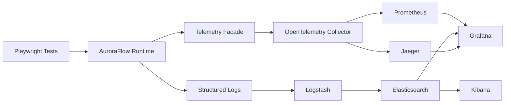

# Observability Stack Architecture

AuroraFlow now has a local observability stack configuration that routes opt-in OpenTelemetry signals to version-controlled development backends. The stack extends the existing artifact pipeline; JSON and Markdown reports remain the deterministic merge-gate source.

## Scope

Implemented in source:

- OpenTelemetry telemetry facade with no-op defaults.
- Page action, Redis, self-healing, flakiness, SLO dashboard, and SLO alert telemetry hooks.
- Local Docker Compose overlay for OpenTelemetry Collector, Prometheus, Grafana, Jaeger, Elasticsearch, Logstash, and Kibana.
- Version-controlled Collector, Prometheus, Grafana provisioning, dashboard, Logstash, Elasticsearch, and Kibana config.
- Contract tests that assert required stack files, services, ports, scrape targets, data sources, and dashboard JSON are present.

Not implemented yet:

- CI observability stack jobs and backend snapshot uploads.
- Remote telemetry export workflow and secret-backed authentication.
- Production manifests, TLS, authentication, retention policy, and dashboard drift controls.
- Production-grade Kibana saved searches and hardened Elasticsearch index lifecycle automation.

## Signal Flow



The Collector receives OTLP over HTTP and gRPC, batches signals, exposes metrics for Prometheus scrape, and exports traces to Jaeger. Logstash tails local JSON logs and self-healing artifacts, applies recursive redaction for known secret-shaped fields, routes malformed log records to a dead-letter index, and writes local Elasticsearch indices.

## Local Operation

Start the stack:

```bash
npm run observability:up
```

Emit framework telemetry:

```bash
AURORAFLOW_OBSERVABILITY_ENABLED=true \
OTEL_EXPORTER_OTLP_ENDPOINT=http://localhost:4318 \
npm run test:smoke
```

Open the local tools:

- Grafana: http://localhost:3000
- Prometheus: http://localhost:9090
- Jaeger: http://localhost:16686
- Kibana: http://localhost:5601
- Collector health: http://localhost:13133

Stop the stack:

```bash
npm run observability:down
```

## Privacy and Cardinality

Telemetry remains opt-in. Raw selectors, URLs, request bodies, passwords, tokens, and cookies are not emitted by default. Page action telemetry uses stable target hashes and low-cardinality metric labels. `AURORAFLOW_OBSERVABILITY_EXPORT_RAW_SELECTORS=true` is only for local debugging and should stay disabled in CI and shared environments.

Prometheus labels should remain bounded to dimensions such as action type, page object, status, project, shard, operation, mode, and strategy. High-cardinality data belongs in traces or logs after hashing or redaction.

## Configuration Files

- `docker-compose.observability.yml`: local stack overlay.
- `observability/otel-collector/config.yaml`: OTLP receivers, memory limiter, resource processor, batch processor, Prometheus exporter, Jaeger exporter, health check.
- `observability/prometheus/prometheus.yml`: Collector scrape and local rule loading.
- `observability/prometheus/rules/auroraflow.yml`: warning-level local SLO and operations alerts.
- `observability/grafana/provisioning`: Prometheus, Elasticsearch, Jaeger data sources and dashboard provider.
- `observability/grafana/dashboards`: starter dashboards for overview, CI matrix, flakiness, self-healing, page actions, Redis, and Collector health.
- `observability/logstash/pipeline/auroraflow.conf`: local log and self-healing artifact ingestion.
- `observability/elastic/elasticsearch.yml` and `observability/kibana/kibana.yml`: local single-node settings.

## Production Boundary

The local stack disables security features where needed for developer ergonomics and binds exposed ports to localhost. Do not reuse it as production infrastructure. Shared environments need TLS, authentication, retention policy, resource limits, protected secret handling, and explicit storage budgets before persistent observability data is enabled.
